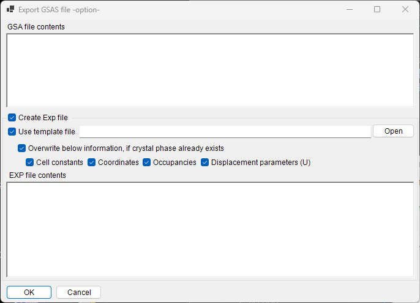

<!-- 260601Cl: migrated from legacy docx + yseto.net web manual -->
# ファイル形式

PDIndexer が読み書きするファイルは、大きく分けて **プロファイルデータ**、**結晶リスト／結晶構造**、**描画出力** の 3 種類です。これらの入出力はすべて [メインウィンドウ](../1-main-window.md) の **ファイル (File)** メニューから操作します。

このページでは、対応する拡張子・入出力方向・補足を表形式でまとめます。

---

## プロファイルデータ

### 読み込み（Read profile(s)）

**ファイル → プロファイルを読込 (Read profile(s))** を選ぶと、複数ファイルをまとめて読み込めます。本ソフト独自形式の `pdi` / `pdi2` のほか、WinPIP 出力の `csv`、Fit2D 出力の `chi`、Rigaku の `ras` など、各種の角度－強度（または エネルギー－強度）テキスト／バイナリ形式に対応します。リストにない形式でも、角度－強度のテキスト形式であればおおむね読み込めるよう汎用解析にフォールバックします。

| 拡張子 | 由来・形式 | 補足 |
| --- | --- | --- |
| `pdi` / `pdi2` | PDIndexer ネイティブ形式 | プロファイルと付随情報（波源・波長・露出時間など）をそのまま保持。`pdi2` が現行版です。読み込み時にデータ変換ダイアログは表示されません。 |
| `csv` | WinPIP 出力（カンマ区切り：`角度,強度`） | データ変換ダイアログで横軸の意味・波源・波長を指定して取り込みます。 |
| `tsv` | タブ区切り（`角度` `[TAB]` `強度`） | 汎用テキストとして取り込み。 |
| `chi` | Fit2D 出力 | 先頭の見出し行を読み飛ばし、4 列データの 2・4 列目を角度・強度として取り込みます。 |
| `ras` | Rigaku 形式 | 機器情報を含むテキスト形式。 |
| `nxs` | NeXus / HDF5（SSD・複数検出器） | 複数チャンネル（ヒストグラム）を含む場合があり、チャンネルごとにエネルギー校正して取り込みます。 |
| `npd` | EDX プロファイル（SSD） | ヘッダの `EGC0/1/2`・`2Theta`・`Live time` などを読み取り、チャンネル番号をエネルギーへ変換します。 |
| `xbm` | SP-8 BL04B2 などの EDX バイナリ形式 | 試料名・測定条件・EGC 校正係数などのメタ情報をコメントとして取り込みます。 |
| `rpt` | Genie 形式（SSD） | 取り出し角・露出時間・EGC をヘッダから読み取ります。 |
| `xy` | pyFAI 校正付き 2 列テキスト | ヘッダから波長を読み取り、角度－強度を取り込みます。 |
| `gsa` | GSAS データ（`BANK` ブロック） | 角度・強度・誤差の 3 列を取り込みます。 |
| その他 | 汎用 角度－強度 テキスト | カンマ／空白／タブ区切りを自動判定して取り込みます（データ変換ダイアログ経由）。 |

!!! note "複数ファイルの一括読み込み"
    複数ファイルを選択して読み込むと、最初のファイルでデータ変換ダイアログの設定を確定した後に「同じ設定を以降のファイルにも使うか」を確認するメッセージが表示されます。**はい (Yes)** を選ぶと残りのファイルがダイアログ無しで一括処理され、読み込みが高速になります。

### データ変換ダイアログ（Data Converter）

`pdi` / `pdi2` 以外のファイル（`csv`, `chi`, `ras`, `nxs`, `npd`, `xbm`, `rpt`, `xy`, `gsa`, および汎用テキスト）を読み込むと、**データ変換 (Data Converter)** ダイアログが開きます。ここで、読み込んだ数値列を PDIndexer 内部の物理量へ正しく対応づけます。

ダイアログでは次の項目を設定します。

| 設定項目 | 内容 |
| --- | --- |
| 横軸 (Horizontal Axis) | 読み込んだ第 1 列の物理量（2θ、エネルギー、d 値、波数、TOF など）と単位を指定します。 |
| 波源・波長 | X 線／中性子／電子線の別、特性 X 線の種類（Kα など）または波長を指定します。これにより d 値や 2θ への換算が決まります。 |
| 露出時間 (Exposure time (per step)) | 1 ステップあたりの露出時間（秒）。CPS 表示や強度規格化に使われます。 |
| SSD データ用設定 (For SSD data) | `rpt` / `npd` / `xbm` / `nxs` のような SSD（EDX）データで、チャンネル番号 \(n\) をエネルギー \(E\) に変換する係数 \(a_0, a_1, a_2\) を設定します。検出器が複数ある場合は検出器ごとに有効／無効と係数を指定できます。 |
| Low energy cutoff | チェックすると、指定値より低エネルギー側のデータ点を取り込み時に除外します。 |

SSD データのチャンネル番号 \(n\) からエネルギー \(E\)（eV）への変換は、2 次の校正式で行われます。

$$
E = a_0 + a_1\,n + a_2\,n^2
$$

汎用テキスト（その他の形式）を読み込んだ場合は、ダイアログ内のテキスト表示で実ファイルの中身を確認しながら、横軸・波源などを設定できます。区切り文字（カンマ／空白／タブ）と先頭の見出し行の読み飛ばしは自動的に判定されます。

!!! tip "クリップボード／フォルダ監視"
    **オプション (Option)** メニューの **クリップボードを監視 (Watch Clipboard)** を有効にすると、IPAnalyzer など他アプリからコピーされたプロファイルを自動で取り込めます。**ファイルを監視 (Watch File)** を有効にすると、指定フォルダに新しく作成された `pdi` ファイルを自動読み込みします。

### 書き込み・エクスポート

**ファイル → プロファイルを書き込み (Save profile(s))** は、読み込み済みの全プロファイルを PDIndexer ネイティブ形式 `pdi2` で保存します。

**ファイル → プロファイルをエクスポート (Export the selected profile(s))** では、選択中のプロファイルを次の形式で書き出せます。

| 拡張子／形式 | 方向 | 補足 |
| --- | --- | --- |
| `pdi2` | 出力 | PDIndexer ネイティブ形式。すべてのプロファイルを一括保存。 |
| `csv` | 出力 | カンマ区切り（角度, 強度）。 |
| `tsv` | 出力 | タブ区切り（角度・強度をタブで区切り）。 |
| `gsa` (GSAS) | 出力 | リートベルト解析用 GSAS 形式。下記のエクスポート画面で内容を確認できます。 |

#### GSAS 形式での出力

GSAS 形式を選ぶと、書き出される内容を確認するエクスポート画面が表示されます。1 行目にプロファイル名、2 行目に `BANK 1 … CONST … FXYE` のヘッダ、以降に角度・強度・誤差の 3 列が出力されます。誤差は、プロファイルが誤差データを持つ場合はそれを、持たない場合は \(\sqrt{\text{強度}}\) を用います。

!!! note "角度のスケール"
    通常の角度分散データでは角度値を 100 倍した値（GSAS の `CONST` 慣習）で出力します。中性子 TOF データの場合はスケールせずそのまま出力します。

---

## 結晶リスト・結晶構造

結晶リストは XML 形式（拡張子 `xml`）で保存・読み込みします。個々の結晶構造は CIF / AMC からインポートできます。詳細は [回折線／結晶情報](../3-crystal-parameter.md) を参照してください。

| 操作（ファイルメニュー） | 拡張子 | 方向 | 補足 |
| --- | --- | --- | --- |
| 結晶リストを読込（現在のリストを消去） | `xml` | 入力 | 結晶リストを読み込み、現在のリストを破棄して置き換えます。 |
| 結晶リストを読込（現在のリストに追加） | `xml` | 入力 | 結晶リストを読み込み、現在のリストの末尾に追加します。 |
| 結晶リストを保存 | `xml` | 出力 | 現在の結晶リストをファイルに保存します。 |
| 結晶情報を CIF, AMC ファイルから読込 | `cif` / `amc` | 入力 | CIF 形式または AMC（AMCSD）形式の構造データを現在の結晶リストに追加します。 |
| 選択結晶を CIF フォーマットで出力 | `cif` | 出力 | 選択中の結晶を CIF 形式の構造データファイルとして保存します。 |
| 結晶リストを初期状態に戻す | — | — | 結晶リストをインストール直後の既定状態に戻します。 |

---

## 描画（プロファイル表示）の出力

メインウィンドウに表示中のプロファイルは、画像としてクリップボードへコピーしたり、ベクター形式のメタファイルとして保存したりできます。

| 操作（ファイルメニュー） | 形式 | 方向 | 補足 |
| --- | --- | --- | --- |
| コピー（as Bitmap） | ビットマップ | クリップボード | 表示内容をビットマップ画像としてクリップボードへコピーします。 |
| コピー（as Metafile） | メタファイル（ベクター） | クリップボード | 表示内容をベクター形式でクリップボードへコピーします。 |
| メタファイルとして保存 | `emf` (EMF) | 出力 | EMF（Enhanced Metafile）形式で保存します。ベクター・フォント情報をそのまま保持するため、保存した `emf` は PowerPoint や Word に読み込めます。 |

このほか、**ページ設定 (Page Setup)**・**印刷プレビュー (Print Preview)**・**印刷 (Print)** で、現在の角度・強度範囲をそのまま印刷できます。
