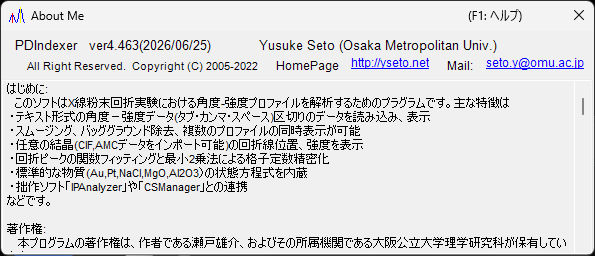

<!-- 260601Cl: migrated from legacy docx + yseto.net web manual -->
# 動作環境とインストール

PDIndexer を使い始めるために必要なインストール手順と、快適に動作させるための推奨環境について説明します。

## インストール

GitHub のリリースページから最新版をダウンロードしてください。

- ダウンロード先: <https://github.com/seto77/PDIndexer/releases/latest>

推奨される方法は MSI インストーラーです。`PDIndexer-setup.msi`（x64）をダウンロードし、ダブルクリックするとインストールが始まります。Windows on Arm（Snapdragon PC など）では代わりに `PDIndexer-setup_arm64.msi` をダウンロードしてください。 <!-- 260625Cl WiX 資産名 + arm64 -->

管理された Windows PC で MSI の実行が制限される場合は、代替手段として no-install ZIP 版を使用できます。portable ZIP（x64 は `PDIndexer-v.<ver>.zip`、Arm は `PDIndexer-v.<ver>_arm64.zip`）をダウンロードし、フォルダ全体をユーザーが書き込み可能な場所へ展開してから、展開後のフォルダ内にある `PDIndexer.exe` を実行してください。ZIP ビューアー内から直接 `PDIndexer.exe` を実行しないでください。 <!-- 260601Ch / 260625Cl -->

!!! note "Windows の保護警告について"
    新しくダウンロードした署名なしの研究用ソフトウェアを実行すると、Windows が「Windows によって PC が保護されました」という保護警告（SmartScreen）を表示することがあります。その場合は **詳細情報** をクリックしてから **実行** を選ぶと続行できます。

!!! note "no-install ZIP 版について"
    ZIP 版は、MSI の実行、管理者承認、または別途 .NET Desktop Runtime の導入が難しい環境向けの代替手段です。ただし、設定まで含めて完全に実行フォルダ内だけで完結するわけではありません。PDIndexer はユーザー設定とコピーした初期データを現在のユーザーの AppData フォルダへ保存し、ユーザーごとの設定を `HKEY_CURRENT_USER\Software\Crystallography\PDIndexer` に保存することがあります。

## 必要な動作環境

MSI インストーラーでインストールした PDIndexer の実行には、次のランタイムが必要です。

| 項目 | 内容 |
| --- | --- |
| OS | Windows（64 bit 版、x64 または Arm64） |
| ランタイム | `.NET デスクトップ ランタイム 10.0`（**.NET ランタイム** ではなく **デスクトップ ランタイム**。Windows on Arm では **Arm64** 版） |

!!! warning "「デスクトップ ランタイム」を選んでください"
    ダウンロードページには「.NET ランタイム」と「.NET デスクトップ ランタイム」の 2 種類があります。PDIndexer は WinForms アプリケーションのため、必ず **デスクトップ ランタイム（.NET Desktop Runtime）** の方をインストールしてください。「.NET ランタイム」だけでは起動しません。

- ランタイムのダウンロード先: <https://dotnet.microsoft.com/ja-jp/download/dotnet/10.0>

no-install ZIP 版は対応アーキテクチャ（x64 または Arm64）向けの self-contained パッケージであり、別途 .NET Desktop Runtime をインストールする必要はありません。 <!-- 260601Ch / 260625Cl arm64 -->

!!! note "旧バージョンの記載について"
    旧マニュアル（docx）には「.NET Desktop Runtime 6.0 以上」と記載されていますが、現在の PDIndexer は **.NET 10.0** を必要とします。最新版の要件に従ってください。

## 推奨動作環境

PDIndexer の機能の中には、大きな計算リソースを必要とするものがあります。速度向上のために、できる限りマルチスレッド化を行っています。快適に使用するためには、以下のスペックを持つ計算能力の高いコンピュータの使用を推奨します。

| 項目 | 推奨 |
| --- | --- |
| OS | Windows 11（Windows 10 以降の 64 bit 版でも動作） |
| メモリ | 16 GB 以上 |
| CPU | 8 コア以上（マルチスレッド計算に有効） |

!!! tip "マルチスレッドの効果"
    結晶構造を用いた回折パターンの計算や逐次解析などは、CPU のコア数が多いほど高速になります。コア数の多い CPU を使うほど、計算待ち時間を短縮できます。

## アップデート（更新の確認）

PDIndexer はメインウィンドウの **ヘルプ** メニューから、最新版への更新や作者情報の確認ができます。

| メニュー | 機能 |
| --- | --- |
| **ヘルプ** ▸ **アップデートをチェック** | 新しいバージョンが公開されているかを確認し、更新します。 |
| **ヘルプ** ▸ **PDIndexerについて** | バージョン情報・作者情報を表示します。 |

**ヘルプ** ▸ **PDIndexerについて** を選ぶと、次のようなウィンドウが開き、現在のバージョン番号や作者情報を確認できます。

!!! tip "定期的なアップデート"
    バグ修正や機能追加が継続的に行われています。**ヘルプ** ▸ **アップデートをチェック** をときどき実行して、最新版に保つことをおすすめします。

## ライセンス

PDIndexer は **MIT ライセンス** で配布されています。著作権表示およびライセンス文を再配布物に添付することを条件として、使用・改変・配布・商用利用が自由に認められます。本ソフトウェアは無保証で提供されます。
