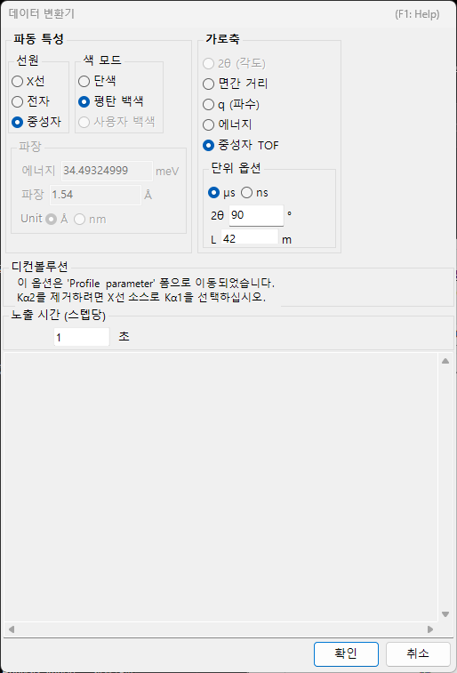

<!-- 260601Cl: migrated from legacy docx + yseto.net web manual -->
# 회절 프로파일

이 페이지에서는 PDIndexer가 다루는 "프로파일 데이터" 자체(측정 데이터)와, 그 읽기·표시·내보내기 방법을 설명합니다. 읽어들인 후의 평활화·배경 제거 등의 처리는 [프로파일 파라미터](4-profile-parameter.md) 창에서 수행합니다. 지원하는 확장자 목록은 [파일 형식](appendix/file-formats.md)을 참조하십시오.

## 프로파일이란

프로파일은 분말 회절 측정으로 얻어지는 "가로축 대 강도"의 1차원 데이터입니다. 가로축은 측정 방식에 따라 다음 중 하나로 표현됩니다.

- 각도 분산형(일반 X선 회절)에서는 \( 2\theta \)(회절각)
- 에너지 분산형 측정(백색 X선, SSD 검출)에서는 에너지
- 중성자 비행시간(TOF)법에서는 비행시간
- 어느 경우든, 내부적으로는 격자면 간격 \( d \) 또는 산란 벡터 \( q \)로 변환하여 다룰 수 있습니다

세로축은 회절 강도이며, `Raw Counts`(원시 카운트) 또는 `Count per Step (CPS)`(스텝당 카운트)로, 선형 또는 로그 스케일로 표시할 수 있습니다([메인 창](1-main-window.md) 페이지의 `Vertical Axis` 항목 참조).

## 지원하는 입력 형식

`File ▸ Read profile(s)`에서는 PDIndexer 고유 형식뿐 아니라 다른 프로그램의 출력이나 범용 텍스트 형식도 읽어들일 수 있습니다.

| 확장자 | 내용 |
| --- | --- |
| `pdi` / `pdi2` | PDIndexer 고유의 프로파일 형식(축 설정 및 처리 정보 포함) |
| `csv` | WinPIP 출력(쉼표 구분) |
| `chi` | Fit2D 출력 |
| `tsv` | 탭 구분 텍스트 |
| `ras` | Rigaku(RAS) 형식 |
| `nxs` | NeXus 형식 |
| `npd` / `xbm` / `rpt`(`rpf`) | SSD(반도체 검출기) 계열 원시 데이터 |
| 기타 텍스트 | 각도(또는 d값)－강도의 2열 텍스트라면 대부분 읽어들일 수 있습니다 |

!!! note "범용 텍스트 읽어들이기"
    각도－강도 텍스트 형식으로 저장된 파일은 위의 표준 형식이 아니어도 대체로 읽어들일 수 있습니다. 가로축 종류나 파장·에너지를 판별할 수 없는 경우, 후술하는 `Data Converter` 대화상자에서 지정합니다.

각 형식의 상세 사양은 [파일 형식](appendix/file-formats.md)에 정리되어 있습니다.

## 읽어들이는 방법

프로파일은 여러 가지 방법으로 읽어들일 수 있습니다.

- **메뉴** — `File ▸ Read profile(s)`(프로파일 읽기). 여러 파일을 동시에 선택할 수 있습니다.
- **드래그 앤 드롭** — 탐색기에서 파일을 메인 창으로 드롭합니다.
- **클립보드 감시** — `Option ▸ Watch Clipboard`(클립보드 감시)를 활성화하면, IPAnalyzer나 CSManager 등 다른 앱에서 복사한 프로파일/결정을 자동으로 가져옵니다.
- **파일 감시** — `Option ▸ Watch File`(파일 감시)을 활성화하고 `Set Directory to the watch`(감시할 디렉터리 설정)로 감시 폴더를 지정하면, 해당 폴더에 새로 생성된 `pdi` 프로파일 파일을 자동으로 읽어들입니다. 연속 측정 시의 실시간 표시에 편리합니다.

!!! tip "가로축 자동 맞춤"
    `After reading profile, change horizontal axis`(프로파일을 읽은 후 가로축 변경)를 체크해 두면, 읽어들인 직후 가로축 표시가 새로 불러온 프로파일에 맞춰 전환됩니다.

## 단일 프로파일 모드와 다중 프로파일 모드

메인 창 오른쪽의 `Single/Multi Profile`로 표시 모드를 전환합니다.

- **`Single Profile`(단일 프로파일)** — 새 프로파일을 읽어들이면 이전 데이터는 교체됩니다. 항상 한 개만 표시됩니다.
- **`Multi Profiles`(다중 프로파일)** — 읽어들인 프로파일을 겹쳐서 표시합니다. `Increasing intensity by a profile`(프로파일별 강도 증가량)을 사용하면 각 프로파일의 강도를 조금씩 어긋나게 하여 여러 곡선을 구분하기 쉽게 합니다. `Change automatically color`(색 자동 변경)를 활성화하면 프로파일마다 그리기 색이 자동으로 할당됩니다.

## Profile 체크리스트

메인 창 왼쪽의 `Profile` 리스트에는 읽어들인 모든 프로파일이 표시됩니다.

- 체크된 프로파일만 중앙 뷰어에 그려집니다. `Check/Uncheck all`(모두 체크/해제)로 한 번에 전환할 수 있습니다.
- `Color` 열을 클릭하면 각 프로파일의 그리기 색을 변경할 수 있습니다.
- 리스트 안의 항목 순서를 바꾸면 겹쳐 그리는 순서를 조정할 수 있습니다.
- Single Profile 모드에서는 리스트가 비활성화되며, Multi Profiles 모드에서는 여러 프로파일이 표시됩니다.

보다 상세한 프로파일 설정(이름, 선 스타일, 평활화, 배경 제거, 축 보정, 프로파일 연산 등)은 리스트 아래의 `Profile Parameter`(프로파일 파라미터) 체크박스를 체크하여 여는 [프로파일 파라미터](4-profile-parameter.md) 창에서 수행합니다.

## Data Converter 대화상자

가로축 종류를 판별할 수 없는 범용 텍스트 파일이나 SSD(에너지 분산) 계열 원시 데이터를 읽어들이면, `Data Converter` 대화상자가 열려 읽어들이는 데이터의 가로축과 관련 파라미터를 지정할 수 있습니다.

이 대화상자에서는 다음 항목을 설정합니다.

| 항목 | 내용 |
| --- | --- |
| 가로축 설정 | 데이터의 가로축 종류(X선 파장/에너지, 2θ, 중성자 TOF 길이·각도 등)와 이에 대응하는 선원 파라미터를 지정합니다. |
| `Exposure time (per step)` | 데이터 1스텝당 노출(측정) 시간을 초 단위로 설정합니다. CPS 환산에 사용되며, 0 이하는 1로 처리됩니다. |
| `Deconvolution` | Kα2 제거는 [프로파일 파라미터](4-profile-parameter.md) 창으로 이동했습니다. 제거하려면 X선 선원으로 Kα1을 선택하십시오. |
| `For SSD data`의 `Low energy cutoff` | EDX 스펙트럼의 저에너지 쪽을 오른쪽 임계값(eV) 이하에서 잘라냅니다. |

가로축 종류가 에너지 분산형(백색 X선, EDX)인 경우, `E = a₀ + a₁ n + a₂ n²`(E: 에너지[eV], n: 채널 번호)의 에너지 교정 계수를 입력하여 채널 번호를 에너지로 변환합니다. `OK`를 클릭하면 설정을 적용하여 데이터를 변환하고, `Cancel`을 클릭하면 읽어들이기를 중단합니다.

## 프로파일 내보내기

- **`File ▸ Save profile(s)`(프로파일 저장)** — 읽어들인 모든 프로파일을 PDIndexer 고유의 `pdi2` 형식으로 저장합니다. 축 설정과 처리 정보도 유지됩니다.
- **`File ▸ Export the selected profile(s)`(선택한 프로파일 내보내기)** — 선택한 프로파일을 다음 형식 중 하나로 내보냅니다.
  - `as CSV (comma separated values) file` — 쉼표 구분(각도, 강도)
  - `as TSV (tab separated values) file` — 탭 구분
  - `as GSAS file` — GSAS(리트벨트 해석) 데이터 형식

!!! note "그림 저장"
    프로파일 "데이터"가 아니라 렌더링된 "그림"을 저장하려면 `File ▸ Copy to Clipboard` 또는 `File ▸ Save as Metafile`(EMF)을 사용합니다. EMF는 PowerPoint나 Word로 가져올 수 있는 벡터 형식입니다.
