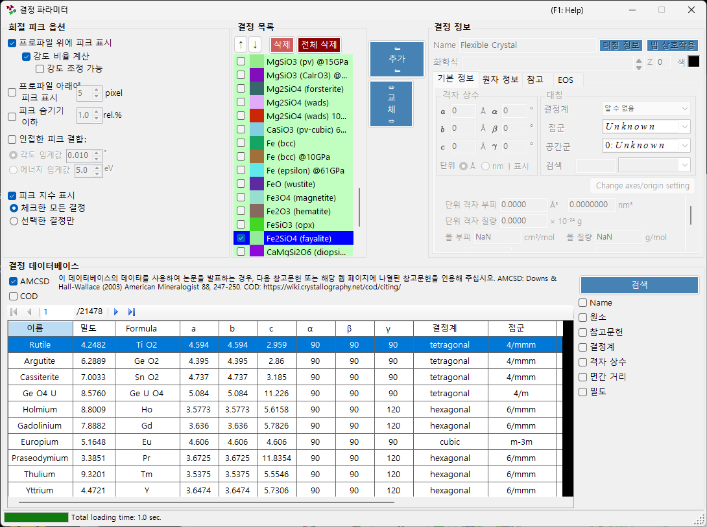
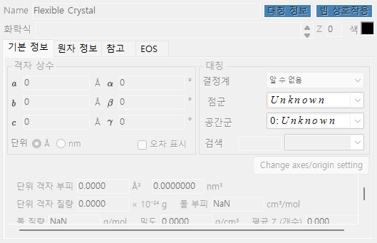
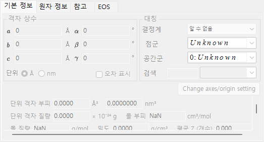
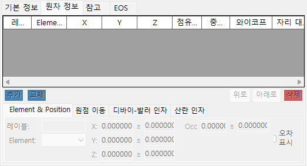
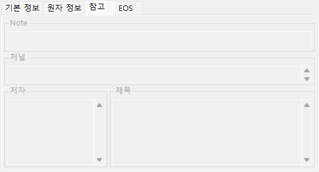
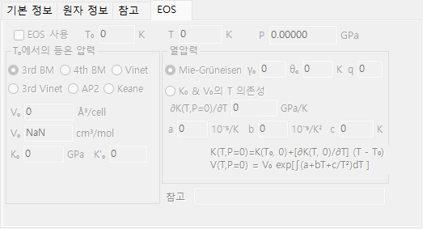
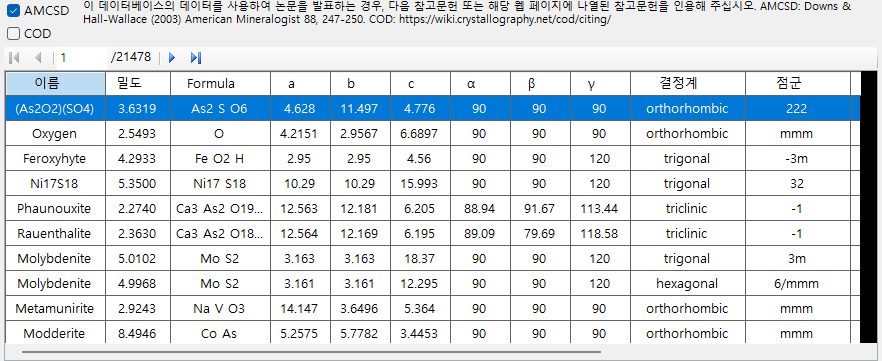
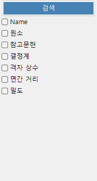
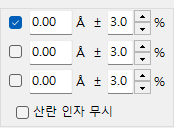
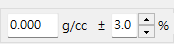

<!-- 260601Cl: migrated from legacy docx + yseto.net web manual -->
# 결정 파라미터

메인 창 툴바에서 `결정 파라미터` 아이콘을 클릭하면 아래와 같은 서브 창이 열립니다. 이 창에서는 회절 피크를 표시할 결정의 종류와 회절 피크의 표시 방법을 설정합니다. 창 하단에는 결정 구조를 검색하고 가져오기 위한 결정 데이터베이스가 내장되어 있습니다.

이 창은 크게 4개의 영역으로 나뉩니다.

| 영역 | 역할 |
| --- | --- |
| `회절 피크 옵션` | 회절선 표시 방법 |
| `결정 목록` | 메인 창과 공유하는 결정 체크리스트 |
| `결정 정보` | 선택한 결정의 상세 파라미터(탭 전환) |
| `결정 데이터베이스` | AMCSD 기반 검색 및 가져오기 |

---

## 회절선 옵션

회절선의 표시를 설정합니다.

### 프로파일 위에 피크 표시

프로파일 데이터에 회절선을 겹쳐서 표시할지 여부를 선택합니다.

### 강도 비율 계산 {#calculate-intensity-ratio}

구조 데이터로부터 회절 강도(의 비율)를 계산할지 여부를 선택합니다.

!!! note
    원자 위치가 입력되어 있지 않으면 체크박스 상태와 관계없이 강도는 계산되지 않습니다. 원자 데이터 입력에 대해서는 [원자 정보 탭](#atom-info-tab)을 참조하십시오.

### 강도 조정 가능

상대 강도 비율을 바꾸지 않고 모든 회절선을 전체적으로 스케일링할 수 있는지 여부를 선택합니다.

### 프로파일 아래에 피크 표시

프로파일 아래에 회절 피크를 표시할지 여부를 선택합니다.

#### 피크 높이

프로파일 아래에 표시되는 피크의 높이를 픽셀(`pixel`) 단위로 설정합니다.

### 인접한 피크 결합

결정학적으로는 비등가이지만 2θ 값이 거의 같거나 완전히 같은 피크의 강도를 결합할지 여부를 선택합니다.

예를 들어 입방정계에서는 (333)면과 (115)면이 비등가임에도 불구하고 d값이 완전히 동일하여 관측 시 겹치게 됩니다. 이 체크박스를 선택하면 이들의 결합된 강도를 표시할 수 있습니다.

| 항목 | 설명 |
| --- | --- |
| `각도 임계값` | 피크를 결합하는 기준이 되는 근접 정도를 각도(`°`)로 지정합니다. |
| `에너지 임계값` | 에너지 분산형 데이터의 경우, 결합 범위를 에너지(`eV`)로 지정합니다. |

!!! tip
    이전 매뉴얼에서는 임계값을 옹스트롬 단위로 명시했지만, 현재 버전에서는 가로축 종류에 따라 각도(`°`) 또는 에너지(`eV`)로 지정합니다.

### 약한 피크 숨기기

가장 강한 반사에 비해 지나치게 약한 피크를 제거할지 여부를 선택합니다. 임계값은 최강선에 대한 비율(`rel.%`)로 지정합니다.

### 피크 지수 표시

회절선의 지수(밀러 지수)를 표시할 대상을 선택합니다.

| 옵션 | 대상 |
| --- | --- |
| `체크한 모든 결정` | 체크된 모든 결정 |
| `선택한 결정만` | 목록에서 현재 선택된 결정만 |

---

## 결정 목록

메인 창의 프로파일 체크리스트와 동일한 정보를 표시합니다. 체크된 결정은 메인 창에 회절선이 표시됩니다. 각 행에는 체크박스(`체크`), 표시 색상(`피크색`), 결정 이름(`결정`)이 표시됩니다.

### 위/아래 화살표 버튼 (↑ / ↓)

결정의 순서를 변경합니다.

!!! note
    1행부터 6행까지는 상태 방정식(EOS)용으로 예약되어 있어 순서를 변경할 수 없습니다. 자세한 내용은 [상태 방정식](5-equation-of-states.md)을 참조하십시오.

### 추가

오른쪽의 결정 정보 영역(아래 설명)에서 설정한 결정을 목록에 새 항목으로 추가합니다.

### 교체

현재 선택된 결정을 오른쪽 결정 정보 영역에서 설정한 결정으로 교체합니다.

### 삭제

현재 선택된 결정을 목록에서 삭제합니다.

### 전체 삭제

목록에서 모든 결정을 삭제합니다.

---

## 결정 정보 {#crystal-information}

선택한 결정의 상세 정보를 여러 탭에서 편집하고 표시합니다. 주요 탭은 다음과 같습니다.

| 탭 | 내용 |
| --- | --- |
| `기본 정보` | 격자 상수, 결정계, 공간군 등 기본 정보 |
| `원자 정보` | 원자 종류, 점유율, 좌표, 온도 인자 |
| `참고` | 출처가 된 논문, 저자 등 참고 정보 |
| `EOS` | 압축 및 열팽창에 관한 상태 방정식 설정 |

### 기본 정보 탭

격자 상수(a, b, c, α, β, γ), 결정계, 공간군과 같은 기본 정보를 설정합니다. 공간군을 선택하면 편집 가능한 격자 상수와 원자 좌표의 자유도가 자동으로 제한됩니다.

!!! tip
    격자 상수 입력란을 마우스 오른쪽 버튼으로 클릭하면 애플리케이션 시작 시점(또는 데이터베이스에서 구조를 가져온 시점)의 값으로 격자 상수를 복원하는 메뉴가 표시됩니다. 피팅 등으로 값을 변경한 후 원래의 참조 값으로 되돌리고 싶을 때 유용합니다.

### 원자 정보 탭 {#atom-info-tab}

각 원자의 원소, 점유율, 분율 좌표, 등방성/이방성 온도 인자를 설정합니다. 여기에 원자 위치를 입력하면 [강도 비율 계산](#calculate-intensity-ratio)을 통해 회절 강도를 계산할 수 있습니다.

### 참고 탭

결정 구조의 출처가 된 논문 제목, 저널명, 저자 등의 참고 정보를 보관합니다. 결정 데이터베이스에서 가져온 구조에는 이 정보가 자동으로 채워집니다.

### EOS 탭

압력 및 온도에 따라 격자 상수가 어떻게 변화하는지를 결정하는, 결정별 상태 방정식(EOS)을 설정합니다. 주요 입력 항목은 다음과 같습니다.

| 필드 | 설명 |
| --- | --- |
| `Use EOS` | 이 결정에 대한 EOS 압력 계산을 활성화합니다. |
| `T0` / `Temperature` | 기준 온도 / 측정 온도. |
| `V0` | 기준 단위 격자 부피. |
| `K0`, `K'0` | 등온 체적 탄성률과 그 압력 미분. |
| 등온식 | `BM3`(3차 Birch-Murnaghan, 기본값) / `BM4` / `Vinet` / `AP2` / `Keane`. |
| 열압력 | `Mie-Grüneisen`(기본값; 매개변수 \( \gamma_0, \theta_0, q \)) / `T-dependence K0&V0`. |

수식과 기호 정의는 [상태 방정식](5-equation-of-states.md)을 참조하십시오.

---

## 결정 데이터베이스

20,000건 이상의 결정 구조에 대한 검색 및 가져오기 기능을 제공합니다. 이 데이터베이스는 American Mineralogist Crystal Structure Database(AMCSD)를 기반으로 합니다.

!!! warning "Citation"
    이 결정 데이터를 사용할 때는 <http://rruff.geo.arizona.edu/AMS/amcsd.php>를 주의 깊게 읽고 다음 문헌을 반드시 인용하십시오.

    > Downs, R.T. and Hall-Wallace, M. (2003) The American Mineralogist Crystal Structure Database. *American Mineralogist* **88**, 247-250.

### 표

데이터베이스에 포함된 결정을 나열합니다. 검색 조건이 입력되어 있으면 조건에 일치하는 결정만 표시됩니다.

표에서 임의의 결정을 선택하면 그 정보가 [결정 정보](#crystal-information)로 전달됩니다. 결정 목록에 추가하려면 결정 목록 영역의 `추가` 또는 `교체` 버튼을 누르십시오.

### 검색 옵션

검색 조건을 입력합니다. 입력 후 `검색` 버튼을 누르거나 Enter 키를 누르십시오. 각 조건은 체크박스로 활성화/비활성화할 수 있습니다.

#### 이름

결정 이름을 입력합니다.

#### 원소

`주기율표` 버튼을 누르면 검색할 원소를 선택하는 별도의 창이 열립니다. 각 원소 버튼은 누를 때마다 상태가 전환됩니다.

창 상단의 버튼으로 모든 원소의 상태를 한 번에 전환할 수 있습니다.

| 버튼 | 의미 |
| --- | --- |
| `may or not include` | 해당 원소가 있어도 없어도 무방합니다(모든 원소 제약을 해제합니다). |
| `must include` | 반드시 포함해야 합니다(지정한 모든 원소를 포함하는 결정만 남습니다). |
| `must exclude` | 반드시 제외해야 합니다(지정한 원소 중 하나라도 포함하는 결정은 제외됩니다). |

!!! tip
    `산란 인자 무시`를 체크하면 산란 인자를 고려하지 않고 검색할 수 있습니다.

#### 참고문헌

논문 제목, 저널명 또는 저자명을 입력합니다.

#### 결정계

결정계를 지정하여 검색합니다.

#### 격자 상수

격자 상수와 허용 오차를 입력합니다.

#### d값

강한 반사의 d값과 허용 오차를 입력합니다.

#### 밀도

밀도와 허용 오차를 입력합니다.
