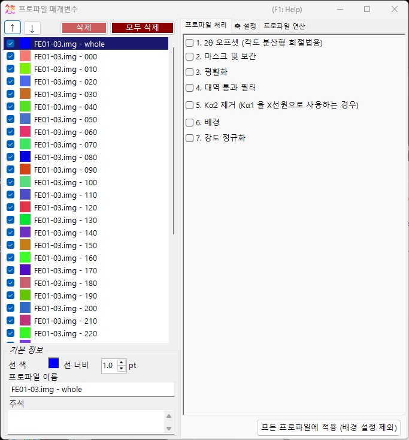
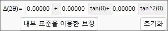
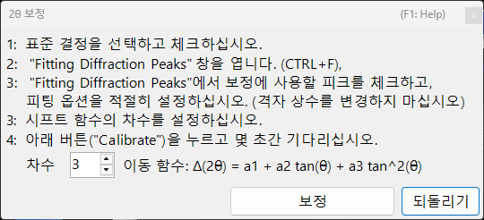
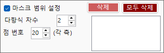
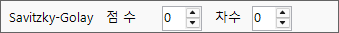
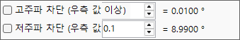
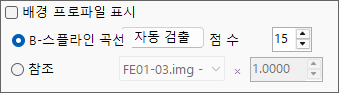
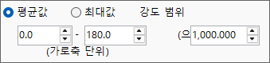

<!-- 260601Cl: migrated from legacy docx + yseto.net web manual -->
# 프로파일 파라미터

메인 창의 `Profile parameter` 아이콘을 클릭하면 이 서브 윈도우가 열립니다. 여기에서는 불러온 프로파일에 대한 세부 설정과 다양한 수치 처리를 수행합니다.

창의 왼쪽에는 [Profile 체크리스트](#profile)가 있고, 오른쪽은 탭으로 전환되는 3개의 페이지 — [프로파일 처리](#profile-processing), [축 설정](#axis-setting), [프로파일 연산](#profile-operator) — 으로 나뉩니다. 각 처리 단계는 체크박스로 켜고 끌 수 있으며, 위에서 아래 순서로 적용됩니다.

!!! note
    이 창에서 설정한 내용은 [메인 창](1-main-window.md)의 프로파일에 실시간으로 반영됩니다. 가로축 단위나 회절선의 지수 표시 등, 결정 쪽 설정은 [Crystal Parameter](3-crystal-parameter.md)를 참조하세요.

---

## Profile 체크리스트 {#profile}

창 왼쪽의 목록은 메인 창의 Profile 체크리스트와 동일한 정보를 표시합니다. 목록에서 프로파일을 선택하면 해당 프로파일이 창 오른쪽의 각 처리·설정의 대상이 됩니다.

| 항목 | 설명 |
| --- | --- |
| `↑` `↓`（위/아래 화살표 버튼） | 목록 내 프로파일의 순서를 변경합니다. |
| `Delete`（삭제） | 선택한 프로파일을 삭제합니다. |
| `Delete all`（모두 삭제） | 모든 프로파일을 삭제합니다. |

목록 아래의 `Basic property`（기본 정보） 영역에서는 선택한 프로파일의 기본 속성을 편집합니다.

| 항목 | 설명 |
| --- | --- |
| `Line Color`（선 색） | 클릭하면 선택한 프로파일의 표시 색상을 변경할 수 있습니다. |
| `Line Width`（선 너비） | 프로파일 선의 두께（`pt`）를 설정합니다. |
| `Profile Name`（프로파일 이름） | 프로파일의 이름을 설정합니다. |
| `Comment`（주석） | 자유롭게 입력하는 주석 필드입니다. |

---

## 프로파일 처리（Profile processing） {#profile-processing}

`Profile processing` 탭에서는 선택한 프로파일에 다양한 수치 처리를 적용합니다. 단계 1~7은 각각 독립된 체크박스로 활성화할 수 있으며, 활성화된 단계가 번호 순서대로 적용됩니다.

### 1. 2θ 오프셋 {#two-theta-offset}

`1. 2θ offeset (for angle-dispersive diffractmetry)`는 각도 분산형 데이터의 각도를 보정합니다. 보정식은 \( \tan\theta \)에 관한 2차 함수입니다.

$$ \Delta(2\theta) = a_0 + a_1 \tan\theta + a_2 \tan^2\theta $$

프로파일에 내부 표준 시료（격자 상수가 알려진 시료）가 포함되어 있다면, `Calibration using an internal standard` 버튼을 누르고 표시되는 메시지에 따라 진행하면 2차 함수의 계수가 자동으로 결정됩니다. 보정 대화상자에서는 관측된 피크 위치와 표준 시료의 이론 피크 위치를 대응시켜 계수를 피팅합니다.

`Reset` 버튼을 누르면 설정한 오프셋 계수를 초기화할 수 있습니다.

!!! tip
    내부 표준 물질로는 Si나 LaB₆처럼 격자 상수가 정밀하게 결정된 물질이 흔히 사용됩니다. 보정 후에는 보정된 2θ 값이 이후의 모든 해석에 그대로 사용됩니다.

### 2. 마스크와 보간（Mask and Interpolation） {#mask}

`2. Mask and Interpolation`은 지정한 각도 범위（또는 에너지 범위）를 마스크하고, 마스크 범위 밖의 강도를 이용하여 프로파일을 보간합니다.

| 항목 | 설명 |
| --- | --- |
| `Set Masking range`（마스크 범위 설정） | 마스크할 가로축 범위를 지정합니다. |
| `Point No.`（점 번호） | 보간에 사용할 끝점（양쪽 각각）의 점 수를 지정합니다. |
| `Polynomial order`（다항식 차수） | 보간에 사용할 다항식의 차수를 지정합니다. |
| `Save Masking Ranges` / `Read Masking Ranges` | 설정한 마스크 범위를 파일로 저장하거나 다시 불러옵니다. |
| `Delete` / `Delete all` | 개별 마스크 범위 또는 모든 마스크 범위를 삭제합니다. |

### 3. 평활화（Smoothing） {#smoothing}

`3. Smoothing`은 선택한 프로파일에 평활화를 적용합니다. 평활화 알고리즘은 `Savitzky-Golay` 법입니다.

이 방법에서는 관심 있는 각 \(x\) 위치에 대해, 해당 지점의 \(\pm\) `Point No.` 범위에 있는 데이터에 `Order`（차수）의 다항식으로 최소제곱법 피팅을 수행하고, 그 결과 함수 \(F(x)\)의 값을 해당 \(x\) 위치의 새로운 강도로 채택합니다.

!!! note
    `Order` \(= 1\)일 때, Savitzky–Golay 평활화는 단순 이동 평균과 동일해집니다. `Order`를 늘리면 피크 형태의 보존성이 높아지고, `Point No.`를 늘리면 평활화가 강해집니다.

### 4. 대역 통과 필터（Bandpass filter） {#bandpass}

`4. Bandpass filter`는 푸리에 변환（FFT）을 이용하여 지정한 주파수보다 크거나 작은 성분을 제거합니다.

| 항목 | 설명 |
| --- | --- |
| `Cut high-freq. over`（고주파 차단） | 지정값보다 높은 주파수의 성분을 제거합니다（고주파 노이즈 저감）. |
| `Cut low-freq. under`（저주파 차단） | 지정값보다 낮은 주파수의 성분을 제거합니다（완만하게 변화하는 배경의 제거）. |

### 5. Kα2 제거（Remove Kα2） {#remove-ka2}

`5. Remove Kα2 (if Kα1 is used as X-ray source)`는 선택한 프로파일이 Kα1과 Kα2가 분리되지 않은 X선으로 측정되었고, Kα1을 지정하여 불러온 경우에, 이를 체크하면 Kα2에서 유래한 회절 강도를 제거합니다.

!!! warning
    이 처리는 X선원으로 Kα1을 선택한 경우에만 유효합니다. 가로축의 단위와 방사선 종류는 [축 설정](#axis-setting) 탭에서 확인·설정하세요.

### 6. 배경（Background） {#background}

`6. Background`는 프로파일에서 배경을 감산합니다. 방법은 두 가지가 있습니다.

#### B-Spline curve（B-스플라인 곡선）

`Auto Detect`（자동 검출）를 누르면 자동으로 배경을 계산하여 감산합니다. `Point No.`（점 수）로 자동 탐색할 배경 제어점의 최대 개수를 설정합니다.

제어점은 수동으로도 변경할 수 있습니다. 메인 창에 그려진 원형 제어점을 마우스로 드래그하여 적절한 곡선을 작성하세요.

#### Reference（참조 프로파일）

선택한 프로파일에 대해 다른 프로파일을 배경으로 지정할 수 있습니다. `Show background profile`（배경 프로파일 표시）을 체크하면 배경으로 사용 중인 프로파일이 표시됩니다.

!!! note
    배경 감산（단계 6）은 아래에서 설명하는 `Apply for all profiles` 버튼에 의한 일괄 적용에서 제외됩니다.

### 7. 강도 정규화（Normalize intensity） {#normalize}

`7. Normarize intensity`는 지정한 가로축 범위에서의 `Average`（평균값） 또는 `Maximum`（최대값）이 지정한 강도가 되도록 프로파일을 정규화합니다.

| 항목 | 설명 |
| --- | --- |
| `Average` / `Maximum`（평균값 / 최대값） | 범위 내의 평균값과 최대값 중 어느 쪽을 기준으로 할지 선택합니다. |
| `intensity between`（가로축 범위） | 대상이 되는 가로축 범위를 지정합니다. |
| `to`（으로 정규화） | 정규화 후의 목표 강도값을 지정합니다. |

### Apply for all profiles 버튼 {#apply-all}

`Apply for all profiles (without background setting)`（모든 프로파일에 적용） 버튼은 단계 1~7 중 **6. 배경을 제외한** 설정을 모든 프로파일에 한꺼번에 적용합니다.

---

## 축 설정（Axis setting） {#axis-setting}

`Axis setting` 탭에서는 선택한 프로파일의 가로축 단위, 방사선（입사선） 종류, 입사선 에너지를 변경합니다.

| 항목 | 설명 |
| --- | --- |
| `Horizontal axis setting`（가로축 설정） | 현재의 가로축 단위（`horizontal unit`）를 변경합니다. `Shift`（이동）로 가로축 전체를 오프셋할 수도 있습니다. |
| `Exposure Time`（노출 시간） | CPS 모드（`(for CPS mode)`）에서 사용하는 노출 시간（`sec.`）을 설정합니다. |
| `Vertical axis setting`（세로축 설정） | 세로축에 관한 설정을 수행합니다. |

!!! note
    여기서의 축 설정은 프로파일 자체가 보유한 물리 정보（단위·방사선 종류·에너지）를 변경하는 것입니다. 메인 창의 표시용 축 변환과는 달리, 데이터 자체의 해석에 영향을 줍니다. 방사선 종류와 에너지는 회절선 위치의 계산에 직접 관여하므로, 올바른 값을 설정하세요.

---

## 프로파일 연산（Profile Operator） {#profile-operator}

`Profile Operator` 탭에서는 여러 프로파일의 평균화와 프로파일 간의 산술 연산을 수행합니다.

계산 대상 프로파일과 수행할 연산을 지정한 뒤 `Calculate`（계산） 버튼을 누르면, 결과가 새로운 프로파일로 추가됩니다.

| 모드 | 설명 |
| --- | --- |
| `Average`（평균화） | 여러 프로파일을 평균화합니다. |
| `Profile and value`（프로파일과 값） | 프로파일과 스칼라값 사이에서 연산합니다. |
| `Two profiles`（두 프로파일 간） | 두 프로파일 사이에서 산술 연산（덧셈 등）을 수행합니다. |

`Output name of the profile`（출력 프로파일의 이름）으로 생성되는 프로파일의 이름을 지정할 수 있습니다（기본값은 `Result #01`）.

!!! tip
    이 기능은 예를 들어 여러 측정 데이터를 평균화하여 S/N 비를 개선하거나, 두 프로파일의 차이를 구해 그 사이의 변화를 추출하는 데 사용할 수 있습니다.
