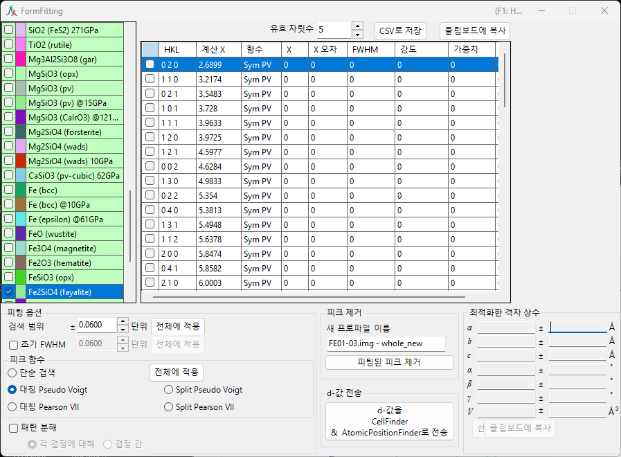
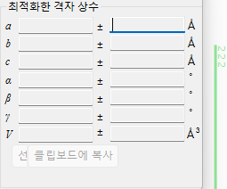
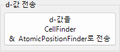
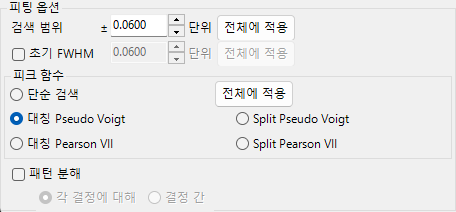
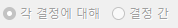
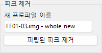
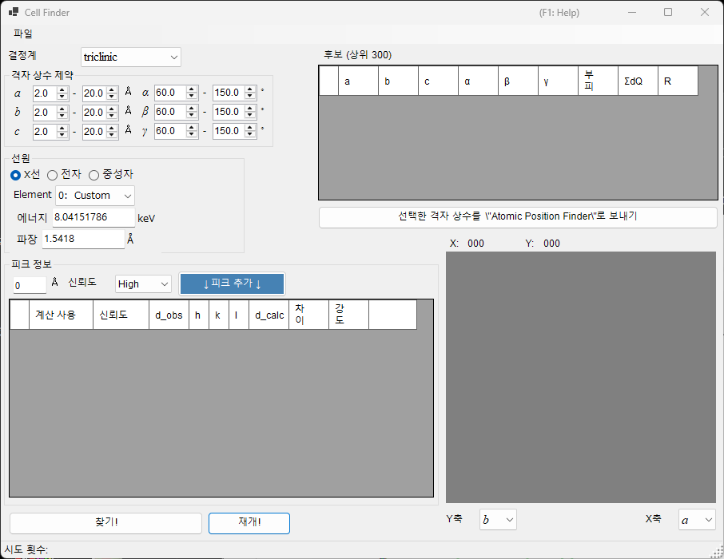
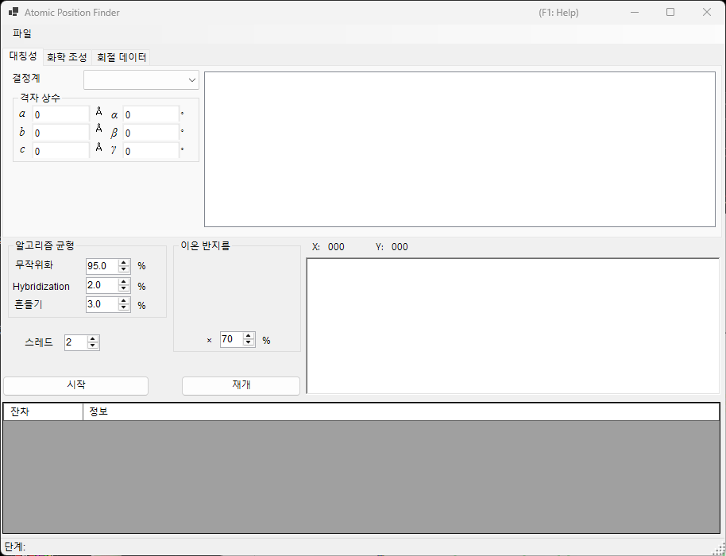

<!-- 260601Cl: migrated from legacy docx + yseto.net web manual -->
# 회절 피크 피팅

`Fitting diffraction peaks` 도구는 회절 프로파일의 피크를 적절한 함수로 피팅하고, 각 피크 위치 2θ로부터 d값을 구하며, 최소제곱법으로 격자 상수를 정밀화하는 일련의 작업을 수행합니다. 메인 창의 도구 모음에서 실행합니다.

## 기본 작업 흐름

1. 결정 목록에서 대상 결정을 선택합니다(멀티 프로파일 모드에서는 작업할 프로파일도 함께 선택합니다).
2. 메인 창에서 마우스로 회절선을 드래그하여 측정 피크와 최대한 겹치도록 조절합니다.
3. 피팅하려는 회절선의 지수를 회절선 목록(체크 목록 상자)에서 선택합니다.
4. 최소제곱 계산이 가능해질 만큼 독립적인 지수가 충분히 선택되면, 화면 오른쪽 아래의 `Optimized cell constants`(최적화한 격자 상수) 패널에 가장 가능성 높은 격자 상수가 오차와 함께 표시됩니다.
5. `Apply to the crystal`(선택한 결정에 적용) 버튼을 누르면, 정밀화한 격자 상수가 메인 프로그램의 결정에 반영됩니다.

!!! note "결정의 체크와 선택"
    결정 목록은 메인 창의 목록과 동일합니다. 피팅을 적용하려면 대상 결정이 "체크"되어 있고 동시에 "선택"되어 있어야 합니다.

## 결정 목록

왼쪽 위의 결정 목록에는 메인 창과 동일한 결정이 나열됩니다. 여기서 체크하고 선택한 결정이 피팅 대상이 됩니다. 자세한 내용은 [결정 파라미터](3-crystal-parameter.md)를 참조하십시오.

## 회절선 목록

선택한 결정의 회절선이 여기에 나열됩니다. 각 행의 체크박스를 켜면 해당 회절선이 피팅 대상이 됩니다. 목록에는 다음과 같은 열이 포함됩니다.

| 열 | 내용 |
| --- | --- |
| `Check` | 피팅 대상에 포함할지 여부 |
| `PeakColor` | 표시 색상 |
| `Crystal` | 결정 이름 |
| `HKL` | 반사 지수 |
| `Calc X` | 계산된 회절선 위치 |
| `Func` | 사용하는 피크 함수 |
| `X` | 피팅으로 구한 피크 위치 |
| `X Err` | 피크 위치의 오차 |
| `FWHM` | 반치전폭 |
| `Intensity` | 피크 강도 |
| `Weight` | 최소제곱 피팅에서의 가중치 |
| `R` | 피팅의 잔차 지표 |

목록 아래의 버튼으로 결과를 내보낼 수 있습니다.

- `Copy to clipborad`: 표를 클립보드에 복사합니다. Excel 등에 바로 붙여넣을 수 있습니다.
- `Save as CSV`: 표를 `.csv` 파일로 저장합니다. `Effective digit`으로 소수점 이하 자릿수를 설정합니다.
- `Clear peaks`: 피팅 결과를 지웁니다.

## Fitting option(피팅 옵션)

피크 프로파일을 피팅할 때 사용하는 세부 설정을 합니다.

### Search Range / Initial FWHM

- `Search Range`(검색 범위): 피팅을 수행할 범위를 설정합니다. 즉, 계산된 회절선 위치에서 ±Search Range 이내의 영역이 해당 피크의 피팅 대상이 됩니다.
- `Initial FWHM`(초기 FWHM): 프로파일 함수의 초기 반치전폭을 지정합니다. 최소제곱 수렴의 시작값으로 사용됩니다.

`Apply to all`(전체에 적용)을 누르면 현재 설정을 모든 회절선에 한 번에 적용합니다.

### Peak function(피크 함수)

피팅에 사용할 피크 함수를 선택합니다.

| 피크 함수 | 내용 |
| --- | --- |
| `Simple Search` | 함수 피팅을 수행하지 않고, 계산된 회절선 위치의 ±Search Range 이내에서 가장 강한 점을 피크 위치로 인식합니다. |
| `Symmetric Pseudo Voigt` | 좌우 대칭인 유사 보이트(pseudo-Voigt) 함수로 피팅합니다. |
| `Symmetric Pearson VII` | 좌우 대칭인 Pearson VII 함수로 피팅합니다. |
| `Split Pseudo Voigt` | 좌우 비대칭(분할형) 유사 보이트 함수로 피팅합니다. |
| `Split Pearson VII` | 좌우 비대칭(분할형) Pearson VII 함수로 피팅합니다. |

!!! tip "권장 함수"
    특별한 이유가 없다면, 안정성이 뛰어난 `Symmetric Pseudo Voigt`를 권장합니다.

유사 보이트 함수는 가우스 함수 \(G(x)\)와 로렌츠 함수 \(L(x)\)를 혼합 파라미터 \(\eta\)로 선형 결합한 것으로, 다음 식으로 주어집니다.

$$
\mathrm{pV}(x) = \eta\, L(x) + (1-\eta)\, G(x), \qquad 0 \le \eta \le 1
$$

여기서 \(\eta\)는 로렌츠 성분의 비율입니다. Split 형태는 피크 위치의 좌우에서 FWHM 등의 파라미터를 독립적으로 취함으로써 비대칭 프로파일을 표현합니다.

### Pattern Decomposition(패턴 분해)

선택된 2개 이상의 회절선의 Search Range가 겹칠 때, 패턴 분해(겹치는 피크의 동시 피팅)를 수행할지 여부를 선택합니다.

- `in each crystal`(각 결정에 대해): 결정마다 독립적으로 패턴 분해를 수행합니다.
- `between crystals`(결정 간): 모든 결정에 걸쳐 패턴 분해를 수행합니다.

## Optimized cell constants(최적화한 격자 상수)

최소제곱 계산이 가능해질 만큼 독립적인 지수가 충분히 선택되면, 이 패널에는 가장 가능성 높은 격자 상수 \(a, b, c, \alpha, \beta, \gamma\)와 부피 \(V\)가 각각의 오차(`±`)와 함께 표시됩니다.

!!! note "NA 표시에 대해"
    자유도가 부족한 경우—즉 자유도가 피팅한 피크 수와 같거나, 특정 격자 상수에 자유도가 없는 경우—오차 대신 `NA`가 표시됩니다. 충분한 수의 독립적인 반사를 선택하면 오차를 계산할 수 있습니다.

- `Apply to the crystal`(선택한 결정에 적용): 정밀화한 격자 상수를 메인 프로그램의 선택한 결정에 반영합니다.
- `Copy to Clipboard`(클립보드에 복사): 최적화한 격자 상수를 클립보드에 복사합니다.
- `Reset take off angle`: 테이크오프 각도를 재설정합니다.

## Remove fitted peaks(피팅된 피크 제거)

피팅된 피크를 프로파일에서 빼고, 잔차 프로파일을 새 프로파일로 출력합니다. `New profile name`에 출력할 이름을 입력하고 `Remove fitted peaks`를 누르면 빼기가 수행됩니다. 배경이나 겹치는 피크의 분리를 확인할 때 유용합니다.

## 관련 도구 (Send d-values)

`Send d-values to CellFinder && AtomicPositionFinder`를 누르면, 피팅으로 얻은 d값을 도구 모음에서도 실행할 수 있는 다음 분석 도구로 전송합니다.

### Cell Finder

`Cell Finder`는 측정된 피크 위치(d값 목록)를 설명하는 단위 격자(격자 상수)를 그 위치로부터 역산하여 탐색합니다. 미지 시료의 지수 결정에 사용됩니다.

### Atomic Position Finder

`Atomic Position Finder`는 관측된 반사의 강도 등의 값으로부터 결정 구조 내 원자 위치를 탐색합니다.

!!! tip "미지 시료 동정하기"
    `Cell Finder`로 격자 상수를 구한 뒤, 그 결정을 결정 목록에 등록하면 본 도구의 최소제곱 피팅으로 격자 상수를 더욱 정밀화할 수 있습니다.
