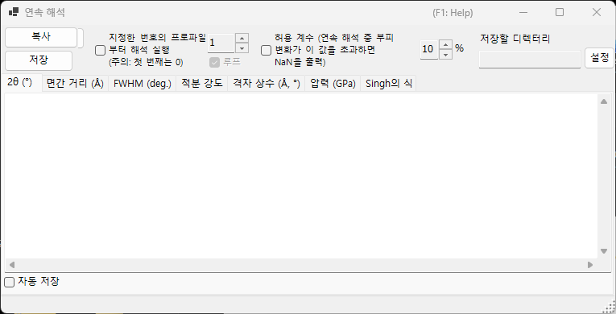
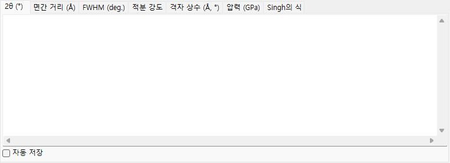
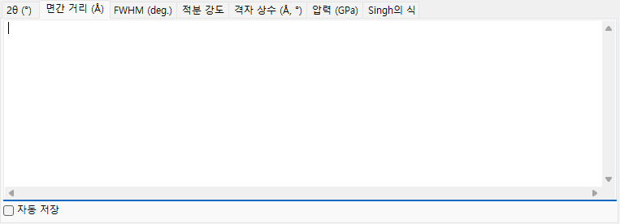
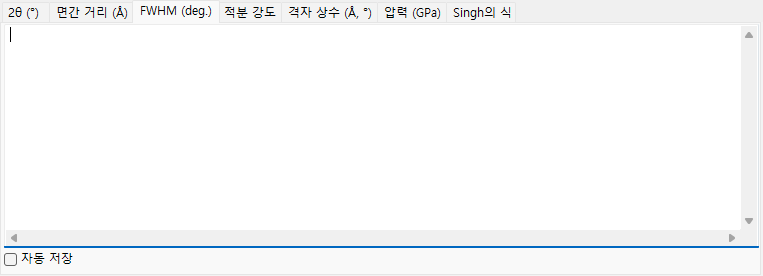
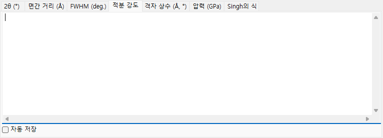
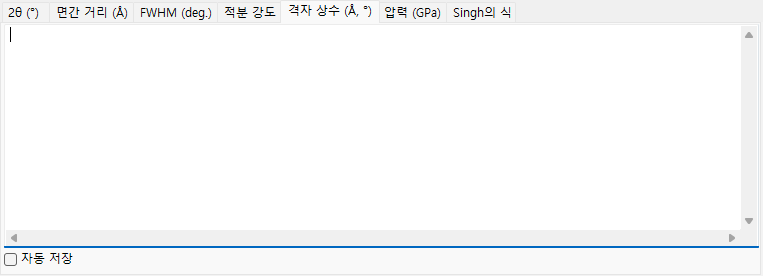
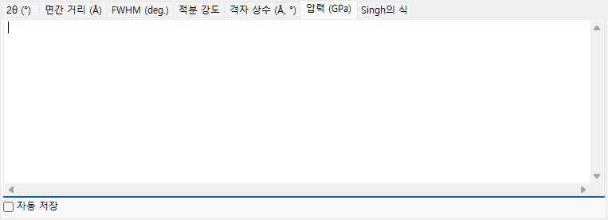
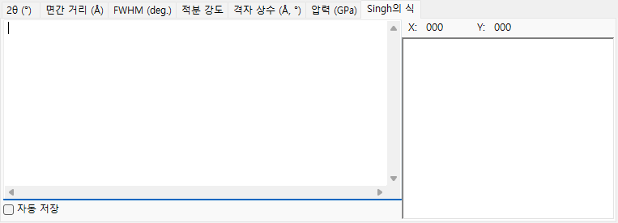

<!-- 260601Cl: migrated from legacy docx + yseto.net web manual -->
# 연속 분석

`Sequential Analysis` (연속 분석) 는 읽어들인 여러 프로파일에 대해 동일한 피크 피팅을 순서대로 실행하고, 그 결과를 양(quantity)별로 모아서 정리합니다. 온도, 압력, 시간 등의 조건을 바꾸어 가며 측정한 일련의 프로파일 시리즈를 대상으로 설계되었으며, 전체 시리즈를 한 번에 처리하여 각 회절선의 2θ, 면간거리(d값), 반치전폭, 강도, 격자 상수, 압력, Singh의 식 (일축 응력 / 격자 변형률 분석) 결과를 각각의 탭에 표 형태로 정리합니다.

메인 창의 툴바에 있는 `Sequential Analysis` 버튼으로 이 창을 열고 닫습니다.

!!! note "[회절 피크 피팅](6-fitting-diffraction-peaks.md) 과 공유"
    연속 분석은 피팅 설정을 `Fitting diffraction peaks` 창과 공유합니다. 먼저 `Fitting diffraction peaks` 창을 열어 대상 결정을 선택하고, 피팅하고자 하는 회절선(피크)에 체크해 두어야 합니다. 이것이 준비되지 않은 상태에서 `실행` 을 누르면 그렇게 하라는 메시지가 표시됩니다.

## 기본 절차

1. 조건을 바꾸어 가며 측정한 일련의 프로파일 시리즈를 모두 읽어들입니다 (최소 4개 이상의 프로파일이 필요합니다).
2. [회절 피크 피팅](6-fitting-diffraction-peaks.md) 창을 열어 대상 결정을 선택하고, 분석하고자 하는 회절선에 체크합니다. 여기서 설정한 피팅 함수와 탐색 범위가 연속 분석에서도 그대로 사용됩니다.
3. 필요에 따라 시작 번호, 루프, 허용 계수, 자동 저장 옵션을 설정합니다 (아래 참조).
4. `실행` 을 누르면 읽어들인 각 프로파일이 차례로 활성화되면서 최소제곱법 피팅이 실행되고, 결과가 각 탭에 축적됩니다.
5. 각 탭의 내용을 확인하고, `복사` 또는 `저장` 으로 표계산 소프트웨어(Excel 등)에 옮깁니다.

진행 상황과 경과 시간은 창 하단의 상태 표시줄에 `... % completed.  Elapsed time: ... sec` 형식으로 표시됩니다. 분석이 완료되면 2θ, 면간거리(d값), 반치전폭, 강도 결과가 함께 클립보드에 복사됩니다.

!!! tip "프로파일당 2회 피팅"
    안정적인 수렴을 얻기 위해, 결과를 기록하기 전에 각 프로파일에 대해 최소제곱법 피팅을 두 번 실행합니다.

## 분석 옵션

`실행` 버튼 주변의 컨트롤은 분석 범위와 이상치 처리 방식을 제어합니다.

| 옵션 | 설명 |
| --- | --- |
| `지정한 번호의 프로파일부터 해석 실행 (주의: 첫 번째는 0)` | 체크하면, 첫 번째 프로파일이 아니라 오른쪽 상자에서 지정한 번호의 프로파일부터 분석을 시작합니다. 첫 번째 프로파일은 번호 0입니다. |
| `루프` | 번호를 지정하여 시작한 경우, 끝에 도달한 후 건너뛴 앞쪽의 프로파일(0 … 시작번호 − 1)도 이어서 처리하여 시리즈 전체를 순환하며 분석합니다. 시작 번호가 활성화된 경우에만 사용할 수 있습니다. |
| `허용 계수 (연속 해석 중 부피 변화가 이 값을 초과하면 NaN을 출력)` | 체크하면, 정밀화된 단위 격자 부피가 초기값에서 오른쪽의 값(%)을 초과하여 변화한 경우 해당 피팅을 기각하고 그 행을 `NaN` 으로 출력합니다. 피팅이 파탄난 경우 발생하는 이상치를 자동으로 제외할 수 있습니다. |

## 출력 탭

각 탭은 하나의 출력량에 대한 표입니다. 각 행은 하나의 프로파일(프로파일 이름)에, 각 열은 선택한 회절선(hkl 지수, flexible crystal의 경우 `Peak No.`)에 대응합니다. 표는 탭 구분 텍스트로 유지되며, `복사` 또는 `저장` 시 콤마 구분 값(CSV)으로 변환됩니다.

### 2θ (°)

각 프로파일 및 각 회절선에 대해 피팅으로 얻은 피크 위치를 2θ(도)로 나타냅니다.

### 면간거리(d값) (Å)

각 피크 위치로부터 계산한 면간 간격 d를 Å 단위로 나타냅니다. 파장과 2θ로부터 \( d = \dfrac{\lambda}{2\sin\theta} \) 에 의해 구해집니다.

### FWHM (deg.)

각 피크의 반치전폭(FWHM)을 2θ의 도 단위로 나타내어, 피크 폭의 변화를 추적할 수 있습니다.

### 강도

각 피크의 적분 강도(면적)를 나타내며, 상전이나 배향(texture) 변화에 수반되는 강도 변화를 추적하는 데 유용합니다.

### 격자 상수 (Å, °)

각 프로파일에서 정밀화된 단위 격자 부피 `V`, 격자 모서리 `A`, `B`, `C` (Å), 축각 `Alpha`, `Beta`, `Gamma` (°), 그리고 각각의 추정 오차(`_err` 열)를 나타냅니다.

### 압력 (GPa)

각 프로파일의 격자 상수로부터 [상태 방정식](5-equation-of-states.md) 을 이용하여 구한 압력을 나타냅니다. `Equation of State` 창에서 Gold, Pt, NaCl(B1/B2), MgO, Corundum, Ar, Re, Mo, Pb 등의 압력 표준 물질이 선택된 경우, 연구자별(보고된 스케일별)로 하나씩 열이 나타납니다. 표준 물질이 선택되지 않은 경우, 대상 결정에 설정된 상태 방정식으로부터 계산한 압력을 나타냅니다.

### Singh의 식

Singh의 일축 응력 / 격자 변형률 분석 결과를 나타냅니다. 각 프로파일 이름 끝의 숫자를 방위각 \( \psi \) (도)로 해석하여, 각 반사에 대해 방위각과 d값의 관계를 최소제곱법(Levenberg–Marquardt 법)으로 피팅합니다. 각 반사마다 무응력 상태의 격자 간격 `d0`, 최대 변형률 방위각 `Ψmax`, 그리고 응력에 비례하는 양 `t/6Ghkl` (차응력 \( t \) 와 전단 탄성률 \( G_{hkl} \) 의 비에 해당) 을 구합니다. 피팅 곡선은 탭 내의 그래프에도 표시됩니다.

!!! note "Singh의 식이 적용되는 경우"
    이 탭은 프로파일 이름이 `...-whole` 로 끝나는 "응력 분석 모드" 시리즈에 대해서만 동작합니다. 각 프로파일 이름은 끝에 방위각을 나타내는 토큰(예: `...-30`)을 가져야 합니다. 일반적인 시리즈에서는 이 탭이 갱신되지 않습니다.

Singh의 식으로 표현되는 방위각 의존 격자 간격은 근사적으로 다음과 같습니다.

$$ d(\psi) = d_0 \left[ 1 + \alpha - 3\,\alpha \left( 1 - \frac{\lambda^2}{4 d^2} \right) \cos^2(\psi - \psi_{\max}) \right] $$

여기서 \( \alpha \) 는 `t/6Ghkl` 에 해당하는 양이고, \( \psi_{\max} \) 는 최대 변형률을 주는 방위각입니다.

## 결과 내보내기

| 동작 | 설명 |
| --- | --- |
| `복사` | 현재 표시된 탭을 CSV(콤마 구분) 형식으로 클립보드에 복사합니다. |
| `저장` | 현재 표시된 탭을 CSV 파일로 저장합니다 (파일명은 대화상자에서 선택). |

### 자동 저장

각 탭에는 `자동 저장` 체크박스가 있어, `실행` 후 해당 양이 CSV 파일로 자동 저장됩니다. 저장 위치는 `저장할 디렉터리` 에 표시되며 `설정` 버튼으로 선택합니다. 파일명은 프로파일 이름의 공통 부분을 바탕으로 만들어지며, 양에 따라 `_2theta.csv`, `_d.csv`, `_fwhm.csv`, `_intensity.csv`, `_cell.csv`, `_pressure.csv`, `_Singh.csv` 접미사가 붙습니다.

!!! tip "저장 위치 폴더 설정"
    자동 저장이 체크되어 있어도 저장 위치 폴더가 설정되어 있지 않으면(존재하지 않으면), `실행` 을 누를 때 폴더 선택 대화상자가 열립니다.

## 매크로에서 사용하기

연속 분석의 모든 출력은 매크로(Python 스크립트)에서도 이용할 수 있습니다. 이들은 [매크로](8-macro.md) 의 `PDI.Sequential` 클래스에 대응합니다.

| 매크로 함수 | 대응하는 탭 |
| --- | --- |
| `PDI.Sequential.Open()` / `Close()` | 창 열기 / 닫기 |
| `PDI.Sequential.Execute()` | 연속 분석 실행 |
| `PDI.Sequential.GetCSV_2theta()` | 2θ |
| `PDI.Sequential.GetCSV_D()` | 면간거리(d값) |
| `PDI.Sequential.GetCSV_FWHM()` | FWHM |
| `PDI.Sequential.GetCSV_Intensity()` | 강도 |
| `PDI.Sequential.GetCSV_CellConstants()` | 격자 상수 |
| `PDI.Sequential.GetCSV_Pressure()` | 압력 |
| `PDI.Sequential.GetCSV_Singh()` | Singh의 식 |

각 `GetCSV_...()` 는 대응하는 탭의 내용을 CSV 문자열로 반환합니다. `PDI.Sequential.Directory` 로 저장 위치 폴더를 가져오거나 설정할 수 있으며, `PDI.File.SaveText(...)` 와 조합하면 결과를 파일로 저장할 수 있습니다. 자세한 내용은 [매크로](8-macro.md) 를 참조하십시오.
