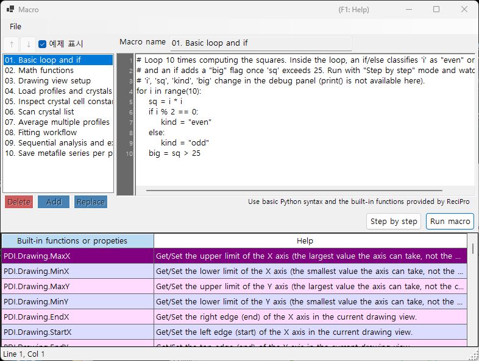

<!-- 260601Cl: migrated from legacy docx + yseto.net web manual -->
# 매크로

PDIndexer의 대부분의 작업은 **매크로** 기능을 사용해 자동화할 수 있습니다. 매크로는 [IronPython](https://ironpython.net/)(.NET 위에서 동작하는 Python 구현)으로 작성하는 Python 스크립트로, 전용 매크로 편집기 창에서 편집·실행합니다. 반복 작업의 자동화, 여러 파일의 일괄 처리, 결과를 CSV나 이미지 파일로 일괄 출력하는 데 활용할 수 있습니다.



!!! note "Python 기본 지식에 대해"
    매크로는 표준 Python 구문(`for` 루프, `if`/`else`, 리스트, 함수 등)을 그대로 사용할 수 있습니다. 이 페이지에서는 Python 언어 자체에 대해서는 설명하지 않습니다. PDIndexer 고유의 기능은 아래에서 설명하는 `PDI` 객체를 통해 호출합니다.

## 매크로 편집기 열기

메인 창의 메뉴 바에서 **매크로 → 편집기**를 선택하면 매크로 편집기 창(제목: `Macro`)이 열립니다.

편집기에서 작성·저장한 매크로는 **매크로** 메뉴 아래에 이름별로 표시되며, 메뉴에서 바로 실행할 수도 있습니다. 매크로 목록은 PDIndexer 종료 시 자동으로 저장되고, 다음 실행 시 복원됩니다.

## 편집기 창의 구성

편집기 창은 다음과 같은 부분으로 구성됩니다.

| 부분 | 설명 |
| --- | --- |
| 매크로 목록(왼쪽) | 저장된 매크로 이름의 목록. 항목을 클릭하면 오른쪽 편집기에 해당 매크로가 로드됩니다. |
| 코드 편집기(가운데) | Python 스크립트를 입력하는 영역. 줄 번호 표시, 자동 들여쓰기, 입력 자동 완성, 함수 툴팁을 지원합니다. |
| 함수 레퍼런스 표 | `PDI` 아래에서 사용할 수 있는 모든 함수의 목록 표. 셀을 더블클릭하면 해당 함수 이름이 커서 위치의 코드에 삽입됩니다. |
| 디버그 패널(오른쪽) | 단계 실행 중 현재 시점의 변수 이름과 값을 표시합니다. |
| 상태 표시줄 | 현재 커서 위치(`Line` / `Col`)를 표시합니다. |

### 목록 조작 버튼

매크로 목록을 편집할 때는 다음 버튼을 사용합니다.

| 버튼 | 동작 |
| --- | --- |
| `Add` | 현재 코드를 이름 입력란에 입력한 이름으로 목록에 추가합니다(동일한 이름이 있으면 덮어쓸지 확인합니다). |
| `Replace` | 목록에서 선택한 매크로를 현재 코드 내용으로 교체합니다. |
| `Delete` | 선택한 매크로를 목록에서 삭제합니다. |
| `↑` / `↓` | 선택한 매크로를 목록 내에서 위 또는 아래로 이동합니다. |
| `예제 표시` | 내장 샘플 매크로 표시를 전환합니다(아래 참조). |

!!! tip "저장과 불러오기"
    매크로는 개별 `.mcr` 파일로 저장하거나 불러올 수 있습니다. `.mcr` 파일을 편집기 창으로 드래그 앤 드롭하면 그 내용을 불러올 수 있습니다. 또한 코드 편집 후 `Ctrl+S`를 누르면 선택 중인 매크로에 덮어쓰기 저장됩니다.

## 매크로 실행

코드 편집기 하단에 있는 버튼으로 매크로를 실행합니다.

| 버튼 | 동작 |
| --- | --- |
| `Run macro` | 매크로를 끝까지 통상적으로 실행합니다. |
| `Step by step` | 한 줄씩 단계별로 실행합니다. 각 줄을 실행하기 전에 멈추고, 오른쪽 디버그 패널에 그 시점의 변수 값을 표시합니다. |
| `Next step (F10)` | 단계 실행 중 다음 한 줄로 진행합니다(`F10` 키로도 가능합니다). |
| `Stop` | 실행을 중단합니다. 중단은 `Step by step` 실행 중에만 유효합니다. |

!!! warning "print()는 사용할 수 없습니다"
    매크로 편집기에는 표준 출력 콘솔이 없으므로 `print()`의 출력은 표시되지 않습니다. 변수 값을 확인하고 싶을 때는 `Step by step` 모드로 실행하면서 디버그 패널에서 값의 변화를 확인하세요.

### 샘플 매크로

`예제 표시` 버튼을 체크하면 내장된 샘플 매크로가 목록에 표시됩니다(읽기 전용). 샘플은 현재 UI 언어(영어/일본어)로 표시됩니다. 자신의 매크로를 작성할 때 참고용으로 활용하세요. 내장 샘플은 다음과 같습니다.

| Name | Content |
| --- | --- |
| 01. Basic loop and if | `for` 루프와 `if`/`else`의 기본 |
| 02. Math functions | `math` 모듈(`pi`, `sin`, `sqrt`, `exp`, `log` 등)의 사용 |
| 03. Drawing view setup | `PDI.Drawing.SetBounds`로 표시 범위 설정 |
| 04. Load profiles and crystals | `PDI.File.ReadProfiles` / `ReadCrystals` |
| 05. Inspect crystal cell constants | `PDI.Crystal`을 통한 격자 상수, 부피, 압력 읽기 |
| 06. Scan crystal list | `PDI.CrystalList` 전체를 순회 |
| 07. Average multiple profiles | `PDI.ProfileOperator.Average` |
| 08. Fitting workflow | `PDI.Fitting`의 전체 흐름 |
| 09. Sequential analysis and export | `PDI.Sequential` 실행과 CSV 출력 |
| 10. Save metafile series per profile | 프로파일별로 EMF를 일괄 저장 |

!!! note "math 모듈은 미리 import되어 있습니다"
    편집기 시작 시 `import math`가 자동으로 실행되므로, `math.sqrt(2)`처럼 명시적인 `import` 문 없이 `math` 모듈을 바로 사용할 수 있습니다.

---

## 함수 레퍼런스

PDIndexer 고유의 기능은 모두 루트 객체 `PDI` 아래의 클래스를 통해 호출합니다. `PDI`는 매크로 스코프에 미리 준비되어 있으므로 `import`가 필요하지 않습니다.

아래 각 표는 소스 코드의 `[Help]` 속성에서 옮겨 적은 것입니다. 동일한 목록이 편집기 창 내부의 함수 레퍼런스 표와 [web 매뉴얼 6장](https://yseto.net/soft/pdi/pdi_06)에도 게재되어 있습니다.

!!! note "표기법"
    시그니처 열의 `(get/set)`은 읽기/쓰기가 가능한 프로퍼티, `(get)`은 읽기 전용 프로퍼티를 나타냅니다. 인자의 `= 값`은 기본 인자이며 생략할 수 있습니다.

### PDI(루트)

| Member | Signature | Description |
| --- | --- | --- |
| `Sleep` | `Sleep(int millisec)` | 지정한 밀리초만큼 매크로 실행을 일시 정지합니다. |
| `Obj` | `Obj (get/set)` | 다른 프로그램에서 전달된 객체(프로세스 간 인자)를 가져오거나 설정합니다. |

### PDI.File — 파일 입출력

| Member | Signature | Description |
| --- | --- | --- |
| `GetDirectoryPath` | `GetDirectoryPath(string filename = "")` | 디렉터리 경로(끝에 백슬래시 포함)를 가져옵니다. `filename`을 생략하면 폴더 선택 대화 상자가 열립니다. 지정한 경우 `filename`의 디렉터리 부분을 반환합니다. |
| `GetFileName` | `GetFileName()` | 파일 선택 대화 상자를 열고 선택한 파일의 전체 경로를 반환합니다. 사용자가 취소하면 빈 문자열을 반환합니다. |
| `GetFileNames` | `GetFileNames()` | 다중 선택 파일 대화 상자를 열고 선택한 파일들의 전체 경로를 반환합니다. 사용자가 취소하면 빈 배열을 반환합니다. |
| `ReadProfiles` | `ReadProfiles(string filename)` | 지정한 파일에서 프로파일 데이터를 읽어옵니다. `filename`을 생략(또는 존재하지 않을 경우)하면 파일 선택 대화 상자가 열립니다. |
| `SaveProfiles` | `SaveProfiles(string filename)` | 프로파일 데이터를 지정한 파일에 저장합니다. `filename`을 생략하면 저장 대화 상자가 열립니다. |
| `ReadCrystals` | `ReadCrystals(string filename)` | 지정한 파일에서 결정 데이터를 읽어옵니다. `filename`을 생략(또는 존재하지 않을 경우)하면 파일 선택 대화 상자가 열립니다. |
| `SaveCrystals` | `SaveCrystals(string filename)` | 결정 데이터를 지정한 파일에 저장합니다. `filename`을 생략하면 저장 대화 상자가 열립니다. |
| `SaveMetafile` | `SaveMetafile(string filename)` | 현재 패턴을 Windows 메타파일(`.emf`)로 저장합니다. `filename`을 생략하면 저장 대화 상자가 열립니다. |
| `SaveText` | `SaveText(string text, string filename)` | 지정한 텍스트 내용을 `.txt` 파일로 저장합니다. `filename`을 생략하면 저장 대화 상자가 열립니다. |

### PDI.Drawing — 그리기 뷰

| Member | Signature | Description |
| --- | --- | --- |
| `MaxX` | `MaxX (get/set)` | X축의 상한값(축이 가질 수 있는 최댓값. 현재 표시 범위가 아님)을 가져오거나 설정합니다. |
| `MinX` | `MinX (get/set)` | X축의 하한값(축이 가질 수 있는 최솟값. 현재 표시 범위가 아님)을 가져오거나 설정합니다. |
| `MaxY` | `MaxY (get/set)` | Y축의 상한값(축이 가질 수 있는 최댓값. 현재 표시 범위가 아님)을 가져오거나 설정합니다. |
| `MinY` | `MinY (get/set)` | Y축의 하한값(축이 가질 수 있는 최솟값. 현재 표시 범위가 아님)을 가져오거나 설정합니다. |
| `EndX` | `EndX (get/set)` | 현재 그리기 뷰에서 X축의 오른쪽 끝(끝점)을 가져오거나 설정합니다. |
| `StartX` | `StartX (get/set)` | 현재 그리기 뷰에서 X축의 왼쪽 끝(시작점)을 가져오거나 설정합니다. |
| `EndY` | `EndY (get/set)` | 현재 그리기 뷰에서 Y축의 위쪽 끝(끝점)을 가져오거나 설정합니다. |
| `StartY` | `StartY (get/set)` | 현재 그리기 뷰에서 Y축의 아래쪽 끝(시작점)을 가져오거나 설정합니다. |
| `SetBounds` | `SetBounds(double startX, double endX, double startY, double endY)` | 네 변(StartX, EndX, StartY, EndY)을 지정해 그리기 뷰를 설정합니다. |

### PDI.Crystal — 선택된 결정

셀 상수 `CellA`–`CellC`의 단위는 \( \mathrm{\AA} \)이며, `CellAlpha`–`CellGamma`의 단위는 도(deg)입니다.

| Member | Signature | Description |
| --- | --- | --- |
| `CellVolume` | `CellVolume (get)` | 선택된 결정의 셀 부피(\( \mathrm{\AA}^3 \))를 가져옵니다. 선택된 결정이 없으면 0을 반환합니다. |
| `Pressure` | `Pressure(double volume = 0)` | 선택된 결정의 EOS로부터 계산한 압력(GPa)을 가져옵니다. `volume`이 0(기본값)이면 현재 셀 부피를 사용합니다. |
| `Name` | `Name (get/set)` | 선택된 결정의 이름을 가져오거나 설정합니다. |
| `CellA` | `CellA (get/set)` | 선택된 결정의 격자 상수 a(\( \mathrm{\AA} \))를 가져오거나 설정합니다. |
| `CellB` | `CellB (get/set)` | 선택된 결정의 격자 상수 b(\( \mathrm{\AA} \))를 가져오거나 설정합니다. |
| `CellC` | `CellC (get/set)` | 선택된 결정의 격자 상수 c(\( \mathrm{\AA} \))를 가져오거나 설정합니다. |
| `CellAlpha` | `CellAlpha (get/set)` | 선택된 결정의 격자 상수 alpha(deg)를 가져오거나 설정합니다. |
| `CellBeta` | `CellBeta (get/set)` | 선택된 결정의 격자 상수 beta(deg)를 가져오거나 설정합니다. |
| `CellGamma` | `CellGamma (get/set)` | 선택된 결정의 격자 상수 gamma(deg)를 가져오거나 설정합니다. |

### PDI.CrystalList — 결정 목록

| Member | Signature | Description |
| --- | --- | --- |
| `Open` | `Open()` | '결정 목록' 창을 엽니다. |
| `Close` | `Close()` | '결정 목록' 창을 닫습니다. |
| `Count` | `Count (get)` | 목록에 있는 결정의 총 개수를 가져옵니다. |
| `SelectedName` | `SelectedName (get)` | 현재 선택된 결정의 이름을 가져옵니다. 선택된 결정이 없으면 빈 문자열을 반환합니다. |
| `SelectedIndex` | `SelectedIndex (get/set)` | 현재 선택된 결정의 인덱스를 가져오거나 설정합니다. |
| `Select` | `Select(int index)` | 지정한 인덱스의 결정을 선택합니다. |
| `Check` | `Check(int index = -1, bool state = true)` | 지정한 인덱스의 결정을 체크하거나 체크 해제합니다. `index`가 -1이면 현재 선택된 결정이 대상이 됩니다. |
| `Uncheck` | `Uncheck(int index = -1)` | 지정한 인덱스의 결정 체크를 해제합니다. `index`가 -1이면 현재 선택된 결정의 체크가 해제됩니다. |
| `GetCellVolume` | `GetCellVolume (get)` | 선택된 결정의 셀 부피(\( \mathrm{\AA}^3 \))를 가져옵니다. `PDI.Crystal.CellVolume`과 동일하며, 하위 호환성을 위해 남아 있습니다. |

### PDI.Profile — 선택된 프로파일

| Member | Signature | Description |
| --- | --- | --- |
| `Comment` | `Comment (get/set)` | 현재 선택된 프로파일의 코멘트 텍스트를 가져오거나 설정합니다. |
| `Name` | `Name (get/set)` | 현재 선택된 프로파일의 표시 이름을 가져오거나 설정합니다. |

### PDI.ProfileOperator — 프로파일 연산

각 프로파일은 목록 내 인덱스로 지정합니다. `output`은 결과 프로파일에 부여할 이름입니다.

| Member | Signature | Description |
| --- | --- | --- |
| `Average` | `Average(int[] indices, string output)` | `indices`에 나열한 인덱스(예: `[1,3,5,9]`)에 해당하는 프로파일들의 평균을 계산합니다. `output`은 결과 프로파일에 부여할 이름입니다. |
| `AddTwoProfiles` | `AddTwoProfiles(int index1, int index2, string output)` | profile1 + profile2를 계산합니다. 각 프로파일은 인덱스로 지정합니다. `output`은 결과 프로파일에 부여할 이름입니다. |
| `SubtractTwoProfiles` | `SubtractTwoProfiles(int index1, int index2, string output)` | profile1 − profile2를 계산합니다. 각 프로파일은 인덱스로 지정합니다. `output`은 결과 프로파일에 부여할 이름입니다. |
| `MultiplyTwoProfiles` | `MultiplyTwoProfiles(int index1, int index2, string output)` | profile1 × profile2를 계산합니다. 각 프로파일은 인덱스로 지정합니다. `output`은 결과 프로파일에 부여할 이름입니다. |
| `DivideTwoProfiles` | `DivideTwoProfiles(int index1, int index2, string output)` | profile1 ÷ profile2를 계산합니다. 각 프로파일은 인덱스로 지정합니다. `output`은 결과 프로파일에 부여할 이름입니다. |

### PDI.ProfileList — 프로파일 목록

| Member | Signature | Description |
| --- | --- | --- |
| `Open` | `Open()` | '프로파일 목록' 창을 엽니다. |
| `Close` | `Close()` | '프로파일 목록' 창을 닫습니다. |
| `DeleteAll` | `DeleteAll()` | 목록에서 모든 프로파일을 삭제합니다(확인 대화 상자 없음). |
| `Delete` | `Delete(int index)` | 지정한 인덱스의 프로파일을 삭제합니다. |
| `Count` | `Count (get)` | 목록에 있는 프로파일의 총 개수를 가져옵니다. |
| `SelectedName` | `SelectedName (get)` | 현재 선택된 프로파일의 이름을 가져옵니다. 선택된 프로파일이 없으면 빈 문자열을 반환합니다. |
| `SelectedIndex` | `SelectedIndex (get/set)` | 현재 선택된 프로파일의 인덱스를 가져오거나 설정합니다. |
| `Select` | `Select(int index)` | 지정한 인덱스의 프로파일을 선택합니다. |
| `Check` | `Check(int index = -1, bool state = true)` | 지정한 인덱스의 프로파일을 체크하거나 체크 해제합니다. `index`가 -1이면 현재 선택된 프로파일이 대상이 됩니다. |
| `Uncheck` | `Uncheck(int index = -1)` | 지정한 인덱스의 프로파일 체크를 해제합니다. `index`가 -1이면 현재 선택된 프로파일의 체크가 해제됩니다. |
| `CheckAll` | `CheckAll()` | 목록의 모든 프로파일을 체크합니다. |
| `UncheckAll` | `UncheckAll()` | 목록의 모든 프로파일 체크를 해제합니다. |

### PDI.Fitting — 피크 피팅

[회절 피크 피팅](6-fitting-diffraction-peaks.md) 창을 조작합니다.

| Member | Signature | Description |
| --- | --- | --- |
| `Open` | `Open()` | '회절 피크 피팅' 창을 엽니다. |
| `Close` | `Close()` | '회절 피크 피팅' 창을 닫습니다. |
| `Apply` | `Apply()` | 최적화된 격자 상수를 선택된 결정에 적용합니다(피팅 창의 `Confirm` 버튼을 클릭하는 것과 동일합니다). |
| `Check` | `Check(int index = -1, bool state = true)` | 지정한 인덱스의 격자면을 체크하거나 체크 해제합니다. `index`가 -1이면 현재 선택된 면이 대상이 됩니다. |
| `Uncheck` | `Uncheck(int index = -1)` | 지정한 인덱스의 격자면 체크를 해제합니다. `index`가 -1이면 현재 선택된 면의 체크가 해제됩니다. |
| `Select` | `Select(int index)` | 지정한 인덱스의 격자면을 선택합니다. |
| `SelectedIndex` | `SelectedIndex (get/set)` | 현재 선택된 격자면의 인덱스를 가져오거나 설정합니다. |
| `Range` | `Range(double range)` | 현재 선택된 격자면에 대한 피크 탐색 범위를 설정합니다(X축과 같은 단위). |

### PDI.Sequential — 연속 분석

[연속 분석](7-sequential-analysis.md) 창을 조작합니다. CSV 게터는 가장 최근 연속 분석 결과를 CSV 문자열로 반환합니다.

| Member | Signature | Description |
| --- | --- | --- |
| `Directory` | `Directory (get/set)` | 연속 분석 결과를 저장하는 디렉터리의 전체 경로를 가져오거나 설정합니다. |
| `Open` | `Open()` | '연속 분석' 창을 엽니다. |
| `Close` | `Close()` | '연속 분석' 창을 닫습니다. |
| `Execute` | `Execute()` | 체크된 모든 프로파일에 대해 연속 분석을 실행합니다. |
| `GetCSV_2theta` | `GetCSV_2theta()` | 가장 최근 연속 분석의 2-theta 결과를 CSV 문자열로 가져옵니다. |
| `GetCSV_D` | `GetCSV_D()` | 가장 최근 연속 분석의 d-spacing 결과를 CSV 문자열로 가져옵니다. |
| `GetCSV_FWHM` | `GetCSV_FWHM()` | 가장 최근 연속 분석의 FWHM 결과를 CSV 문자열로 가져옵니다. |
| `GetCSV_Intensity` | `GetCSV_Intensity()` | 가장 최근 연속 분석의 피크 강도 결과를 CSV 문자열로 가져옵니다. |
| `GetCSV_CellConstants` | `GetCSV_CellConstants()` | 가장 최근 연속 분석의 격자 상수 결과를 CSV 문자열로 가져옵니다. |
| `GetCSV_Pressure` | `GetCSV_Pressure()` | 가장 최근 연속 분석의 압력 결과를 CSV 문자열로 가져옵니다. |
| `GetCSV_Singh` | `GetCSV_Singh()` | 가장 최근 연속 분석의 Singh식 결과를 CSV 문자열로 가져옵니다. |
| `AutoSave2theta` | `AutoSave2theta (get/set)` | 연속 분석을 실행할 때마다 2-theta 결과를 자동 저장할지 여부를 가져오거나 설정합니다. |
| `AutoSaveDspacing` | `AutoSaveDspacing (get/set)` | 연속 분석을 실행할 때마다 d-spacing 결과를 자동 저장할지 여부를 가져오거나 설정합니다. |
| `AutoSaveFWHM` | `AutoSaveFWHM (get/set)` | 연속 분석을 실행할 때마다 FWHM 결과를 자동 저장할지 여부를 가져오거나 설정합니다. |
| `AutoSaveIntensity` | `AutoSaveIntensity (get/set)` | 연속 분석을 실행할 때마다 피크 강도 결과를 자동 저장할지 여부를 가져오거나 설정합니다. |
| `AutoSaveCellConstants` | `AutoSaveCellConstants (get/set)` | 연속 분석을 실행할 때마다 격자 상수 결과를 자동 저장할지 여부를 가져오거나 설정합니다. |
| `AutoSavePressure` | `AutoSavePressure (get/set)` | 연속 분석을 실행할 때마다 압력 결과를 자동 저장할지 여부를 가져오거나 설정합니다. |
| `AutoSaveSingh` | `AutoSaveSingh (get/set)` | 연속 분석을 실행할 때마다 Singh식 결과를 자동 저장할지 여부를 가져오거나 설정합니다. |

## 매크로 예제

내장 샘플 중 하나로, 연속 분석을 실행하고 결과를 CSV로 저장하는 매크로입니다.

```python
# Check all profiles, run sequential analysis, then obtain 2-theta / d-spacing /
# cell-constant / pressure results as CSV strings and save each to a file.
PDI.ProfileList.CheckAll()
PDI.Sequential.Open()
PDI.Sequential.Execute()
dir_path = PDI.File.GetDirectoryPath()
PDI.File.SaveText(PDI.Sequential.GetCSV_2theta(),        dir_path + "seq_2theta.csv")
PDI.File.SaveText(PDI.Sequential.GetCSV_D(),             dir_path + "seq_d.csv")
PDI.File.SaveText(PDI.Sequential.GetCSV_CellConstants(), dir_path + "seq_cell.csv")
PDI.File.SaveText(PDI.Sequential.GetCSV_Pressure(),      dir_path + "seq_pressure.csv")
```

그 밖의 샘플은 편집기의 `예제 표시` 버튼에서 목록으로 확인할 수 있습니다.
