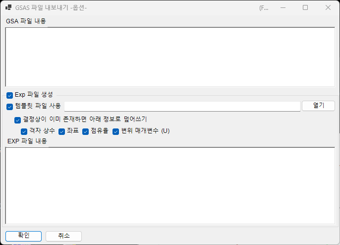

<!-- 260601Cl: migrated from legacy docx + yseto.net web manual -->
# 파일 형식

PDIndexer가 읽고 쓰는 파일은 크게 **프로파일 데이터**, **결정 리스트 / 결정 구조**, **드로잉 출력** 의 3가지로 나뉩니다. 이러한 입출력은 모두 [메인 창](../1-main-window.md)의 **파일(File)** 메뉴에서 실행합니다.

이 페이지에서는 지원하는 확장자, 입출력 방향, 참고 사항을 표 형식으로 정리합니다.

---

## 프로파일 데이터

### 읽기 (Read profile(s))

**파일 → 프로파일 읽기 (Read profile(s))** 를 선택하면 여러 파일을 한꺼번에 읽어올 수 있습니다. PDIndexer 고유 형식인 `pdi` / `pdi2` 외에도 WinPIP 출력의 `csv`, Fit2D 출력의 `chi`, Rigaku의 `ras` 등 다양한 각도-강도(또는 에너지-강도) 텍스트/바이너리 형식을 지원합니다. 아래 목록에 없는 형식이라도 일반적인 각도-강도 텍스트 파일이라면 대부분 읽을 수 있도록 범용 파서로 대체 처리됩니다.

| 확장자 | 출처 / 형식 | 참고 |
| --- | --- | --- |
| `pdi` / `pdi2` | PDIndexer 네이티브 형식 | 프로파일과 관련 정보(파원, 파장, 노출 시간 등)를 함께 보존합니다. `pdi2` 가 현재 버전입니다. 읽을 때 데이터 변환기 다이얼로그는 표시되지 않습니다. |
| `csv` | WinPIP 출력 (쉼표 구분: `angle,intensity`) | 데이터 변환기 다이얼로그에서 가로축의 의미, 파원, 파장을 지정하여 가져옵니다. |
| `tsv` | 탭 구분 (`angle` `[TAB]` `intensity`) | 범용 텍스트로 가져옵니다. |
| `chi` | Fit2D 출력 | 앞부분의 헤더 행을 건너뛰고, 4열 데이터 중 2열과 4열을 각도와 강도로 취급합니다. |
| `ras` | Rigaku 형식 | 기기 정보도 포함하는 텍스트 형식. |
| `nxs` | NeXus / HDF5 (SSD, 다중 검출기) | 여러 채널(히스토그램)을 포함할 수 있으며, 각 채널을 에너지 보정하여 개별적으로 가져옵니다. |
| `npd` | EDX 프로파일 (SSD) | 헤더에서 `EGC0/1/2`, `2Theta`, `Live time` 등을 읽고 채널 번호를 에너지로 변환합니다. |
| `xbm` | EDX 바이너리 형식 (예: SP-8 BL04B2) | 시료명, 측정 조건, EGC 보정 계수 등의 메타데이터를 코멘트로 가져옵니다. |
| `rpt` | Genie 형식 (SSD) | 헤더에서 취출각, 노출 시간, EGC를 읽습니다. |
| `xy` | pyFAI 보정이 적용된 2열 텍스트 | 헤더에서 파장을 읽고 각도-강도를 가져옵니다. |
| `gsa` | GSAS 데이터 (`BANK` 블록) | 각도, 강도, 오차의 3개 열을 가져옵니다. |
| 기타 | 범용 각도-강도 텍스트 | 쉼표 / 공백 / 탭 구분자를 자동으로 판별하여 가져옵니다 (데이터 변환기 다이얼로그 경유). |

!!! note "여러 파일을 한꺼번에 읽기"
    여러 파일을 선택하여 읽으면, 첫 번째 파일에 대해 데이터 변환기 다이얼로그 설정을 확정한 후 나머지 파일에도 같은 설정을 사용할지 묻는 메시지가 표시됩니다. **예(Yes)** 를 선택하면 나머지 파일은 다이얼로그 없이 일괄 처리되어 읽기 속도가 빨라집니다.

### 데이터 변환기 다이얼로그

`pdi` / `pdi2` 이외의 파일(`csv`, `chi`, `ras`, `nxs`, `npd`, `xbm`, `rpt`, `xy`, `gsa`, 그리고 범용 텍스트)을 읽으면 **데이터 변환기(Data Converter)** 다이얼로그가 열립니다. 여기서 가져온 숫자 열을 PDIndexer 내부에서 사용하는 올바른 물리량에 대응시킵니다.

다이얼로그에서는 다음 항목을 설정합니다.

| 설정 항목 | 설명 |
| --- | --- |
| 가로축 (Horizontal Axis) | 가져온 첫 번째 열이 나타내는 물리량(2θ, 에너지, d값, 파수, TOF 등)과 단위. |
| 파원 / 파장 | X선 / 중성자 / 전자선의 구분과 특성 X선 종류(Kα 등) 또는 파장. 이에 따라 d값 및 2θ로의 환산이 결정됩니다. |
| 노출 시간 (Exposure time (per step)) | 스텝당 노출 시간(초). CPS 표시와 강도 정규화에 사용됩니다. |
| SSD 데이터용 설정 (For SSD data) | `rpt` / `npd` / `xbm` / `nxs` 와 같은 SSD(EDX) 데이터에서 채널 번호 \(n\) 을 에너지 \(E\) 로 변환하는 계수 \(a_0, a_1, a_2\) 를 설정합니다. 검출기가 여러 개인 경우 검출기마다 활성화/비활성화와 계수를 개별적으로 지정할 수 있습니다. |
| 저에너지 차단 (Low energy cutoff) | 체크하면 지정한 에너지보다 낮은 데이터 점을 가져올 때 제외합니다. |

SSD 데이터의 채널 번호 \(n\) 은 다음과 같은 2차 보정식으로 에너지 \(E\)(eV)로 변환됩니다.

$$
E = a_0 + a_1\,n + a_2\,n^2
$$

범용 텍스트(기타 형식)를 읽는 경우, 다이얼로그 안에 실제 파일 내용이 텍스트 상자로 표시되므로 데이터를 확인하면서 가로축, 파원 등을 설정할 수 있습니다. 구분자(쉼표 / 공백 / 탭)와 건너뛸 앞부분 헤더 행 수는 자동으로 판별됩니다.

!!! tip "클립보드 / 폴더 감시"
    **옵션(Option) → 클립보드 감시(Watch Clipboard)** 를 활성화하면 IPAnalyzer 등 다른 앱에서 복사한 프로파일을 자동으로 가져올 수 있습니다. **파일 감시(Watch File)** 를 활성화하면 지정한 폴더에 새로 생성된 `pdi` 파일을 자동으로 읽어옵니다.

### 저장과 내보내기

**파일 → 프로파일 저장 (Save profile(s))** 은 읽어들인 모든 프로파일을 PDIndexer 네이티브 형식인 `pdi2` 로 저장합니다.

**파일 → 선택한 프로파일 내보내기 (Export the selected profile(s))** 에서는 선택한 프로파일을 다음 형식 중 하나로 내보낼 수 있습니다.

| 확장자 / 형식 | 방향 | 참고 |
| --- | --- | --- |
| `pdi2` | 출력 | PDIndexer 네이티브 형식. 모든 프로파일을 한꺼번에 저장합니다. |
| `csv` | 출력 | 쉼표 구분(각도, 강도). |
| `tsv` | 출력 | 탭 구분(각도와 강도를 탭으로 구분). |
| `gsa` (GSAS) | 출력 | 리트벨트 해석용 GSAS 형식. 아래의 내보내기 화면에서 내용을 확인할 수 있습니다. |

#### GSAS 형식으로 내보내기

GSAS 형식을 선택하면 실제로 기록될 내용을 확인할 수 있는 내보내기 화면이 표시됩니다. 1행은 프로파일 이름, 2행은 `BANK 1 … CONST … FXYE` 헤더이며, 이후 행에는 각도, 강도, 오차의 3개 열이 기록됩니다. 오차는 프로파일이 자체 오차 데이터를 가지고 있으면 그 값을 사용하고, 없으면 \(\sqrt{\text{intensity}}\) 를 사용합니다.

!!! note "각도 스케일"
    일반적인 각도 분산 데이터에서는 각도 값을 100배 한 값(GSAS의 `CONST` 관례)으로 기록합니다. 중성자 TOF 데이터의 경우에는 스케일을 적용하지 않고 그대로 기록합니다.

---

## 결정 리스트와 결정 구조

결정 리스트는 XML 형식(확장자 `xml`)으로 저장 및 로드됩니다. 개별 결정 구조는 CIF / AMC 로부터 가져올 수 있습니다. 자세한 내용은 [결정 파라미터](../3-crystal-parameter.md)를 참조하세요.

| 조작 (파일 메뉴) | 확장자 | 방향 | 참고 |
| --- | --- | --- | --- |
| 결정 불러오기 (새 리스트로) | `xml` | 입력 | 결정 리스트를 불러와 현재 리스트를 대체합니다(현재 리스트는 폐기됩니다). |
| 결정 불러오기 (현재 리스트에 추가) | `xml` | 입력 | 결정 리스트를 불러와 현재 리스트 끝에 추가합니다. |
| 결정 저장 | `xml` | 출력 | 현재 결정 리스트를 파일로 저장합니다. |
| CIF, AMC 가져오기... | `cif` / `amc` | 입력 | CIF 형식 또는 AMC(AMCSD) 형식의 구조 데이터를 현재 결정 리스트에 추가합니다. |
| 선택한 결정을 CIF로 내보내기 | `cif` | 출력 | 선택한 결정을 CIF 형식의 구조 데이터 파일로 저장합니다. |
| 결정을 초기 상태로 되돌리기 | — | — | 결정 리스트를 설치 직후의 기본 상태로 되돌립니다. |

---

## 드로잉 (프로파일 뷰어) 출력

메인 창에 현재 표시 중인 프로파일은 이미지로 클립보드에 복사하거나, 벡터 형식의 메타파일로 저장할 수 있습니다.

| 조작 (파일 메뉴) | 형식 | 방향 | 참고 |
| --- | --- | --- | --- |
| 클립보드에 복사 (as Bitmap data) | 비트맵 | 클립보드 | 뷰어 내용을 비트맵 이미지로 클립보드에 복사합니다. |
| 클립보드에 복사 (as Metafile data) | 메타파일(벡터) | 클립보드 | 뷰어 내용을 벡터 형식으로 클립보드에 복사합니다. |
| 메타파일로 저장 | `emf` (EMF) | 출력 | EMF(Enhanced Metafile) 형식으로 저장합니다. 벡터 및 글꼴 정보를 그대로 유지하므로 저장한 `emf` 는 PowerPoint와 Word에서 불러올 수 있습니다. |

이 외에도 **페이지 설정(Page Setup)**, **인쇄 미리보기(Print Preview)**, **인쇄(Print)** 를 사용하면 현재의 각도·강도 범위를 그대로 인쇄할 수 있습니다.
