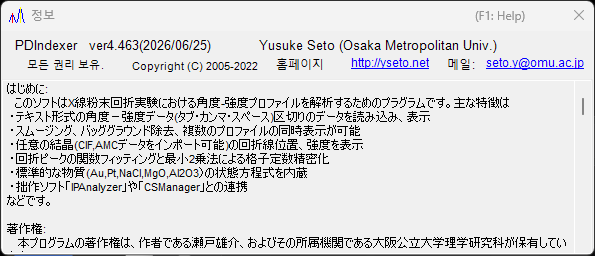

<!-- 260601Cl: migrated from legacy docx + yseto.net web manual -->
# 실행 환경 및 설치

이 페이지에서는 PDIndexer의 설치 방법과 쾌적하게 동작시키기 위해 권장되는 환경을 설명합니다.

## 설치

GitHub 릴리스 페이지에서 최신 버전을 다운로드하십시오.

- 다운로드: <https://github.com/seto77/PDIndexer/releases/latest>

권장되는 방법은 MSI 인스톨러입니다. `PDIndexer-setup.msi`(x64)를 다운로드하고 더블 클릭하면 설치가 시작됩니다. Windows on Arm(Snapdragon PC 등)에서는 대신 `PDIndexer-setup_arm64.msi`를 다운로드하십시오. <!-- 260625Cl WiX asset names + arm64 -->

관리되는 Windows PC에서 MSI 설치가 제한되는 경우, 대안으로 no-install ZIP 패키지를 사용할 수 있습니다. portable ZIP(x64는 `PDIndexer-v.<ver>.zip`, Arm은 `PDIndexer-v.<ver>_arm64.zip`)을 다운로드하여 폴더 전체를 사용자가 쓰기 가능한 위치에 압축 해제한 다음, 압축 해제한 폴더 안의 `PDIndexer.exe`를 실행하십시오. ZIP 뷰어 안에서 직접 `PDIndexer.exe`를 실행하지 마십시오. <!-- 260601Ch / 260625Cl -->

!!! note "Windows 보호 경고에 대하여"
    새로 다운로드한 서명되지 않은 연구용 소프트웨어를 실행하면 Windows가 "Windows에서 PC를 보호했습니다"라는 SmartScreen 경고를 표시할 수 있습니다. 이 경우 **추가 정보**를 클릭한 다음 **실행**을 선택하면 계속 진행할 수 있습니다.

!!! note "no-install ZIP 패키지에 대하여"
    ZIP 패키지는 MSI 설치, 관리자 승인, 또는 별도의 .NET Desktop Runtime 설치가 어려운 환경을 위한 대안입니다. 설정까지 완전히 포함하여 실행 폴더 안에서만 완결되는 것은 아닙니다. PDIndexer는 사용자 설정과 복사된 기본 데이터를 현재 사용자의 AppData 폴더에 저장하며, 사용자별 옵션을 `HKEY_CURRENT_USER\Software\Crystallography\PDIndexer`에 저장할 수 있습니다.

## 필요한 실행 환경

MSI 인스톨러로 설치한 PDIndexer를 실행하려면 다음 런타임이 필요합니다.

| 항목 | 요구 사항 |
| --- | --- |
| OS | Windows(64비트, x64 또는 Arm64) |
| 런타임 | `.NET Desktop Runtime 10.0`(일반 **.NET Runtime**이 아닌 **Desktop Runtime**. Windows on Arm에서는 **Arm64** 빌드) |

!!! warning "Desktop Runtime을 선택하십시오"
    다운로드 페이지에는 ".NET Runtime"과 ".NET Desktop Runtime" 두 가지 제품이 있습니다. PDIndexer는 WinForms 애플리케이션이므로 반드시 **.NET Desktop Runtime**을 설치하십시오. 일반 ".NET Runtime"만으로는 프로그램이 실행되지 않습니다.

- 런타임 다운로드: <https://dotnet.microsoft.com/download/dotnet/10.0>

no-install ZIP 패키지는 해당 아키텍처(x64 또는 Arm64)용 self-contained 패키지이며, 별도의 .NET Desktop Runtime 설치가 필요하지 않습니다. <!-- 260601Ch / 260625Cl arm64 -->

!!! note "이전 문서에 기재된 버전에 대하여"
    이전 매뉴얼(docx)에는 ".NET Desktop Runtime 6.0 이상"이라고 기재되어 있지만, 현재 PDIndexer는 **.NET 10.0**을 필요로 합니다. 최신 버전의 요구 사항을 따르십시오.

## 권장 환경

PDIndexer의 기능 중에는 상당한 계산 자원을 필요로 하는 것이 있습니다. 속도 향상을 위해 계산은 가능한 한 멀티스레드화되어 있습니다. 쾌적하게 사용하려면 다음과 같은 고성능 사양을 갖춘 컴퓨터를 권장합니다.

| 항목 | 권장 사양 |
| --- | --- |
| OS | Windows 11(Windows 10 이상, 64비트에서도 동작) |
| RAM | 16 GB 이상 |
| CPU | 8코어 이상(멀티스레드 계산에 효과적) |

!!! tip "멀티스레딩의 효과"
    결정 구조를 이용한 회절 패턴 계산이나 순차 분석 등은 CPU 코어 수가 많을수록 더 빠르게 실행됩니다. CPU 코어 수가 많을수록 계산 대기 시간을 단축할 수 있습니다.

## 업데이트(새 버전 확인)

메인 창의 **도움말** 메뉴에서 PDIndexer를 최신 버전으로 업데이트하거나 작성자 정보를 확인할 수 있습니다.

| 메뉴 | 기능 |
| --- | --- |
| **도움말** ▸ **프로그램 업데이트** | 새 버전이 공개되었는지 확인하고 프로그램을 업데이트합니다. |
| **도움말** ▸ **PDIndexer 정보** | 버전 및 작성자 정보를 표시합니다. |

**도움말** ▸ **PDIndexer 정보**를 선택하면 아래와 같은 창이 열려 현재 버전 번호와 작성자 정보를 확인할 수 있습니다.

!!! tip "정기적인 업데이트"
    버그 수정과 새로운 기능이 계속해서 추가되고 있습니다. **도움말** ▸ **프로그램 업데이트**를 가끔 실행하여 PDIndexer를 최신 상태로 유지하십시오.

## 라이선스

PDIndexer는 **MIT 라이선스**로 배포됩니다. 저작권 표시 및 라이선스 문구를 재배포물에 포함하는 것을 조건으로 사용, 수정, 배포, 상업적 이용이 자유롭게 허용됩니다. 본 소프트웨어는 무보증으로 제공됩니다.
