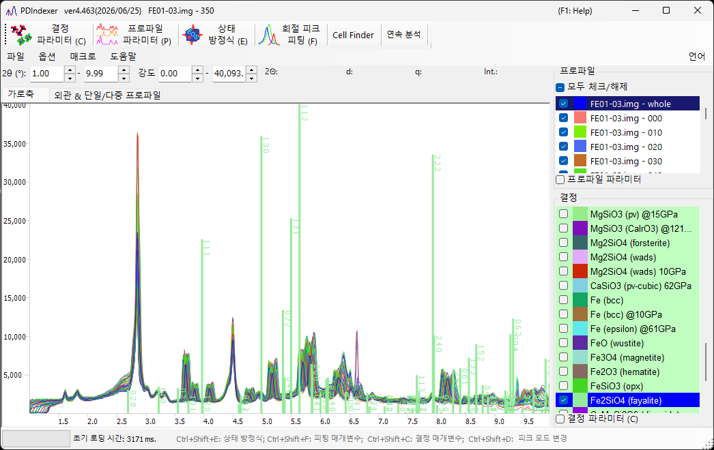

<!-- 260601Cl: English landing page for the PDIndexer Pages manual (content migrated from the legacy docx + yseto.net web manual). -->
<!-- 260625Cl: static-i18n folder mode へ移設 (docs/src/index.md → docs/src/en/index.md)。画像は ../assets、内部リンクは en/ 接頭辞を剥がす。 -->
# PDIndexer 매뉴얼

**PDIndexer**는 1차원 분말 회절 패턴(실험실·방사광 X선, 중성자 TOF)을 분석하는 MIT 라이선스의 무료 Windows 애플리케이션입니다. 측정 프로파일을 표시하고, 결정 구조로부터 계산한 회절선을 겹쳐 표시하며, 프로파일을 처리·보정하고, 피크를 피팅하여 최소제곱법으로 격자 상수를 정밀화하며, 표준 물질의 상태 방정식으로부터 압력을 추정합니다.

## 목적별로 찾기

| 목적 | 여기서 시작 | 주요 다음 단계 |
|------|------------|-----------------|
| 측정 프로파일을 불러와 표시하기 | [2. 회절 프로파일](2-pattern-profiles.md) | [1. 메인 창](1-main-window.md), [파일 형식](appendix/file-formats.md) |
| 기존 결정을 겹쳐 표시하여 상을 동정하기 | [3. 결정 파라미터](3-crystal-parameter.md) | [2. 회절 프로파일](2-pattern-profiles.md) |
| 프로파일을 처리·보정하기 | [4. 프로파일 파라미터](4-profile-parameter.md) | [3. 결정 파라미터](3-crystal-parameter.md) |
| 피크를 피팅하여 격자 상수를 정밀화하기 | [6. 회절 피크 피팅](6-fitting-diffraction-peaks.md) | [3. 결정 파라미터](3-crystal-parameter.md) |
| 표준 물질로부터 압력을 추정하기 | [5. 상태 방정식](5-equation-of-states.md) | [6. 회절 피크 피팅](6-fitting-diffraction-peaks.md) |
| 일련의 프로파일을 일괄 처리하기 | [7. 연속 분석](7-sequential-analysis.md) | [8. 매크로](8-macro.md) |
| 스크립트로 작업을 자동화하기 | [8. 매크로](8-macro.md) | [7. 연속 분석](7-sequential-analysis.md) |

## 목차

- [0. 개요](0-overview.md) — PDIndexer로 할 수 있는 일과 주요 기능
- [1. 메인 창](1-main-window.md) — 화면 구성, 메뉴, 도구 모음, 프로파일/결정 목록
- [2. 회절 프로파일](2-pattern-profiles.md) — 프로파일 데이터, 지원 형식, 불러오기
- [3. 결정 파라미터](3-crystal-parameter.md) — 회절선 표시, 결정 정보, 데이터베이스
- [4. 프로파일 파라미터](4-profile-parameter.md) — 프로파일 처리, 축 설정, 연산
- [5. 상태 방정식](5-equation-of-states.md) — 표준 물질 EOS를 이용한 압력 계산
- [6. 회절 피크 피팅](6-fitting-diffraction-peaks.md) — 피크 피팅과 격자 상수 정밀화
- [7. 연속 분석](7-sequential-analysis.md) — 프로파일 계열의 일괄 분석
- [8. 매크로](8-macro.md) — IronPython 스크립트와 함수 레퍼런스

### 부록

- [실행 환경 및 설치](appendix/runtime-and-installation.md)
- [파일 형식](appendix/file-formats.md)
- [문제 해결](appendix/troubleshooting.md)

## 빠른 시작

1. [릴리스 페이지](https://github.com/seto77/PDIndexer/releases/latest)에서 다운로드하여 설치한 후 *PDIndexer*를 실행합니다.
2. 측정 프로파일을 엽니다(파일을 드래그 앤 드롭하거나, [IPAnalyzer](https://github.com/seto77/IPAnalyzer)에서 복사한 프로파일을 붙여넣기).
3. 내장 데이터베이스에서 기존 결정을 추가하거나(또는 CIF/AMC 파일을 가져와서) 회절선을 겹쳐 표시합니다.
4. 피크를 피팅하여 격자 상수를 정밀화하거나, 표준 물질의 상태 방정식으로부터 압력을 추정합니다.

## 시스템 요구 사항

| 항목 | 요구 사항 |
|------|-------------|
| OS | [.NET Desktop Runtime 10.0](https://dotnet.microsoft.com/download/dotnet/10.0)(.NET Runtime이 **아님**)이 동작하는 Windows |
| 권장 | 64비트 Windows 10/11, 메모리 16 GB 이상, 8코어 이상 CPU |

자세한 내용은 [실행 환경 및 설치](appendix/runtime-and-installation.md)를 참조하세요.

!!! note
    소스 코드, 릴리스, 이슈 트래커는 [GitHub](https://github.com/seto77/PDIndexer)에 있습니다. PDIndexer는 [MIT 라이선스](https://github.com/seto77/PDIndexer/blob/master/LICENSE.md)로 배포됩니다.
