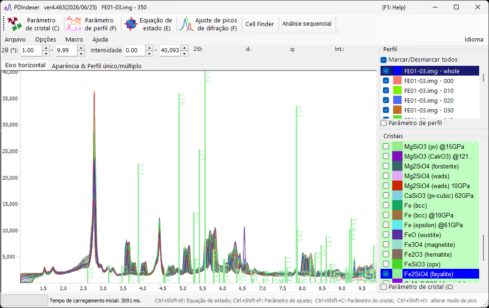

<!-- 260601Cl: migrated from legacy docx + yseto.net web manual -->
# Visão geral

O PDIndexer é um aplicativo de software para analisar padrões unidimensionais de difração de raios X de pó. Ele pode exibir e analisar perfis de difração obtidos de instrumentos de difração de raios X de pó, de raios X de síncrotron medidos com óptica de transmissão de Debye-Scherrer e de medições de tempo de voo (TOF) de nêutrons.

Ele fornece um conjunto completo de ferramentas para a análise de difração de pó, incluindo exibição sobreposta de múltiplos perfis, comparação com as linhas de difração de cristais conhecidos, calibração de temperatura e pressão em relação a materiais padrão, ajuste de perfis e refinamento por mínimos quadrados dos parâmetros de rede.

!!! note "Sobre este manual"
    Esta página é apenas uma visão geral. Para instruções detalhadas sobre cada recurso, consulte as páginas dedicadas.

## Principais recursos

O PDIndexer oferece os seguintes recursos.

| Recurso | Descrição |
| --- | --- |
| Exibição e comparação de perfis | Sobreponha e compare múltiplos perfis de difração. As escalas do eixo horizontal (\(2\theta\) / \(d\) / \(q\)) e do eixo vertical podem ser alternadas de forma flexível. |
| Comparação com cristais conhecidos | Calcule as linhas de difração de cristais conhecidos e sobreponha-as ao perfil observado para identificação. Consulte [Parâmetros do cristal](3-crystal-parameter.md) para detalhes. |
| Calibração com padrões | Usando equações de estado (EOS) como NaCl EOS e Pt EOS, estime a temperatura e a pressão a partir do volume da célula de um material padrão. Consulte [Equação de estado (EOS)](5-equation-of-states.md) para detalhes. |
| Ajuste de picos | Ajuste a posição, a largura total a meia altura (FWHM) e a intensidade dos picos de difração. Consulte [Ajuste de picos de difração](6-fitting-diffraction-peaks.md) para detalhes. |
| Refinamento de parâmetros de rede | Refine os parâmetros de rede a partir das posições dos picos por mínimos quadrados. O **Cell Finder** também pode pesquisar parâmetros de rede a partir das posições dos picos. |
| Análise sequencial | Processe em lote uma série de arquivos com o recurso **Análise sequencial**. Consulte [Análise sequencial](7-sequential-analysis.md) para detalhes. |
| Importação / exportação | Importe estruturas cristalinas de arquivos CIF e AMC e exporte para os formatos CSV, TSV e GSAS (Rietveld). |
| Carregamento automático | Monitore a área de transferência ou uma pasta para ler automaticamente perfis/cristais copiados de outros aplicativos (por exemplo, IPAnalyzer) ou arquivos recém-criados. |

!!! tip "Dados suportados"
    Uma ampla variedade de perfis pode ser manipulada, incluindo os de instrumentos de difração de raios X de pó, raios X de síncrotron (óptica de transmissão de Debye-Scherrer) e medições de tempo de voo (TOF) de nêutrons.

## Licença

Este software é distribuído sob a **Licença MIT** ([LICENSE.md](https://github.com/seto77/PDIndexer/blob/master/LICENSE.md)). Qualquer pessoa é livre para usar este software gratuitamente, desde que as seguintes condições sejam aceitas.

- Você pode livremente copiar, distribuir, modificar, redistribuir versões modificadas, usar comercialmente, vender por uma taxa ou usar o software de qualquer outra forma.
- Ao redistribuir, inclua o aviso de direitos autorais deste software e o texto completo desta licença no código-fonte ou em um arquivo de licença separado empacotado com o código-fonte.
- Este software não vem com nenhuma garantia. O autor não assume nenhuma responsabilidade por quaisquer problemas decorrentes do uso deste software.

## Comentários

Envie seus comentários e solicitações por meio das [Issues](https://github.com/seto77/PDIndexer/issues) do GitHub. O código-fonte está publicado em [github.com/seto77/PDIndexer](https://github.com/seto77/PDIndexer).

## Instalação e requisitos de sistema

O PDIndexer requer um sistema operacional Windows capaz de executar o **.NET Desktop Runtime 6.0 ou posterior**. Alguns recursos exigem recursos computacionais substanciais; multithreading e aceleração por GPU são usados para melhorar a velocidade. Para um uso confortável, recomenda-se um Windows 10/11 de 64 bits com 16 GB ou mais de memória e uma CPU de 8 núcleos ou superior.

Para etapas detalhadas de instalação e requisitos de sistema, consulte [Runtime e instalação](appendix/runtime-and-installation.md).
