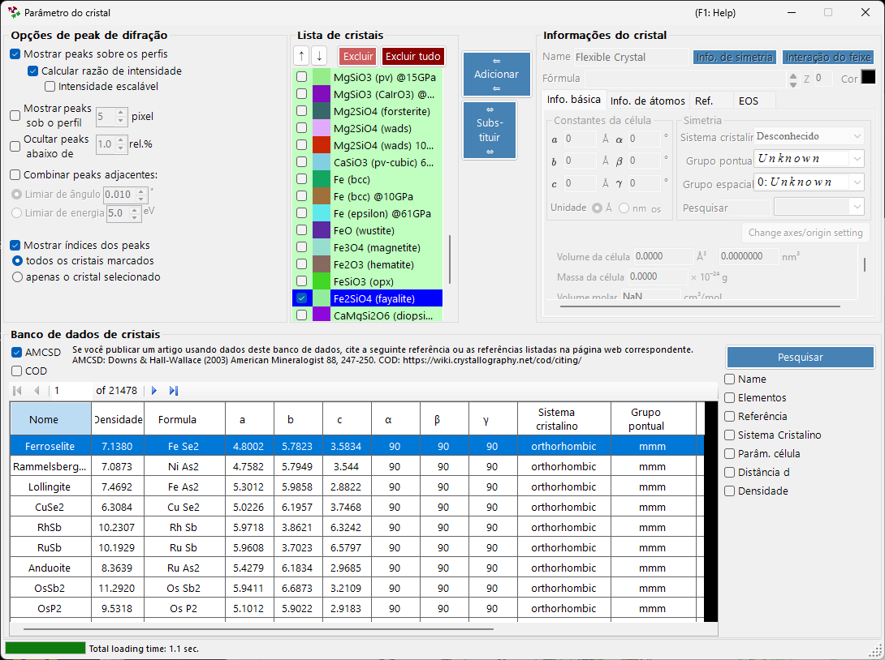
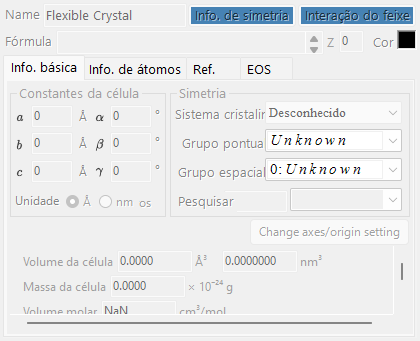
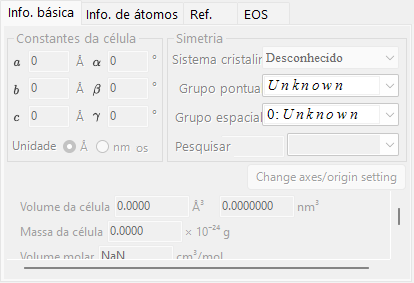
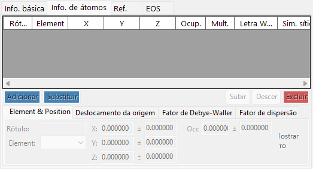
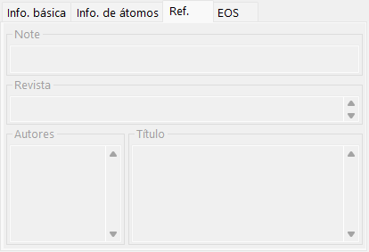
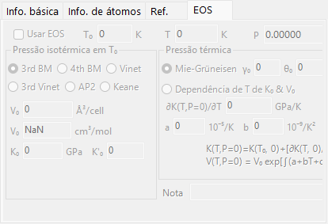
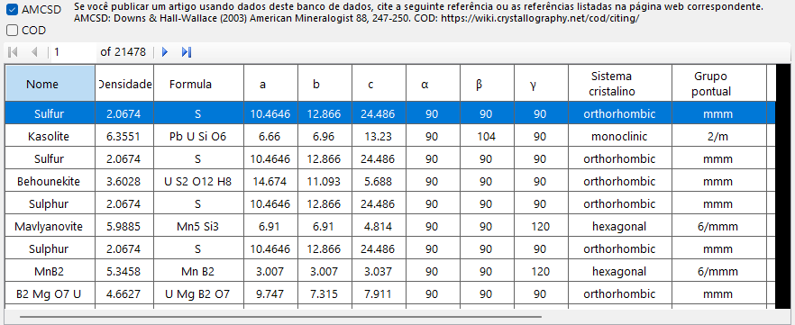
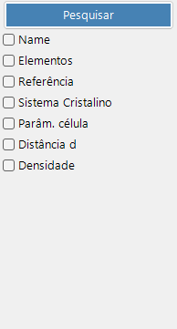
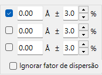

<!-- 260601Cl: migrated from legacy docx + yseto.net web manual -->
# Parâmetros do cristal

Clicar no ícone `Parâmetro do cristal` na barra de ferramentas da janela principal abre a subjanela mostrada abaixo. Aqui você define quais linhas de difração dos cristais serão exibidas e como esses picos são desenhados. Um banco de dados de cristais para buscar e importar estruturas está integrado à parte inferior da janela.

A janela é dividida em quatro áreas principais.

| Área | Finalidade |
| --- | --- |
| `Opções de peak de difração` | Como as linhas de difração são exibidas |
| `Lista de cristais` | Uma lista de verificação de cristais compartilhada com a janela principal |
| `Informações do cristal` | Parâmetros detalhados do cristal selecionado (em abas) |
| `Banco de dados de cristais` | Busca e importação baseadas no AMCSD |

---

## Opções de peak de difração

Configura a exibição das linhas de difração.

### Mostrar peaks sobre os perfis

Seleciona se as linhas de difração são desenhadas sobrepostas aos dados do perfil.

### Calcular razão de intensidade {#calculate-intensity-ratio}

Seleciona se as intensidades de difração (suas razões) são calculadas a partir dos dados estruturais.

!!! note
    Se as posições atômicas não tiverem sido inseridas, as intensidades não são calculadas, independentemente do estado da caixa de seleção. Consulte a [aba Info. de átomos](#atom-info-tab) para inserir os dados atômicos.

### Intensidade escalável

Seleciona se todas as linhas de difração podem ser escalonadas globalmente sem alterar suas razões de intensidade relativas.

### Mostrar peaks sob o perfil

Seleciona se os picos de difração são desenhados abaixo do perfil.

#### Altura do peak

Define a altura, em pixels (`pixel`), dos picos desenhados abaixo do perfil.

### Combinar peaks adjacentes

Seleciona se as intensidades de picos que, embora sejam cristalograficamente não equivalentes, têm valores de 2θ quase idênticos ou exatamente idênticos, devem ser combinadas.

Por exemplo, no sistema cúbico os planos (333) e (115) são não equivalentes, mas têm exatamente o mesmo espaçamento d, de modo que se sobrepõem na observação. Marcar esta caixa permite exibir a intensidade combinada deles.

| Item | Descrição |
| --- | --- |
| `Limiar de ângulo` | Quão próximos os picos devem estar para serem combinados, indicado em graus (`°`). |
| `Limiar de energia` | Para dados de dispersão de energia, o intervalo de combinação indicado em energia (`eV`). |

!!! tip
    O manual antigo indicava o limiar em ångströms, mas a versão atual o especifica em graus (`°`) ou em energia (`eV`), dependendo do tipo de eixo horizontal.

### Ocultar peaks abaixo de

Seleciona se picos que são fracos demais em comparação com a reflexão mais intensa devem ser removidos. O corte é indicado como uma razão relativa à linha mais intensa (`rel.%`).

### Mostrar índices dos peaks

Seleciona quais cristais têm os índices de suas linhas de difração (índices de Miller) rotulados.

| Opção | Alvo |
| --- | --- |
| `todos os cristais marcados` | Todos os cristais marcados |
| `apenas o cristal selecionado` | Apenas o cristal atualmente selecionado na lista |

---

## Lista de cristais

Isto mostra as mesmas informações que a lista de verificação de perfis na janela principal. Os cristais marcados têm suas linhas de difração desenhadas na janela principal. Cada linha mostra uma caixa de seleção (`Marcar`), uma cor de desenho (`Cor do peak`) e o nome do cristal (`Cristal`).

### Botões de seta para cima/baixo (↑ / ↓)

Alteram a ordem dos cristais.

!!! note
    As linhas de 1 a 6 são reservadas para a equação de estado (EOS) e não podem ser reordenadas. Consulte [Equação de estado](5-equation-of-states.md) para mais detalhes.

### Adicionar

Adiciona à lista, como uma nova entrada, o cristal configurado na área Informações do cristal, à direita (descrita abaixo).

### Substituir

Substitui o cristal atualmente selecionado por aquele configurado na área Informações do cristal, à direita.

### Excluir

Remove o cristal atualmente selecionado da lista.

### Excluir tudo

Remove todos os cristais da lista.

---

## Informações do cristal {#crystal-information}

Edita e exibe informações detalhadas do cristal selecionado em várias abas. As abas principais são:

| Aba | Conteúdo |
| --- | --- |
| `Info. básica` | Parâmetros de rede, sistema cristalino, grupo espacial e outras informações básicas |
| `Info. de átomos` | Tipos de átomos, ocupações, coordenadas e fatores de temperatura |
| `Ref.` | Informações de referência da publicação de origem, autores e assim por diante |
| `EOS` | Configurações da equação de estado para compressão e expansão térmica |

### Aba Info. básica

Define informações básicas, como os parâmetros de rede (a, b, c, α, β, γ), o sistema cristalino e o grupo espacial. Escolher um grupo espacial restringe automaticamente os parâmetros de rede editáveis e os graus de liberdade das coordenadas atômicas.

!!! tip
    Clicar com o botão direito em um campo de parâmetro de rede exibe um menu que restaura os parâmetros de rede aos valores que tinham na inicialização do aplicativo (ou no momento em que a estrutura foi importada do banco de dados). Isso é útil quando você quer retornar aos valores de referência originais após alterá-los por meio do ajuste.

### Aba Info. de átomos {#atom-info-tab}

Define o elemento, a ocupação, as coordenadas fracionárias e os fatores de temperatura isotrópicos/anisotrópicos de cada átomo. Quando as posições atômicas são inseridas aqui, as intensidades de difração podem ser calculadas por meio de [Calcular razão de intensidade](#calculate-intensity-ratio).

### Aba Ref.

Guarda informações de referência, como o título da publicação, o nome da revista e os autores que são a fonte da estrutura cristalina. Estruturas importadas do banco de dados de cristais têm essas informações preenchidas automaticamente.

### Aba EOS

Define a equação de estado (EOS) por cristal, que governa como os parâmetros de rede mudam com a pressão e a temperatura. Os principais campos de entrada são:

| Campo | Descrição |
| --- | --- |
| `Use EOS` | Habilita o cálculo de pressão por EOS para este cristal. |
| `T0` / `Temperature` | Temperatura de referência / medida. |
| `V0` | Volume de referência da célula unitária. |
| `K0`, `K'0` | Módulo de compressibilidade isotérmico e sua derivada em relação à pressão. |
| Forma isotérmica | `BM3` (Birch-Murnaghan de terceira ordem, padrão) / `BM4` / `Vinet` / `AP2` / `Keane`. |
| Pressão térmica | `Mie-Grüneisen` (padrão; parâmetros \( \gamma_0, \theta_0, q \)) / `T-dependence K0&V0`. |

Consulte [Equação de estado](5-equation-of-states.md) para as fórmulas e as definições dos símbolos.

---

## Banco de dados de cristais

Fornece funções de busca e importação para mais de 20.000 estruturas cristalinas. Este banco de dados é baseado no American Mineralogist Crystal Structure Database (AMCSD).

!!! warning "Citação"
    Ao usar estes dados cristalinos, leia atentamente <http://rruff.geo.arizona.edu/AMS/amcsd.php> e não deixe de citar a seguinte referência.

    > Downs, R.T. and Hall-Wallace, M. (2003) The American Mineralogist Crystal Structure Database. *American Mineralogist* **88**, 247-250.

### Tabela

Lista os cristais contidos no banco de dados. Se condições de busca forem inseridas, apenas os cristais que as satisfazem são exibidos.

Selecionar qualquer cristal na tabela transfere suas informações para [Informações do cristal](#crystal-information). Para adicioná-lo à lista de cristais, pressione o botão `Adicionar` ou `Substituir` na área Lista de cristais.

### Opções de busca

Insira as condições de busca. Após inseri-las, pressione o botão `Pesquisar` ou a tecla Enter. Cada condição pode ser habilitada ou desabilitada com sua caixa de seleção.

#### Nome

Insira o nome do cristal.

#### Elementos

Pressionar o botão `Tabela Periódica` abre uma janela separada onde você escolhe os elementos a buscar. Cada botão de elemento alterna seu estado a cada vez que você o pressiona.

Os botões no topo da janela alternam o estado de todos os elementos de uma só vez.

| Botão | Significado |
| --- | --- |
| `may or not include` | O elemento pode ou não estar presente (remove todas as restrições de elemento). |
| `must include` | Deve incluir (apenas cristais que contêm todos os elementos especificados são mantidos). |
| `must exclude` | Deve excluir (cristais que contêm qualquer um dos elementos especificados são removidos). |

!!! tip
    Marcar `Ignorar fator de dispersão` permite buscar sem levar em conta os fatores de espalhamento.

#### Referência

Insira o título da publicação, o nome da revista ou o nome do autor.

#### Sistema Cristalino

Busca especificando o sistema cristalino.

#### Parâm. célula

Insira os parâmetros de rede e a tolerância permitida.

#### Distância d

Insira o espaçamento d de uma reflexão intensa e a tolerância permitida.

#### Densidade

Insira a densidade e a tolerância permitida.
