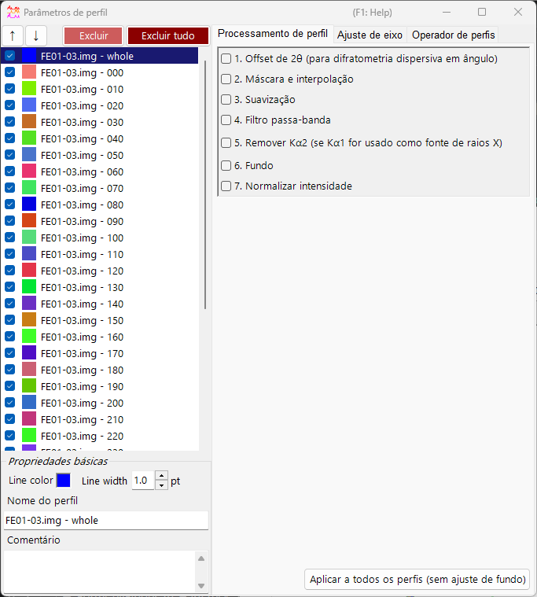
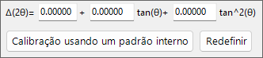
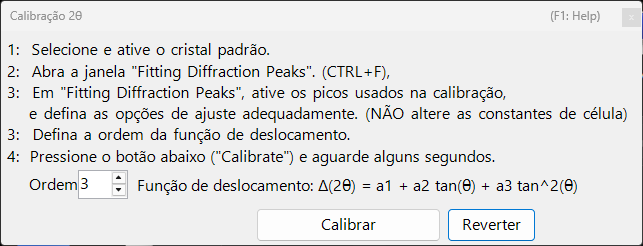
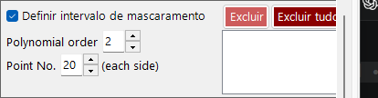
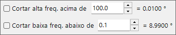
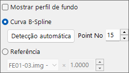
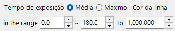

<!-- 260601Cl: migrated from legacy docx + yseto.net web manual -->
# Parâmetros do perfil

Ao clicar no ícone `Profile parameter` na janela principal, esta subjanela é aberta. Aqui você faz ajustes detalhados nos perfis carregados e aplica diversos processamentos numéricos.

O lado esquerdo da janela contém a [Lista de verificação de perfis](#profile), e o lado direito é dividido em três páginas em abas — [Processamento de perfil](#profile-processing), [Configuração de eixo](#axis-setting) e [Operador de perfil](#profile-operator). Cada etapa de processamento pode ser ativada/desativada com uma caixa de seleção e é aplicada em ordem, de cima para baixo.

!!! note
    As configurações feitas nesta janela são refletidas nos perfis da [janela principal](1-main-window.md) em tempo real. Para configurações do lado do cristal, como a unidade do eixo horizontal e os rótulos de índice das linhas de difração, consulte [Crystal Parameter](3-crystal-parameter.md).

---

## Lista de verificação de perfis {#profile}

A lista no lado esquerdo da janela mostra as mesmas informações que a Lista de verificação de perfis na janela principal. Selecionar um perfil na lista o torna o alvo do processamento e das configurações no lado direito da janela.

| Item | Descrição |
| --- | --- |
| `↑` `↓` (botões de seta para cima/baixo) | Alteram a ordem dos perfis na lista. |
| `Delete` | Exclui o perfil selecionado. |
| `Delete all` | Exclui todos os perfis. |

Na área `Basic property` abaixo da lista, você edita os atributos básicos do perfil selecionado.

| Item | Descrição |
| --- | --- |
| `Line Color` | Clique para alterar a cor de desenho do perfil selecionado. |
| `Line Width` | Define a espessura da linha do perfil (`pt`). |
| `Profile Name` | Define o nome do perfil. |
| `Comment` | Um campo de comentário de formato livre. |

---

## Processamento de perfil {#profile-processing}

Na aba `Profile processing` você aplica diversos processamentos numéricos ao perfil selecionado. As etapas 1–7 podem ser habilitadas de forma independente com uma caixa de seleção, e as habilitadas são aplicadas em ordem numérica.

### 1. Deslocamento de 2θ {#two-theta-offset}

`1. 2θ offeset (for angle-dispersive diffractmetry)` corrige o ângulo de dados dispersivos em ângulo. A expressão de correção é uma função quadrática de \( \tan\theta \).

$$ \Delta(2\theta) = a_0 + a_1 \tan\theta + a_2 \tan^2\theta $$

Se o perfil contiver um padrão interno (uma amostra com parâmetros de rede conhecidos), pressione o botão `Calibration using an internal standard` e siga as mensagens; os coeficientes da função quadrática são então determinados automaticamente. Na caixa de diálogo de calibração, as posições de pico observadas são correspondidas às posições de pico teóricas do padrão, e os coeficientes são ajustados.

O botão `Reset` reinicia os coeficientes de deslocamento que você definiu.

!!! tip
    Padrões internos são comumente materiais com parâmetros de rede determinados com precisão, como Si ou LaB₆. Após a calibração, os valores de 2θ corrigidos são usados diretamente em toda a análise subsequente.

### 2. Máscara e interpolação {#mask}

`2. Mask and Interpolation` mascara um intervalo angular especificado (ou intervalo de energia) e interpola o perfil usando as intensidades fora do intervalo mascarado.

| Item | Descrição |
| --- | --- |
| `Set Masking range` | Especifica o intervalo do eixo horizontal a mascarar. |
| `Point No.` | Especifica o número de pontos de extremidade (de cada lado) usados para interpolação. |
| `Polynomial order` | Especifica a ordem do polinômio usado para interpolação. |
| `Save Masking Ranges` / `Read Masking Ranges` | Salva os intervalos de mascaramento configurados em um arquivo, ou os lê de volta. |
| `Delete` / `Delete all` | Exclui um intervalo de mascaramento individual, ou todos eles. |

### 3. Suavização {#smoothing}

`3. Smoothing` aplica suavização ao perfil selecionado. O algoritmo de suavização é o método `Savitzky-Golay`.

Neste método, para cada posição \(x\) de interesse, um ajuste por mínimos quadrados com um polinômio de grau `Order` é realizado sobre os dados dentro de \(\pm\) `Point No.` desse ponto, e o valor da função resultante \(F(x)\) é adotado como a nova intensidade nessa posição \(x\).

!!! note
    Quando `Order` \(= 1\), a suavização de Savitzky–Golay é equivalente a uma simples média móvel. Aumentar `Order` preserva melhor as formas dos picos, enquanto aumentar `Point No.` intensifica a suavização.

### 4. Filtro passa-banda {#bandpass}

`4. Bandpass filter` usa uma transformada de Fourier (FFT) para cortar componentes acima ou abaixo de frequências especificadas.

| Item | Descrição |
| --- | --- |
| `Cut high-freq. over` | Remove componentes com frequência mais alta que o valor especificado (reduz o ruído de alta frequência). |
| `Cut low-freq. under` | Remove componentes com frequência mais baixa que o valor especificado (remove um fundo que varia lentamente). |

### 5. Remover Kα2 {#remove-ka2}

`5. Remove Kα2 (if Kα1 is used as X-ray source)`: se o perfil selecionado foi medido com raios X nos quais Kα1 e Kα2 não estão separados, e foi carregado especificando Kα1, marcar esta opção remove a intensidade de difração originada por Kα2.

!!! warning
    Este processamento só é eficaz quando Kα1 é selecionado como fonte de raios X. Verifique e configure a unidade do eixo horizontal e o tipo de radiação na aba [Configuração de eixo](#axis-setting).

### 6. Fundo {#background}

`6. Background` subtrai o fundo do perfil. Há dois métodos.

#### B-Spline curve

Pressionar `Auto Detect` calcula e subtrai o fundo automaticamente. Com `Point No.` você define o número máximo de pontos de controle de fundo a procurar automaticamente.

Você também pode alterar os pontos de controle manualmente. Arraste com o mouse os pontos de controle redondos desenhados na janela principal para criar uma curva apropriada.

#### Reference

Você pode especificar outro perfil como o fundo do perfil selecionado. Marcar `Show background profile` exibe o perfil que está sendo usado como fundo.

!!! note
    A subtração de fundo (etapa 6) é excluída da aplicação em massa realizada pelo botão `Apply for all profiles` descrito abaixo.

### 7. Normalizar intensidade {#normalize}

`7. Normarize intensity` normaliza o perfil de modo que a `Average` ou o `Maximum` sobre um intervalo especificado do eixo horizontal se torne uma intensidade especificada.

| Item | Descrição |
| --- | --- |
| `Average` / `Maximum` | Escolha se a média ou o máximo dentro do intervalo é usado como referência. |
| `intensity between` | Especifica o intervalo alvo do eixo horizontal. |
| `to` | Especifica o valor de intensidade alvo após a normalização. |

### Botão Apply for all profiles {#apply-all}

O botão `Apply for all profiles (without background setting)` aplica as configurações das etapas 1–7, **excluindo 6. Background**, a todos os perfis de uma só vez.

---

## Configuração de eixo {#axis-setting}

Na aba `Axis setting` você altera a unidade do eixo horizontal, o tipo de radiação (feixe incidente) e a energia do feixe incidente do perfil selecionado.

| Item | Descrição |
| --- | --- |
| `Horizontal axis setting` | Altera a unidade atual do eixo horizontal (`horizontal unit`). Com `Shift` você também pode deslocar todo o eixo horizontal. |
| `Exposure Time` | Define o tempo de exposição (`sec.`) usado no modo CPS (`(for CPS mode)`). |
| `Vertical axis setting` | Configurações relacionadas ao eixo vertical. |

!!! note
    A configuração de eixo aqui altera as informações físicas que o próprio perfil mantém (unidade, tipo de radiação, energia). Diferentemente da transformação de eixo apenas para exibição na janela principal, ela afeta como os próprios dados são interpretados. Como o tipo de radiação e a energia influenciam diretamente o cálculo das posições das linhas de difração, defina os valores corretos.

---

## Operador de perfil {#profile-operator}

Na aba `Profile Operator` você realiza a média de múltiplos perfis e operações aritméticas entre perfis.

Após especificar os perfis alvo do cálculo e a operação que deseja realizar, pressione o botão `Calculate`; o resultado é adicionado como um novo perfil.

| Modo | Descrição |
| --- | --- |
| `Average` | Faz a média de múltiplos perfis. |
| `Profile and value` | Opera entre um perfil e um valor escalar. |
| `Two profiles` | Realiza uma operação aritmética (como adição) entre dois perfis. |

Com `Output name of the profile` você pode especificar o nome do perfil gerado (o padrão é `Result #01`).

!!! tip
    Isso pode ser usado, por exemplo, para fazer a média de várias medições e melhorar a razão S/N, ou para tomar a diferença de dois perfis a fim de extrair a mudança entre eles.
