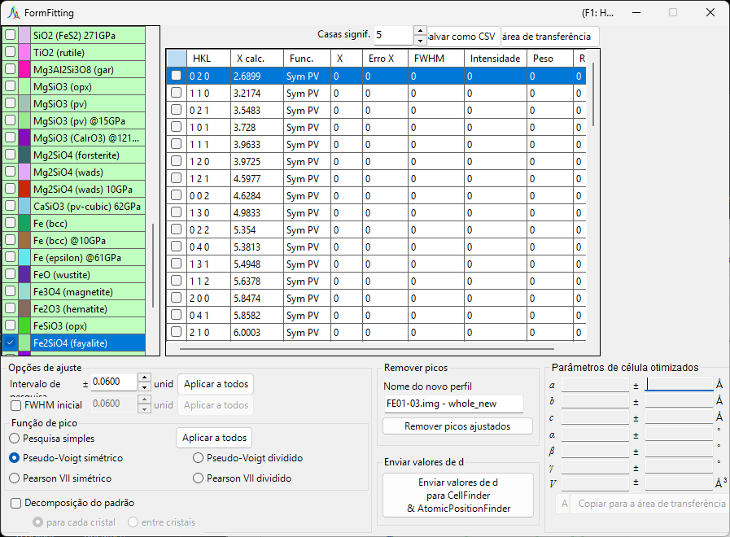
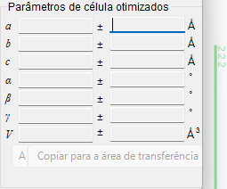
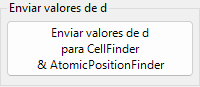
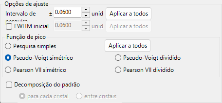
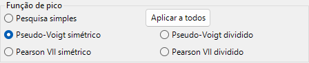
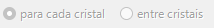
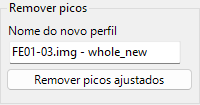
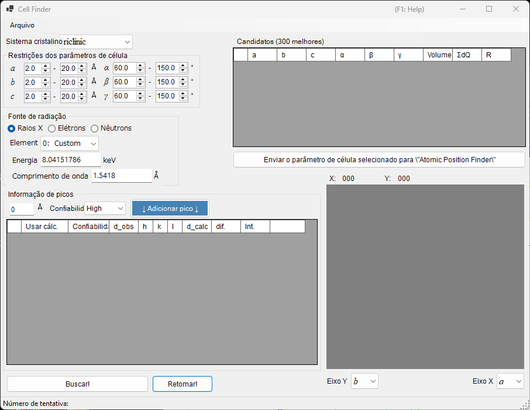
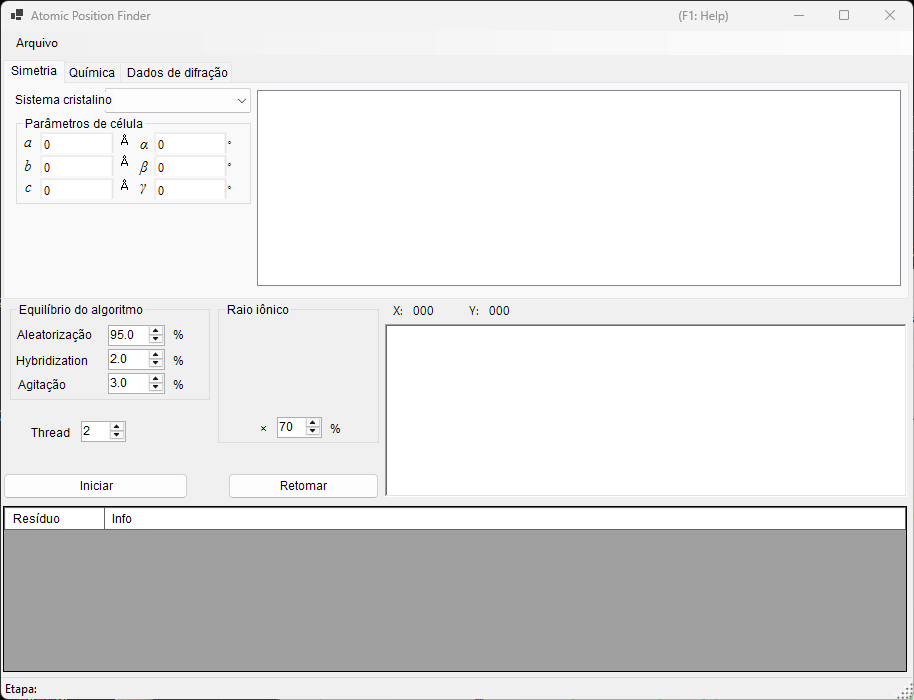

<!-- 260601Cl: migrated from legacy docx + yseto.net web manual -->
# Ajuste de picos de difração

A ferramenta `Fitting diffraction peaks` ajusta os picos de um perfil de difração com uma função apropriada, deriva o espaçamento d a partir de cada posição de pico 2θ e refina os parâmetros de rede por mínimos quadrados. Ela é iniciada a partir da barra de ferramentas da janela principal.

## Fluxo de trabalho básico

1. Selecione o cristal alvo na lista de cristais (no modo multi-perfil, selecione também o perfil no qual deseja trabalhar).
2. Na janela principal, arraste as linhas de difração com o mouse de modo que se sobreponham aos picos medidos o mais próximo possível.
3. Escolha os índices das linhas de difração que deseja ajustar na lista de picos de difração (uma caixa de lista com marcações).
4. Assim que índices independentes suficientes forem escolhidos para que o cálculo por mínimos quadrados seja solúvel, os parâmetros de rede mais prováveis aparecem, com seus erros, no painel `Optimized cell constants` (parâmetros de célula otimizados) no canto inferior direito.
5. Pressione `Apply to the crystal` (aplicar ao cristal) para enviar os parâmetros de rede refinados de volta ao cristal no programa principal.

!!! note "Marcar e selecionar um cristal"
    A lista de cristais espelha a da janela principal. Para que o ajuste tenha efeito, o cristal alvo deve estar tanto marcado quanto selecionado.

## Lista de cristais

A lista de cristais no canto superior esquerdo contém os mesmos cristais da janela principal. O cristal que você marca e seleciona aqui torna-se o alvo do ajuste. Consulte [Parâmetros do cristal](3-crystal-parameter.md) para mais detalhes.

## Lista de picos de difração

As linhas de difração do cristal selecionado são listadas aqui. Ativar a caixa de marcação de uma linha torna essa linha de difração um alvo de ajuste. A lista contém colunas como as seguintes.

| Coluna | Conteúdo |
| --- | --- |
| `Check` | Se a linha deve ser incluída no ajuste |
| `PeakColor` | Cor de exibição |
| `Crystal` | Nome do cristal |
| `HKL` | Índices de reflexão |
| `Calc X` | Posição calculada da linha de difração |
| `Func` | Função de pico utilizada |
| `X` | Posição do pico obtida pelo ajuste |
| `X Err` | Erro da posição do pico |
| `FWHM` | Largura à meia altura |
| `Intensity` | Intensidade do pico |
| `Weight` | Peso no ajuste por mínimos quadrados |
| `R` | Índice de resíduo do ajuste |

Os botões abaixo da lista exportam os resultados.

- `Copy to clipborad`: Copia a tabela para a área de transferência. Ela pode ser colada diretamente no Excel e aplicativos semelhantes.
- `Save as CSV`: Salva a tabela como um arquivo `.csv`. `Effective digit` (casas significativas) define o número de casas decimais.
- `Clear peaks`: Limpa os resultados do ajuste.

## Fitting option (Opções de ajuste)

Aqui você faz as configurações detalhadas usadas ao ajustar os perfis de pico.

### Search Range / Initial FWHM

- `Search Range` (intervalo de pesquisa): Define o intervalo sobre o qual o ajuste é realizado. Isto é, a região dentro de ±Search Range em torno da posição calculada da linha de difração é tomada como alvo do ajuste para aquele pico.
- `Initial FWHM` (FWHM inicial): Especifica a largura à meia altura inicial da função de perfil. Ela é usada como valor de partida para a convergência dos mínimos quadrados.

Pressionar `Apply to all` (aplicar a todos) aplica as configurações atuais a todas as linhas de difração de uma só vez.

### Peak function (Função de pico)

Seleciona a função de pico usada para o ajuste.

| Função de pico | Conteúdo |
| --- | --- |
| `Simple Search` | Não realiza ajuste de função; reconhece o ponto mais intenso dentro de ±Search Range em torno da posição calculada da linha de difração como a posição do pico. |
| `Symmetric Pseudo Voigt` | Ajusta com uma função pseudo-Voigt simétrica à esquerda e à direita. |
| `Symmetric Pearson VII` | Ajusta com uma função Pearson VII simétrica à esquerda e à direita. |
| `Split Pseudo Voigt` | Ajusta com uma função pseudo-Voigt assimétrica (dividida) à esquerda e à direita. |
| `Split Pearson VII` | Ajusta com uma função Pearson VII assimétrica (dividida) à esquerda e à direita. |

!!! tip "Função recomendada"
    A menos que haja uma razão específica para não fazê-lo, `Symmetric Pseudo Voigt` é recomendado por causa de sua estabilidade superior.

A função pseudo-Voigt é uma combinação linear de uma gaussiana \(G(x)\) e uma lorentziana \(L(x)\) com parâmetro de mistura \(\eta\), dada por:

$$
\mathrm{pV}(x) = \eta\, L(x) + (1-\eta)\, G(x), \qquad 0 \le \eta \le 1
$$

onde \(\eta\) é a fração da componente lorentziana. A forma dividida representa um perfil assimétrico tomando parâmetros como a FWHM independentemente à esquerda e à direita da posição do pico.

### Pattern Decomposition

Quando os Search Ranges de duas ou mais linhas de difração selecionadas se sobrepõem, esta opção seleciona se deve ser realizada a decomposição do padrão (ajuste simultâneo dos picos sobrepostos).

- `in each crystal` (para cada cristal): Realiza a decomposição do padrão independentemente para cada cristal.
- `between crystals` (entre cristais): Realiza a decomposição do padrão através de todos os cristais.

## Optimized cell constants (Parâmetros de célula otimizados)

Assim que índices independentes suficientes forem escolhidos para que o cálculo por mínimos quadrados se torne solúvel, este painel exibe os parâmetros de rede mais prováveis \(a, b, c, \alpha, \beta, \gamma\) e o volume \(V\), cada um com seu erro (`±`).

!!! note "Sobre a exibição de NA"
    Quando não há graus de liberdade suficientes—isto é, quando os graus de liberdade são iguais ao número de picos ajustados, ou quando um dado parâmetro de rede não tem graus de liberdade—`NA` é exibido em vez de um erro. Escolher reflexões independentes suficientes permite que os erros sejam calculados.

- `Apply to the crystal` (aplicar ao cristal): Envia os parâmetros de rede refinados de volta ao cristal selecionado no programa principal.
- `Copy to Clipboard` (copiar para a área de transferência): Copia os parâmetros de rede otimizados para a área de transferência.
- `Reset take off angle` (redefinir ângulo de take-off): Redefine o ângulo de take-off.

## Remove fitted peaks (Remover picos ajustados)

Isto subtrai os picos ajustados do perfil e produz o perfil residual como um novo perfil. Digite o nome de destino em `New profile name` (nome do novo perfil) e pressione `Remove fitted peaks` (remover picos ajustados) para realizar a subtração. É útil para verificar o fundo ou a separação de picos sobrepostos.

## Ferramentas relacionadas (Send d-values)

Pressionar `Send d-values to CellFinder && AtomicPositionFinder` envia os valores de d obtidos do ajuste para as seguintes ferramentas de análise, que também podem ser iniciadas a partir da barra de ferramentas.

### Cell Finder

O `Cell Finder` procura a célula unitária (parâmetros de rede) que explica um conjunto de posições de pico medidas (uma lista de valores de d), trabalhando de trás para frente a partir dessas posições. Ele é usado para indexar amostras desconhecidas.

### Atomic Position Finder

O `Atomic Position Finder` procura as posições atômicas em uma estrutura cristalina a partir de quantidades como as intensidades das reflexões observadas.

!!! tip "Identificando uma amostra desconhecida"
    Depois de determinar os parâmetros de rede com o `Cell Finder`, registre esse cristal na lista de cristais, e você poderá refinar os parâmetros de rede ainda mais com o ajuste por mínimos quadrados desta ferramenta.
