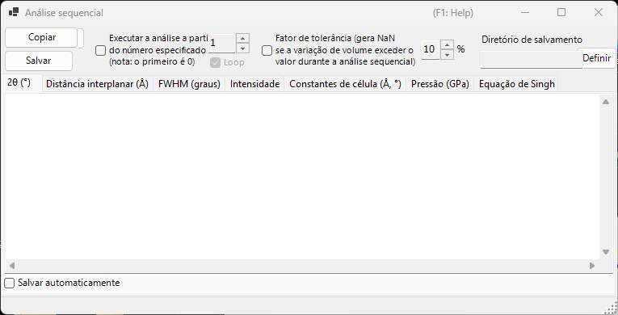
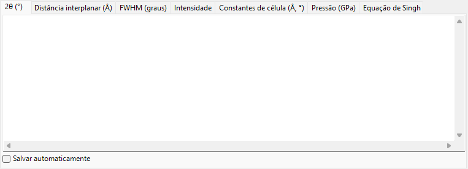
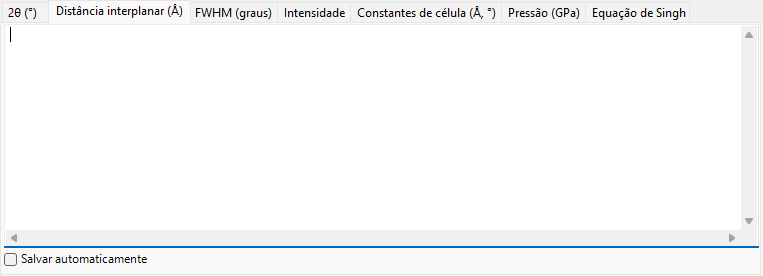
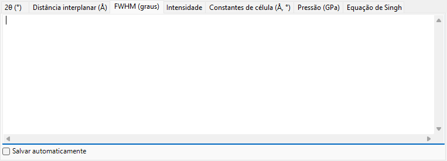
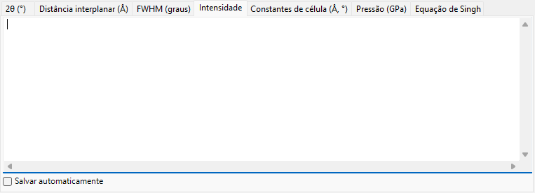
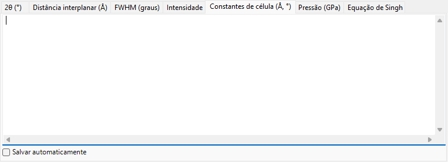
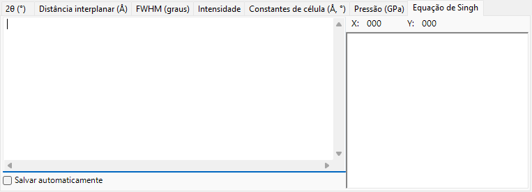

<!-- 260601Cl: migrated from legacy docx + yseto.net web manual -->
# Análise sequencial

A `Análise sequencial` executa o mesmo ajuste de picos, um após o outro, em muitos perfis carregados e reúne os resultados por quantidade. Ela foi concebida para uma série de perfis adquiridos enquanto uma condição como temperatura, pressão ou tempo varia: processa a série inteira de uma só vez e tabula, em sua própria aba, os resultados de 2θ, espaçamento d, FWHM, intensidade, constantes de célula, pressão e equação de Singh (análise de tensão uniaxial / deformação da rede) para cada linha de difração.

Use o botão `Análise sequencial` na barra de ferramentas da janela principal para abrir e fechar esta janela.

!!! note "Compartilhado com [Ajuste de picos de difração](6-fitting-diffraction-peaks.md)"
    A análise sequencial compartilha sua configuração de ajuste com a janela `Ajuste de picos de difração`. Abra primeiro a janela `Ajuste de picos de difração`, selecione o cristal alvo e marque as linhas de difração (picos) que deseja ajustar. Se estes não estiverem preparados quando você pressionar `Executar`, uma mensagem avisará para fazê-lo.

## Fluxo de trabalho básico

1. Carregue a série inteira de perfis medidos sob a condição variável (são necessários pelo menos quatro perfis).
2. Abra a janela [Ajuste de picos de difração](6-fitting-diffraction-peaks.md), escolha o cristal alvo e marque as linhas de difração que deseja analisar. A função de ajuste e o intervalo de pesquisa que você definir ali são reutilizados pela análise sequencial.
3. Opcionalmente, defina o número inicial, o ciclo, o fator de tolerância e as opções de salvamento automático (veja abaixo).
4. Pressione `Executar`. Cada perfil carregado é ativado por vez, um ajuste por mínimos quadrados é executado e os resultados se acumulam em cada aba.
5. Revise cada aba e leve os dados para uma planilha (Excel, etc.) com `Copiar` ou `Salvar`.

O progresso e o tempo decorrido são exibidos na barra de status na parte inferior da janela como `... % completed.  Elapsed time: ... sec`. Quando a análise termina, os resultados de 2θ, espaçamento d, FWHM e intensidade são copiados em conjunto para a área de transferência.

!!! tip "Dois ajustes por perfil"
    Para obter uma convergência estável, o ajuste por mínimos quadrados é executado duas vezes para cada perfil antes de o resultado ser registrado.

## Opções de análise

Os controles em torno do botão `Executar` governam o intervalo de análise e o tratamento de valores discrepantes.

| Opção | Descrição |
| --- | --- |
| `Executar a análise a partir do número especificado (nota: o primeiro é 0)` | Quando marcado, inicia a análise a partir do número de perfil definido na caixa à direita, em vez de a partir do primeiro perfil. O primeiro perfil é o número 0. |
| `Ciclo` | Ao iniciar a partir de um número, também processa os perfis anteriores ignorados (0 … início − 1) após chegar ao fim, dando a volta para que a série inteira seja analisada. Disponível somente quando o número inicial está habilitado. |
| `Fator de tolerância (gera NaN se a variação de volume exceder o valor durante a análise sequencial)` | Quando marcado, rejeita um ajuste (gera `NaN` para essa linha) quando o volume de célula refinado varia em relação ao valor inicial mais do que o valor (em %) à direita. Isso descarta automaticamente os valores discrepantes causados por um ajuste que falhou. |

## Abas de saída

Cada aba é uma tabela para uma quantidade de saída. Cada linha corresponde a um perfil (o nome do perfil), e cada coluna corresponde a uma linha de difração selecionada (índice hkl, ou `Peak No.` para um flexible crystal). As tabelas são mantidas como texto separado por tabulações e são convertidas em valores separados por vírgulas (CSV) quando você as usa com `Copiar` ou `Salvar`.

### 2θ (°)

A posição de pico ajustada, em 2θ (graus), para cada perfil e cada linha de difração.

### Distância interplanar (Å)

O espaçamento interplanar d, em Å, calculado a partir de cada posição de pico. Ele é obtido a partir do comprimento de onda e de 2θ por \( d = \dfrac{\lambda}{2\sin\theta} \).

### FWHM (deg.)

A largura total à meia altura (FWHM) de cada pico, em graus de 2θ, permitindo acompanhar como as larguras dos picos variam.

### Intensidade

A intensidade integrada (área) de cada pico, útil para acompanhar variações de intensidade que acompanham transições de fase ou variações de textura.

### Constantes de célula (Å, °)

O volume de célula unitária refinado `V`, as arestas da célula `A`, `B`, `C` (Å), os ângulos axiais `Alpha`, `Beta`, `Gamma` (°) e o erro estimado de cada um (as colunas `_err`) para cada perfil.

### Pressão (GPa)

A pressão derivada das constantes de célula de cada perfil usando uma [equação de estado](5-equation-of-states.md). Quando um padrão de pressão como Gold, Pt, NaCl (B1/B2), MgO, Corundum, Ar, Re, Mo ou Pb é selecionado na janela `Equation of State`, aparece uma coluna por pesquisador (por escala reportada). Quando nenhum padrão é selecionado, a pressão é calculada a partir da equação de estado atribuída ao cristal alvo.

### Equação de Singh

Os resultados da análise de tensão uniaxial / deformação da rede de Singh. O número final de cada nome de perfil é interpretado como o ângulo azimutal \( \psi \) (graus), e, para cada reflexão, a relação entre azimute e d é ajustada por mínimos quadrados (Levenberg–Marquardt). Para cada reflexão, ela fornece o espaçamento de rede livre de tensão `d0`, o azimute de deformação máxima `Ψmax` e uma quantidade proporcional à tensão `t/6Ghkl` (a razão entre a tensão diferencial \( t \) e o módulo de cisalhamento \( G_{hkl} \)). As curvas ajustadas também são desenhadas no gráfico da aba.

!!! note "Quando a equação de Singh se aplica"
    Esta aba opera sobre uma série em "modo de análise de tensão" cujos nomes de perfil terminam em `...-whole`. Cada nome de perfil deve conter um ângulo azimutal como seu token final (por exemplo `...-30`). Para uma série comum, esta aba não é atualizada.

O espaçamento de rede dependente do azimute expresso pela equação de Singh é aproximadamente

$$ d(\psi) = d_0 \left[ 1 + \alpha - 3\,\alpha \left( 1 - \frac{\lambda^2}{4 d^2} \right) \cos^2(\psi - \psi_{\max}) \right] $$

onde \( \alpha \) corresponde a `t/6Ghkl` e \( \psi_{\max} \) é o azimute de deformação máxima.

## Exportando os resultados

| Ação | Descrição |
| --- | --- |
| `Copiar` | Copia a aba exibida no momento para a área de transferência como CSV (separado por vírgulas). |
| `Salvar` | Salva a aba exibida no momento como um arquivo CSV (nome do arquivo escolhido em uma caixa de diálogo). |

### Salvar automaticamente

Cada aba tem uma caixa de seleção `Salvar automaticamente` para que a quantidade correspondente seja gravada em um arquivo CSV automaticamente após `Executar`. O destino é mostrado em `Diretório de salvamento` e escolhido com o botão `Definir`. O nome do arquivo é construído a partir da parte comum dos nomes dos perfis, com um sufixo por quantidade: `_2theta.csv`, `_d.csv`, `_fwhm.csv`, `_intensity.csv`, `_cell.csv`, `_pressure.csv` ou `_Singh.csv`.

!!! tip "Definindo a pasta de destino"
    Se o salvamento automático estiver marcado, mas a pasta de destino não estiver definida (não existir), uma caixa de diálogo de seleção de pasta se abre quando você pressiona `Executar`.

## Usando a partir de uma macro

Toda saída da análise sequencial também está disponível a partir de uma macro (script Python). Elas correspondem à classe `PDI.Sequential` em [Macro](8-macro.md).

| Função de macro | Aba correspondente |
| --- | --- |
| `PDI.Sequential.Open()` / `Close()` | Abrir / fechar a janela |
| `PDI.Sequential.Execute()` | Executar a análise sequencial |
| `PDI.Sequential.GetCSV_2theta()` | 2θ |
| `PDI.Sequential.GetCSV_D()` | Distância interplanar |
| `PDI.Sequential.GetCSV_FWHM()` | FWHM |
| `PDI.Sequential.GetCSV_Intensity()` | Intensidade |
| `PDI.Sequential.GetCSV_CellConstants()` | Constantes de célula |
| `PDI.Sequential.GetCSV_Pressure()` | Pressão |
| `PDI.Sequential.GetCSV_Singh()` | Equação de Singh |

Cada `GetCSV_...()` retorna a aba correspondente como uma string CSV. `PDI.Sequential.Directory` obtém/define a pasta de destino, e combiná-lo com `PDI.File.SaveText(...)` grava os resultados em arquivos. Consulte [Macro](8-macro.md) para detalhes.
