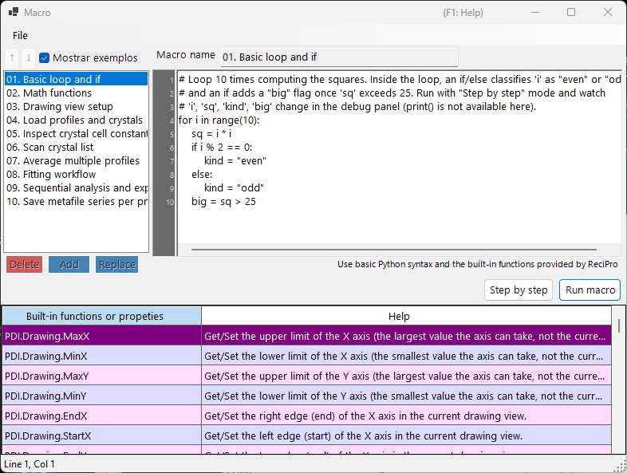

<!-- 260601Cl: migrated from legacy docx + yseto.net web manual -->
# Macro

A maior parte das operações do PDIndexer pode ser automatizada com o recurso **Macro**. As macros são scripts Python escritos em [IronPython](https://ironpython.net/) (uma implementação de Python que roda sobre o .NET), editados e executados em uma janela de editor de macros dedicada. Use-as para automatizar tarefas repetitivas, processar vários arquivos em lote e exportar resultados para arquivos CSV ou de imagem em massa.



!!! note "Conhecimento básico de Python"
    As macros aceitam a sintaxe padrão do Python (laços `for`, `if`/`else`, listas, funções etc.) diretamente. Esta página não explica a própria linguagem Python. As funcionalidades específicas do PDIndexer são invocadas por meio do objeto `PDI` descrito abaixo.

## Abrindo o editor de macros

Na barra de menus da janela principal, escolha **Macro → Editor** para abrir a janela do editor de macros (com o título `Macro`).

As macros criadas e salvas no editor também são listadas por nome no menu **Macro**, para que você possa executá-las diretamente pelo menu. A lista de macros é salva automaticamente quando o PDIndexer é fechado e restaurada na próxima inicialização.

## Layout da janela do editor

A janela do editor é composta pelas seguintes partes.

| Parte | Descrição |
| --- | --- |
| Lista de macros (à esquerda) | Uma lista dos nomes das macros salvas. Clique em um item para carregar aquela macro no editor à direita. |
| Editor de código (centro) | A área onde você digita o script Python. Ele oferece uma calha de números de linha, recuo automático, complemento de entrada (autocompletar) e dicas de ferramenta de funções. |
| Tabela de referência de funções | Uma tabela com todas as funções disponíveis sob `PDI`. Dê um duplo clique em uma célula para inserir aquele nome de função no código, na posição do cursor. |
| Painel de depuração (à direita) | Exibe os nomes e valores das variáveis no ponto atual durante a execução passo a passo. |
| Barra de status | Mostra a posição atual do cursor (`Line` / `Col`). |

### Botões de operação da lista

Use os botões a seguir para editar a lista de macros.

| Botão | Ação |
| --- | --- |
| `Add` | Adiciona o código atual à lista com o nome digitado na caixa de nome (solicita confirmação para sobrescrever se o nome já existir). |
| `Replace` | Substitui a macro selecionada na lista pelo código atual. |
| `Delete` | Remove a macro selecionada da lista. |
| `↑` / `↓` | Move a macro selecionada para cima ou para baixo dentro da lista. |
| `Show samples` | Alterna a exibição das macros de exemplo incorporadas (veja abaixo). |

!!! tip "Salvando e carregando"
    As macros podem ser salvas em e carregadas de arquivos `.mcr` individuais. Arraste e solte um arquivo `.mcr` sobre a janela do editor para carregar seu conteúdo. Pressionar `Ctrl+S` após a edição sobrescreve a macro atualmente selecionada.

## Executando uma macro

Execute a macro usando os botões na parte inferior do editor de código.

| Botão | Ação |
| --- | --- |
| `Run macro` | Executa a macro normalmente, do início ao fim. |
| `Step by step` | Executa a macro uma linha por vez. Ele pausa antes de cada linha e mostra os valores atuais das variáveis no painel de depuração à direita. |
| `Next step (F10)` | Avança para a próxima linha durante a execução passo a passo (a tecla `F10` também funciona). |
| `Stop` | Aborta a execução. O aborto só tem efeito durante a execução em `Step by step`. |

!!! warning "print() não está disponível"
    O editor de macros não tem um console de saída padrão, portanto a saída de `print()` não é exibida. Para inspecionar os valores das variáveis, execute a macro no modo `Step by step` e observe os valores mudarem no painel de depuração.

### Macros de exemplo

Marcar o botão `Show samples` exibe as macros de exemplo incorporadas na lista (somente leitura). Os exemplos são mostrados no idioma atual da interface (inglês/japonês). Use-os como referência ao escrever suas próprias macros. Os exemplos incorporados são:

| Nome | Conteúdo |
| --- | --- |
| 01. Basic loop and if | Fundamentos dos laços `for` e de `if`/`else` |
| 02. Math functions | Uso do módulo `math` (`pi`, `sin`, `sqrt`, `exp`, `log` etc.) |
| 03. Drawing view setup | Definição da faixa de visualização com `PDI.Drawing.SetBounds` |
| 04. Load profiles and crystals | `PDI.File.ReadProfiles` / `ReadCrystals` |
| 05. Inspect crystal cell constants | Leitura de constantes de célula, volume e pressão via `PDI.Crystal` |
| 06. Scan crystal list | Percorrendo todo o `PDI.CrystalList` |
| 07. Average multiple profiles | `PDI.ProfileOperator.Average` |
| 08. Fitting workflow | Uma sequência completa de `PDI.Fitting` |
| 09. Sequential analysis and export | Execução de `PDI.Sequential` e exportação de CSV |
| 10. Save metafile series per profile | Salvando um EMF por perfil em lote |

!!! note "O módulo math já está importado"
    `import math` é executado automaticamente quando o editor inicia, portanto você pode usar o módulo `math` diretamente, por exemplo `math.sqrt(2)`, sem uma instrução `import` explícita.

---

## Referência de funções

Todas as funcionalidades específicas do PDIndexer são invocadas por meio das classes sob o objeto raiz `PDI`. `PDI` já está disponível no escopo da macro, portanto nenhum `import` é necessário.

Cada tabela abaixo é transcrita dos atributos `[Help]` no código-fonte. A mesma lista aparece na tabela de referência de funções dentro da janela do editor e na [seção 6 do manual web](https://yseto.net/soft/pdi/pdi_06).

!!! note "Notação"
    Na coluna de assinatura, `(get/set)` indica uma propriedade de leitura/escrita e `(get)` uma propriedade somente leitura. Um argumento com `= value` é um argumento padrão e pode ser omitido.

### PDI (raiz)

| Membro | Assinatura | Descrição |
| --- | --- | --- |
| `Sleep` | `Sleep(int millisec)` | Pausa a execução da macro pelo número de milissegundos indicado. |
| `Obj` | `Obj (get/set)` | Obtém/Define objetos passados de outro programa (argumentos entre processos). |

### PDI.File — Entrada/saída de arquivos

| Membro | Assinatura | Descrição |
| --- | --- | --- |
| `GetDirectoryPath` | `GetDirectoryPath(string filename = "")` | Obtém um caminho de diretório (com barra invertida final). Se `filename` for omitido, uma caixa de diálogo de seleção de pasta é aberta. Caso contrário, a parte do diretório de `filename` é retornada. |
| `GetFileName` | `GetFileName()` | Abre uma caixa de diálogo de seleção de arquivo e retorna o caminho completo do arquivo escolhido. Retorna uma string vazia se o usuário cancelar. |
| `GetFileNames` | `GetFileNames()` | Abre uma caixa de diálogo de arquivo com seleção múltipla e retorna os caminhos completos dos arquivos escolhidos. Retorna um array vazio se o usuário cancelar. |
| `ReadProfiles` | `ReadProfiles(string filename)` | Lê os dados de perfil a partir do arquivo indicado. Se `filename` for omitido (ou não existir), uma caixa de diálogo de seleção de arquivo será aberta. |
| `SaveProfiles` | `SaveProfiles(string filename)` | Salva os dados de perfil no arquivo indicado. Se `filename` for omitido, uma caixa de diálogo de salvamento será aberta. |
| `ReadCrystals` | `ReadCrystals(string filename)` | Lê os dados de cristal a partir do arquivo indicado. Se `filename` for omitido (ou não existir), uma caixa de diálogo de seleção de arquivo será aberta. |
| `SaveCrystals` | `SaveCrystals(string filename)` | Salva os dados de cristal no arquivo indicado. Se `filename` for omitido, uma caixa de diálogo de salvamento será aberta. |
| `SaveMetafile` | `SaveMetafile(string filename)` | Salva o padrão atual como um Windows Metafile (`.emf`). Se `filename` for omitido, uma caixa de diálogo de salvamento será aberta. |
| `SaveText` | `SaveText(string text, string filename)` | Salva o conteúdo de texto indicado em um arquivo `.txt`. Se `filename` for omitido, uma caixa de diálogo de salvamento será aberta. |

### PDI.Drawing — Visualização de desenho

| Membro | Assinatura | Descrição |
| --- | --- | --- |
| `MaxX` | `MaxX (get/set)` | Obtém/Define o limite superior do eixo X (o maior valor que o eixo pode assumir, não a visualização atual). |
| `MinX` | `MinX (get/set)` | Obtém/Define o limite inferior do eixo X (o menor valor que o eixo pode assumir, não a visualização atual). |
| `MaxY` | `MaxY (get/set)` | Obtém/Define o limite superior do eixo Y (o maior valor que o eixo pode assumir, não a visualização atual). |
| `MinY` | `MinY (get/set)` | Obtém/Define o limite inferior do eixo Y (o menor valor que o eixo pode assumir, não a visualização atual). |
| `EndX` | `EndX (get/set)` | Obtém/Define a borda direita (fim) do eixo X na visualização de desenho atual. |
| `StartX` | `StartX (get/set)` | Obtém/Define a borda esquerda (início) do eixo X na visualização de desenho atual. |
| `EndY` | `EndY (get/set)` | Obtém/Define a borda superior (fim) do eixo Y na visualização de desenho atual. |
| `StartY` | `StartY (get/set)` | Obtém/Define a borda inferior (início) do eixo Y na visualização de desenho atual. |
| `SetBounds` | `SetBounds(double startX, double endX, double startY, double endY)` | Define a visualização de desenho fornecendo as quatro bordas (StartX, EndX, StartY, EndY). |

### PDI.Crystal — Cristal selecionado

Os parâmetros de rede `CellA`–`CellC` estão em \( \mathrm{\AA} \), e `CellAlpha`–`CellGamma` estão em graus (deg).

| Membro | Assinatura | Descrição |
| --- | --- | --- |
| `CellVolume` | `CellVolume (get)` | Obtém o volume da célula (\( \mathrm{\AA}^3 \)) do cristal selecionado. Retorna 0 se nenhum cristal estiver selecionado. |
| `Pressure` | `Pressure(double volume = 0)` | Obtém a pressão (GPa) do cristal selecionado, calculada a partir de sua EOS. Se `volume` for 0 (padrão), o volume de célula atual é usado. |
| `Name` | `Name (get/set)` | Obtém/Define o nome do cristal selecionado. |
| `CellA` | `CellA (get/set)` | Obtém/Define o parâmetro de rede a (\( \mathrm{\AA} \)) do cristal selecionado. |
| `CellB` | `CellB (get/set)` | Obtém/Define o parâmetro de rede b (\( \mathrm{\AA} \)) do cristal selecionado. |
| `CellC` | `CellC (get/set)` | Obtém/Define o parâmetro de rede c (\( \mathrm{\AA} \)) do cristal selecionado. |
| `CellAlpha` | `CellAlpha (get/set)` | Obtém/Define o parâmetro de rede alfa (deg) do cristal selecionado. |
| `CellBeta` | `CellBeta (get/set)` | Obtém/Define o parâmetro de rede beta (deg) do cristal selecionado. |
| `CellGamma` | `CellGamma (get/set)` | Obtém/Define o parâmetro de rede gama (deg) do cristal selecionado. |

### PDI.CrystalList — Lista de cristais

| Membro | Assinatura | Descrição |
| --- | --- | --- |
| `Open` | `Open()` | Abre a janela 'Crystal List'. |
| `Close` | `Close()` | Fecha a janela 'Crystal List'. |
| `Count` | `Count (get)` | Obtém o número total de cristais na lista. |
| `SelectedName` | `SelectedName (get)` | Obtém o nome do cristal atualmente selecionado. Retorna uma string vazia se nenhum cristal estiver selecionado. |
| `SelectedIndex` | `SelectedIndex (get/set)` | Obtém/Define o índice do cristal atualmente selecionado. |
| `Select` | `Select(int index)` | Seleciona o cristal no índice indicado. |
| `Check` | `Check(int index = -1, bool state = true)` | Marca ou desmarca o cristal no índice indicado. Se `index` for -1, o cristal atualmente selecionado é o alvo. |
| `Uncheck` | `Uncheck(int index = -1)` | Desmarca o cristal no índice indicado. Se `index` for -1, o cristal atualmente selecionado será desmarcado. |
| `GetCellVolume` | `GetCellVolume (get)` | Obtém o volume da célula (\( \mathrm{\AA}^3 \)) do cristal selecionado. Igual a `PDI.Crystal.CellVolume`; mantido por compatibilidade retroativa. |

### PDI.Profile — Perfil selecionado

| Membro | Assinatura | Descrição |
| --- | --- | --- |
| `Comment` | `Comment (get/set)` | Obtém/Define o texto de comentário do perfil atualmente selecionado. |
| `Name` | `Name (get/set)` | Obtém/Define o nome de exibição do perfil atualmente selecionado. |

### PDI.ProfileOperator — Aritmética de perfis

Cada perfil é especificado pelo seu índice na lista. `output` é o nome dado ao perfil resultante.

| Membro | Assinatura | Descrição |
| --- | --- | --- |
| `Average` | `Average(int[] indices, string output)` | Calcula a média dos perfis cujos índices estão listados em `indices` (por exemplo, `[1,3,5,9]`). `output` é o nome dado ao perfil resultante. |
| `AddTwoProfiles` | `AddTwoProfiles(int index1, int index2, string output)` | Calcula profile1 + profile2. Cada perfil é especificado pelo seu índice. `output` é o nome dado ao perfil resultante. |
| `SubtractTwoProfiles` | `SubtractTwoProfiles(int index1, int index2, string output)` | Calcula profile1 − profile2. Cada perfil é especificado pelo seu índice. `output` é o nome dado ao perfil resultante. |
| `MultiplyTwoProfiles` | `MultiplyTwoProfiles(int index1, int index2, string output)` | Calcula profile1 × profile2. Cada perfil é especificado pelo seu índice. `output` é o nome dado ao perfil resultante. |
| `DivideTwoProfiles` | `DivideTwoProfiles(int index1, int index2, string output)` | Calcula profile1 ÷ profile2. Cada perfil é especificado pelo seu índice. `output` é o nome dado ao perfil resultante. |

### PDI.ProfileList — Lista de perfis

| Membro | Assinatura | Descrição |
| --- | --- | --- |
| `Open` | `Open()` | Abre a janela 'Profile List'. |
| `Close` | `Close()` | Fecha a janela 'Profile List'. |
| `DeleteAll` | `DeleteAll()` | Exclui todos os perfis da lista (sem caixa de diálogo de confirmação). |
| `Delete` | `Delete(int index)` | Exclui o perfil no índice indicado. |
| `Count` | `Count (get)` | Obtém o número total de perfis na lista. |
| `SelectedName` | `SelectedName (get)` | Obtém o nome do perfil atualmente selecionado. Retorna uma string vazia se nenhum perfil estiver selecionado. |
| `SelectedIndex` | `SelectedIndex (get/set)` | Obtém/Define o índice do perfil atualmente selecionado. |
| `Select` | `Select(int index)` | Seleciona o perfil no índice indicado. |
| `Check` | `Check(int index = -1, bool state = true)` | Marca ou desmarca o perfil no índice indicado. Se `index` for -1, o perfil atualmente selecionado é o alvo. |
| `Uncheck` | `Uncheck(int index = -1)` | Desmarca o perfil no índice indicado. Se `index` for -1, o perfil atualmente selecionado será desmarcado. |
| `CheckAll` | `CheckAll()` | Marca todos os perfis da lista. |
| `UncheckAll` | `UncheckAll()` | Desmarca todos os perfis da lista. |

### PDI.Fitting — Ajuste de picos

Opera a janela [Ajuste de picos de difração](6-fitting-diffraction-peaks.md).

| Membro | Assinatura | Descrição |
| --- | --- | --- |
| `Open` | `Open()` | Abre a janela 'Fitting peaks'. |
| `Close` | `Close()` | Fecha a janela 'Fitting peaks'. |
| `Apply` | `Apply()` | Aplica os parâmetros de rede otimizados ao cristal selecionado (equivalente a clicar no botão `Confirm` na janela de ajuste). |
| `Check` | `Check(int index = -1, bool state = true)` | Marca ou desmarca o plano de rede no índice indicado. Se `index` for -1, o plano atualmente selecionado é o alvo. |
| `Uncheck` | `Uncheck(int index = -1)` | Desmarca o plano de rede no índice indicado. Se `index` for -1, o plano atualmente selecionado será desmarcado. |
| `Select` | `Select(int index)` | Seleciona o plano de rede no índice indicado. |
| `SelectedIndex` | `SelectedIndex (get/set)` | Obtém/Define o índice do plano de rede atualmente selecionado. |
| `Range` | `Range(double range)` | Define a faixa de busca de picos para o plano de rede atualmente selecionado (na mesma unidade do eixo X). |

### PDI.Sequential — Análise sequencial

Opera a janela [Análise sequencial](7-sequential-analysis.md). Os getters de CSV retornam os resultados da análise sequencial mais recente como uma string CSV.

| Membro | Assinatura | Descrição |
| --- | --- | --- |
| `Directory` | `Directory (get/set)` | Obtém/Define o caminho completo do diretório onde os resultados da análise sequencial são salvos. |
| `Open` | `Open()` | Abre a janela 'Sequential Analysis'. |
| `Close` | `Close()` | Fecha a janela 'Sequential Analysis'. |
| `Execute` | `Execute()` | Executa a análise sequencial em todos os perfis marcados. |
| `GetCSV_2theta` | `GetCSV_2theta()` | Obtém os resultados de 2-teta da análise sequencial mais recente como uma string CSV. |
| `GetCSV_D` | `GetCSV_D()` | Obtém os resultados de espaçamento d da análise sequencial mais recente como uma string CSV. |
| `GetCSV_FWHM` | `GetCSV_FWHM()` | Obtém os resultados de FWHM da análise sequencial mais recente como uma string CSV. |
| `GetCSV_Intensity` | `GetCSV_Intensity()` | Obtém os resultados de intensidade de pico da análise sequencial mais recente como uma string CSV. |
| `GetCSV_CellConstants` | `GetCSV_CellConstants()` | Obtém os resultados de parâmetros de rede da análise sequencial mais recente como uma string CSV. |
| `GetCSV_Pressure` | `GetCSV_Pressure()` | Obtém os resultados de pressão da análise sequencial mais recente como uma string CSV. |
| `GetCSV_Singh` | `GetCSV_Singh()` | Obtém os resultados da equação de Singh da análise sequencial mais recente como uma string CSV. |
| `AutoSave2theta` | `AutoSave2theta (get/set)` | Obtém/Define se os resultados de 2-teta são salvos automaticamente após cada execução da análise sequencial. |
| `AutoSaveDspacing` | `AutoSaveDspacing (get/set)` | Obtém/Define se os resultados de espaçamento d são salvos automaticamente após cada execução da análise sequencial. |
| `AutoSaveFWHM` | `AutoSaveFWHM (get/set)` | Obtém/Define se os resultados de FWHM são salvos automaticamente após cada execução da análise sequencial. |
| `AutoSaveIntensity` | `AutoSaveIntensity (get/set)` | Obtém/Define se os resultados de intensidade de pico são salvos automaticamente após cada execução da análise sequencial. |
| `AutoSaveCellConstants` | `AutoSaveCellConstants (get/set)` | Obtém/Define se os resultados de parâmetros de rede são salvos automaticamente após cada execução da análise sequencial. |
| `AutoSavePressure` | `AutoSavePressure (get/set)` | Obtém/Define se os resultados de pressão são salvos automaticamente após cada execução da análise sequencial. |
| `AutoSaveSingh` | `AutoSaveSingh (get/set)` | Obtém/Define se os resultados da equação de Singh são salvos automaticamente após cada execução da análise sequencial. |

## Exemplo de macro

Como um dos exemplos incorporados, aqui está uma macro que executa a análise sequencial e salva os resultados em CSV.

```python
# Check all profiles, run sequential analysis, then obtain 2-theta / d-spacing /
# cell-constant / pressure results as CSV strings and save each to a file.
PDI.ProfileList.CheckAll()
PDI.Sequential.Open()
PDI.Sequential.Execute()
dir_path = PDI.File.GetDirectoryPath()
PDI.File.SaveText(PDI.Sequential.GetCSV_2theta(),        dir_path + "seq_2theta.csv")
PDI.File.SaveText(PDI.Sequential.GetCSV_D(),             dir_path + "seq_d.csv")
PDI.File.SaveText(PDI.Sequential.GetCSV_CellConstants(), dir_path + "seq_cell.csv")
PDI.File.SaveText(PDI.Sequential.GetCSV_Pressure(),      dir_path + "seq_pressure.csv")
```

Você pode navegar pelos outros exemplos usando o botão `Show samples` no editor.
