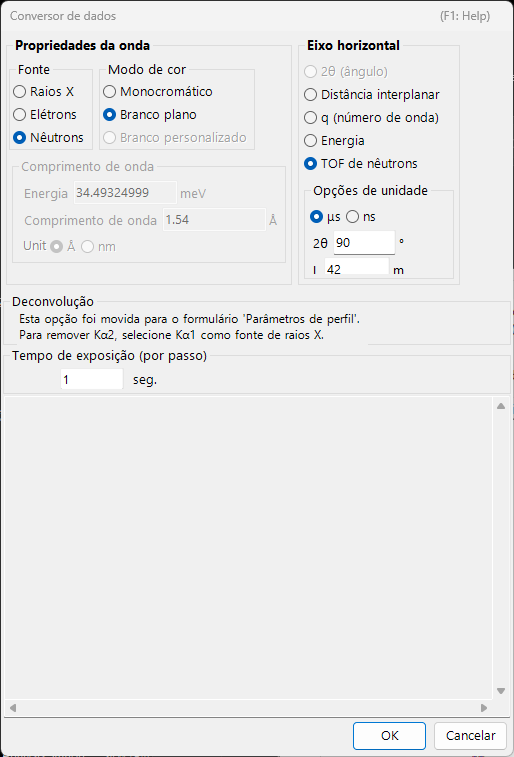
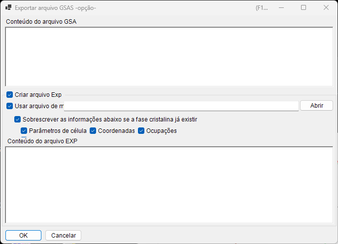

<!-- 260601Cl: migrated from legacy docx + yseto.net web manual -->
# Formatos de arquivo

Os arquivos que o PDIndexer lê e grava se dividem em três grupos: **dados de perfil**, **listas de cristais / estruturas cristalinas** e **saída de desenho**. Todas essas operações de E/S são acessadas a partir do menu **Arquivo (File)** da [janela principal](../1-main-window.md).

Esta página resume as extensões suportadas, a direção de E/S e observações em forma de tabela.

---

## Dados de perfil

### Leitura (Read profile(s))

**Arquivo → Ler perfil(is) (Read profile(s))** permite carregar vários arquivos de uma só vez. Além do formato próprio do PDIndexer `pdi` / `pdi2`, ele suporta uma variedade de formatos de texto e binários de ângulo-vs-intensidade (ou energia-vs-intensidade), como o `csv` do WinPIP, o `chi` do Fit2D e o `ras` da Rigaku. Mesmo formatos não listados abaixo podem geralmente ser lidos: qualquer arquivo de texto simples de ângulo-vs-intensidade recorre a um analisador genérico.

| Extensão | Origem / formato | Observações |
| --- | --- | --- |
| `pdi` / `pdi2` | Formato nativo do PDIndexer | Mantém o perfil junto com suas informações associadas (fonte de onda, comprimento de onda, tempo de exposição, etc.). `pdi2` é a versão atual. A caixa de diálogo do Conversor de dados não é exibida ao ler esses arquivos. |
| `csv` | Saída do WinPIP (separado por vírgula: `angle,intensity`) | Importado pela caixa de diálogo do Conversor de dados, onde você especifica o significado do eixo horizontal, a fonte de onda e o comprimento de onda. |
| `tsv` | Separado por tabulação (`angle` `[TAB]` `intensity`) | Importado como texto genérico. |
| `chi` | Saída do Fit2D | As linhas de cabeçalho iniciais são ignoradas; as colunas 2 e 4 dos dados de quatro colunas são tomadas como ângulo e intensidade. |
| `ras` | Formato Rigaku | Formato de texto que também contém informações do instrumento. |
| `nxs` | NeXus / HDF5 (SSD, múltiplos detectores) | Pode conter vários canais (histogramas); cada um é calibrado em energia e importado separadamente. |
| `npd` | Perfil EDX (SSD) | Lê `EGC0/1/2`, `2Theta`, `Live time`, etc. do cabeçalho e converte o número do canal em energia. |
| `xbm` | Formato binário EDX (p. ex. SP-8 BL04B2) | Metadados como nome da amostra, condições de medição e coeficientes de calibração EGC são importados como comentário. |
| `rpt` | Formato Genie (SSD) | Lê o ângulo de saída (take-off), o tempo de exposição e o EGC do cabeçalho. |
| `xy` | Texto de duas colunas calibrado com pyFAI | Lê o comprimento de onda do cabeçalho e importa ângulo vs. intensidade. |
| `gsa` | Dados GSAS (bloco `BANK`) | Importa as três colunas: ângulo, intensidade, erro. |
| Outro | Texto genérico de ângulo-vs-intensidade | O delimitador vírgula / espaço em branco / tabulação é detectado automaticamente (pela caixa de diálogo do Conversor de dados). |

!!! note "Carregar vários arquivos de uma vez"
    Ao selecionar e ler múltiplos arquivos, depois que você confirma as configurações do Conversor de dados para o primeiro arquivo, uma mensagem pergunta se deseja reutilizar as mesmas configurações para os arquivos restantes. Escolher **Sim (Yes)** processa o restante sem exibir a caixa de diálogo, o que acelera o carregamento.

### Caixa de diálogo do Conversor de dados (Data Converter)

Ao ler qualquer arquivo diferente de `pdi` / `pdi2` (`csv`, `chi`, `ras`, `nxs`, `npd`, `xbm`, `rpt`, `xy`, `gsa` e texto genérico), a caixa de diálogo do **Conversor de dados (Data Converter)** se abre. É onde você mapeia as colunas numéricas importadas para as grandezas físicas corretas usadas internamente pelo PDIndexer.

A caixa de diálogo oferece as configurações a seguir.

| Configuração | Descrição |
| --- | --- |
| Eixo horizontal (Horizontal Axis) | A grandeza física (2θ, energia, espaçamento d, número de onda, TOF, etc.) e a unidade representadas pela primeira coluna importada. |
| Fonte de onda / comprimento de onda | Raio X / nêutron / elétron, e a linha característica de raios X (Kα, etc.) ou o comprimento de onda. Isso determina a conversão para espaçamento d e 2θ. |
| Tempo de exposição (por passo) | O tempo de exposição por passo em segundos. Usado para exibição de CPS e normalização de intensidade. |
| Para dados SSD | Para dados SSD (EDX) como `rpt` / `npd` / `xbm` / `nxs`, defina os coeficientes \(a_0, a_1, a_2\) que convertem o número do canal \(n\) em energia \(E\). Quando há múltiplos detectores, você pode habilitar/desabilitar cada um e definir seus coeficientes individualmente. |
| Corte de baixa energia | Quando marcado, os pontos de dados abaixo da energia especificada são excluídos na importação. |

Para dados SSD, o número do canal \(n\) é convertido em energia \(E\) (em eV) por uma calibração quadrática:

$$
E = a_0 + a_1\,n + a_2\,n^2
$$

Ao ler texto genérico (um formato "outro"), a caixa de diálogo mostra o conteúdo real do arquivo em uma caixa de texto para que você possa definir o eixo horizontal, a fonte de onda, e assim por diante, enquanto inspeciona os dados. O delimitador (vírgula / espaço em branco / tabulação) e o número de linhas de cabeçalho iniciais a ignorar são detectados automaticamente.

!!! tip "Monitorar a área de transferência / uma pasta"
    Habilitar **Opções → Monitorar área de transferência (Watch Clipboard)** permite que o PDIndexer importe automaticamente perfis copiados de outros aplicativos, como o IPAnalyzer. Habilitar **Monitorar arquivo (Watch File)** lê automaticamente arquivos `pdi` recém-criados em uma pasta escolhida.

### Salvamento e exportação

**Arquivo → Salvar perfil(is) (Save profile(s))** salva todos os perfis carregados no formato nativo do PDIndexer `pdi2`.

**Arquivo → Exportar o(s) perfil(is) selecionado(s) (Export the selected profile(s))** grava o perfil selecionado em um dos seguintes formatos.

| Extensão / formato | Direção | Observações |
| --- | --- | --- |
| `pdi2` | Saída | Formato nativo do PDIndexer. Salva todos os perfis de uma só vez. |
| `csv` | Saída | Separado por vírgula (ângulo, intensidade). |
| `tsv` | Saída | Separado por tabulação (ângulo e intensidade separados por uma tabulação). |
| `gsa` (GSAS) | Saída | Formato GSAS para análise de Rietveld. Você pode revisar o conteúdo na tela de exportação abaixo. |

#### Exportação no formato GSAS

Ao escolher o formato GSAS, uma tela de exportação aparece para que você possa revisar o que será gravado. A linha 1 é o nome do perfil, a linha 2 é um cabeçalho `BANK 1 … CONST … FXYE`, e as linhas seguintes contêm três colunas: ângulo, intensidade e erro. O erro é tomado dos próprios dados de erro do perfil quando presentes; caso contrário, \(\sqrt{\text{intensity}}\) é usado.

!!! note "Escala do ângulo"
    Para dados comuns de dispersão angular, os valores de ângulo são gravados multiplicados por 100 (a convenção `CONST` do GSAS). Para dados de nêutrons TOF, os valores são gravados como estão, sem escala.

---

## Listas de cristais e estruturas cristalinas

As listas de cristais são salvas e carregadas como arquivos XML (extensão `xml`). Estruturas cristalinas individuais podem ser importadas de CIF / AMC. Consulte [Parâmetros do cristal](../3-crystal-parameter.md) para detalhes.

| Operação (menu Arquivo) | Extensão | Direção | Observações |
| --- | --- | --- | --- |
| Carregar cristais (como nova lista) | `xml` | Entrada | Carrega uma lista de cristais e substitui a lista atual (a lista atual é descartada). |
| Carregar cristais (e adicionar à lista atual) | `xml` | Entrada | Carrega uma lista de cristais e a acrescenta ao final da lista atual. |
| Salvar cristais | `xml` | Saída | Salva a lista de cristais atual em um arquivo. |
| Importar CIF, AMC... | `cif` / `amc` | Entrada | Adiciona dados de estrutura no formato CIF ou no formato AMC (AMCSD) à lista de cristais atual. |
| Exportar o cristal selecionado para CIF | `cif` | Saída | Salva o cristal selecionado como um arquivo de dados de estrutura CIF. |
| Reverter cristais ao estado inicial | — | — | Restaura a lista de cristais ao seu estado padrão como instalado. |

---

## Saída de desenho (visualizador de perfis)

O perfil atualmente exibido na janela principal pode ser copiado para a área de transferência como imagem ou salvo como um metafile vetorial.

| Operação (menu Arquivo) | Formato | Direção | Observações |
| --- | --- | --- | --- |
| Copiar para a área de transferência (como dados Bitmap) | Bitmap | Área de transferência | Copia o conteúdo do visualizador para a área de transferência como imagem bitmap. |
| Copiar para a área de transferência (como dados Metafile) | Metafile (vetorial) | Área de transferência | Copia o conteúdo do visualizador para a área de transferência em forma vetorial. |
| Salvar como Metafile | `emf` (EMF) | Saída | Salva no formato EMF (Enhanced Metafile). Como preserva as informações vetoriais e de fonte, o `emf` salvo pode ser lido no PowerPoint e no Word. |

Além disso, **Configurar página (Page Setup)**, **Visualizar impressão (Print Preview)** e **Imprimir (Print)** permitem imprimir diretamente a faixa atual de ângulo e intensidade.
