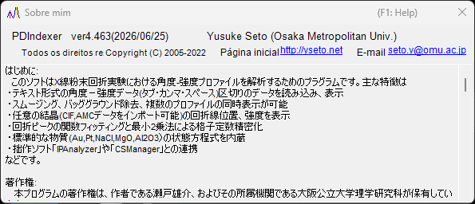

<!-- 260601Cl: migrated from legacy docx + yseto.net web manual -->
# Ambiente de execução e instalação

Esta página descreve como instalar o PDIndexer e o ambiente recomendado para uma operação confortável.

## Instalação

Baixe a versão mais recente na página de releases do GitHub.

- Download: <https://github.com/seto77/PDIndexer/releases/latest>

O método recomendado é o instalador MSI. Baixe `PDIndexer-setup.msi` (x64) e clique duas vezes para iniciar a instalação. No Windows on Arm (por exemplo, PCs com Snapdragon), baixe `PDIndexer-setup_arm64.msi` em vez disso. <!-- 260625Cl WiX asset names + arm64 -->

Se a instalação por MSI estiver bloqueada em um PC Windows gerenciado, use o pacote ZIP sem instalação como alternativa. Baixe o ZIP portátil (`PDIndexer-v.<ver>.zip` para x64, ou `PDIndexer-v.<ver>_arm64.zip` para Arm), extraia a pasta inteira para um local com permissão de escrita para o usuário e execute `PDIndexer.exe` a partir da pasta extraída. Não execute `PDIndexer.exe` diretamente de dentro do visualizador de ZIP. <!-- 260601Ch / 260625Cl -->

!!! note "Sobre o aviso de proteção do Windows"
    Ao executar software de pesquisa recém-baixado e sem assinatura, o Windows pode exibir um aviso do SmartScreen ("O Windows protegeu o seu PC"). Se isso acontecer, clique em **Mais informações** e escolha **Executar assim mesmo** para continuar.

!!! note "Sobre o pacote ZIP sem instalação"
    O pacote ZIP destina-se a ser uma alternativa para ambientes em que a instalação por MSI, a aprovação de administrador ou a instalação separada do .NET Desktop Runtime são difíceis. Ele não é uma pasta de configurações totalmente autocontida: o PDIndexer ainda armazena as configurações do usuário e os dados padrão copiados na pasta AppData do usuário atual, e pode armazenar opções por usuário em `HKEY_CURRENT_USER\Software\Crystallography\PDIndexer`.

## Requisitos de execução

O runtime a seguir é necessário quando o PDIndexer é instalado a partir do instalador MSI.

| Item | Requisito |
| --- | --- |
| SO | Windows (64 bits, x64 ou Arm64) |
| Runtime | `.NET Desktop Runtime 10.0` (o **Desktop Runtime**, não o simples **.NET Runtime**; no Windows on Arm, o build **Arm64**) |

!!! warning "Escolha o Desktop Runtime"
    A página de download oferece dois produtos: o ".NET Runtime" e o ".NET Desktop Runtime". Como o PDIndexer é uma aplicação WinForms, certifique-se de instalar o **.NET Desktop Runtime**. O simples ".NET Runtime" sozinho não iniciará o programa.

- Baixar o runtime: <https://dotnet.microsoft.com/download/dotnet/10.0>

O pacote ZIP sem instalação é autocontido para a arquitetura correspondente (x64 ou Arm64) e não requer uma instalação separada do .NET Desktop Runtime. <!-- 260601Ch / 260625Cl arm64 -->

!!! note "Sobre a versão indicada em documentos mais antigos"
    O manual legado (docx) menciona ".NET Desktop Runtime 6.0 ou posterior", mas o PDIndexer atual requer **.NET 10.0**. Siga o requisito da versão mais recente.

## Ambiente recomendado

Alguns recursos do PDIndexer exigem recursos computacionais consideráveis. Para melhorar a velocidade, o cálculo é multithread sempre que possível. Para um uso confortável, recomenda-se um computador com as seguintes especificações de alto desempenho.

| Item | Recomendado |
| --- | --- |
| SO | Windows 11 (Windows 10 ou posterior, 64 bits, também funciona) |
| RAM | 16 GB ou mais |
| CPU | 8 núcleos ou mais (eficaz para cálculo multithread) |

!!! tip "Benefício do multithreading"
    Cálculos de padrões de difração usando estruturas cristalinas, análise sequencial e tarefas semelhantes rodam mais rápido com mais núcleos de CPU. Quanto mais núcleos sua CPU tiver, menor o tempo de espera do cálculo.

## Atualizações (verificar novas versões)

No menu **Ajuda** da janela principal, o PDIndexer permite atualizar para a versão mais recente e ver as informações do autor.

| Menu | Função |
| --- | --- |
| **Ajuda** ▸ **Atualizações do Programa** | Verifica se uma versão mais recente foi lançada e atualiza o programa. |
| **Ajuda** ▸ **Sobre** | Exibe as informações de versão e do autor. |

Ao escolher **Ajuda** ▸ **Sobre**, abre-se uma janela como a mostrada abaixo, onde você pode verificar o número da versão atual e as informações do autor.

!!! tip "Atualize regularmente"
    Correções de bugs e novos recursos são adicionados continuamente. Execute **Ajuda** ▸ **Atualizações do Programa** de tempos em tempos para manter o PDIndexer atualizado.

## Licença

O PDIndexer é distribuído sob a **Licença MIT**. Uso, modificação, distribuição e uso comercial são livremente permitidos, desde que o aviso de direitos autorais e o texto da licença sejam incluídos em qualquer redistribuição. O software é fornecido sem garantia.
