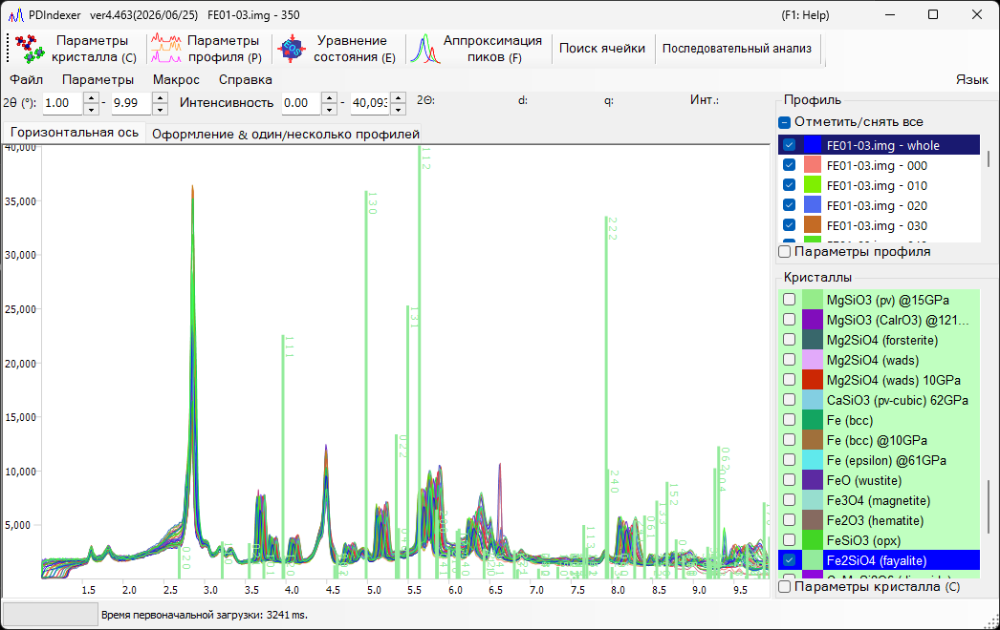

<!-- 260601Cl: migrated from legacy docx + yseto.net web manual -->
# Главное окно

При запуске программы появляется окно, показанное ниже. Главное окно состоит из центральной **области отрисовки профиля**, **строки меню** и **панели инструментов (список функций)** сверху, вкладок меню в верхней части (`Горизонтальная ось` / `Оформление & один/несколько профилей`), **списка профилей** в правом верхнем углу и **списка кристаллов** в правом нижнем углу.

## Область отрисовки профиля

Эта область занимает большую часть окна и отображает профили, отмеченные в списке профилей. Если в списке кристаллов выбран кристалл, в позициях дифракционных пиков также отрисовываются дифракционные линии.

### Управление мышью

| Действие | Результат |
| --- | --- |
| Перетаскивание левой кнопкой | Перемещение дифракционных линий (изменение параметров решётки кристалла) |
| Перетаскивание правой кнопкой | Увеличение масштаба |
| Щелчок правой кнопкой | Уменьшение масштаба |
| Перетаскивание средней кнопкой | Панорамирование вида |

Диапазоны отрисовки по горизонтальной и вертикальной осям можно изменить, введя значения непосредственно в числовые поля над областью отрисовки (`2θ:`, `d:`, `Int.:`, `q:` и т. д.; подписи зависят от выбранного режима горизонтальной оси).

!!! tip
    Режим отображения горизонтальной оси (угол, энергия, межплоскостное расстояние (d) и т. д.) переключается на [вкладке `Горизонтальная ось`](#horizontal-axis-tab). Это чисто отображаемая настройка, она не изменяет собственные данные горизонтальной оси профиля.

## Панель инструментов (список функций)

Каждая кнопка панели инструментов открывает и закрывает соответствующее окно анализа.

| Кнопка | Функция | См. |
| --- | --- | --- |
| `Параметры кристалла (C)` | Открывает и закрывает окно параметров кристалла. | [Параметры кристалла](3-crystal-parameter.md) |
| `Параметры профиля (P)` | Открывает и закрывает окно параметров профиля. | [Параметры профиля](4-profile-parameter.md) |
| `Уравнение состояния (E)` | Открывает и закрывает окно уравнения состояния для оценки давления по объёму элементарной ячейки эталонного материала. | [Уравнения состояния](5-equation-of-states.md) |
| `Аппроксимация пиков (F)` | Открывает и закрывает окно аппроксимации пиков для подгонки дифракционных пиков (положение, FWHM, интенсивность). | [Аппроксимация дифракционных пиков](6-fitting-diffraction-peaks.md) |
| `Поиск ячейки` | Открывает и закрывает окно поиска ячейки для поиска параметров решётки по положениям пиков. | — |
| `Последовательный анализ` | Открывает и закрывает окно последовательного анализа для пакетной обработки серии файлов. | [Последовательный анализ](7-sequential-analysis.md) |
| `Поиск атомных позиций` | Открывает и закрывает окно поиска атомных позиций для поиска атомных позиций по дифракционным интенсивностям. | — |
| `LPO-анализ` | Открывает и закрывает окно анализа LPO (преимущественной кристаллографической ориентации). | — |

!!! note
    Основные окна можно также открывать и закрывать с помощью сочетаний клавиш: `Ctrl+Shift+C` (параметры кристалла), `Ctrl+Shift+E` (уравнение состояния), `Ctrl+Shift+F` (параметры аппроксимации) и `Ctrl+Shift+D` (изменить режим отображения пиков).

## Строка меню

### Файл

| Пункт | Описание |
| --- | --- |
| `Прочитать профиль(и)` | Считывает данные профиля. Помимо собственного формата программы `pdi` / `pdi2`, можно считывать вывод WinPIP в формате `csv`, вывод Fit2D в формате `chi` и другие. Также можно считать большинство файлов, хранящихся как текст «угол — интенсивность». |
| `Сохранить профиль(и)` | Сохраняет все загруженные профили в формате `pdi2` данной программы. |
| `Экспортировать выбранный(е) профиль(и)` | Экспортирует выбранный(е) профиль(и) в файл с разделителями-запятыми (CSV), с разделителями-табуляциями (TSV) или в файл GSAS (Rietveld). |
| `Загрузить кристаллы (как новый список)` | Загружает файл списка кристаллов (расширение `xml`). Текущий список кристаллов при этом удаляется. |
| `Загрузить кристаллы (и добавить к текущему списку)` | Загружает файл списка кристаллов (расширение `xml`) и добавляет его в конец текущего списка кристаллов. |
| `Сохранить кристаллы` | Сохраняет текущий список кристаллов в файл (расширение `xml`). |
| `Импорт CIF, AMC...` | Импортирует файл структурных данных в формате `cif` или `amc` и добавляет его в текущий список кристаллов. |
| `Экспортировать выбранный кристалл в CIF` | Сохраняет выбранный кристалл как файл структурных данных в формате `cif`. |
| `Вернуть кристаллы в исходное состояние` | Возвращает список кристаллов в исходное (стандартное) состояние. |
| `Параметры страницы` | Открывает диалог параметров страницы для печати. |
| `Предварительный просмотр` | Показывает предварительный просмотр печати области просмотра профиля. |
| `Печать` | Печать. Диапазон печати соответствует текущему диапазону угла и интенсивности. |
| `Копировать в буфер обмена` | Копирует текущий отрисованный профиль в буфер обмена в виде растровых данных (bitmap) или метафайла (векторные данные). |
| `Сохранить как Metafile` | Сохраняет текущий отрисованный профиль в формате метафайла. Поддерживается формат EMF (Enhanced Meta File); сохранённые файлы `*.emf` можно открывать в PowerPoint и Word. |
| `Закрыть` | Закрывает PDIndexer. |

### Параметры

| Пункт | Описание |
| --- | --- |
| `Подсказка` | Если отмечено, отображает всплывающие подсказки в главном окне. |
| `Следить за буфером обмена` | Отслеживает буфер обмена и автоматически импортирует данные профиля/кристалла, скопированные из других приложений (например, из IPAnalyzer). |
| `Следить за файлом` | Отслеживает указанную папку и автоматически считывает вновь созданные файлы профилей `.pdi`. Отслеживаемую папку можно выбрать в диалоге выбора или указать путь напрямую. |
| `Очистить реестр (отметьте и перезапустите)` | Если отмечено, при выходе очищает все сохранённые настройки в реестре (для сброса требуется перезапуск). |
| `Сохранять список кристаллов при закрытии` | Если отмечено, автоматически сохраняет список кристаллов при выходе и загружает его заново при запуске. |

### Макрос

`Редактор` открывает окно редактора макросов. Подробности о функции макросов PDIndexer см. в разделе [Макрос](8-macro.md).

### Справка

| Пункт | Описание |
| --- | --- |
| `О программе` | Показывает сведения об авторских правах, версии и авторе, а также историю версий. |
| `Проверить обновления` | Проверяет наличие новой версии в сети и, если она доступна, загружает и устанавливает её. |
| `Подсказка` | Показывает подсказки по использованию (устарело). |
| `Справка (веб)` | Открывает данное руководство. |

### Язык

Переключает язык интерфейса. В настоящее время поддерживаются английский (`English (need restart)`) и японский (`Japanese (need restart)`). После переключения требуется перезапуск.

## Вкладка «Горизонтальная ось» {#horizontal-axis-tab}

Вкладка `Горизонтальная ось` задаёт режим отображения оси. Настройки здесь относятся только к отображению и не связаны с фактическими данными горизонтальной оси (фактические данные горизонтальной оси можно изменить в разделе [Параметры профиля](4-profile-parameter.md)). Благодаря этому можно выровнять горизонтальную ось для сравнения даже при использовании разных источников рентгеновского излучения. Например, даже если загруженный профиль был получен на линии Cu Kα, его можно отобразить так, как если бы он был получен на длине волны линии Mo Kα.

| Пункт | Описание |
| --- | --- |
| `После загрузки профиля изменять горизонтальную ось` | Если отмечено, автоматически выравнивает настройки горизонтальной оси по настройкам вновь загруженного профиля. |
| 2θ (degree) | Устанавливает горизонтальную ось в виде угла. Переключатель `X-ray` задаёт угол рассеяния для рентгеновского излучения; выберите характеристический источник рентгеновского излучения или `Custom` из выпадающего списка и укажите длину волны. Переключатель `Electron` задаёт угол рассеяния для электронов; при указании ускоряющего напряжения вычисляется длина волны с релятивистской поправкой. |
| Energy (eV) | Устанавливает горизонтальную ось в виде энергии (единица измерения — эВ). Соответствует эксперименту по рентгеновской дифракции с использованием EDX-детектора. Соответствующим образом задайте угол выхода (take-off angle) EDX. |
| d-spacing (Å) | Устанавливает горизонтальную ось в виде межплоскостного расстояния (d). |
| q | Устанавливает горизонтальную ось в виде модуля вектора рассеяния \( q \). |

Связь между углом рассеяния и межплоскостным расстоянием (d) даётся законом Брэгга, где \( \lambda \) — длина волны:

$$ 2 d \sin\theta = n \lambda $$

## Вкладка «Оформление & один/несколько профилей»

Вкладка `Оформление & один/несколько профилей` настраивает внешний вид отрисовки и режим отображения одного/нескольких профилей.

### Настройки шкалы и цвета

| Пункт | Описание |
| --- | --- |
| `Линия шкалы` | Выбирает, отображать ли линии шкалы (сетку). |
| `Планки погрешностей` | Отображает планки погрешностей, если данные содержат информацию об ошибках. |
| `Цвет` | Задаёт цвета отображения, такие как `Цвет фона`, `Линия шкалы` и `Текст шкалы`. |

### Один/несколько профилей

Текущий режим — тот, у которого установлена отметка.

| Пункт | Описание |
| --- | --- |
| `Один профиль` | Режим одного профиля. При загрузке профиля или при получении данных из IPAnalyzer через буфер обмена старый профиль удаляется, а новый профиль отрисовывается. |
| `Несколько профилей` | Режим нескольких профилей. Новые профили загружаются и накладываются поверх уже существующих. |
| `Прирост интенсивности на профиль` | Задаёт смещение интенсивности между наборами данных при наложении нескольких наборов. Служит только для удобства восприятия отображения; фактические данные при этом не изменяются. |
| `Автоматически менять цвет` | Если отмечено, автоматически изменяет цвет отрисовки профилей. |

### Вертикальная ось

Указывает, отображать ли вертикальную ось (интенсивность) как необработанные отсчёты (`Исходные отсчёты`) или как отсчёты на шаг (`Отсчёты на шаг (CPS)`). Также можно указать, отображать ли вертикальную ось в линейном (`Линейная`) или логарифмическом (`Логарифмическая`) масштабе.

## Список профилей

Отображает и позволяет выбирать загруженные профили. Отключён в режиме `Один профиль`.

В режиме нескольких профилей загруженные профили показаны в виде списка, и в центральной области отрисовки отображаются только отмеченные из них. Более подробные настройки профиля задаются установкой флажка `Параметры профиля` внизу блока (см. [Параметры профиля](4-profile-parameter.md)).

## Список кристаллов

Отображает и настраивает список кристаллов. Отметка записи отрисовывает дифракционные линии в позициях дифракционных пиков. По умолчанию заранее зарегистрировано около 80 кристаллов.

!!! note "Особые строки"
    - Первая строка (строка 0) — это **Flexible Crystal** (голубой фон), используемая для отрисовки произвольных дифракционных линий.
    - Верхние строки (розовый фон, например `NaCl EOS` и `Pt EOS`) зарезервированы как эталонные материалы для расчётов уравнения состояния (EOS).

Более подробные настройки кристалла задаются установкой флажка `Параметры кристалла (C)` внизу блока (см. [Параметры кристалла](3-crystal-parameter.md)). `Отметить/снять все` отмечает или снимает отметку со всего списка кристаллов сразу.
