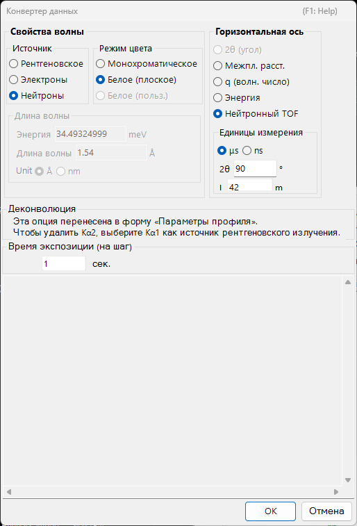

<!-- 260601Cl: migrated from legacy docx + yseto.net web manual -->
# Профили дифрактограмм

На этой странице описываются сами «данные профиля» (измеренный набор данных), с которыми работает PDIndexer, а также их загрузка, отображение и экспорт. Обработка, применяемая после загрузки — сглаживание, вычитание фона и так далее — выполняется в окне [Параметры профиля](4-profile-parameter.md). Полный список поддерживаемых расширений файлов см. в разделе [Форматы файлов](appendix/file-formats.md).

## Что такое профиль

Профиль — это одномерный набор данных «горизонтальная ось vs интенсивность», получаемый в результате измерения порошковой дифракции. Горизонтальная ось выражается одним из следующих способов, в зависимости от геометрии измерения:

- \( 2\theta \) (угол дифракции) для угловой дисперсионной дифракции (обычная рентгеновская дифракция)
- Энергия для энергодисперсионных измерений (белое рентгеновское излучение, детектирование SSD)
- Время пролёта для метода времени пролёта нейтронов (TOF)
- В любом случае данные можно также обрабатывать внутренне после преобразования в межплоскостное расстояние \( d \) или вектор рассеяния \( q \)

Вертикальная ось — это интенсивность дифракции, которая может отображаться как `Raw Counts` (исходные отсчёты) или `Count per Step (CPS)` (отсчёты на шаг), в линейном или логарифмическом масштабе (см. `Vertical Axis` на странице [Главное окно](1-main-window.md)).

## Поддерживаемые форматы ввода

`File ▸ Read profile(s)` загружает как собственный формат PDIndexer, так и вывод других программ и обобщённые текстовые форматы.

| Расширение | Содержимое |
| --- | --- |
| `pdi` / `pdi2` | Собственный формат профиля PDIndexer (включает настройки осей и информацию об обработке) |
| `csv` | Вывод WinPIP (с разделителями-запятыми) |
| `chi` | Вывод Fit2D |
| `tsv` | Текст с разделителями-табуляцией |
| `ras` | Формат Rigaku (RAS) |
| `nxs` | Формат NeXus |
| `npd` / `xbm` / `rpt` (`rpf`) | Необработанные данные SSD (полупроводниковый детектор) |
| Прочий текст | Как правило, читается любой двухколоночный текст угол (или значение d) — интенсивность |

!!! note "Чтение обобщённого текста"
    Файлы, сохранённые в виде текста угол–интенсивность, обычно можно прочитать, даже если они не соответствуют ни одному из перечисленных выше стандартных форматов. Если тип горизонтальной оси или длину волны/энергию определить не удаётся, укажите их в диалоге `Data Converter`, описанном ниже.

Подробные спецификации каждого формата собраны в разделе [Форматы файлов](appendix/file-formats.md).

## Способы загрузки

Профили можно загружать несколькими способами.

- **Меню** — `File ▸ Read profile(s)` (Прочитать профиль(и)). Можно выбрать сразу несколько файлов.
- **Перетаскивание** — перетащите файлы из проводника в главное окно.
- **Слежение за буфером обмена** — если включено `Option ▸ Watch Clipboard` (Следить за буфером обмена), профили/кристаллы, скопированные из других приложений (например, IPAnalyzer или CSManager), импортируются автоматически.
- **Слежение за файлом** — если включено `Option ▸ Watch File` (Следить за файлом) и папка выбрана командой `Set Directory to the watch` (Задать отслеживаемый каталог), новые файлы профилей `pdi`, созданные в этой папке, читаются автоматически. Это удобно для отображения в реальном времени при непрерывном измерении.

!!! tip "Автоматическое выравнивание горизонтальной оси"
    Установка флажка `After reading profile, change horizontal axis` (После загрузки профиля изменять горизонтальную ось) переключает отображение горизонтальной оси в соответствие с только что загруженным профилем сразу после его чтения.

## Режимы Single Profile и Multi Profiles

Переключайте режим отображения переключателем `Single/Multi Profile` (Один/несколько профилей) в правой части главного окна.

- **`Single Profile`** (Один профиль) — при загрузке нового профиля предыдущие данные заменяются; одновременно отображается только один профиль.
- **`Multi Profiles`** (Несколько профилей) — загруженные профили накладываются друг на друга. Используйте `Increasing intensity by a profile` (Прирост интенсивности на профиль), чтобы немного сместить интенсивность каждого профиля — так несколько кривых легче различать. Включение `Change automatically color` (Автоматически менять цвет) автоматически назначает каждому профилю свой цвет отрисовки.

## Список профилей

Список `Profile` (Профиль) в левой части главного окна показывает все загруженные профили.

- В центральной области просмотра отрисовываются только отмеченные профили. Используйте `Check/Uncheck all` (Отметить/снять все), чтобы переключить их все разом.
- Щёлкните по столбцу `Color` (Цвет), чтобы изменить цвет отрисовки каждого профиля.
- Измените порядок записей в списке, чтобы настроить порядок наложения при отрисовке.
- В режиме Single Profile список отключён, а в режиме Multi Profiles отображается несколько профилей.

Более детальные настройки профиля (имя, стиль линии, сглаживание, вычитание фона, коррекция оси, операции над профилем и так далее) выполняются в окне [Параметры профиля](4-profile-parameter.md), которое открывается установкой флажка `Profile Parameter` (Параметры профиля) под списком.

## Диалог Data Converter

При загрузке обобщённого текстового файла, для которого не удаётся определить тип горизонтальной оси, или необработанных данных SSD (энергодисперсионных), открывается диалог `Data Converter`, позволяющий указать горизонтальную ось загружаемых данных и связанные с ней параметры.

В диалоге задаются следующие элементы.

| Элемент | Содержимое |
| --- | --- |
| Настройка горизонтальной оси | Укажите тип горизонтальной оси данных (длина волны/энергия рентгеновского излучения, 2θ, длина/угол TOF нейтронов и т. д.) и соответствующие исходные параметры. |
| `Exposure time (per step)` (Время экспозиции (на шаг)) | Время экспозиции (измерения) на один шаг данных, в секундах. Используется для преобразования в CPS; значения ≤ 0 считаются равными 1. |
| `Deconvolution` (Деконволюция) | Удаление Kα2 перенесено в форму [Параметры профиля](4-profile-parameter.md). Чтобы удалить его, выберите Kα1 в качестве источника рентгеновского излучения. |
| `Low energy cutoff` (Отсечка низких энергий) в разделе `For SSD data` (Для данных SSD) | Отбрасывает низкоэнергетическую сторону спектра EDX ниже порога (эВ) справа. |

Если тип горизонтальной оси — энергодисперсионный (белое рентгеновское излучение, EDX), введите коэффициенты энергетической калибровки `E = a₀ + a₁ n + a₂ n²` (E: энергия в eV, n: номер канала), чтобы преобразовать номера каналов в энергию. Нажмите `OK`, чтобы применить настройки и преобразовать данные, или `Cancel`, чтобы прервать импорт.

## Экспорт профилей

- **`File ▸ Save profile(s)`** (Сохранить профиль(и)) — сохраняет все загруженные профили в собственном формате PDIndexer `pdi2`. Настройки осей и информация об обработке сохраняются.
- **`File ▸ Export the selected profile(s)`** (Экспортировать выбранный(е) профиль(и)) — экспортирует выбранные профили в одном из следующих форматов:
  - `as CSV (comma separated values) file` (как файл CSV) — с разделителями-запятыми (угол, интенсивность)
  - `as TSV (tab separated values) file` (как файл TSV) — с разделителями-табуляцией
  - `as GSAS file` (как файл GSAS) — формат данных GSAS (Ритвельд)

!!! note "Сохранение изображения"
    Чтобы сохранить не данные профиля, а само отрисованное изображение, используйте `File ▸ Copy to Clipboard` или `File ▸ Save as Metafile` (EMF). EMF — это векторный формат, который можно импортировать в PowerPoint и Word.
