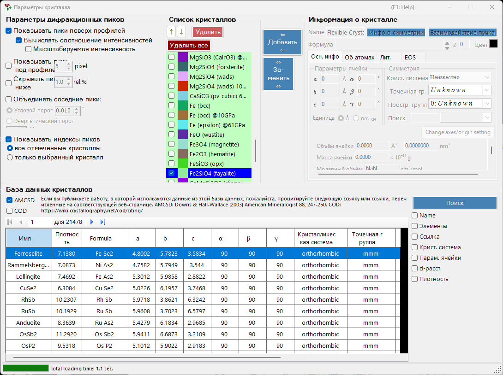
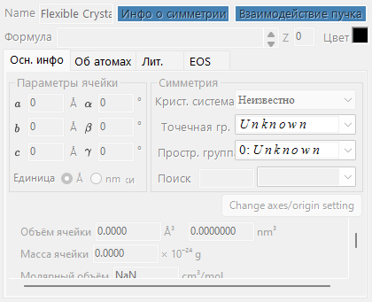
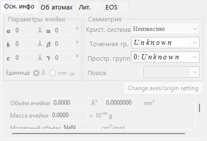
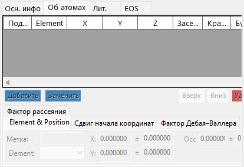
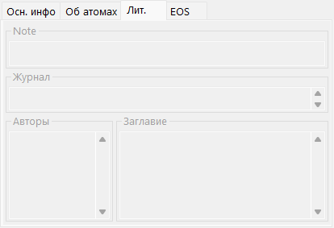
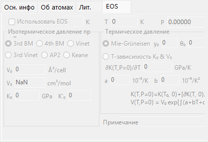
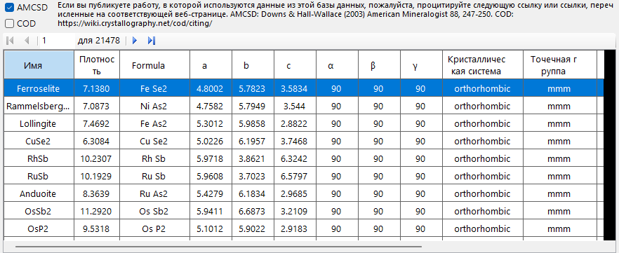
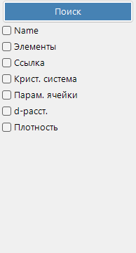
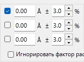

<!-- 260601Cl: migrated from legacy docx + yseto.net web manual -->
# Параметры кристалла

Щелчок по значку `Crystal Parameter` на панели инструментов главного окна открывает дочернее окно, показанное ниже. Здесь вы задаёте, дифракционные пики каких кристаллов отображать и как эти пики рисуются. В нижней части окна встроена база данных кристаллов для поиска и импорта структур.

Окно разделено на четыре основные области.

| Область | Назначение |
| --- | --- |
| `Diffraction Peak Option` | Способ отображения дифракционных линий |
| `Crystal List` | Список кристаллов с флажками, общий с главным окном |
| `Crystal Information` | Подробные параметры выбранного кристалла (по вкладкам) |
| `Crystal database` | Поиск и импорт на основе AMCSD |

---

## Diffraction Peak Option

Настраивает отображение дифракционных линий.

### Show peaks over profiles

Выбирает, отображаются ли дифракционные линии поверх данных профиля.

### Calculate intensity ratio {#calculate-intensity-ratio}

Выбирает, вычисляются ли дифракционные интенсивности (их соотношения) на основе структурных данных.

!!! note
    Если атомные позиции не введены, интенсивности не вычисляются независимо от состояния флажка. О вводе атомных данных см. [вкладку Об атомах](#atom-info-tab).

### Scalable intensity

Выбирает, можно ли масштабировать все дифракционные линии одновременно, не меняя их относительных соотношений интенсивности.

### Show peaks under profile

Выбирает, отображаются ли дифракционные пики под профилем.

#### Peak height

Задаёт высоту пиков, отображаемых под профилем, в пикселях (`pixel`).

### Combine adjacent peaks

Выбирает, следует ли объединять интенсивности пиков, которые, хотя и кристаллографически неэквивалентны, имеют почти одинаковые или точно совпадающие значения 2θ.

Например, в кубической системе плоскости (333) и (115) неэквивалентны, но имеют абсолютно одинаковое межплоскостное расстояние (d), поэтому на дифрактограмме они накладываются друг на друга. Установка этого флажка позволяет отображать их суммарную интенсивность.

| Пункт | Описание |
| --- | --- |
| `Angle threshold` | Насколько близко должны находиться пики, чтобы их объединить, задаётся в градусах (`°`). |
| `Energy threshold` | Для энергодисперсионных данных — диапазон объединения, задаваемый в энергии (`eV`). |

!!! tip
    В старой версии руководства порог указывался в ангстремах, но в текущей версии он задаётся в градусах (`°`) или энергии (`eV`) в зависимости от типа горизонтальной оси.

### Hide peaks below

Выбирает, следует ли убирать пики, которые слишком слабы по сравнению с самой сильной линией. Порог отсечения задаётся как отношение к самой сильной линии (`rel.%`).

### Show peak indices

Выбирает, для каких кристаллов подписываются индексы дифракционных линий (индексы Миллера).

| Вариант | Область действия |
| --- | --- |
| `all checked crystals` | Все отмеченные кристаллы |
| `only selected crystal` | Только кристалл, выбранный в списке в данный момент |

---

## Crystal List

Здесь показана та же информация, что и в списке профилей на главном окне. Отмеченные кристаллы отображаются дифракционными линиями на главном окне. Каждая строка содержит флажок (`Check`), цвет отрисовки (`PeakColor`) и название кристалла (`Crystal`).

### Кнопки со стрелками вверх/вниз (↑ / ↓)

Изменяют порядок кристаллов.

!!! note
    Строки с 1 по 6 зарезервированы для уравнения состояния (EOS) и не могут быть переупорядочены. Подробности см. в разделе [Уравнение состояния](5-equation-of-states.md).

### Add

Добавляет кристалл, настроенный в области Crystal Information справа (описана ниже), в список как новую запись.

### Replace

Заменяет выбранный в данный момент кристалл на кристалл, настроенный в области Crystal Information справа.

### Delete

Удаляет выбранный в данный момент кристалл из списка.

### Delete all

Удаляет все кристаллы из списка.

---

## Crystal Information {#crystal-information}

Редактирует и отображает подробную информацию о выбранном кристалле на нескольких вкладках. Основные вкладки:

| Вкладка | Содержимое |
| --- | --- |
| `Осн. инфо` | Параметры решётки, сингония, пространственная группа и другая базовая информация |
| `Об атомах` | Типы атомов, заселённость, координаты и температурные факторы |
| `Ref.` | Справочная информация об исходной статье, авторах и т. д. |
| `EOS` | Настройки уравнения состояния для сжатия и теплового расширения |

### Вкладка Осн. инфо

Задаёт базовую информацию, такую как параметры решётки (a, b, c, α, β, γ), сингонию и пространственную группу. Выбор пространственной группы автоматически ограничивает редактируемые параметры решётки и степени свободы атомных координат.

!!! tip
    Щелчок правой кнопкой мыши по полю параметра решётки открывает меню, восстанавливающее параметры решётки до значений на момент запуска приложения (или на момент импорта структуры из базы данных). Это удобно, когда нужно вернуться к исходным справочным значениям после их изменения в процессе уточнения.

### Вкладка Об атомах {#atom-info-tab}

Задаёт для каждого атома химический элемент, заселённость, дробные координаты и изотропные/анизотропные температурные факторы. Если здесь введены атомные позиции, дифракционные интенсивности можно вычислить через [Calculate intensity ratio](#calculate-intensity-ratio).

### Вкладка Ref.

Содержит справочную информацию, такую как название статьи, название журнала и авторов, послуживших источником кристаллической структуры. У структур, импортированных из базы данных кристаллов, эта информация заполняется автоматически.

### Вкладка EOS

Задаёт уравнение состояния (EOS) для отдельного кристалла, которое определяет, как параметры решётки изменяются с давлением и температурой. Основные поля ввода:

| Поле | Описание |
| --- | --- |
| `Use EOS` | Включить расчёт давления по EOS для данного кристалла. |
| `T0` / `Temperature` | Опорная / измеренная температура. |
| `V0` | Опорный объём элементарной ячейки. |
| `K0`, `K'0` | Изотермический модуль всестороннего сжатия и его производная по давлению. |
| Изотермическая форма | `BM3` (уравнение Birch-Murnaghan третьего порядка, по умолчанию) / `BM4` / `Vinet` / `AP2` / `Keane`. |
| Тепловое давление | `Mie-Grüneisen` (по умолчанию; параметры \( \gamma_0, \theta_0, q \)) / `T-dependence K0&V0`. |

Формулы и определения символов см. в разделе [Уравнение состояния](5-equation-of-states.md).

---

## Crystal database

Предоставляет функции поиска и импорта для более чем 20 000 кристаллических структур. Эта база данных основана на American Mineralogist Crystal Structure Database (AMCSD).

!!! warning "Citation"
    При использовании этих кристаллографических данных внимательно прочитайте <http://rruff.geo.arizona.edu/AMS/amcsd.php> и обязательно процитируйте следующий источник.

    > Downs, R.T. and Hall-Wallace, M. (2003) The American Mineralogist Crystal Structure Database. *American Mineralogist* **88**, 247-250.

### Table

Содержит список кристаллов, входящих в базу данных. Если введены условия поиска, отображаются только кристаллы, удовлетворяющие им.

Выбор любого кристалла в таблице передаёт его информацию в [Crystal Information](#crystal-information). Чтобы добавить его в список кристаллов, нажмите кнопку `Add` или `Replace` в области Crystal List.

### Search options

Введите условия поиска. После ввода нажмите кнопку `Search` или клавишу Enter. Каждое условие можно включить или отключить своим флажком.

#### Name

Введите название кристалла.

#### Elements

Нажатие кнопки `Periodic Table` открывает отдельное окно, в котором вы выбираете элементы для поиска. Каждая кнопка элемента переключает своё состояние при каждом нажатии.

Кнопки в верхней части окна переключают состояние всех элементов сразу.

| Кнопка | Значение |
| --- | --- |
| `may or not include` | Элемент может присутствовать или отсутствовать (снимает все ограничения по элементам). |
| `must include` | Должен включаться (остаются только кристаллы, содержащие все указанные элементы). |
| `must exclude` | Должен исключаться (кристаллы, содержащие любой из указанных элементов, удаляются). |

!!! tip
    Установка флажка `Ignore scattering factor` позволяет вести поиск без учёта факторов рассеяния.

#### Reference

Введите название статьи, название журнала или имя автора.

#### Crystal System

Поиск по указанной сингонии.

#### Cell Params

Введите параметры решётки и допустимую погрешность.

#### d-spacing

Введите межплоскостное расстояние (d) сильной линии и допустимую погрешность.

#### Density

Введите плотность и допустимую погрешность.
