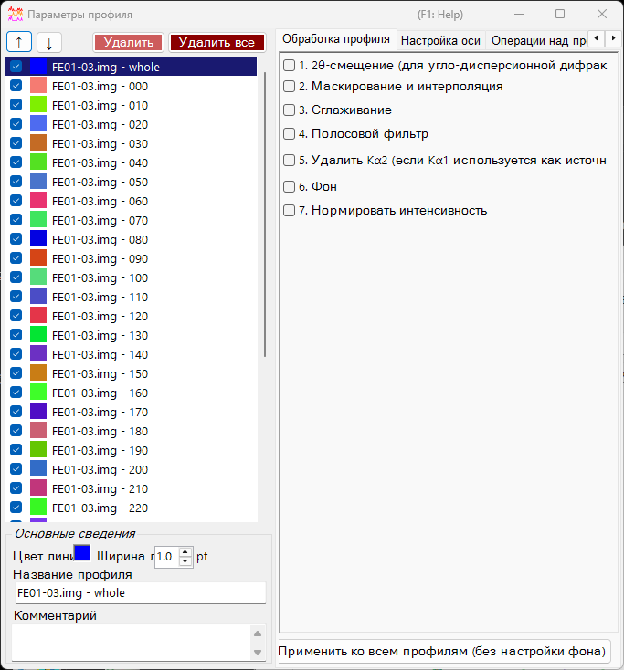
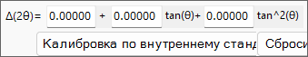
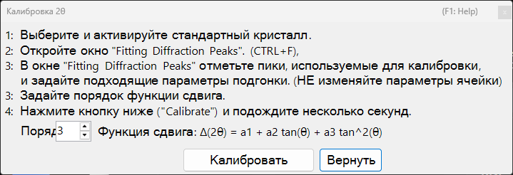
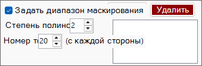
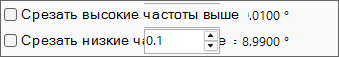
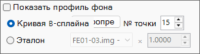
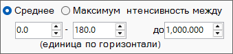

<!-- 260601Cl: migrated from legacy docx + yseto.net web manual -->
# Параметры профиля

При нажатии на значок `Profile parameter` в главном окне открывается это подчинённое окно. Здесь выполняются подробные настройки загруженных профилей и различная числовая обработка.

В левой части окна находится [список профилей](#profile), а правая часть разделена на три вкладки — [Обработка профиля](#profile-processing), [Настройка осей](#axis-setting) и [Операции с профилем](#profile-operator). Каждый шаг обработки можно включать и выключать флажком, и они применяются по порядку сверху вниз.

!!! note
    Настройки, сделанные в этом окне, отражаются на профилях в [главном окне](1-main-window.md) в реальном времени. Настройки на стороне кристалла — такие как единица горизонтальной оси и подписи индексов дифракционных линий — см. в разделе [Параметры кристалла](3-crystal-parameter.md).

---

## Список профилей {#profile}

Список в левой части окна показывает ту же информацию, что и список профилей в главном окне. Выбор профиля в списке делает его объектом обработки и настроек в правой части окна.

| Элемент | Описание |
| --- | --- |
| `↑` `↓` (кнопки со стрелками вверх/вниз) | Изменяют порядок профилей в списке. |
| `Delete` | Удаляет выбранный профиль. |
| `Delete all` | Удаляет все профили. |

В области `Basic property` под списком редактируются основные атрибуты выбранного профиля.

| Элемент | Описание |
| --- | --- |
| `Line Color` | Нажмите, чтобы изменить цвет отрисовки выбранного профиля. |
| `Line Width` | Задаёт толщину линии профиля (`pt`). |
| `Profile Name` | Задаёт имя профиля. |
| `Comment` | Поле для произвольного комментария. |

---

## Обработка профиля {#profile-processing}

На вкладке `Profile processing` к выбранному профилю применяется различная числовая обработка. Шаги 1–7 можно включать независимо друг от друга флажком, и включённые шаги применяются по порядку номеров.

### 1. Смещение 2θ {#two-theta-offset}

`1. 2θ offeset (for angle-dispersive diffractmetry)` корректирует угол для данных угло-дисперсионной дифрактометрии. Формула коррекции — квадратичная функция от \( \tan\theta \).

$$ \Delta(2\theta) = a_0 + a_1 \tan\theta + a_2 \tan^2\theta $$

Если профиль содержит внутренний стандарт (образец с известными параметрами решётки), нажмите кнопку `Calibration using an internal standard` и следуйте появляющимся сообщениям — коэффициенты квадратичной функции будут определены автоматически. В диалоге калибровки наблюдаемые положения пиков сопоставляются с теоретическими положениями пиков эталона, и по ним подбираются коэффициенты.

Кнопка `Reset` сбрасывает установленные коэффициенты смещения.

!!! tip
    В качестве внутренних стандартов обычно используются материалы с точно определёнными параметрами решётки, такие как Si или LaB₆. После калибровки скорректированные значения 2θ используются напрямую во всём дальнейшем анализе.

### 2. Маскирование и интерполяция {#mask}

`2. Mask and Interpolation` маскирует заданный угловой диапазон (или диапазон энергий) и интерполирует профиль, используя интенсивности вне маскированного диапазона.

| Элемент | Описание |
| --- | --- |
| `Set Masking range` | Задаёт диапазон горизонтальной оси для маскирования. |
| `Point No.` | Задаёт число конечных точек (с каждой стороны), используемых для интерполяции. |
| `Polynomial order` | Задаёт порядок полинома, используемого для интерполяции. |
| `Save Masking Ranges` / `Read Masking Ranges` | Сохраняет настроенные диапазоны маскирования в файл или считывает их обратно. |
| `Delete` / `Delete all` | Удаляет отдельный диапазон маскирования или все сразу. |

### 3. Сглаживание {#smoothing}

`3. Smoothing` применяет сглаживание к выбранному профилю. Алгоритм сглаживания — метод `Savitzky-Golay`.

В этом методе для каждой рассматриваемой позиции \(x\) выполняется аппроксимация методом наименьших квадратов полиномом степени `Order` по данным в пределах \(\pm\) `Point No.` от этой точки, и значение полученной функции \(F(x)\) принимается как новая интенсивность в этой позиции \(x\).

!!! note
    При `Order` \(= 1\) сглаживание Savitzky–Golay эквивалентно простому скользящему среднему. Увеличение `Order` лучше сохраняет форму пиков, а увеличение `Point No.` усиливает сглаживание.

### 4. Полосовой фильтр {#bandpass}

`4. Bandpass filter` использует преобразование Фурье (FFT), чтобы отсечь составляющие выше или ниже заданных частот.

| Элемент | Описание |
| --- | --- |
| `Cut high-freq. over` | Удаляет составляющие с частотой выше заданного значения (снижает высокочастотный шум). |
| `Cut low-freq. under` | Удаляет составляющие с частотой ниже заданного значения (устраняет медленно меняющийся фон). |

### 5. Удаление Kα2 {#remove-ka2}

`5. Remove Kα2 (if Kα1 is used as X-ray source)`: если выбранный профиль был измерен рентгеновским излучением, в котором Kα1 и Kα2 не разделены, и он был загружен с указанием Kα1, включение этого флажка удаляет дифракционную интенсивность, обусловленную Kα2.

!!! warning
    Эта обработка эффективна только в том случае, если в качестве источника рентгеновского излучения выбран Kα1. Проверьте и задайте единицу горизонтальной оси и тип излучения на вкладке [Настройка осей](#axis-setting).

### 6. Фон {#background}

`6. Background` вычитает фон из профиля. Есть два метода.

#### B-Spline curve

При нажатии `Auto Detect` фон автоматически вычисляется и вычитается. Параметр `Point No.` задаёт максимальное число опорных точек фона, которые ищутся автоматически.

Опорные точки можно также изменять вручную. Перетаскивайте мышью круглые опорные точки, нарисованные в главном окне, чтобы построить подходящую кривую.

#### Reference

Для выбранного профиля можно указать в качестве фона другой профиль. Флажок `Show background profile` отображает профиль, используемый в качестве фона.

!!! note
    Вычитание фона (шаг 6) исключено из массового применения кнопкой `Apply for all profiles`, описанной ниже.

### 7. Нормировка интенсивности {#normalize}

`7. Normarize intensity` нормирует профиль так, чтобы `Average` (среднее) или `Maximum` (максимум) в заданном диапазоне горизонтальной оси стало заданной интенсивностью.

| Элемент | Описание |
| --- | --- |
| `Average` / `Maximum` | Выбор, использовать ли в качестве опорного значения среднее или максимум в диапазоне. |
| `intensity between` | Задаёт целевой диапазон горизонтальной оси. |
| `to` | Задаёт целевое значение интенсивности после нормировки. |

### Кнопка Apply for all profiles {#apply-all}

Кнопка `Apply for all profiles (without background setting)` применяет настройки шагов 1–7, **за исключением 6. Фон**, сразу ко всем профилям.

---

## Настройка осей {#axis-setting}

На вкладке `Axis setting` изменяются единица горизонтальной оси, тип излучения (падающего пучка) и энергия падающего пучка выбранного профиля.

| Элемент | Описание |
| --- | --- |
| `Horizontal axis setting` | Изменяет текущую единицу горизонтальной оси (`horizontal unit`). С помощью `Shift` можно также сместить всю горизонтальную ось. |
| `Exposure Time` | Задаёт время экспозиции (`sec.`), используемое в режиме CPS (`(for CPS mode)`). |
| `Vertical axis setting` | Настройки, связанные с вертикальной осью. |

!!! note
    Настройка осей здесь изменяет физическую информацию, которую хранит сам профиль (единица, тип излучения, энергия). В отличие от чисто отображаемого преобразования осей в главном окне, это влияет на то, как интерпретируются сами данные. Поскольку тип излучения и энергия напрямую влияют на расчёт положений дифракционных линий, задавайте правильные значения.

---

## Операции с профилем {#profile-operator}

На вкладке `Profile Operator` выполняется усреднение нескольких профилей и арифметические операции между профилями.

Указав целевые профили для вычисления и нужную операцию, нажмите кнопку `Calculate` — результат будет добавлен как новый профиль.

| Режим | Описание |
| --- | --- |
| `Average` | Усредняет несколько профилей. |
| `Profile and value` | Выполняет операцию между профилем и скалярным значением. |
| `Two profiles` | Выполняет арифметическую операцию (например, сложение) между двумя профилями. |

С помощью `Output name of the profile` можно задать имя создаваемого профиля (по умолчанию `Result #01`).

!!! tip
    Это можно использовать, например, для усреднения нескольких измерений с целью улучшения отношения сигнал/шум, либо для взятия разности двух профилей, чтобы выделить изменение между ними.
