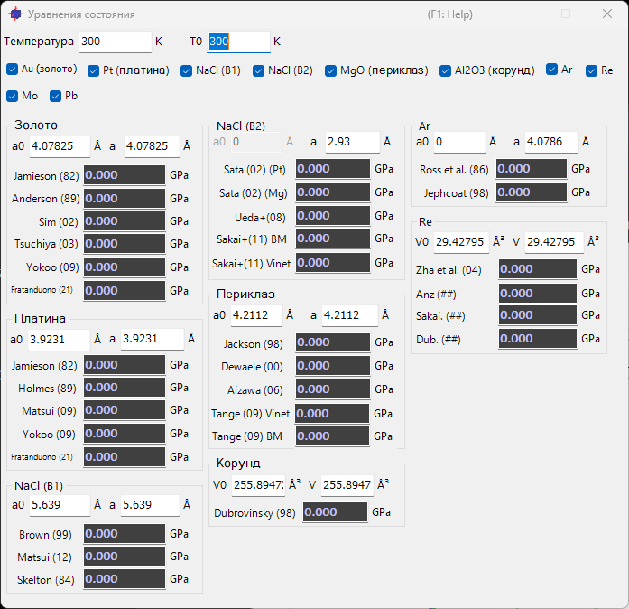
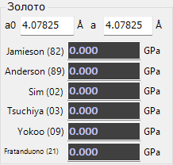
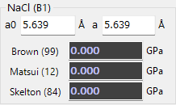
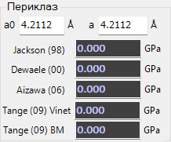

<!-- 260601Cl: migrated from legacy docx + yseto.net web manual -->
# Уравнения состояния

Щелчок по значку `Equation of States` на панели инструментов главного окна открывает окно, показанное ниже. Этот инструмент вычисляет давление по уравнению состояния (EOS, Equation of State) эталонного материала.

В экспериментах при высоком давлении вместе с образцом загружают эталонный материал (маркер давления), который служит опорной точкой для определения давления. Давление затем вычисляется по измеренному параметру решётки (объёму) маркера и его известному уравнению состояния. Именно этот расчёт выполняет данный инструмент.

## Как использовать

1. С помощью флажков в верхней части окна выберите эталонный материал(ы), для которых нужно определить давление.
2. Для каждого выбранного материала рассчитанный результат (давление) отображается в нижней части окна.
3. Давление можно вычислить, введя параметры решётки (`a`, `a0`) или объём (`V`, `V0`) напрямую.
4. При перетаскивании дифракционной линии в главном окне её значение сразу же отражается в расчёте по уравнению состояния.

!!! note "Связь со списком кристаллов"
    Эталонные материалы соответствуют кристаллам, показанным розовыми строками в списке кристаллов. По умолчанию предусмотрено примерно 10 материалов: золото (Au), платина (Pt), NaCl-B1, NaCl-B2, периклаз (MgO), корунд (Al2O3), аргон (Ar), рений (Re), молибден (Mo), свинец (Pb) и другие.

## Поддерживаемые эталонные материалы

Ниже перечислены эталонные материалы, которые можно выбрать с помощью флажков в верхней части окна. Для каждого материала предусмотрено несколько уравнений состояния разных исследователей (источников), и результаты по каждому выбранному пункту отображаются отдельно.

| Эталонный материал | Описание |
| --- | --- |
| `Au (Gold)` | Золото |
| `Pt (Platinum)` | Платина |
| `NaCl (B1)` | Хлорид натрия (структура B1, тип каменной соли) |
| `NaCl (B2)` | Хлорид натрия (структура B2, тип CsCl) |
| `MgO (Periclase)` | Оксид магния (периклаз) |
| `Al2O3 (Corundum)` | Оксид алюминия (корунд) |
| `Ar` | Аргон |
| `Re` | Рений |
| `Mo` | Молибден |
| `Pb` | Свинец |
| `hBN` | Гексагональный нитрид бора |

## Входные параметры

В `groupBox` каждого материала можно ввести или посмотреть следующие значения.

| Поле | Описание |
| --- | --- |
| `a` / `V` | Измеренный параметр решётки или объём. Автоматически обновляется при перетаскивании дифракционной линии в главном окне. |
| `a0` / `V0` | Параметр решётки или объём в нормальных (эталонных) условиях. |
| `Temperature` | Температура образца. Используется уравнениями состояния, учитывающими тепловое давление (высокотемпературные EOS). |
| `T0` | Эталонная температура. Используется вместе с `Temperature` для применения поправки на тепловое давление. |

!!! tip "Уравнения состояния, зависящие от температуры"
    Некоторые источники поддерживают высокотемпературные уравнения состояния, учитывающие тепловое давление. Введя `Temperature` и `T0` в соответствии с условиями эксперимента, вы получите давление с учётом температурной поправки. К этой категории относятся формулировки на основе модели Mie-Grüneisen(-Debye), такие как формы Vinet/BM у `Sakai+(11)`.

## Источники по каждому материалу

В `groupBox` каждого материала перечислено несколько уравнений состояния из разных источников, и давление, вычисленное по каждой формуле, отображается одновременно. Их можно сравнить и выбрать источник, наиболее подходящий для вашего исследования или условий измерения. Ниже приведены характерные примеры.

### Золото

Для золота (`Au (Gold)`) доступны такие уравнения состояния, как `Yokoo (09)`, `Matsui (09)`, `Holmes (89)`, `Jamieson (82)` и `Fratanduono (21)`.

### NaCl (структура B1)

Для `NaCl (B1)` доступны такие уравнения состояния, как `Brown (99)`, `Sakai+` и `Matsui (12)`.

### Периклаз (MgO)

Для `MgO (Periclase)` доступны такие уравнения состояния, как `Tange (09) BM`, `Tange (09) Vinet`, `Aizawa (06)`, `Dewaele (00)` и `Jackson (98)`.

!!! note "Другие материалы"
    Для платины (`Pt (Platinum)`: `Fratanduono (21)`, `Holmes (89)` и др.), `NaCl (B2)` (`Sakai (02)`, `Ueda+(08)` и др.), корунда (`Al2O3 (Corundum)`: `Sata (02)` и др.), `Ar` (`Dubrovinsky (98)`, `Ross et al. (86)`, `Jephcoat (98)` и др.), `Re` (`Zha et al. (04)` и др.), `Mo` (`Zhao+(00)`, `Huang+(16) MGD` и др.) и `Pb` (`Strässle+(14)` и др.) также предусмотрен выбор из нескольких источников.

## Теория уравнений состояния

Уравнение состояния \( P = P(V, T) \) выражает связь между давлением, объёмом и температурой вещества; задача данного инструмента — определить давление \( P \) по измеренному объёму \( V \). Давление вычисляется как сумма **члена изотермического сжатия** \( P_\text{st}(V) \) при эталонной температуре и **члена теплового давления** \( \Delta P_\text{th} \), обусловленного разностью температур.

$$P(V, T) = P_\text{st}(V) + \Delta P_\text{th}(V, T)$$

Приведённые ниже общие формулы представляют собой единый каркас, который эта форма использует для вычисления давления каждого эталонного материала; каждый источник либо подставляет в этот каркас опубликованные параметры, либо использует формулу, специфичную для источника (конкретные формулы и параметры по каждому источнику см. в разделе [Формулы по источникам](#per-source) ниже). Про вкладку EOS для каждого кристалла в элементе управления Crystal Information см. [Параметры кристалла](3-crystal-parameter.md).

### Обозначения

| Символ | Значение |
| --- | --- |
| \( V_0,\ V \) | объём элементарной ячейки в эталонном / измеренном состоянии |
| \( K_0 \) | изотермический модуль всестороннего сжатия при эталонной температуре и объёме |
| \( K_0' \) | производная \( K_0 \) по давлению |
| \( K_0'' \) | вторая производная \( K_0 \) по давлению (используется в BM4) |
| \( T_0,\ T \) | эталонная / измеренная температура |
| \( \gamma_0 \) | параметр Грюнайзена при эталонном объёме |
| \( \theta_0 \) | температура Дебая при эталонном объёме |
| \( q \) | зависимость параметра Грюнайзена от объёма |
| \( n \) | число атомов на формульную единицу |
| \( R \) | газовая постоянная |

### Член изотермического сжатия \( P_\text{st}(V) \)

Пусть коэффициент сжатия \( x = V_0/V \).

**Уравнение Birch-Murnaghan третьего порядка (BM3, по умолчанию)**

$$P_\text{st} = \tfrac{3}{2}K_0\left(x^{7/3} - x^{5/3}\right)\left[1 + \tfrac{3}{4}(K_0' - 4)\left(x^{2/3} - 1\right)\right]$$

**Vinet**: при \( y = (V/V_0)^{1/3} \),

$$P_\text{st} = 3K_0\,\frac{1-y}{y^2}\,\exp\!\left[\tfrac{3}{2}(K_0' - 1)(1 - y)\right]$$

Также доступны уравнение Birch-Murnaghan четвёртого порядка (**BM4**, добавляющее члены более высокого порядка с \( K_0'' \)), **AP2** и **Keane**.

### Член теплового давления \( \Delta P_\text{th}(V, T) \)

**Модель Mie-Grüneisen-Debye (по умолчанию)**: при молярном объёме \( V_m \) (эталонное значение \( V_{m0} \)) параметр Грюнайзена и температура Дебая равны

$$\gamma = \gamma_0\left(\frac{V_m}{V_{m0}}\right)^{q},\qquad \theta = \theta_0\exp\!\left[\frac{\gamma_0 - \gamma}{q}\right]$$

а тепловое давление равно

$$\Delta P_\text{th} = \frac{\gamma}{V_m}\Bigl[E_\text{th}(T,\theta) - E_\text{th}(T_0,\theta)\Bigr]$$

где \( E_\text{th} \) — внутренняя энергия Дебая

$$E_\text{th}(T,\theta) = 9nRT\left(\frac{T}{\theta}\right)^3\int_0^{\theta/T}\frac{t^3}{e^t - 1}\,dt.$$

**Модель T-dependence K0&V0**: модуль всестороннего сжатия и эталонный объём рассматриваются как функции температуры: \( K_{T0} = K_0 + (\partial K/\partial T)(T - T_0) \), а температурно-скорректированный эталонный объём \( V_0(T) \) получают интегрированием коэффициента теплового расширения \( \alpha(T) = A\times10^{-5} + B\times10^{-9}\,T + C/T^2 \); затем эти величины подставляются в приведённые выше изотермические уравнения.

Конкретные значения параметров и предпосылки для опубликованного EOS каждого материала также обобщены на пояснительной странице автора.

- [Заметки об уравнениях состояния (EOS)](https://yseto.net/misc/misc-4/misc-4-1)

## Формулы по источникам {#per-source}

Для каждого эталонного материала давление вычисляется одним из трёх способов в зависимости от источника:

1. **Общая формула + опубликованные параметры**: изотермические BM3 / BM4 / Vinet сочетаются с тепловым давлением Mie-Grüneisen-Debye, подставляя опубликованные значения источника.
2. **Замкнутая форма, специфичная для источника**: формула, характерная именно для данного источника (приводится там, где применяется).
3. **Интерполяция опубликованной таблицы P-V-T**: не аналитическое уравнение, а двухэтапная кубическая сплайн-интерполяция (сначала по сжатию, затем по температуре) табличных данных источника «давление – объём – температура».

Ниже перечислены источники, которые FormEOS отображает для каждого материала (параметры — это опубликованные значения, зашитые в реализации; K0 в ГПа, температура в К, отношение объёмов V/V0). Формы BM3/BM4/Vinet/Mie-Grüneisen-Debye см. в предыдущем разделе.

### Золото (Au)

| Источник | Модель | Основные параметры |
| --- | --- | --- |
| Jamieson82 | сплайн таблицы P-V-T | сжатие x=1−V/V0, T=200–1500 K |
| Anderson89 | BM3 + линейный тепловой член | K0=166.65, K0'=5.4823, ∂K/∂T=−0.0115 |
| Sim02 | BM3 + Mie-Grüneisen-Debye | K0=167, K0'=5.0; θ0=170, γ0=2.97, q=1.0, n=1 |
| Tsuchiya03 | сплайн таблицы P-V-T | T=300–2500 K |
| Yokoo09 | сплайн таблицы P-V-T | T=0–3000 K |
| Fratanduono21 | Vinet (изотермический) | K0=170.09, K0'=5.880 |

Тепловой член Anderson89: $\Delta P_\text{th} = \left[0.00714 + (\partial K/\partial T)\ln(V_0/V)\right](T-300)$.

### Платина (Pt)

| Источник | Модель | Основные параметры |
| --- | --- | --- |
| Jamieson82 | сплайн таблицы P-V-T | T=200–1500 K |
| Holmes89 | Vinet (изотермический) + линейный тепловой член | K0=266, K0'=5.81, αT=0.261 |
| Matsui09 | Vinet + Mie-Grüneisen-Debye + электронный член Pel | K0=273, K0'=5.20; θ0=230, γ0=2.70, q=1.10 |
| Yokoo09 | сплайн таблицы P-V-T | T=0–3000 K |
| Fratanduono21 | Vinet (изотермический) | K0=259.7, K0'=5.839 |

Тепловой член Holmes89: $\Delta P_\text{th} = \alpha_T K_0 (T-300)/10000$. Электронное давление Matsui09 $P_\text{el}$ — кубический полином от температуры (~0.04 ГПа при эталонном значении 300 K).

### Аргон (Ar)

| Источник | Модель | Основные параметры |
| --- | --- | --- |
| Ross86 | сплайн таблицы P-V (изотерма 273 K) | молярный объём [см³/моль], интерполяция |
| Jephcoat98 | BM3 + Mie-Grüneisen-Debye | K0=3.03, K0'=7.24; θ0=93.3, γ0=0.5, T0=4 K |

Jephcoat98 задаёт γ линейно зависящей от объёма: $\gamma = \gamma_0 + \gamma_1 (V/V_0)$ (γ1=2.20, θ фиксировано на θ0).

### Оксид магния (MgO)

| Источник | Модель | Основные параметры |
| --- | --- | --- |
| Jackson98 | BM3 + Mie-Grüneisen-Debye | K0=162.5, K0'=4.13; θ0=673, γ0=1.41, q=1.3, n=2 |
| Dewaele00 | BM3 + Mie-Grüneisen-Debye | K0=161, K0'=3.94; θ0=800, γ0=1.45, q=0.8, n=2 |
| Aizawa06 | BM3 + Mie-Grüneisen-Debye | K0=160, K0'=4.15; θ0=773, γ0=1.41, q=0.7, n=2 |
| Tange09 Vinet | Vinet + тепловой член Tange | K0=160.63, K0'=4.367; θ0=761, γ0=1.442, a=0.138, b=5.4 |
| Tange09 BM | BM3 + тепловой член Tange | K0=160.64, K0'=4.221; θ0=761, γ0=1.431, a=0.29, b=3.5 |

Тепловой член Tange использует зависимость от объёма $\gamma=\gamma_0\left[1+a\left((V/V_0)^{b}-1\right)\right]$ и аппроксимирует внутреннюю энергию Дебая полиномом от θ/T.

### Хлорид натрия NaCl (структура B2)

| Источник | Модель | Основные параметры |
| --- | --- | --- |
| Sata02 (шкала Pt) | замкнутая форма Decker/Sata | Pr=31.14, Kr=143.5, V0=27.17 ų |
| Sata02 (шкала MgO) | замкнутая форма Decker/Sata | Pr=32.15, Kr=141.0, V0=27.17 ų |
| Ueda08 | Vinet + линейный тепловой член | K0=28.45, K0'=5.16; тепловой член 0.00468(T−300) |
| Sakai11 BM | BM3 (изотермический) | K0=47.00, K0'=4.10, V0=37.73 ų |
| Sakai11 Vinet | Vinet (изотермический) | K0=40.40, K0'=5.04, V0=37.73 ų |

Форма Sata: $P = P_r (V/V_0)^{-2/3}\exp\!\left[-(3K_r/P_r-2)\left((V/V_0)^{1/3}-1\right)\right]$.

### Хлорид натрия NaCl (структура B1)

| Источник | Модель | Основные параметры |
| --- | --- | --- |
| Brown99 | сплайн таблицы P-V-T | T=300–1200 K |
| Matsui12 | BM4 + Mie-Grüneisen-Debye | K0=23.7, K0'=5.14, K0''=−0.392; θ0=279, γ0=1.56, q=0.96, n=2 |
| Skelton84 | сплайн таблицы P-V-T (линейная деформация 1−a/a0) | T=0–298 K |

### Корунд Al2O3

| Источник | Модель | Основные параметры |
| --- | --- | --- |
| Dubrovinsky98 | BM3 (K0, V0 с температурной поправкой) | K0=258, K0'=4.88, ∂K/∂T=−0.020; тепловое расширение a=2.6e−5, b=1.81e−9, c=−0.67 |

BM3 вычисляется с использованием $K_T=258+(\partial K/\partial T)(T-300)$ и температурно-расширенного $V_0(T)=V_0\exp\!\left[a(T-T_0)+\tfrac{b}{2}(T^2-T_0^2)-c(1/T-1/T_0)\right]$.

### Рений (Re)

| Источник | Модель | Основные параметры |
| --- | --- | --- |
| Zha04 | сплайн таблицы P-V-T | x=1−V/V0=0–0.20, T=300–3000 K |
| Anz | Vinet (изотермический) | K0=352.6, K0'=4.56, V0=29.467 ų |
| Sakai | Vinet (изотермический) | K0=358, K0'=4.8, V0=29.47 ų |
| Dub | BM4 (изотермический) | K0=342, K0'=6.15, K0''=−0.029, V0=29.46 ų |

### Молибден (Mo)

| Источник | Модель | Основные параметры |
| --- | --- | --- |
| Huang16 | BM3 + Mie-Grüneisen-Debye | K0=255, K0'=4.25; θ0=470, γ0=2.01, q=0.6, n=1, z=2 |
| Zhao00 | BM4 + поправка на тепловое расширение (T-dependence) | K0=268, K0'=3.81, K0''=−0.0141, ∂K/∂T=−0.0213; тепловое расширение A=1.31e−5, B=11.2e−9 |

Zhao00 вычисляет BM4 с использованием $K_{T0}=K_0+(\partial K/\partial T)(T-T_0)$ и температурно-скорректированного $V_0(T)$.

### Свинец (Pb)

| Источник | Модель | Основные параметры |
| --- | --- | --- |
| Strassle14 | Vinet (K0, K0', a0 с температурной интерполяцией) | B(T), B'(T), a0(T) линейно интерполируются из измеренных таблиц (B/B' в диапазоне 0–300 K, a0 в диапазоне 0–310 K) |

## Связанные страницы

- О регистрации кристаллов и отображении списка кристаллов см. связанные страницы, такие как [Параметры профиля](4-profile-parameter.md).

<!-- 260605Cl: P-V-T tables for spline-interpolated EOS sources (not on yseto.net) -->

## Таблицы P–V–T, используемые для сплайн-интерполяции {#pvt-tables}

Среди источников, перечисленных в разделе [Формулы по источникам](#per-source), у некоторых нет аналитической формулы, и давление получают **сплайн-интерполяцией опубликованной таблицы P–V–T**. Эти таблицы не включены во внешнюю пояснительную страницу ([yseto.net](https://yseto.net/misc/misc-4/misc-4-1)), поэтому исходные данные, используемые в реализации, приведены ниже дословно (источник: `EOS.cs` / `FormEOS.cs`).

**Порядок интерполяции**: для каждого столбца температуры строится кубический сплайн по сжатию \( x \) (обычно \( x = 1 - V/V_0 \); для Skelton — линейная деформация \( x = 1 - a/a_0 \)) и вычисляется при целевом значении \( x \); полученные давления затем интерполируются кубическим сплайном по температуре \( T \) до целевой температуры (двухэтапный сплайн). Пустые ячейки означают отсутствие значений в исходных данных (не используются при интерполяции). Давление указано в ГПа, если не оговорено иное.

??? note "Золото Au — Jamieson (1982)"

    | x = 1−V/V₀ | 200 K | 300 K | 400 K | 500 K | 600 K | 700 K | 800 K | 900 K | 1000 K | 1100 K | 1200 K | 1300 K | 1400 K | 1500 K |
    |---|---|---|---|---|---|---|---|---|---|---|---|---|---|---|
    | -0.01 | -2.28 | -1.52 | -0.75 | 0.02 | 0.79 | 1.56 | 2.33 | 3.11 | 3.88 | 4.66 | 5.43 | 6.2 | 6.98 | 7.75 |
    | -0.005 | -1.51 | -0.75 | 0.02 | 0.79 | 1.56 | 2.33 | 3.1 | 3.88 | 4.65 | 5.42 | 6.2 | 6.97 | 7.75 | 8.52 |
    | 0 | -0.7 | 0.05 | 0.82 | 1.59 | 2.36 | 3.13 | 3.9 | 4.68 | 5.45 | 6.23 | 7 | 7.77 | 8.55 | 9.32 |
    | 0.005 | 0.13 | 0.89 | 1.65 | 2.42 | 3.19 | 3.96 | 4.74 | 5.51 | 6.28 | 7.06 | 7.83 | 8.61 | 9.38 | 10.16 |
    | 0.01 | 1 | 1.75 | 2.52 | 3.29 | 4.06 | 4.83 | 5.6 | 6.38 | 7.15 | 7.92 | 8.7 | 9.47 | 10.25 | 11.02 |
    | 0.015 | 1.9 | 2.65 | 3.42 | 4.19 | 4.96 | 5.73 | 6.5 | 7.27 | 8.05 | 8.82 | 9.6 | 10.37 | 11.14 | 11.92 |
    | 0.02 | 2.83 | 3.59 | 4.35 | 5.12 | 5.89 | 6.66 | 7.44 | 8.21 | 8.98 | 9.76 | 10.53 | 11.3 | 12.08 | 12.85 |
    | 0.025 | 3.8 | 4.56 | 5.32 | 6.09 | 6.86 | 7.63 | 8.4 | 9.18 | 9.95 | 10.72 | 11.5 | 12.27 | 13.05 | 13.82 |
    | 0.03 | 4.81 | 5.56 | 6.33 | 7.09 | 7.86 | 8.64 | 9.41 | 10.18 | 10.96 | 11.73 | 12.5 | 13.28 | 14.05 | 14.83 |
    | 0.035 | 5.85 | 6.61 | 7.37 | 8.14 | 8.91 | 9.68 | 10.45 | 11.22 | 12 | 12.77 | 13.54 | 14.32 | 15.09 | 15.87 |
    | 0.04 | 6.94 | 7.69 | 8.45 | 9.22 | 9.99 | 10.76 | 11.53 | 12.3 | 13.08 | 13.85 | 14.62 | 15.4 | 16.17 | 16.95 |
    | 0.045 | 8.06 | 8.81 | 9.57 | 10.34 | 11.11 | 11.88 | 12.65 | 13.42 | 14.2 | 14.97 | 15.74 | 16.52 | 17.29 | 18.07 |
    | 0.05 | 9.22 | 9.97 | 10.73 | 11.5 | 12.27 | 13.04 | 13.81 | 14.58 | 15.36 | 16.13 | 16.9 | 17.68 | 18.45 | 19.23 |
    | 0.055 | 10.42 | 11.17 | 11.93 | 12.7 | 13.47 | 14.24 | 15.01 | 15.78 | 16.56 | 17.33 | 18.1 | 18.88 | 19.65 | 20.43 |
    | 0.06 | 11.66 | 12.41 | 13.17 | 13.94 | 14.71 | 15.48 | 16.25 | 17.02 | 17.8 | 18.57 | 19.34 | 20.12 | 20.89 | 21.67 |
    | 0.065 | 12.95 | 13.7 | 14.46 | 15.22 | 15.99 | 16.76 | 17.54 | 18.31 | 19.08 | 19.86 | 20.63 | 21.4 | 22.18 | 22.95 |
    | 0.07 | 14.28 | 15.03 | 15.79 | 16.55 | 17.32 | 18.09 | 18.86 | 19.64 | 20.41 | 21.18 | 21.96 | 22.73 | 23.5 | 24.28 |
    | 0.075 | 15.65 | 16.4 | 17.16 | 17.93 | 18.69 | 19.47 | 20.24 | 21.01 | 21.78 | 22.56 | 23.33 | 24.1 | 24.88 | 25.65 |
    | 0.08 | 17.07 | 17.82 | 18.58 | 19.34 | 20.11 | 20.88 | 21.66 | 22.43 | 23.2 | 23.97 | 24.75 | 25.52 | 26.29 | 27.07 |
    | 0.085 | 18.54 | 19.28 | 20.04 | 20.81 | 21.58 | 22.35 | 23.12 | 23.89 | 24.66 | 25.44 | 26.21 | 26.98 | 27.76 | 28.53 |
    | 0.09 | 20.05 | 20.8 | 21.56 | 22.32 | 23.09 | 23.86 | 24.63 | 25.4 | 26.17 | 26.95 | 27.72 | 28.5 | 29.27 | 30.04 |
    | 0.095 | 21.61 | 22.36 | 23.11 | 23.88 | 24.65 | 25.42 | 26.19 | 26.96 | 27.73 | 28.51 | 29.28 | 30.05 | 30.83 | 31.6 |
    | 0.1 | 23.22 | 23.96 | 24.72 | 25.49 | 26.25 | 27.02 | 27.8 | 28.57 | 29.34 | 30.11 | 30.89 | 31.66 | 32.43 | 33.21 |
    | 0.105 | 24.88 | 25.62 | 26.38 | 27.14 | 27.91 | 28.68 | 29.45 | 30.22 | 31 | 31.77 | 32.54 | 33.32 | 34.09 | 34.86 |
    | 0.11 | 26.59 | 27.33 | 28.09 | 28.85 | 29.62 | 30.39 | 31.16 | 31.93 | 32.7 | 33.47 | 34.25 | 35.02 | 35.79 | 36.57 |
    | 0.115 | 28.35 | 29.09 | 29.84 | 30.61 | 31.37 | 32.14 | 32.91 | 33.69 | 34.46 | 35.23 | 36 | 36.78 | 37.55 | 38.32 |
    | 0.12 | 30.18 | 30.92 | 31.67 | 32.43 | 33.2 | 33.97 | 34.74 | 35.51 | 36.28 | 37.06 | 37.83 | 38.6 | 39.38 | 40.15 |
    | 0.125 | 32.01 | 32.74 | 33.5 | 34.26 | 35.02 | 35.79 | 36.56 | 37.34 | 38.11 | 38.88 | 39.65 | 40.43 | 41.2 | 41.97 |
    | 0.13 | 33.89 | 34.62 | 35.37 | 36.14 | 36.9 | 37.67 | 38.44 | 39.21 | 39.99 | 40.76 | 41.53 | 42.3 | 43.08 | 43.85 |
    | 0.135 | 35.82 | 36.56 | 37.31 | 38.07 | 38.84 | 39.61 | 40.38 | 41.15 | 41.92 | 42.69 | 43.46 | 44.24 | 45.01 | 45.78 |
    | 0.14 | 37.82 | 38.55 | 39.3 | 40.06 | 40.83 | 41.6 | 42.37 | 43.14 | 43.91 | 44.68 | 45.45 | 46.23 | 47 | 47.77 |
    | 0.145 | 39.87 | 40.6 | 41.35 | 42.11 | 42.88 | 43.65 | 44.42 | 45.19 | 45.96 | 46.73 | 47.5 | 48.28 | 49.05 | 49.82 |
    | 0.15 | 41.98 | 42.71 | 43.46 | 44.22 | 44.99 | 45.76 | 46.53 | 47.3 | 48.07 | 48.84 | 49.61 | 50.39 | 51.16 | 51.93 |
    | 0.155 | 44.16 | 44.89 | 45.64 | 46.4 | 47.16 | 47.93 | 48.7 | 49.47 | 50.24 | 51.01 | 51.79 | 52.56 | 53.33 | 54.11 |
    | 0.16 | 46.4 | 47.13 | 47.88 | 48.63 | 49.4 | 50.17 | 50.94 | 51.71 | 52.48 | 53.25 | 54.02 | 54.8 | 55.57 | 56.34 |
    | 0.165 | 48.71 | 49.43 | 50.18 | 50.94 | 51.7 | 52.47 | 53.24 | 54.01 | 54.78 | 55.55 | 56.33 | 57.1 | 57.87 | 58.64 |
    | 0.17 | 51.08 | 51.8 | 52.55 | 53.31 | 54.07 | 54.84 | 55.61 | 56.38 | 57.15 | 57.92 | 58.7 | 59.47 | 60.24 | 61.02 |
    | 0.175 | 53.53 | 54.25 | 54.99 | 55.75 | 56.52 | 57.28 | 58.05 | 58.82 | 59.59 | 60.36 | 61.14 | 61.91 | 62.68 | 63.46 |
    | 0.18 | 56.04 | 56.76 | 57.51 | 58.27 | 59.03 | 59.8 | 60.56 | 61.33 | 62.11 | 62.88 | 63.65 | 64.42 | 65.19 | 65.97 |
    | 0.185 | 58.64 | 59.35 | 60.1 | 60.85 | 61.62 | 62.38 | 63.15 | 63.92 | 64.69 | 65.46 | 66.24 | 67.01 | 67.78 | 68.55 |
    | 0.19 | 61.3 | 62.02 | 62.76 | 63.52 | 64.28 | 65.05 | 65.82 | 66.59 | 67.36 | 68.13 | 68.9 | 69.67 | 70.44 | 71.22 |
    | 0.195 | 64.05 | 64.76 | 65.51 | 66.26 | 67.02 | 67.79 | 68.56 | 69.33 | 70.1 | 70.87 | 71.64 | 72.41 | 73.19 | 73.96 |
    | 0.2 | 66.88 | 67.59 | 68.33 | 69.09 | 69.85 | 70.61 | 71.38 | 72.15 | 72.92 | 73.69 | 74.46 | 75.24 | 76.01 | 76.78 |
    | 0.205 | 69.79 | 70.5 | 71.24 | 71.99 | 72.76 | 73.52 | 74.29 | 75.06 | 75.83 | 76.6 | 77.37 | 78.14 | 78.92 | 79.69 |
    | 0.21 | 72.79 | 73.49 | 74.23 | 74.99 | 75.75 | 76.51 | 77.28 | 78.05 | 78.82 | 79.59 | 80.36 | 81.14 | 81.91 | 82.68 |
    | 0.215 | 75.87 | 76.58 | 77.32 | 78.07 | 78.83 | 79.6 | 80.36 | 81.13 | 81.9 | 82.67 | 83.44 | 84.22 | 84.99 | 85.76 |
    | 0.22 | 79.05 | 79.76 | 80.49 | 81.25 | 82.01 | 82.77 | 83.54 | 84.3 | 85.07 | 85.85 | 86.62 | 87.39 | 88.16 | 88.93 |
    | 0.225 | 82.32 | 83.03 | 83.76 | 84.51 | 85.27 | 86.04 | 86.8 | 87.57 | 88.34 | 89.11 | 89.88 | 90.66 | 91.43 | 92.2 |

??? note "Золото Au — Tsuchiya (2003)"

    | x = 1−V/V₀ | 300 K | 500 K | 1000 K | 1500 K | 2000 K | 2500 K |
    |---|---|---|---|---|---|---|
    | 0 | 0 | 1.52 | 5.35 | 9.19 | 13.04 | 16.88 |
    | 0.02 | 3.55 | 5.04 | 8.78 | 12.54 | 16.29 | 20.05 |
    | 0.04 | 7.68 | 9.13 | 12.79 | 16.45 | 20.12 | 23.79 |
    | 0.06 | 12.42 | 13.83 | 17.4 | 20.98 | 24.56 | 28.14 |
    | 0.08 | 17.86 | 19.23 | 22.71 | 26.2 | 29.7 | 33.19 |
    | 0.1 | 24.12 | 25.46 | 28.85 | 32.25 | 35.66 | 39.07 |
    | 0.12 | 31.3 | 32.6 | 35.9 | 39.22 | 42.54 | 45.86 |
    | 0.14 | 39.52 | 40.78 | 43.99 | 47.22 | 50.45 | 53.68 |
    | 0.16 | 48.94 | 50.17 | 53.29 | 56.43 | 59.58 | 62.72 |
    | 0.18 | 59.76 | 60.95 | 63.98 | 67.03 | 70.09 | 73.15 |
    | 0.2 | 72.11 | 73.26 | 76.21 | 79.18 | 82.14 | 85.11 |
    | 0.22 | 86.36 | 87.48 | 90.34 | 93.22 | 96.1 | 98.98 |
    | 0.24 | 102.65 | 103.73 | 106.5 | 109.29 | 112.08 | 114.88 |
    | 0.26 | 121.38 | 122.42 | 125.1 | 127.8 | 130.51 | 133.21 |
    | 0.28 | 142.98 | 143.99 | 146.58 | 149.19 | 151.81 | 154.43 |
    | 0.3 | 167.77 | 168.74 | 171.24 | 173.77 | 176.3 | 178.83 |
    | 0.32 | 196.48 | 197.41 | 199.83 | 202.26 | 204.7 | 207.15 |
    | 0.34 | 229.56 | 230.45 | 232.78 | 235.13 | 237.49 | 239.84 |

??? note "Золото Au — Yokoo et al. (2009)"

    | x = 1−V/V₀ | 0 K | 300 K | 500 K | 1000 K | 1500 K | 2000 K | 2500 K | 3000 K |
    |---|---|---|---|---|---|---|---|---|
    | 0 | -1.73 | 0 | 1.42 | 4.99 | 8.58 | 12.18 |  |  |
    | 0.02 | 1.92 | 3.59 | 4.98 | 8.49 | 12.02 | 15.56 |  |  |
    | 0.04 | 6.08 | 7.7 | 9.07 | 12.53 | 16 | 19.48 | 22.99 |  |
    | 0.06 | 10.83 | 12.41 | 13.76 | 17.16 | 20.59 | 24.02 | 27.47 |  |
    | 0.08 | 16.26 | 17.8 | 19.13 | 22.49 | 25.87 | 29.26 | 32.67 | 36.1 |
    | 0.1 | 22.46 | 23.96 | 25.27 | 28.59 | 31.93 | 35.29 | 38.66 | 42.06 |
    | 0.12 | 29.55 | 31.01 | 32.3 | 35.59 | 38.91 | 42.23 | 45.58 | 48.94 |
    | 0.14 | 37.65 | 39.07 | 40.36 | 43.62 | 46.91 | 50.21 | 53.53 | 56.87 |
    | 0.16 | 46.93 | 48.31 | 49.59 | 52.83 | 56.1 | 59.39 | 62.69 | 66.01 |
    | 0.18 | 57.55 | 58.9 | 60.17 | 63.4 | 66.66 | 69.93 | 73.22 | 76.53 |
    | 0.2 | 69.73 | 71.05 | 72.31 | 75.54 | 78.79 | 82.06 | 85.34 | 88.65 |
    | 0.22 | 83.71 | 85.01 | 86.27 | 89.49 | 92.74 | 96.01 | 99.3 | 102.61 |
    | 0.24 | 99.8 | 101.07 | 102.33 | 105.56 | 108.82 | 112.1 | 115.39 | 118.71 |
    | 0.26 | 118.34 | 119.58 | 120.84 | 124.08 | 127.36 | 130.65 | 133.96 | 137.3 |
    | 0.28 | 139.75 | 140.96 | 142.23 | 145.49 | 148.78 | 152.1 | 155.43 | 158.79 |
    | 0.3 | 164.52 | 165.71 | 166.98 | 170.26 | 173.59 | 176.93 | 180.3 | 183.68 |
    | 0.32 | 193.25 | 194.42 | 195.7 | 199.01 | 202.37 | 205.75 | 209.16 | 212.58 |
    | 0.34 | 226.67 | 227.82 | 229.1 | 232.46 | 235.86 | 239.29 | 242.74 | 246.2 |
    | 0.36 | 265.66 | 266.78 | 268.08 | 271.48 | 274.93 | 278.41 | 281.91 | 285.44 |
    | 0.38 | 311.29 | 312.39 | 313.7 | 317.15 | 320.66 | 324.2 | 327.77 | 331.35 |
    | 0.4 | 364.87 | 365.95 | 367.27 | 370.78 | 374.37 | 377.98 | 381.61 | 385.26 |

??? note "Платина Pt — Jamieson (1982)"

    | x = 1−V/V₀ | 200 K | 300 K | 400 K | 500 K | 600 K | 700 K | 800 K | 900 K | 1000 K | 1100 K | 1200 K | 1300 K | 1400 K | 1500 K |
    |---|---|---|---|---|---|---|---|---|---|---|---|---|---|---|
    | -0.01 | -3.2 | -2.56 | -1.92 | -1.26 | -0.61 | 0.04 | 0.7 | 1.36 | 2.01 | 2.67 | 3.33 | 3.98 | 4.64 | 5.3 |
    | -0.005 | -1.92 | -1.28 | -0.63 | 0.02 | 0.67 | 1.33 | 1.98 | 2.64 | 3.3 | 3.95 | 4.61 | 5.27 | 5.92 | 6.58 |
    | 0 | -0.59 | 0.05 | 0.69 | 1.34 | 2 | 2.65 | 3.31 | 3.96 | 4.62 | 5.28 | 5.93 | 6.59 | 7.25 | 7.91 |
    | 0.005 | 0.78 | 1.41 | 2.06 | 2.71 | 3.37 | 4.02 | 4.68 | 5.33 | 5.99 | 6.65 | 7.3 | 7.96 | 8.62 | 9.27 |
    | 0.01 | 2.19 | 2.83 | 3.47 | 4.12 | 4.78 | 5.43 | 6.09 | 6.74 | 7.4 | 8.06 | 8.72 | 9.37 | 10.03 | 10.69 |
    | 0.015 | 3.65 | 4.29 | 4.93 | 5.58 | 6.24 | 6.89 | 7.55 | 8.2 | 8.86 | 9.52 | 10.17 | 10.83 | 11.49 | 12.15 |
    | 0.02 | 5.16 | 5.79 | 6.44 | 7.09 | 7.74 | 8.4 | 9.05 | 9.71 | 10.36 | 11.02 | 11.68 | 12.34 | 12.99 | 13.65 |
    | 0.025 | 6.71 | 7.35 | 7.99 | 8.64 | 9.3 | 9.95 | 10.61 | 11.26 | 11.92 | 12.58 | 13.23 | 13.89 | 14.55 | 15.2 |
    | 0.03 | 8.32 | 8.95 | 9.6 | 10.25 | 10.9 | 11.55 | 12.21 | 12.87 | 13.52 | 14.18 | 14.84 | 15.49 | 16.15 | 16.81 |
    | 0.035 | 9.97 | 10.61 | 11.25 | 11.9 | 12.56 | 13.21 | 13.87 | 14.52 | 15.18 | 15.83 | 16.49 | 17.15 | 17.81 | 18.46 |
    | 0.04 | 11.68 | 12.32 | 12.96 | 13.61 | 14.26 | 14.92 | 15.57 | 16.23 | 16.89 | 17.54 | 18.2 | 18.86 | 19.51 | 20.17 |
    | 0.045 | 13.45 | 14.08 | 14.73 | 15.38 | 16.03 | 16.68 | 17.34 | 17.99 | 18.65 | 19.31 | 19.96 | 20.62 | 21.28 | 21.93 |
    | 0.05 | 15.27 | 15.9 | 16.55 | 17.2 | 17.85 | 18.5 | 19.16 | 19.81 | 20.47 | 21.13 | 21.78 | 22.44 | 23.1 | 23.75 |
    | 0.055 | 17.15 | 17.78 | 18.43 | 19.07 | 19.73 | 20.38 | 21.04 | 21.69 | 22.35 | 23 | 23.66 | 24.32 | 24.98 | 25.63 |
    | 0.06 | 19.09 | 19.72 | 20.36 | 21.01 | 21.67 | 22.32 | 22.97 | 23.63 | 24.29 | 24.94 | 25.6 | 26.26 | 26.91 | 27.57 |
    | 0.065 | 21.09 | 21.72 | 22.37 | 23.01 | 23.67 | 24.32 | 24.98 | 25.63 | 26.29 | 26.94 | 27.6 | 28.26 | 28.91 | 29.57 |
    | 0.07 | 23.16 | 23.79 | 24.43 | 25.08 | 25.73 | 26.39 | 27.04 | 27.7 | 28.35 | 29.01 | 29.67 | 30.32 | 30.98 | 31.64 |
    | 0.075 | 25.29 | 25.92 | 26.56 | 27.21 | 27.86 | 28.52 | 29.17 | 29.83 | 30.48 | 31.14 | 31.8 | 32.45 | 33.11 | 33.77 |
    | 0.08 | 27.49 | 28.12 | 28.76 | 29.41 | 30.06 | 30.72 | 31.37 | 32.03 | 32.68 | 33.34 | 34 | 34.65 | 35.31 | 35.97 |
    | 0.085 | 29.77 | 30.39 | 31.03 | 31.68 | 32.33 | 32.99 | 33.64 | 34.3 | 34.95 | 35.61 | 36.27 | 36.92 | 37.58 | 38.24 |
    | 0.09 | 32.11 | 32.74 | 33.38 | 34.03 | 34.68 | 35.33 | 35.98 | 36.64 | 37.3 | 37.95 | 38.61 | 39.27 | 39.92 | 40.58 |
    | 0.095 | 34.53 | 35.16 | 35.8 | 36.44 | 37.1 | 37.75 | 38.4 | 39.06 | 39.71 | 40.37 | 41.03 | 41.68 | 42.34 | 43 |
    | 0.1 | 37.03 | 37.65 | 38.29 | 38.94 | 39.59 | 40.25 | 40.9 | 41.55 | 42.21 | 42.87 | 43.52 | 44.18 | 44.84 | 45.49 |
    | 0.105 | 39.61 | 40.23 | 40.87 | 41.52 | 42.17 | 42.82 | 43.48 | 44.13 | 44.79 | 45.44 | 46.1 | 46.76 | 47.41 | 48.07 |
    | 0.11 | 42.27 | 42.89 | 43.53 | 44.18 | 44.83 | 45.48 | 46.14 | 46.79 | 47.45 | 48.1 | 48.76 | 49.42 | 50.07 | 50.73 |
    | 0.115 | 45.02 | 45.64 | 46.28 | 46.93 | 47.58 | 48.23 | 48.88 | 49.54 | 50.19 | 50.85 | 51.51 | 52.16 | 52.82 | 53.48 |
    | 0.12 | 47.85 | 48.48 | 49.11 | 49.76 | 50.41 | 51.06 | 51.72 | 52.37 | 53.03 | 53.68 | 54.34 | 55 | 55.65 | 56.31 |
    | 0.125 | 50.78 | 51.4 | 52.04 | 52.69 | 53.34 | 53.99 | 54.64 | 55.3 | 55.95 | 56.61 | 57.27 | 57.92 | 58.58 | 59.24 |
    | 0.13 | 53.81 | 54.43 | 55.07 | 55.71 | 56.36 | 57.01 | 57.67 | 58.32 | 58.98 | 59.63 | 60.29 | 60.95 | 61.6 | 62.26 |
    | 0.135 | 56.93 | 57.55 | 58.19 | 58.83 | 59.48 | 60.13 | 60.79 | 61.44 | 62.1 | 62.75 | 63.41 | 64.07 | 64.72 | 65.38 |
    | 0.14 | 60.16 | 60.77 | 61.41 | 62.06 | 62.71 | 63.36 | 64.01 | 64.67 | 65.32 | 65.98 | 66.63 | 67.29 | 67.95 | 68.6 |
    | 0.145 | 63.49 | 64.1 | 64.74 | 65.39 | 66.04 | 66.69 | 67.34 | 68 | 68.65 | 69.31 | 69.96 | 70.62 | 71.28 | 71.93 |
    | 0.15 | 66.93 | 67.54 | 68.18 | 68.83 | 69.47 | 70.13 | 70.78 | 71.43 | 72.09 | 72.74 | 73.4 | 74.06 | 74.71 | 75.37 |
    | 0.155 | 70.48 | 71.1 | 71.73 | 72.38 | 73.03 | 73.68 | 74.33 | 74.99 | 75.64 | 76.3 | 76.95 | 77.61 | 78.27 | 78.92 |
    | 0.16 | 74.16 | 74.77 | 75.4 | 76.05 | 76.7 | 77.35 | 78 | 78.66 | 79.31 | 79.97 | 80.62 | 81.28 | 81.94 | 82.59 |
    | 0.165 | 77.95 | 78.56 | 79.2 | 79.84 | 80.49 | 81.14 | 81.79 | 82.45 | 83.1 | 83.76 | 84.41 | 85.07 | 85.73 | 86.38 |
    | 0.17 | 81.87 | 82.48 | 83.12 | 83.76 | 84.41 | 85.06 | 85.71 | 86.37 | 87.02 | 87.68 | 88.33 | 88.99 | 89.65 | 90.3 |
    | 0.175 | 85.93 | 86.54 | 87.17 | 87.81 | 88.46 | 89.11 | 89.76 | 90.42 | 91.07 | 91.73 | 92.38 | 93.04 | 93.7 | 94.35 |
    | 0.18 | 90.11 | 90.72 | 91.36 | 92 | 92.65 | 93.3 | 93.95 | 94.6 | 95.26 | 95.91 | 96.57 | 97.23 | 97.88 | 98.54 |

??? note "Платина Pt — Yokoo et al. (2009)"

    | x = 1−V/V₀ | 0 K | 300 K | 500 K | 1000 K | 1500 K | 2000 K | 2500 K | 3000 K |
    |---|---|---|---|---|---|---|---|---|
    | 0 | -1.76 | 0 | 1.52 | 5.37 | 9.25 | 13.15 | 17.09 | 21.06 |
    | 0.02 | 4.18 | 5.89 | 7.38 | 11.16 | 14.97 | 18.81 | 22.67 | 26.57 |
    | 0.04 | 10.9 | 12.55 | 14.02 | 17.74 | 21.49 | 25.27 | 29.07 | 32.92 |
    | 0.06 | 18.48 | 20.09 | 21.53 | 25.2 | 28.91 | 32.63 | 36.39 | 40.18 |
    | 0.08 | 27.06 | 28.62 | 30.04 | 33.67 | 37.33 | 41.02 | 44.73 | 48.48 |
    | 0.1 | 36.76 | 38.28 | 39.68 | 43.28 | 46.9 | 50.56 | 54.24 | 57.96 |
    | 0.12 | 47.73 | 49.21 | 50.61 | 54.18 | 57.78 | 61.4 | 65.06 | 68.76 |
    | 0.14 | 60.16 | 61.61 | 63 | 66.54 | 70.13 | 73.74 | 77.38 | 81.06 |
    | 0.16 | 74.26 | 75.68 | 77.06 | 80.59 | 84.17 | 87.77 | 91.41 | 95.08 |
    | 0.18 | 90.28 | 91.66 | 93.04 | 96.57 | 100.14 | 103.74 | 107.38 | 111.05 |
    | 0.2 | 108.48 | 109.85 | 111.22 | 114.75 | 118.33 | 121.94 | 125.58 | 129.26 |
    | 0.22 | 129.22 | 130.56 | 131.93 | 135.48 | 139.07 | 142.7 | 146.35 | 150.05 |
    | 0.24 | 152.88 | 154.2 | 155.57 | 159.14 | 162.75 | 166.4 | 170.08 | 173.8 |
    | 0.26 | 179.94 | 181.23 | 182.61 | 186.2 | 189.84 | 193.52 | 197.24 | 200.98 |
    | 0.28 | 210.93 | 212.2 | 213.59 | 217.21 | 220.9 | 224.61 | 228.37 | 232.15 |
    | 0.3 | 246.53 | 247.77 | 249.17 | 252.83 | 256.56 | 260.33 | 264.13 | 267.97 |
    | 0.32 | 287.51 | 288.74 | 290.14 | 293.85 | 297.64 | 301.46 | 305.32 | 309.21 |
    | 0.34 | 334.83 | 336.03 | 337.45 | 341.21 | 345.06 | 348.95 | 352.87 | 356.83 |
    | 0.36 | 389.62 | 390.8 | 392.23 | 396.06 | 399.98 | 403.94 | 407.94 | 411.97 |
    | 0.38 | 453.28 | 454.44 | 455.89 | 459.79 | 463.78 | 467.83 | 471.9 | 476.02 |
    | 0.4 | 527.51 | 528.64 | 530.11 | 534.08 | 538.17 | 542.3 | 546.47 | 550.69 |

??? note "NaCl (B1) — Brown (1999)"

    | x = 1−V/V₀ | 300 K | 400 K | 500 K | 600 K | 700 K | 800 K | 900 K | 1000 K | 1100 K | 1200 K |
    |---|---|---|---|---|---|---|---|---|---|---|
    | 0.3197 | 23.68 | 23.91 | 24.15 | 24.4 | 24.64 | 24.89 | 25.14 | 25.39 | 25.64 | 25.9 |
    | 0.3147 | 22.88 | 23.11 | 23.36 | 23.6 | 23.85 | 24.1 | 24.35 | 24.6 | 24.85 | 25.11 |
    | 0.31 | 22.1 | 22.34 | 22.58 | 22.83 | 23.08 | 23.33 | 23.58 | 23.83 | 24.09 | 24.34 |
    | 0.305 | 21.35 | 21.59 | 21.83 | 22.08 | 22.33 | 22.58 | 22.83 | 23.08 | 23.34 | 23.59 |
    | 0.3002 | 20.62 | 20.85 | 21.1 | 21.35 | 21.6 | 21.85 | 22.1 | 22.36 | 22.61 | 22.87 |
    | 0.2952 | 19.9 | 20.14 | 20.39 | 20.64 | 20.89 | 21.14 | 21.39 | 21.65 | 21.9 | 22.16 |
    | 0.2903 | 19.21 | 19.45 | 19.69 | 19.94 | 20.2 | 20.45 | 20.7 | 20.96 | 21.22 | 21.47 |
    | 0.2855 | 18.53 | 18.77 | 19.02 | 19.27 | 19.52 | 19.78 | 20.03 | 20.29 | 20.55 | 20.8 |
    | 0.2805 | 17.87 | 18.12 | 18.37 | 18.62 | 18.87 | 19.13 | 19.38 | 19.64 | 19.9 | 20.16 |
    | 0.2755 | 17.24 | 17.48 | 17.73 | 17.98 | 18.24 | 18.49 | 18.75 | 19.01 | 19.27 | 19.53 |
    | 0.2708 | 16.62 | 16.86 | 17.11 | 17.36 | 17.62 | 17.88 | 18.14 | 18.39 | 18.65 | 18.91 |
    | 0.2658 | 16.01 | 16.26 | 16.51 | 16.76 | 17.02 | 17.28 | 17.54 | 17.8 | 18.06 | 18.32 |
    | 0.261 | 15.43 | 15.67 | 15.93 | 16.18 | 16.44 | 16.7 | 16.96 | 17.22 | 17.48 | 17.74 |
    | 0.2561 | 14.86 | 15.11 | 15.36 | 15.62 | 15.87 | 16.13 | 16.39 | 16.66 | 16.92 | 17.18 |
    | 0.2511 | 14.31 | 14.55 | 14.81 | 15.07 | 15.33 | 15.59 | 15.85 | 16.11 | 16.37 | 16.63 |
    | 0.2463 | 13.77 | 14.02 | 14.27 | 14.53 | 14.79 | 15.05 | 15.32 | 15.58 | 15.84 | 16.1 |
    | 0.2413 | 13.25 | 13.5 | 13.75 | 14.01 | 14.27 | 14.54 | 14.8 | 15.06 | 15.33 | 15.59 |
    | 0.2364 | 12.74 | 12.99 | 13.25 | 13.51 | 13.77 | 14.03 | 14.3 | 14.56 | 14.83 | 15.09 |
    | 0.2316 | 12.25 | 12.5 | 12.76 | 13.02 | 13.28 | 13.55 | 13.81 | 14.08 | 14.34 | 14.61 |
    | 0.2266 | 11.78 | 12.03 | 12.29 | 12.55 | 12.81 | 13.07 | 13.34 | 13.61 | 13.87 | 14.14 |
    | 0.2219 | 11.31 | 11.56 | 11.82 | 12.09 | 12.35 | 12.62 | 12.88 | 13.15 | 13.42 | 13.68 |
    | 0.2169 | 10.86 | 11.12 | 11.38 | 11.64 | 11.9 | 12.17 | 12.44 | 12.71 | 12.97 | 13.24 |
    | 0.2119 | 10.43 | 10.68 | 10.94 | 11.21 | 11.47 | 11.74 | 12.01 | 12.27 | 12.54 | 12.81 |
    | 0.2071 | 10 | 10.26 | 10.52 | 10.78 | 11.05 | 11.32 | 11.59 | 11.86 | 12.13 | 12.4 |
    | 0.2022 | 9.59 | 9.85 | 10.11 | 10.38 | 10.64 | 10.91 | 11.18 | 11.45 | 11.72 | 11.99 |
    | 0.1972 | 9.19 | 9.45 | 9.71 | 9.98 | 10.25 | 10.52 | 10.79 | 11.06 | 11.33 | 11.6 |
    | 0.1924 | 8.81 | 9.06 | 9.33 | 9.6 | 9.86 | 10.13 | 10.41 | 10.68 | 10.95 | 11.22 |
    | 0.1874 | 8.43 | 8.69 | 8.95 | 9.22 | 9.49 | 9.76 | 10.03 | 10.31 | 10.58 | 10.85 |
    | 0.1827 | 8.06 | 8.32 | 8.59 | 8.86 | 9.13 | 9.4 | 9.67 | 9.95 | 10.22 | 10.49 |
    | 0.1777 | 7.71 | 7.97 | 8.24 | 8.51 | 8.78 | 9.05 | 9.33 | 9.6 | 9.87 | 10.15 |
    | 0.1727 | 7.37 | 7.63 | 7.9 | 8.17 | 8.44 | 8.71 | 8.99 | 9.26 | 9.54 | 9.81 |
    | 0.168 | 7.03 | 7.3 | 7.56 | 7.84 | 8.11 | 8.38 | 8.66 | 8.93 | 9.21 | 9.48 |
    | 0.163 | 6.71 | 6.97 | 7.24 | 7.51 | 7.79 | 8.06 | 8.34 | 8.61 | 8.89 | 9.17 |
    | 0.1582 | 6.39 | 6.66 | 6.93 | 7.2 | 7.48 | 7.75 | 8.03 | 8.31 | 8.58 | 8.86 |
    | 0.1532 | 6.09 | 6.35 | 6.63 | 6.9 | 7.17 | 7.45 | 7.73 | 8.01 | 8.28 | 8.56 |
    | 0.1483 | 5.79 | 6.06 | 6.33 | 6.61 | 6.88 | 7.16 | 7.44 | 7.72 | 7.99 | 8.27 |
    | 0.1435 | 5.5 | 5.77 | 6.04 | 6.32 | 6.6 | 6.88 | 7.15 | 7.43 | 7.71 | 7.99 |
    | 0.1336 | 4.95 | 5.22 | 5.5 | 5.78 | 6.06 | 6.33 | 6.62 | 6.9 | 7.18 | 7.46 |
    | 0.1238 | 4.44 | 4.71 | 4.99 | 5.26 | 5.55 | 5.83 | 6.11 | 6.39 | 6.67 | 6.96 |
    | 0.1141 | 3.95 | 4.22 | 4.5 | 4.78 | 5.07 | 5.35 | 5.63 | 5.92 | 6.2 | 6.49 |
    | 0.1043 | 3.49 | 3.77 | 4.05 | 4.33 | 4.62 | 4.9 | 5.19 | 5.47 | 5.76 | 6.04 |
    | 0.0944 | 3.07 | 3.34 | 3.62 | 3.91 | 4.19 | 4.48 | 4.77 | 5.05 | 5.34 | 5.63 |
    | 0.0846 | 2.66 | 2.94 | 3.22 | 3.51 | 3.8 | 4.08 | 4.37 | 4.66 | 4.95 | 5.24 |
    | 0.0749 | 2.28 | 2.56 | 2.85 | 3.13 | 3.42 | 3.71 | 4 | 4.29 | 4.58 | 4.87 |
    | 0.0652 | 1.92 | 2.2 | 2.49 | 2.78 | 3.07 | 3.36 | 3.65 | 3.94 | 4.23 | 4.52 |
    | 0.0554 | 1.58 | 1.86 | 2.15 | 2.44 | 2.73 | 3.02 | 3.31 | 3.6 | 3.89 | 4.19 |
    | 0.0407 | 1.1 | 1.39 | 1.68 | 1.97 | 2.26 | 2.55 | 2.84 | 3.13 | 3.43 | 3.72 |
    | 0.026 | 0.67 | 0.95 | 1.24 | 1.53 | 1.82 | 2.12 | 2.41 | 2.7 | 3 | 3.29 |
    | 0.0113 | 0.27 | 0.56 | 0.85 | 1.14 | 1.43 | 1.72 | 2.01 | 2.31 | 2.6 | 2.9 |
    | 0.0015 | 0.03 | 0.32 | 0.6 | 0.89 | 1.19 | 1.48 | 1.77 | 2.06 | 2.36 | 2.65 |
    | 0 | 0 |  |  |  |  |  |  |  |  |  |
    | -0.0035 | -0.09 | 0.2 | 0.49 | 0.78 | 1.07 | 1.36 | 1.65 | 1.95 | 2.24 | 2.53 |
    | -0.0132 |  | -0.02 | 0.27 | 0.56 | 0.85 | 1.14 | 1.43 | 1.72 | 2.01 | 2.31 |
    | -0.0229 |  |  | 0.06 | 0.35 | 0.64 | 0.93 | 1.22 | 1.51 | 1.8 | 2.09 |
    | -0.0329 |  |  | -0.13 | 0.15 | 0.44 | 0.73 | 1.02 | 1.31 | 1.6 | 1.89 |
    | -0.0426 |  |  |  | -0.03 | 0.25 | 0.54 | 0.83 | 1.11 | 1.4 | 1.69 |
    | -0.0524 |  |  |  |  | 0.08 | 0.36 | 0.65 | 0.93 | 1.22 | 1.5 |
    | -0.0671 |  |  |  |  | -0.16 | 0.12 | 0.4 | 0.68 | 0.96 | 1.25 |
    | -0.0818 |  |  |  |  |  | -0.1 | 0.17 | 0.45 | 0.73 | 1.01 |
    | -0.1013 |  |  |  |  |  |  | -0.09 | 0.18 | 0.46 | 0.73 |
    | -0.121 |  |  |  |  |  |  |  | -0.05 | 0.22 | 0.48 |
    | -0.1405 |  |  |  |  |  |  |  |  | 0.01 | 0.27 |
    | -0.1602 |  |  |  |  |  |  |  |  | -0.18 | 0.08 |
    | -0.1699 |  |  |  |  |  |  |  |  |  | -0.01 |

??? note "NaCl (B1) — Skelton et al. (1984)"

    | x = 1−a/a₀ | 0 K | 40 K | 60 K | 80 K | 100 K | 120 K | 140 K | 160 K | 200 K | 250 K | 298 K |
    |---|---|---|---|---|---|---|---|---|---|---|---|
    | 0 |  |  |  |  |  |  |  |  |  |  | 0 |
    | 0.002 |  |  |  |  |  |  |  |  |  | 0.009 | 0.144 |
    | 0.004 |  |  |  |  |  |  |  |  | 0.022 | 0.16 | 0.294 |
    | 0.006 |  |  |  |  |  |  | 0.023 | 0.072 | 0.175 | 0.313 | 0.447 |
    | 0.008 | 0.012 | 0.016 | 0.032 | 0.06 | 0.096 | 0.137 | 0.183 | 0.231 | 0.334 | 0.472 | 0.606 |
    | 0.01 | 0.178 | 0.183 | 0.198 | 0.225 | 0.262 | 0.302 | 0.348 | 0.396 | 0.499 | 0.636 | 0.77 |
    | 0.012 | 0.349 | 0.353 | 0.368 | 0.395 | 0.431 | 0.471 | 0.516 | 0.564 | 0.667 | 0.804 | 0.938 |
    | 0.016 | 0.707 | 0.71 | 0.725 | 0.751 | 0.786 | 0.825 | 0.871 | 0.918 | 1.02 | 1.157 | 1.291 |
    | 0.02 | 1.087 | 1.091 | 1.104 | 1.13 | 1.164 | 1.203 | 1.248 | 1.295 | 1.397 | 1.533 | 1.667 |
    | 0.024 | 1.49 | 1.493 | 1.506 | 1.531 | 1.565 | 1.603 | 1.647 | 1.695 | 1.796 | 1.931 | 2.065 |
    | 0.028 | 1.919 | 1.921 | 1.933 | 1.957 | 1.99 | 2.028 | 2.072 | 2.119 | 2.219 | 2.355 | 2.488 |
    | 0.032 | 2.373 | 2.375 | 2.386 | 2.409 | 2.442 | 2.479 | 2.522 | 2.569 | 2.669 | 2.804 | 2.937 |
    | 0.036 | 2.854 | 2.855 | 2.866 | 2.889 | 2.92 | 2.957 | 3 | 3.046 | 3.145 | 3.28 | 3.413 |
    | 0.04 | 3.364 | 3.365 | 3.376 | 3.397 | 3.427 | 3.464 | 3.506 | 3.552 | 3.651 | 3.785 | 3.918 |
    | 0.044 | 3.904 | 3.905 | 3.915 | 3.935 | 3.965 | 4.001 | 4.043 | 4.088 | 4.187 | 4.321 | 4.453 |
    | 0.048 | 4.476 | 4.477 | 4.486 | 4.506 | 4.535 | 4.57 | 4.612 | 4.657 | 4.755 | 4.888 | 5.02 |
    | 0.052 | 5.081 | 5.082 | 5.09 | 5.109 | 5.138 | 5.172 | 5.214 | 5.258 | 5.355 | 5.488 | 5.62 |
    | 0.056 | 5.721 | 5.722 | 5.73 | 5.748 | 5.776 | 5.81 | 5.85 | 5.895 | 5.991 | 6.124 | 6.255 |
    | 0.06 | 6.4 | 6.399 | 6.407 | 6.424 | 6.451 | 6.485 | 6.525 | 6.569 | 6.665 | 6.797 | 6.928 |
    | 0.064 | 7.117 | 7.117 | 7.124 | 7.14 | 7.166 | 7.199 | 7.239 | 7.282 | 7.378 | 7.509 | 7.64 |
    | 0.068 | 7.875 | 7.875 | 7.881 | 7.897 | 7.923 | 7.955 | 7.994 | 8.037 | 8.132 | 8.263 | 8.393 |
    | 0.072 | 8.677 | 8.676 | 8.682 | 8.697 | 8.722 | 8.753 | 8.792 | 8.835 | 8.929 | 9.059 | 9.189 |
    | 0.076 | 9.524 | 9.523 | 9.528 | 9.543 | 9.567 | 9.598 | 9.636 | 9.678 | 9.771 | 9.901 | 10.031 |
    | 0.08 | 10.419 | 10.418 | 10.423 | 10.437 | 10.46 | 10.49 | 10.528 | 10.57 | 10.662 | 10.792 | 10.921 |
    | 0.084 | 11.365 | 11.363 | 11.368 | 11.381 | 11.403 | 11.433 | 11.47 | 11.511 | 11.603 | 11.732 | 11.861 |
    | 0.088 | 12.364 | 12.362 | 12.366 | 12.379 | 12.4 | 12.43 | 12.466 | 12.507 | 12.598 | 12.726 | 12.855 |
    | 0.092 | 13.421 | 13.418 | 13.422 | 13.434 | 13.455 | 13.483 | 13.52 | 13.56 | 13.65 | 13.778 | 13.906 |
    | 0.096 | 14.535 | 14.533 | 14.536 | 14.547 | 14.567 | 14.595 | 14.631 | 14.671 | 14.76 | 14.887 | 15.015 |
    | 0.1 | 15.713 | 15.71 | 15.713 | 15.723 | 15.742 | 15.77 | 15.805 | 15.844 | 15.933 | 16.06 | 16.187 |
    | 0.104 | 16.956 | 16.953 | 16.956 | 16.965 | 16.984 | 17.011 | 17.045 | 17.084 | 17.173 | 17.298 | 17.425 |
    | 0.108 | 18.268 | 18.264 | 18.266 | 18.275 | 18.293 | 18.32 | 18.354 | 18.392 | 18.48 | 18.604 | 18.731 |
    | 0.112 | 19.653 | 19.65 | 19.651 | 19.66 | 19.677 | 19.703 | 19.736 | 19.774 | 19.861 | 19.985 | 20.111 |
    | 0.116 | 21.115 | 21.111 | 21.112 | 21.12 | 21.136 | 21.162 | 21.195 | 21.232 | 21.318 | 21.441 | 21.567 |
    | 0.12 | 22.658 | 22.654 | 22.655 | 22.662 | 22.678 | 22.703 | 22.735 | 22.772 | 22.857 | 22.98 | 23.105 |
    | 0.124 | 24.286 | 24.281 | 24.282 | 24.289 | 24.304 | 24.328 | 24.36 | 24.396 | 24.48 | 24.602 | 24.727 |
    | 0.126 | 25.134 | 25.129 | 25.13 | 25.136 | 25.15 | 25.174 | 25.206 | 25.242 | 25.326 | 25.448 | 25.572 |
    | 0.128 | 26.003 | 25.999 | 25.999 | 26.005 | 26.019 | 26.043 | 26.074 | 26.11 | 26.194 | 26.315 | 26.439 |
    | 0.13 | 26.898 | 26.893 | 26.894 | 26.899 | 26.913 | 26.936 | 26.968 | 27.003 | 27.086 | 27.207 | 27.331 |
    | 0.132 | 27.816 | 27.811 | 27.811 | 27.816 | 27.83 | 27.853 | 27.884 | 27.919 | 28.002 | 28.122 | 28.246 |
    | 0.134 | 28.76 | 28.755 | 28.755 | 28.759 | 28.773 | 28.796 | 28.826 | 28.861 | 28.944 | 29.064 | 29.187 |
    | 0.136 | 29.729 | 29.723 | 29.723 | 29.728 | 29.741 | 29.763 | 29.793 | 29.828 | 29.91 | 30.03 | 30.153 |
    | 0.138 | 30.723 | 30.718 | 30.718 | 30.722 | 30.735 | 30.757 | 30.787 | 30.821 | 30.903 | 31.022 | 31.145 |

??? note "Рений Re — Zha et al. (2004)"

    | x = 1−V/V₀ | 300 K | 500 K | 1000 K | 1500 K | 2000 K | 2500 K | 3000 K |
    |---|---|---|---|---|---|---|---|
    | 0 | 0 | 1.31 | 4.81 | 8.54 | 12.42 | 16.34 | 20.26 |
    | 0.01 | 3.7 | 5.02 | 8.53 | 12.25 | 16.09 | 19.98 | 23.86 |
    | 0.02 | 7.61 | 8.94 | 12.46 | 16.16 | 19.97 | 23.82 | 27.67 |
    | 0.03 | 11.74 | 13.07 | 16.6 | 20.29 | 24.07 | 27.88 | 31.69 |
    | 0.04 | 16.11 | 17.45 | 20.98 | 24.64 | 28.39 | 32.16 | 35.93 |
    | 0.05 | 20.73 | 22.07 | 25.61 | 29.24 | 32.96 | 36.68 | 40.41 |
    | 0.06 | 25.61 | 26.95 | 30.49 | 34.1 | 37.78 | 41.46 | 45.14 |
    | 0.07 | 30.77 | 32.11 | 35.65 | 39.23 | 42.87 | 46.5 | 50.14 |
    | 0.08 | 36.23 | 37.57 | 41.11 | 44.64 | 48.24 | 51.83 | 55.42 |
    | 0.09 | 42 | 43.35 | 46.87 | 50.37 | 53.93 | 57.47 | 61 |
    | 0.1 | 48.11 | 49.46 | 52.96 | 56.42 | 59.93 | 63.42 | 66.91 |
    | 0.11 | 54.58 | 55.92 | 59.41 | 62.82 | 66.28 | 69.72 | 73.15 |
    | 0.12 | 61.43 | 62.76 | 66.23 | 69.58 | 73 | 76.39 | 79.76 |
    | 0.13 | 68.68 | 70 | 73.44 | 76.74 | 80.11 | 83.44 | 86.75 |
    | 0.14 | 76.36 | 77.68 | 81.07 | 84.32 | 87.63 | 90.9 | 94.16 |
    | 0.15 | 84.49 | 85.8 | 89.16 | 92.33 | 95.59 | 98.81 | 102 |
    | 0.16 | 93.12 | 94.41 | 97.72 | 100.82 | 104.02 | 107.18 | 110.31 |
    | 0.17 | 102.27 | 103.54 | 106.79 | 109.82 | 112.96 | 116.06 | 119.12 |
    | 0.18 | 111.97 | 113.23 | 116.41 | 119.35 | 122.43 | 125.46 | 128.46 |
    | 0.19 | 122.26 | 123.5 | 126.61 | 129.45 | 132.47 | 135.44 | 138.37 |
    | 0.2 | 133.19 | 134.4 | 137.42 | 140.17 | 143.12 | 146.03 | 148.89 |

??? note "Аргон Ar — Ross et al. (1986) (изотерма 273 K; молярный объём → давление)"

    | Vₘ [cm³/mol] | P [GPa] (273 K) |
    |---|---|
    | 19 | 1.6 |
    | 18 | 2.1 |
    | 17 | 2.8 |
    | 16 | 3.8 |
    | 15 | 5.3 |
    | 14 | 7.5 |
    | 13 | 10.7 |
    | 12 | 15.5 |
    | 11 | 22.9 |
    | 10 | 34.7 |
    | 9 | 54 |
    | 8 | 86.8 |
    | 7 | 145.3 |
    | 6 | 256 |
    | 5 | 484.1 |
    | 4.5 | 689.2 |

??? note "Свинец Pb — Strässle et al. (2014) (температурно-зависимые параметры)"

    a₀(T), B(T), B′(T) линейно интерполируются по T, после чего вычисляется уравнение состояния Vinet.

    **Таблица модуля всестороннего сжатия**

    | T [K] | B [GPa] | B′ |
    |---|---|---|
    | 0 | 48.3298 | 5.4511 |
    | 20 | 48.2387 | 5.4542 |
    | 40 | 47.9462 | 5.4644 |
    | 60 | 47.5019 | 5.4801 |
    | 80 | 47 | 5.4979 |
    | 100 | 46.4875 | 5.5165 |
    | 120 | 45.9743 | 5.5353 |
    | 140 | 45.4578 | 5.5545 |
    | 160 | 44.9356 | 5.5742 |
    | 180 | 44.4073 | 5.5945 |
    | 200 | 43.8743 | 5.6152 |
    | 220 | 43.3386 | 5.6364 |
    | 240 | 42.8019 | 5.658 |
    | 260 | 42.2659 | 5.6799 |
    | 280 | 41.7317 | 5.7021 |
    | 300 | 41.2 | 5.7245 |

    **Таблица параметра решётки при нормальных условиях**

    | T [K] | a₀ [Å] |
    |---|---|
    | 0 | 4.91366 |
    | 5 | 4.9137 |
    | 10 | 4.91378 |
    | 15 | 4.91391 |
    | 20 | 4.9141 |
    | 25 | 4.91436 |
    | 30 | 4.91469 |
    | 35 | 4.91508 |
    | 40 | 4.91552 |
    | 45 | 4.91601 |
    | 50 | 4.91654 |
    | 55 | 4.9171 |
    | 60 | 4.91768 |
    | 65 | 4.91828 |
    | 70 | 4.9189 |
    | 75 | 4.91952 |
    | 80 | 4.92014 |
    | 85 | 4.92077 |
    | 90 | 4.9214 |
    | 95 | 4.92203 |
    | 100 | 4.92267 |
    | 105 | 4.9233 |
    | 110 | 4.92394 |
    | 115 | 4.92457 |
    | 120 | 4.92521 |
    | 125 | 4.92585 |
    | 130 | 4.9265 |
    | 135 | 4.92714 |
    | 140 | 4.92779 |
    | 145 | 4.92844 |
    | 150 | 4.92909 |
    | 155 | 4.92975 |
    | 160 | 4.93041 |
    | 165 | 4.93108 |
    | 170 | 4.93174 |
    | 175 | 4.93241 |
    | 180 | 4.93308 |
    | 185 | 4.93376 |
    | 190 | 4.93444 |
    | 195 | 4.93511 |
    | 200 | 4.9358 |
    | 205 | 4.93648 |
    | 210 | 4.93717 |
    | 215 | 4.93785 |
    | 220 | 4.93854 |
    | 225 | 4.93923 |
    | 230 | 4.93993 |
    | 235 | 4.94062 |
    | 240 | 4.94131 |
    | 245 | 4.94201 |
    | 250 | 4.9427 |
    | 255 | 4.9434 |
    | 260 | 4.9441 |
    | 265 | 4.9448 |
    | 270 | 4.9455 |
    | 275 | 4.94619 |
    | 280 | 4.94689 |
    | 285 | 4.9476 |
    | 290 | 4.9483 |
    | 295 | 4.949 |
    | 300 | 4.9497 |
    | 305 | 4.9504 |
    | 310 | 4.9511 |

