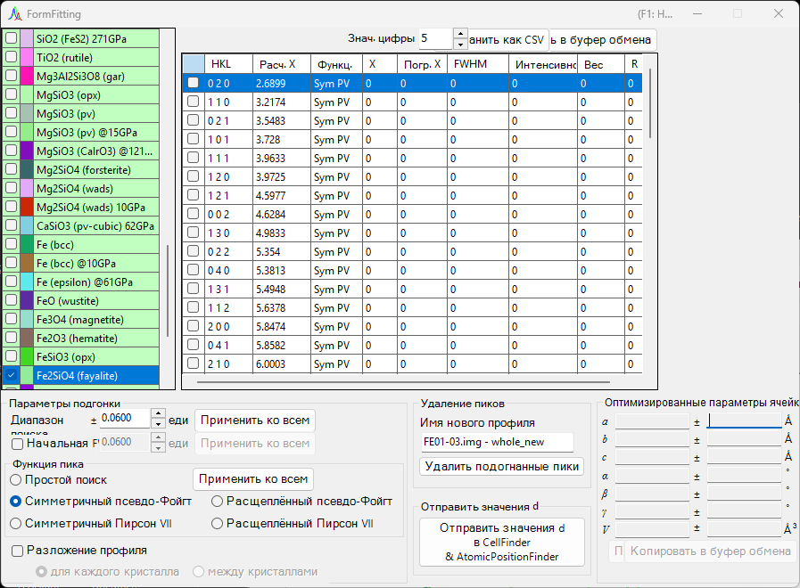
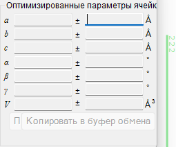
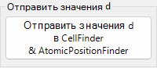
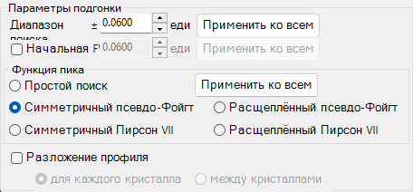
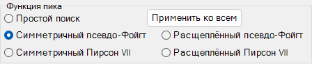
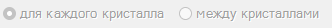
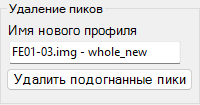
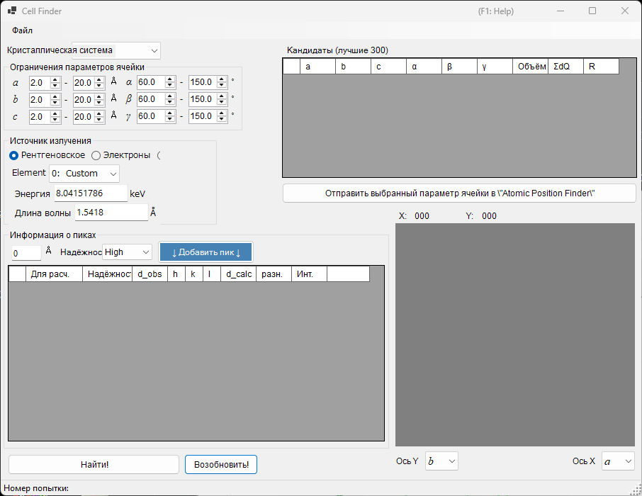
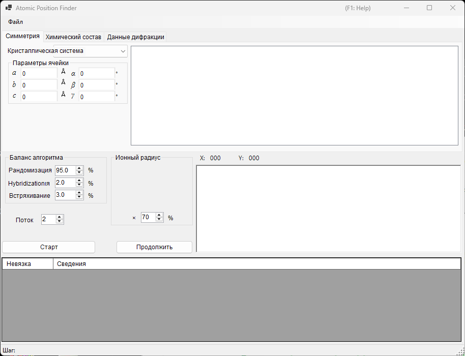

<!-- 260601Cl: migrated from legacy docx + yseto.net web manual -->
# Аппроксимация дифракционных пиков

Инструмент `Fitting diffraction peaks` аппроксимирует пики дифрактограммы подходящей функцией, определяет межплоскостное расстояние (d) из положения каждого пика 2θ и уточняет параметры решётки методом наименьших квадратов. Он запускается с панели инструментов главного окна.

## Базовый порядок работы

1. Выберите нужный кристалл в списке кристаллов (в режиме нескольких профилей также выберите профиль, с которым хотите работать).
2. В главном окне перетащите дифракционные линии мышью так, чтобы они как можно точнее совпали с измеренными пиками.
3. Выберите индексы дифракционных линий, которые нужно аппроксимировать, из списка дифракционных пиков (список с флажками).
4. Как только будет выбрано достаточное число независимых индексов для решения задачи методом наименьших квадратов, в панели `Optimized cell constants` (Оптимизированные параметры ячейки) справа внизу появятся наиболее вероятные параметры решётки с их погрешностями.
5. Нажмите `Apply to the crystal` (Применить к кристаллу), чтобы передать уточнённые параметры решётки обратно в кристалл в основной программе.

!!! note "Отметка и выбор кристалла"
    Список кристаллов отражает список в главном окне. Чтобы аппроксимация вступила в силу, целевой кристалл должен быть одновременно отмечен флажком и выбран.

## Список кристаллов

Список кристаллов в верхнем левом углу содержит те же кристаллы, что и главное окно. Кристалл, который вы отметите и выберете здесь, становится целью аппроксимации. Подробности см. в разделе [Параметры кристалла](3-crystal-parameter.md).

## Список дифракционных пиков

Здесь перечислены дифракционные линии выбранного кристалла. Установка флажка в строке делает эту дифракционную линию целью аппроксимации. Список содержит следующие столбцы.

| Столбец | Содержимое |
| --- | --- |
| `Check` | Включать ли линию в аппроксимацию |
| `PeakColor` | Цвет отображения |
| `Crystal` | Название кристалла |
| `HKL` | Индексы отражения |
| `Calc X` | Расчётное положение дифракционной линии |
| `Func` | Используемая функция пика |
| `X` | Положение пика, полученное аппроксимацией |
| `X Err` | Погрешность положения пика |
| `FWHM` | Полная ширина на половине высоты |
| `Intensity` | Интенсивность пика |
| `Weight` | Вес в аппроксимации методом наименьших квадратов |
| `R` | Показатель невязки аппроксимации |

Кнопки под списком служат для экспорта результатов.

- `Copy to clipborad` (Копировать в буфер обмена): Копирует таблицу в буфер обмена. Её можно вставить прямо в Excel и аналогичные приложения.
- `Save as CSV` (Сохранить как CSV): Сохраняет таблицу в файл `.csv`. `Effective digit` (Знач. цифры) задаёт число десятичных знаков.
- `Clear peaks` (Очистить пики): Очищает результаты аппроксимации.

## Fitting option (Параметры подгонки)

Здесь задаются детальные настройки, используемые при аппроксимации профилей пиков.

### Search Range / Initial FWHM

- `Search Range` (Диапазон поиска): Задаёт диапазон, в котором выполняется аппроксимация. То есть областью аппроксимации для данного пика считается интервал ±Search Range вокруг расчётного положения дифракционной линии.
- `Initial FWHM` (Начальная FWHM): Задаёт начальную полную ширину на половине высоты функции профиля. Используется как начальное значение для сходимости метода наименьших квадратов.

Нажатие `Apply to all` (Применить ко всем) применяет текущие настройки сразу ко всем дифракционным линиям.

### Peak function (Функция пика)

Выбирает функцию пика, используемую при аппроксимации.

| Функция пика | Содержимое |
| --- | --- |
| `Simple Search` (Простой поиск) | Не выполняет аппроксимацию функцией; в качестве положения пика распознаётся наиболее сильная точка в диапазоне ±Search Range вокруг расчётного положения дифракционной линии. |
| `Symmetric Pseudo Voigt` (Симметричный псевдо-Фойгт) | Аппроксимирует симметричной относительно центра функцией псевдо-Фойгта. |
| `Symmetric Pearson VII` (Симметричный Пирсон VII) | Аппроксимирует симметричной относительно центра функцией Пирсона VII. |
| `Split Pseudo Voigt` (Расщеплённый псевдо-Фойгт) | Аппроксимирует асимметричной (расщеплённой) функцией псевдо-Фойгта. |
| `Split Pearson VII` (Расщеплённый Пирсон VII) | Аппроксимирует асимметричной (расщеплённой) функцией Пирсона VII. |

!!! tip "Рекомендуемая функция"
    Если нет особых причин поступать иначе, рекомендуется `Symmetric Pseudo Voigt` (Симметричный псевдо-Фойгт) благодаря её превосходной устойчивости.

Функция псевдо-Фойгта представляет собой линейную комбинацию функции Гаусса \(G(x)\) и функции Лоренца \(L(x)\) с параметром смешения \(\eta\), задаваемую выражением:

$$
\mathrm{pV}(x) = \eta\, L(x) + (1-\eta)\, G(x), \qquad 0 \le \eta \le 1
$$

где \(\eta\) — доля лоренцевой составляющей. Расщеплённая форма описывает асимметричный профиль за счёт того, что такие параметры, как FWHM, задаются независимо слева и справа от положения пика.

### Pattern Decomposition (Разложение профиля)

Когда диапазоны поиска (Search Range) двух или более выбранных дифракционных линий перекрываются, этот параметр определяет, выполнять ли разложение профиля (одновременную аппроксимацию перекрывающихся пиков).

- `in each crystal` (для каждого кристалла): Выполняет разложение профиля независимо для каждого кристалла.
- `between crystals` (между кристаллами): Выполняет разложение профиля по всем кристаллам сразу.

## Optimized cell constants (Оптимизированные параметры ячейки)

Как только выбрано достаточное число независимых индексов для решения задачи методом наименьших квадратов, эта панель отображает наиболее вероятные параметры решётки \(a, b, c, \alpha, \beta, \gamma\) и объём \(V\), каждый со своей погрешностью (`±`).

!!! note "Об отображении NA"
    Когда число степеней свободы недостаточно — то есть когда число степеней свободы равно числу аппроксимированных пиков, либо когда у данного параметра решётки нет степеней свободы, — вместо погрешности отображается `NA`. Выбор достаточного числа независимых отражений позволяет вычислить погрешности.

- `Apply to the crystal` (Применить к кристаллу): Передаёт уточнённые параметры решётки обратно в выбранный кристалл в основной программе.
- `Copy to Clipboard` (Копировать в буфер обмена): Копирует оптимизированные параметры решётки в буфер обмена.
- `Reset take off angle` (Сбросить угол отбора): Сбрасывает угол отбора (take-off angle).

## Remove fitted peaks (Удаление подогнанных пиков)

Эта функция вычитает аппроксимированные пики из профиля и выводит остаточный профиль как новый профиль. Введите имя назначения в поле `New profile name` (Имя нового профиля) и нажмите `Remove fitted peaks` (Удалить подогнанные пики), чтобы выполнить вычитание. Это удобно для проверки фона или разделения перекрывающихся пиков.

## Связанные инструменты (Send d-values)

Нажатие `Send d-values to CellFinder && AtomicPositionFinder` (Отправить значения d в CellFinder && AtomicPositionFinder) отправляет значения d, полученные при аппроксимации, в следующие инструменты анализа, которые также можно запустить с панели инструментов.

### Cell Finder

`Cell Finder` выполняет поиск элементарной ячейки (параметров решётки), объясняющей набор измеренных положений пиков (список значений d), путём обратного расчёта от этих положений. Используется для индицирования неизвестных образцов.

### Atomic Position Finder

`Atomic Position Finder` выполняет поиск атомных позиций в кристаллической структуре по таким величинам, как интенсивности наблюдаемых отражений.

!!! tip "Идентификация неизвестного образца"
    Определив параметры решётки с помощью `Cell Finder`, зарегистрируйте этот кристалл в списке кристаллов, после чего можно будет дополнительно уточнить параметры решётки с помощью аппроксимации методом наименьших квадратов в этом инструменте.
