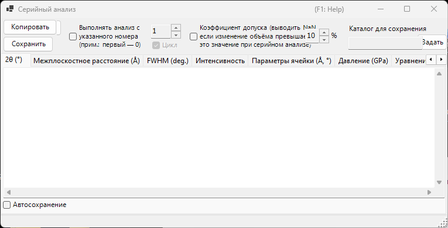
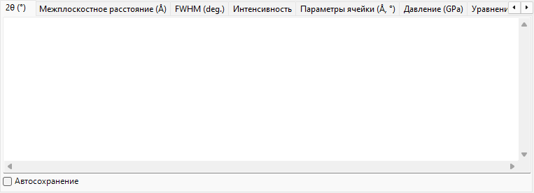
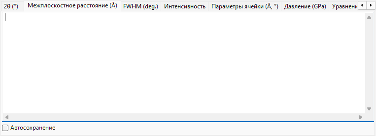
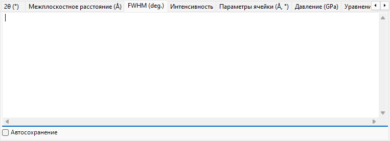
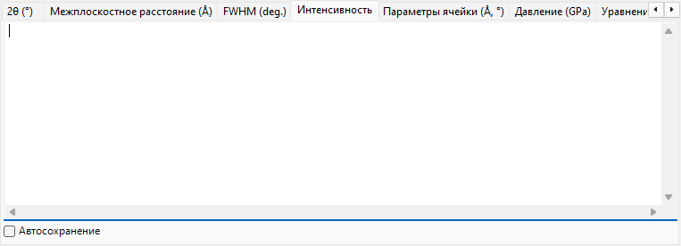
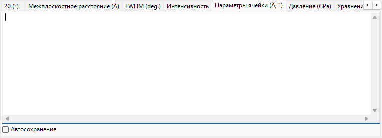
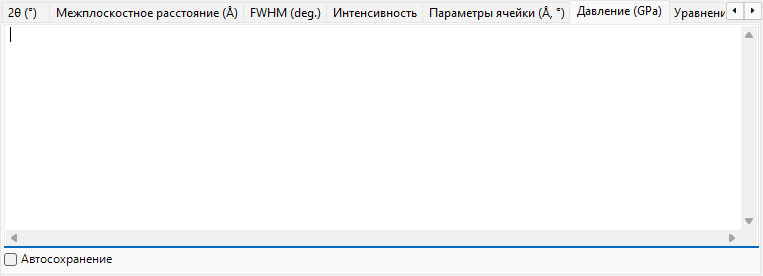
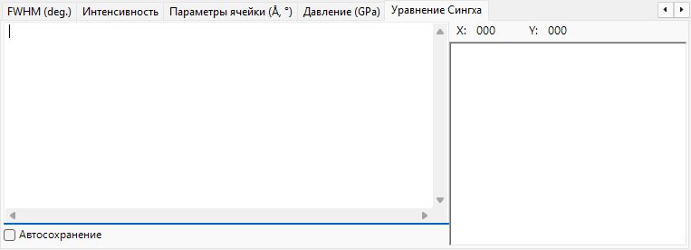

<!-- 260601Cl: migrated from legacy docx + yseto.net web manual -->
# Последовательный анализ

`Sequential Analysis` (последовательный анализ) выполняет одну и ту же аппроксимацию пиков последовательно для множества загруженных профилей и собирает результаты по величинам. Он предназначен для серии профилей, полученных при изменении такого условия, как температура, давление или время: он обрабатывает всю серию за один проход и сводит на своей вкладке результаты 2θ, межплоскостного расстояния (d), полуширины (FWHM), интенсивности, параметров ячейки, давления и уравнения Сингха (анализ одноосного напряжения / деформации решётки) для каждой дифракционной линии.

Используйте кнопку `Sequential Analysis` на панели инструментов главного окна, чтобы открыть и закрыть это окно.

!!! note "Общее с [аппроксимацией дифракционных пиков](6-fitting-diffraction-peaks.md)"
    Последовательный анализ использует те же настройки аппроксимации, что и окно `Fitting diffraction peaks`. Сначала откройте окно `Fitting diffraction peaks`, выберите целевой кристалл и отметьте дифракционные линии (пики), которые нужно аппроксимировать. Если это не подготовлено при нажатии `Выполнить`, появится сообщение с указанием сделать это.

## Базовый порядок работы

1. Загрузите всю серию профилей, измеренных при изменяющемся условии (требуется не менее четырёх профилей).
2. Откройте окно [аппроксимации дифракционных пиков](6-fitting-diffraction-peaks.md), выберите целевой кристалл и отметьте дифракционные линии, которые нужно проанализировать. Функция аппроксимации и диапазон поиска, заданные там, используются повторно в последовательном анализе.
3. При необходимости задайте начальный номер, цикл, коэффициент допуска и параметры автосохранения (см. ниже).
4. Нажмите `Выполнить`. Каждый загруженный профиль поочерёдно активируется, выполняется аппроксимация методом наименьших квадратов, и результаты накапливаются на каждой вкладке.
5. Просмотрите каждую вкладку и перенесите данные в электронную таблицу (Excel и т. п.) с помощью `Копировать` или `Сохранить`.

Ход выполнения и затраченное время отображаются в строке состояния внизу окна в виде `... % completed.  Elapsed time: ... sec`. По завершении анализа результаты 2θ, d-spacing, FWHM и интенсивности вместе копируются в буфер обмена.

!!! tip "Две аппроксимации на профиль"
    Для получения устойчивой сходимости аппроксимация методом наименьших квадратов выполняется дважды для каждого профиля, прежде чем результат будет записан.

## Параметры анализа

Элементы управления вокруг кнопки `Выполнить` определяют диапазон анализа и обработку выбросов.

| Параметр | Описание |
| --- | --- |
| `Выполнять анализ с указанного номера (прим.: первый — 0)` | Если отмечено, анализ начинается с номера профиля, заданного в поле справа, а не с первого профиля. Первый профиль имеет номер 0. |
| `Цикл` | При старте с номера также обрабатывать пропущенные более ранние профили (0 … начало − 1) после достижения конца, с переходом по кругу, чтобы была проанализирована вся серия. Доступно только при включённом начальном номере. |
| `Коэффициент допуска (выводить NaN, если изменение объёма превышает это значение при серийном анализе)` | Если отмечено, отбраковывать аппроксимацию (выводить `NaN` для этой строки), когда уточнённый объём ячейки изменяется от начального значения более чем на значение (в %) справа. Это автоматически отбрасывает выбросы, вызванные неудачной аппроксимацией. |

## Вкладки вывода

Каждая вкладка представляет собой таблицу для одной выходной величины. Каждая строка соответствует одному профилю (имени профиля), а каждый столбец — выбранной дифракционной линии (индекс hkl, либо `Peak No.` для гибкого кристалла). Таблицы хранятся как текст с разделением табуляцией и преобразуются в значения, разделённые запятыми (CSV), при выполнении `Копировать` или `Сохранить`.

### 2θ (°)

Подобранное положение пика в 2θ (градусах) для каждого профиля и каждой дифракционной линии.

### Межплоскостное расстояние (Å)

Межплоскостное расстояние d, в Å, вычисленное из каждого положения пика. Оно получается из длины волны и 2θ по формуле \( d = \dfrac{\lambda}{2\sin\theta} \).

### FWHM (град.)

Полная ширина на полувысоте (FWHM) каждого пика, в градусах 2θ, позволяющая отслеживать изменение ширины пиков.

### Интенсивность

Интегральная интенсивность (площадь) каждого пика, полезная для отслеживания изменений интенсивности, сопровождающих фазовые переходы или изменения текстуры.

### Параметры ячейки (Å, °)

Уточнённый объём элементарной ячейки `V`, рёбра ячейки `A`, `B`, `C` (Å), осевые углы `Alpha`, `Beta`, `Gamma` (°) и оценка погрешности каждого из них (столбцы `_err`) для каждого профиля.

### Давление (GPa)

Давление, полученное из параметров ячейки каждого профиля с использованием [уравнения состояния](5-equation-of-states.md). Когда в окне `Equation of State` выбран эталонный материал давления, такой как Gold, Pt, NaCl (B1/B2), MgO, Corundum, Ar, Re, Mo или Pb, появляется по одному столбцу на каждого исследователя (на каждую опубликованную шкалу). Если эталон не выбран, давление вычисляется по уравнению состояния, назначенному целевому кристаллу.

### Уравнение Сингха

Результаты анализа одноосного напряжения / деформации решётки по уравнению Сингха. Конечное число в имени каждого профиля интерпретируется как азимутальный угол \( \psi \) (в градусах), и для каждого отражения зависимость азимута от d аппроксимируется методом наименьших квадратов (Левенберга — Марквардта). Для каждого отражения при этом получаются свободное от напряжений межплоскостное расстояние `d0`, азимут максимальной деформации `Ψmax` и величина, пропорциональная напряжению, `t/6Ghkl` (отношение разностного напряжения \( t \) к модулю сдвига \( G_{hkl} \)). Подобранные кривые также отображаются на графике на вкладке.

!!! note "Когда применяется уравнение Сингха"
    Эта вкладка работает с серией в «режиме анализа напряжений», имена профилей в которой заканчиваются на `...-whole`. Каждое имя профиля должно нести азимутальный угол в качестве конечного токена (например, `...-30`). Для обычной серии эта вкладка не обновляется.

Азимутально зависимое межплоскостное расстояние, выражаемое уравнением Сингха, приближённо задаётся как

$$ d(\psi) = d_0 \left[ 1 + \alpha - 3\,\alpha \left( 1 - \frac{\lambda^2}{4 d^2} \right) \cos^2(\psi - \psi_{\max}) \right] $$

где \( \alpha \) соответствует `t/6Ghkl`, а \( \psi_{\max} \) — азимут максимальной деформации.

## Экспорт результатов

| Действие | Описание |
| --- | --- |
| `Копировать` | Скопировать текущую отображаемую вкладку в буфер обмена как CSV (с разделением запятыми). |
| `Сохранить` | Сохранить текущую отображаемую вкладку как файл CSV (имя файла выбирается в диалоговом окне). |

### Автосохранение

Каждая вкладка имеет флажок `Автосохранение`, благодаря которому соответствующая величина автоматически записывается в файл CSV после `Выполнить`. Место назначения показано в поле `Каталог для сохранения` и выбирается кнопкой `Задать`. Имя файла формируется из общей части имён профилей с суффиксом для каждой величины: `_2theta.csv`, `_d.csv`, `_fwhm.csv`, `_intensity.csv`, `_cell.csv`, `_pressure.csv` или `_Singh.csv`.

!!! tip "Настройка папки назначения"
    Если автосохранение отмечено, но папка назначения не задана (не существует), при нажатии `Выполнить` открывается диалог выбора папки.

## Использование из макроса

Каждый результат последовательного анализа также доступен из макроса (скрипта Python). Они соответствуют классу `PDI.Sequential` в разделе [Макрос](8-macro.md).

| Функция макроса | Соответствующая вкладка |
| --- | --- |
| `PDI.Sequential.Open()` / `Close()` | Открыть / закрыть окно |
| `PDI.Sequential.Execute()` | Выполнить последовательный анализ |
| `PDI.Sequential.GetCSV_2theta()` | 2θ |
| `PDI.Sequential.GetCSV_D()` | Межплоскостное расстояние |
| `PDI.Sequential.GetCSV_FWHM()` | FWHM |
| `PDI.Sequential.GetCSV_Intensity()` | Интенсивность |
| `PDI.Sequential.GetCSV_CellConstants()` | Параметры ячейки |
| `PDI.Sequential.GetCSV_Pressure()` | Давление |
| `PDI.Sequential.GetCSV_Singh()` | Уравнение Сингха |

Каждая функция `GetCSV_...()` возвращает соответствующую вкладку в виде строки CSV. `PDI.Sequential.Directory` получает/задаёт папку назначения, а в сочетании с `PDI.File.SaveText(...)` позволяет записывать результаты в файлы. См. раздел [Макрос](8-macro.md) для подробностей.
