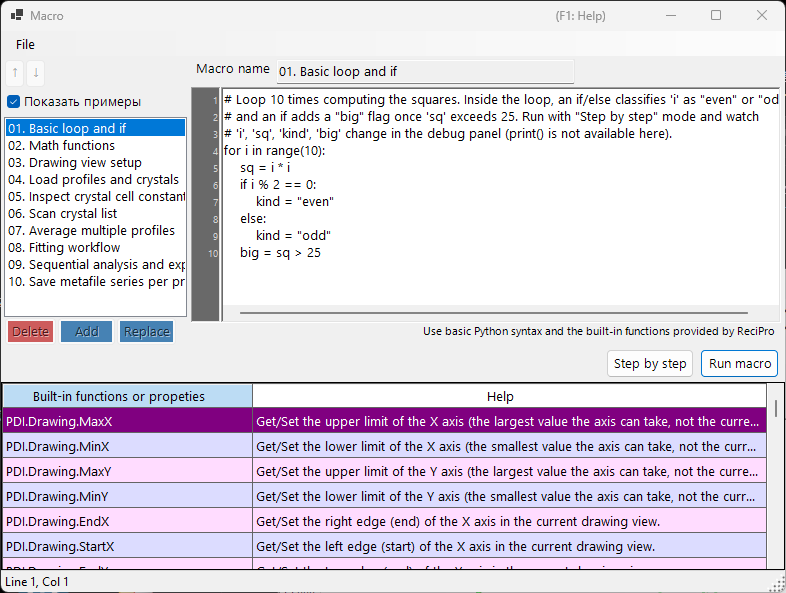

<!-- 260601Cl: migrated from legacy docx + yseto.net web manual -->
# Макрос

Большинство операций в PDIndexer можно автоматизировать с помощью функции **Макрос**. Макросы — это скрипты Python, написанные на [IronPython](https://ironpython.net/) (реализация Python, работающая на .NET), которые редактируются и выполняются в специальном окне редактора макросов. Используйте их для автоматизации повторяющихся задач, пакетной обработки нескольких файлов и массового экспорта результатов в CSV или файлы изображений.



!!! note "Базовые знания Python"
    Макросы напрямую принимают стандартный синтаксис Python (циклы `for`, `if`/`else`, списки, функции и т. д.). На этой странице не рассматривается сам язык Python. Специфичные для PDIndexer функции вызываются через объект `PDI`, описанный ниже.

## Открытие редактора макросов

В строке меню главного окна выберите **Макрос → Редактор**, чтобы открыть окно редактора макросов (с заголовком `Macro`).

Макросы, созданные и сохранённые в редакторе, также отображаются по имени в меню **Макрос**, поэтому их можно запускать прямо из меню. Список макросов автоматически сохраняется при выходе из PDIndexer и восстанавливается при следующем запуске.

## Структура окна редактора

Окно редактора состоит из следующих частей.

| Часть | Описание |
| --- | --- |
| Список макросов (слева) | Список имён сохранённых макросов. Щёлкните по элементу, чтобы загрузить этот макрос в редактор справа. |
| Редактор кода (по центру) | Область для ввода скрипта Python. Поддерживает область с номерами строк, автоотступ, автодополнение ввода и всплывающие подсказки для функций. |
| Таблица справочника функций | Таблица всех функций, доступных под `PDI`. Двойной щелчок по ячейке вставляет имя этой функции в код в позиции курсора. |
| Панель отладки (справа) | Отображает имена переменных и их значения в текущей точке при пошаговом выполнении. |
| Строка состояния | Показывает текущую позицию курсора (`Line` / `Col`). |

### Кнопки управления списком

Для редактирования списка макросов используйте следующие кнопки.

| Кнопка | Действие |
| --- | --- |
| `Add` | Добавляет текущий код в список под именем, введённым в поле имени (запрашивает подтверждение перезаписи, если такое имя уже существует). |
| `Replace` | Заменяет выбранный в списке макрос текущим кодом. |
| `Delete` | Удаляет выбранный макрос из списка. |
| `↑` / `↓` | Перемещает выбранный макрос вверх или вниз по списку. |
| `Show samples` | Переключает отображение встроенных примеров макросов (см. ниже). |

!!! tip "Сохранение и загрузка"
    Макросы можно сохранять в отдельные файлы `.mcr` и загружать из них. Перетащите файл `.mcr` в окно редактора, чтобы загрузить его содержимое. Нажатие `Ctrl+S` после редактирования перезаписывает текущий выбранный макрос.

## Запуск макроса

Запускайте макрос с помощью кнопок в нижней части редактора кода.

| Кнопка | Действие |
| --- | --- |
| `Run macro` | Запускает макрос целиком в обычном режиме. |
| `Step by step` | Выполняет макрос по одной строке за раз. Останавливается перед каждой строкой и показывает текущие значения переменных на панели отладки справа. |
| `Next step (F10)` | Переходит к следующей строке при пошаговом выполнении (клавиша `F10` тоже работает). |
| `Stop` | Прерывает выполнение. Прерывание действует только во время выполнения `Step by step`. |

!!! warning "print() недоступен"
    В редакторе макросов нет консоли стандартного вывода, поэтому вывод `print()` не отображается. Чтобы проверить значения переменных, запустите макрос в режиме `Step by step` и наблюдайте за изменением значений на панели отладки.

### Примеры макросов

Установив флажок `Show samples`, вы отобразите в списке встроенные примеры макросов (только для чтения). Примеры отображаются на текущем языке интерфейса (английском/японском). Используйте их как справочный материал при написании собственных макросов. Встроенные примеры:

| Название | Содержание |
| --- | --- |
| 01. Basic loop and if | Основы циклов `for` и `if`/`else` |
| 02. Math functions | Использование модуля `math` (`pi`, `sin`, `sqrt`, `exp`, `log` и т. д.) |
| 03. Drawing view setup | Настройка диапазона отображения с помощью `PDI.Drawing.SetBounds` |
| 04. Load profiles and crystals | `PDI.File.ReadProfiles` / `ReadCrystals` |
| 05. Inspect crystal cell constants | Чтение параметров ячейки, объёма и давления через `PDI.Crystal` |
| 06. Scan crystal list | Перебор всех элементов `PDI.CrystalList` |
| 07. Average multiple profiles | `PDI.ProfileOperator.Average` |
| 08. Fitting workflow | Полная последовательность `PDI.Fitting` |
| 09. Sequential analysis and export | Запуск `PDI.Sequential` и экспорт CSV |
| 10. Save metafile series per profile | Массовое сохранение по одному EMF на профиль |

!!! note "Модуль math импортируется заранее"
    Команда `import math` выполняется автоматически при запуске редактора, поэтому вы можете напрямую использовать модуль `math`, например `math.sqrt(2)`, без явной инструкции `import`.

---

## Справочник функций

Все специфичные для PDIndexer функции вызываются через классы под корневым объектом `PDI`. `PDI` уже доступен в области видимости макроса, поэтому `import` не требуется.

Каждая таблица ниже составлена на основе атрибутов `[Help]` в исходном коде. Тот же список приведён в таблице справочника функций внутри окна редактора, а также в [разделе 6 веб-руководства](https://yseto.net/soft/pdi/pdi_06).

!!! note "Обозначения"
    В столбце сигнатуры `(get/set)` обозначает свойство для чтения и записи, а `(get)` — свойство только для чтения. Аргумент с `= значение` является аргументом по умолчанию и может быть опущен.

### PDI (корень)

| Член | Сигнатура | Описание |
| --- | --- | --- |
| `Sleep` | `Sleep(int millisec)` | Приостанавливает выполнение макроса на заданное число миллисекунд. |
| `Obj` | `Obj (get/set)` | Получает/задаёт объекты, переданные из другой программы (межпроцессные аргументы). |

### PDI.File — ввод-вывод файлов

| Член | Сигнатура | Описание |
| --- | --- | --- |
| `GetDirectoryPath` | `GetDirectoryPath(string filename = "")` | Возвращает путь к каталогу (с завершающим обратным слэшем). Если `filename` опущен, открывается диалог выбора папки. В противном случае возвращается часть пути `filename`, относящаяся к каталогу. |
| `GetFileName` | `GetFileName()` | Открывает диалог выбора файла и возвращает полный путь к выбранному файлу. Возвращает пустую строку, если пользователь отменил выбор. |
| `GetFileNames` | `GetFileNames()` | Открывает диалог выбора нескольких файлов и возвращает полные пути к выбранным файлам. Возвращает пустой массив, если пользователь отменил выбор. |
| `ReadProfiles` | `ReadProfiles(string filename)` | Считывает данные профиля из указанного файла. Если `filename` опущен (или файл не существует), откроется диалог выбора файла. |
| `SaveProfiles` | `SaveProfiles(string filename)` | Сохраняет данные профиля в указанный файл. Если `filename` опущен, откроется диалог сохранения. |
| `ReadCrystals` | `ReadCrystals(string filename)` | Считывает данные кристалла из указанного файла. Если `filename` опущен (или файл не существует), откроется диалог выбора файла. |
| `SaveCrystals` | `SaveCrystals(string filename)` | Сохраняет данные кристалла в указанный файл. Если `filename` опущен, откроется диалог сохранения. |
| `SaveMetafile` | `SaveMetafile(string filename)` | Сохраняет текущую дифрактограмму как Windows Metafile (`.emf`). Если `filename` опущен, откроется диалог сохранения. |
| `SaveText` | `SaveText(string text, string filename)` | Сохраняет заданное текстовое содержимое в файл `.txt`. Если `filename` опущен, откроется диалог сохранения. |

### PDI.Drawing — область отображения

| Член | Сигнатура | Описание |
| --- | --- | --- |
| `MaxX` | `MaxX (get/set)` | Получает/задаёт верхний предел оси X (наибольшее значение, которое может принимать ось, а не текущий диапазон отображения). |
| `MinX` | `MinX (get/set)` | Получает/задаёт нижний предел оси X (наименьшее значение, которое может принимать ось, а не текущий диапазон отображения). |
| `MaxY` | `MaxY (get/set)` | Получает/задаёт верхний предел оси Y (наибольшее значение, которое может принимать ось, а не текущий диапазон отображения). |
| `MinY` | `MinY (get/set)` | Получает/задаёт нижний предел оси Y (наименьшее значение, которое может принимать ось, а не текущий диапазон отображения). |
| `EndX` | `EndX (get/set)` | Получает/задаёт правую границу (конец) оси X в текущем диапазоне отображения. |
| `StartX` | `StartX (get/set)` | Получает/задаёт левую границу (начало) оси X в текущем диапазоне отображения. |
| `EndY` | `EndY (get/set)` | Получает/задаёт верхнюю границу (конец) оси Y в текущем диапазоне отображения. |
| `StartY` | `StartY (get/set)` | Получает/задаёт нижнюю границу (начало) оси Y в текущем диапазоне отображения. |
| `SetBounds` | `SetBounds(double startX, double endX, double startY, double endY)` | Задаёт диапазон отображения, указывая четыре границы (StartX, EndX, StartY, EndY). |

### PDI.Crystal — выбранный кристалл

Параметры ячейки `CellA`–`CellC` измеряются в \( \mathrm{\AA} \), а `CellAlpha`–`CellGamma` — в градусах (deg).

| Член | Сигнатура | Описание |
| --- | --- | --- |
| `CellVolume` | `CellVolume (get)` | Получает объём ячейки (\( \mathrm{\AA}^3 \)) выбранного кристалла. Возвращает 0, если кристалл не выбран. |
| `Pressure` | `Pressure(double volume = 0)` | Получает давление (ГПа) выбранного кристалла, вычисленное по его уравнению состояния. Если `volume` равен 0 (значение по умолчанию), используется текущий объём ячейки. |
| `Name` | `Name (get/set)` | Получает/задаёт имя выбранного кристалла. |
| `CellA` | `CellA (get/set)` | Получает/задаёт параметр ячейки a (\( \mathrm{\AA} \)) выбранного кристалла. |
| `CellB` | `CellB (get/set)` | Получает/задаёт параметр ячейки b (\( \mathrm{\AA} \)) выбранного кристалла. |
| `CellC` | `CellC (get/set)` | Получает/задаёт параметр ячейки c (\( \mathrm{\AA} \)) выбранного кристалла. |
| `CellAlpha` | `CellAlpha (get/set)` | Получает/задаёт параметр ячейки alpha (deg) выбранного кристалла. |
| `CellBeta` | `CellBeta (get/set)` | Получает/задаёт параметр ячейки beta (deg) выбранного кристалла. |
| `CellGamma` | `CellGamma (get/set)` | Получает/задаёт параметр ячейки gamma (deg) выбранного кристалла. |

### PDI.CrystalList — список кристаллов

| Член | Сигнатура | Описание |
| --- | --- | --- |
| `Open` | `Open()` | Открывает окно «Список кристаллов». |
| `Close` | `Close()` | Закрывает окно «Список кристаллов». |
| `Count` | `Count (get)` | Получает общее число кристаллов в списке. |
| `SelectedName` | `SelectedName (get)` | Получает имя текущего выбранного кристалла. Возвращает пустую строку, если кристалл не выбран. |
| `SelectedIndex` | `SelectedIndex (get/set)` | Получает/задаёт индекс текущего выбранного кристалла. |
| `Select` | `Select(int index)` | Выбирает кристалл с заданным индексом. |
| `Check` | `Check(int index = -1, bool state = true)` | Устанавливает или снимает флажок кристалла с заданным индексом. Если `index` равен -1, применяется к текущему выбранному кристаллу. |
| `Uncheck` | `Uncheck(int index = -1)` | Снимает флажок кристалла с заданным индексом. Если `index` равен -1, флажок будет снят у текущего выбранного кристалла. |
| `GetCellVolume` | `GetCellVolume (get)` | Получает объём ячейки (\( \mathrm{\AA}^3 \)) выбранного кристалла. То же самое, что `PDI.Crystal.CellVolume`; сохранено для обратной совместимости. |

### PDI.Profile — выбранный профиль

| Член | Сигнатура | Описание |
| --- | --- | --- |
| `Comment` | `Comment (get/set)` | Получает/задаёт текст комментария текущего выбранного профиля. |
| `Name` | `Name (get/set)` | Получает/задаёт отображаемое имя текущего выбранного профиля. |

### PDI.ProfileOperator — арифметика профилей

Каждый профиль задаётся своим индексом в списке. `output` — это имя, присваиваемое результирующему профилю.

| Член | Сигнатура | Описание |
| --- | --- | --- |
| `Average` | `Average(int[] indices, string output)` | Вычисляет среднее значение профилей, индексы которых перечислены в `indices` (например, `[1,3,5,9]`). `output` — это имя, присваиваемое результирующему профилю. |
| `AddTwoProfiles` | `AddTwoProfiles(int index1, int index2, string output)` | Вычисляет profile1 + profile2. Каждый профиль задаётся своим индексом. `output` — это имя, присваиваемое результирующему профилю. |
| `SubtractTwoProfiles` | `SubtractTwoProfiles(int index1, int index2, string output)` | Вычисляет profile1 − profile2. Каждый профиль задаётся своим индексом. `output` — это имя, присваиваемое результирующему профилю. |
| `MultiplyTwoProfiles` | `MultiplyTwoProfiles(int index1, int index2, string output)` | Вычисляет profile1 × profile2. Каждый профиль задаётся своим индексом. `output` — это имя, присваиваемое результирующему профилю. |
| `DivideTwoProfiles` | `DivideTwoProfiles(int index1, int index2, string output)` | Вычисляет profile1 ÷ profile2. Каждый профиль задаётся своим индексом. `output` — это имя, присваиваемое результирующему профилю. |

### PDI.ProfileList — список профилей

| Член | Сигнатура | Описание |
| --- | --- | --- |
| `Open` | `Open()` | Открывает окно «Список профилей». |
| `Close` | `Close()` | Закрывает окно «Список профилей». |
| `DeleteAll` | `DeleteAll()` | Удаляет все профили из списка (без диалога подтверждения). |
| `Delete` | `Delete(int index)` | Удаляет профиль с заданным индексом. |
| `Count` | `Count (get)` | Получает общее число профилей в списке. |
| `SelectedName` | `SelectedName (get)` | Получает имя текущего выбранного профиля. Возвращает пустую строку, если профиль не выбран. |
| `SelectedIndex` | `SelectedIndex (get/set)` | Получает/задаёт индекс текущего выбранного профиля. |
| `Select` | `Select(int index)` | Выбирает профиль с заданным индексом. |
| `Check` | `Check(int index = -1, bool state = true)` | Устанавливает или снимает флажок профиля с заданным индексом. Если `index` равен -1, применяется к текущему выбранному профилю. |
| `Uncheck` | `Uncheck(int index = -1)` | Снимает флажок профиля с заданным индексом. Если `index` равен -1, флажок будет снят у текущего выбранного профиля. |
| `CheckAll` | `CheckAll()` | Устанавливает флажки у всех профилей в списке. |
| `UncheckAll` | `UncheckAll()` | Снимает флажки у всех профилей в списке. |

### PDI.Fitting — аппроксимация пиков

Управляет окном [Аппроксимация дифракционных пиков](6-fitting-diffraction-peaks.md).

| Член | Сигнатура | Описание |
| --- | --- | --- |
| `Open` | `Open()` | Открывает окно «Аппроксимация пиков». |
| `Close` | `Close()` | Закрывает окно «Аппроксимация пиков». |
| `Apply` | `Apply()` | Применяет оптимизированные параметры ячейки к выбранному кристаллу (эквивалентно нажатию кнопки `Confirm` в окне аппроксимации). |
| `Check` | `Check(int index = -1, bool state = true)` | Устанавливает или снимает флажок кристаллографической плоскости с заданным индексом. Если `index` равен -1, применяется к текущей выбранной плоскости. |
| `Uncheck` | `Uncheck(int index = -1)` | Снимает флажок кристаллографической плоскости с заданным индексом. Если `index` равен -1, флажок будет снят у текущей выбранной плоскости. |
| `Select` | `Select(int index)` | Выбирает кристаллографическую плоскость с заданным индексом. |
| `SelectedIndex` | `SelectedIndex (get/set)` | Получает/задаёт индекс текущей выбранной кристаллографической плоскости. |
| `Range` | `Range(double range)` | Задаёт диапазон поиска пика для текущей выбранной кристаллографической плоскости (в тех же единицах, что и ось X). |

### PDI.Sequential — последовательный анализ

Управляет окном [Последовательный анализ](7-sequential-analysis.md). Геттеры CSV возвращают результаты последнего выполненного последовательного анализа в виде строки CSV.

| Член | Сигнатура | Описание |
| --- | --- | --- |
| `Directory` | `Directory (get/set)` | Получает/задаёт полный путь к каталогу, в который сохраняются результаты последовательного анализа. |
| `Open` | `Open()` | Открывает окно «Последовательный анализ». |
| `Close` | `Close()` | Закрывает окно «Последовательный анализ». |
| `Execute` | `Execute()` | Выполняет последовательный анализ для всех отмеченных профилей. |
| `GetCSV_2theta` | `GetCSV_2theta()` | Получает результаты 2θ последнего последовательного анализа в виде строки CSV. |
| `GetCSV_D` | `GetCSV_D()` | Получает результаты межплоскостного расстояния (d) последнего последовательного анализа в виде строки CSV. |
| `GetCSV_FWHM` | `GetCSV_FWHM()` | Получает результаты полной ширины на полувысоте (FWHM) последнего последовательного анализа в виде строки CSV. |
| `GetCSV_Intensity` | `GetCSV_Intensity()` | Получает результаты интенсивности пиков последнего последовательного анализа в виде строки CSV. |
| `GetCSV_CellConstants` | `GetCSV_CellConstants()` | Получает результаты параметров ячейки последнего последовательного анализа в виде строки CSV. |
| `GetCSV_Pressure` | `GetCSV_Pressure()` | Получает результаты давления последнего последовательного анализа в виде строки CSV. |
| `GetCSV_Singh` | `GetCSV_Singh()` | Получает результаты уравнения Сингха последнего последовательного анализа в виде строки CSV. |
| `AutoSave2theta` | `AutoSave2theta (get/set)` | Получает/задаёт, сохраняются ли результаты 2θ автоматически после каждого запуска последовательного анализа. |
| `AutoSaveDspacing` | `AutoSaveDspacing (get/set)` | Получает/задаёт, сохраняются ли результаты межплоскостного расстояния (d) автоматически после каждого запуска последовательного анализа. |
| `AutoSaveFWHM` | `AutoSaveFWHM (get/set)` | Получает/задаёт, сохраняются ли результаты FWHM автоматически после каждого запуска последовательного анализа. |
| `AutoSaveIntensity` | `AutoSaveIntensity (get/set)` | Получает/задаёт, сохраняются ли результаты интенсивности пиков автоматически после каждого запуска последовательного анализа. |
| `AutoSaveCellConstants` | `AutoSaveCellConstants (get/set)` | Получает/задаёт, сохраняются ли результаты параметров ячейки автоматически после каждого запуска последовательного анализа. |
| `AutoSavePressure` | `AutoSavePressure (get/set)` | Получает/задаёт, сохраняются ли результаты давления автоматически после каждого запуска последовательного анализа. |
| `AutoSaveSingh` | `AutoSaveSingh (get/set)` | Получает/задаёт, сохраняются ли результаты уравнения Сингха автоматически после каждого запуска последовательного анализа. |

## Пример макроса

В качестве одного из встроенных примеров приведён макрос, который запускает последовательный анализ и сохраняет результаты в CSV.

```python
# Check all profiles, run sequential analysis, then obtain 2-theta / d-spacing /
# cell-constant / pressure results as CSV strings and save each to a file.
PDI.ProfileList.CheckAll()
PDI.Sequential.Open()
PDI.Sequential.Execute()
dir_path = PDI.File.GetDirectoryPath()
PDI.File.SaveText(PDI.Sequential.GetCSV_2theta(),        dir_path + "seq_2theta.csv")
PDI.File.SaveText(PDI.Sequential.GetCSV_D(),             dir_path + "seq_d.csv")
PDI.File.SaveText(PDI.Sequential.GetCSV_CellConstants(), dir_path + "seq_cell.csv")
PDI.File.SaveText(PDI.Sequential.GetCSV_Pressure(),      dir_path + "seq_pressure.csv")
```

Остальные примеры можно просмотреть с помощью кнопки `Show samples` в редакторе.
