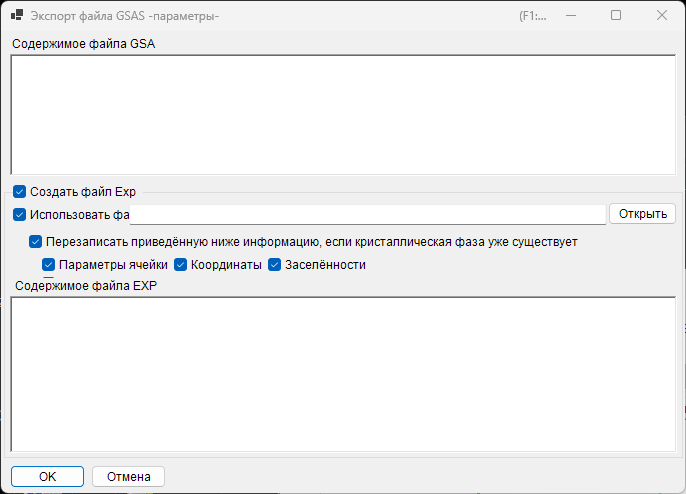

<!-- 260601Cl: migrated from legacy docx + yseto.net web manual -->
# Форматы файлов

Файлы, которые читает и записывает PDIndexer, делятся на три группы: **данные профиля**, **списки кристаллов / кристаллические структуры** и **вывод рисования**. Все эти операции ввода-вывода доступны из меню **File** [главного окна](../1-main-window.md).

На этой странице в виде таблиц перечислены поддерживаемые расширения, направление ввода-вывода и примечания.

---

## Данные профиля

### Чтение (Read profile(s))

**File → Read profile(s)** позволяет загрузить сразу несколько файлов. Помимо собственного формата PDIndexer `pdi` / `pdi2`, поддерживается ряд текстовых и бинарных форматов угол-интенсивность (или энергия-интенсивность), таких как `csv` от WinPIP, `chi` от Fit2D и `ras` от Rigaku. Даже форматы, не перечисленные ниже, обычно удаётся прочитать: любой обычный текстовый файл угол-интенсивность обрабатывается универсальным парсером.

| Расширение | Происхождение / формат | Примечания |
| --- | --- | --- |
| `pdi` / `pdi2` | Собственный формат PDIndexer | Хранит профиль вместе с сопутствующей информацией (источник излучения, длина волны, время экспозиции и т.д.). `pdi2` — текущая версия. При чтении этих файлов диалог Data Converter не отображается. |
| `csv` | Вывод WinPIP (через запятую: `angle,intensity`) | Импортируется через диалог Data Converter, где задаётся смысл горизонтальной оси, источник излучения и длина волны. |
| `tsv` | С разделителем-табуляцией (`angle` `[TAB]` `intensity`) | Импортируется как обычный текст. |
| `chi` | Вывод Fit2D | Начальные строки заголовка пропускаются; в качестве угла и интенсивности берутся 2-й и 4-й столбцы четырёхколоночных данных. |
| `ras` | Формат Rigaku | Текстовый формат, содержащий также информацию об оборудовании. |
| `nxs` | NeXus / HDF5 (SSD, несколько детекторов) | Может содержать несколько каналов (гистограмм); каждый калибруется по энергии и импортируется отдельно. |
| `npd` | Профиль EDX (SSD) | Из заголовка считываются `EGC0/1/2`, `2Theta`, `Live time` и т.д., номер канала преобразуется в энергию. |
| `xbm` | Бинарный формат EDX (например, SP-8 BL04B2) | Метаданные — имя образца, условия измерения, коэффициенты калибровки EGC — импортируются как комментарий. |
| `rpt` | Формат Genie (SSD) | Из заголовка считываются угол выхода, время экспозиции и EGC. |
| `xy` | Двухколоночный текст, калиброванный pyFAI | Длина волны считывается из заголовка, импортируются угол и интенсивность. |
| `gsa` | Данные GSAS (блок `BANK`) | Импортируются три столбца: угол, интенсивность, погрешность. |
| Прочие | Универсальный текст угол-интенсивность | Разделитель (запятая / пробел / табуляция) определяется автоматически (через диалог Data Converter). |

!!! note "Загрузка нескольких файлов сразу"
    Если выбрать и прочитать несколько файлов, то после подтверждения настроек Data Converter для первого файла появится сообщение с вопросом, использовать ли те же настройки для остальных файлов. Выбор **Yes** обрабатывает оставшиеся файлы без показа диалога, что ускоряет загрузку.

### Диалог Data Converter

При чтении любого файла, кроме `pdi` / `pdi2` (`csv`, `chi`, `ras`, `nxs`, `npd`, `xbm`, `rpt`, `xy`, `gsa` и обычного текста), открывается диалог **Конвертер данных**. В нём импортированные числовые столбцы сопоставляются с корректными физическими величинами, используемыми внутри PDIndexer.

В диалоге задаются следующие параметры.

| Параметр | Описание |
| --- | --- |
| Horizontal Axis | Физическая величина (2θ, энергия, межплоскостное расстояние (d), волновое число, TOF и т.д.) и единица измерения, представленные первым импортированным столбцом. |
| Источник излучения / длина волны | Рентгеновское излучение / нейтроны / электроны, а также характеристическая линия рентгеновского излучения (Kα и т.д.) или длина волны. Это определяет пересчёт в межплоскостное расстояние (d) и 2θ. |
| Время экспозиции (на шаг) | Время экспозиции на один шаг в секундах. Используется для отображения CPS и нормализации интенсивности. |
| Для данных SSD | Для данных SSD (EDX), таких как `rpt` / `npd` / `xbm` / `nxs`, задаются коэффициенты \(a_0, a_1, a_2\), преобразующие номер канала \(n\) в энергию \(E\). При наличии нескольких детекторов каждый из них можно включать/выключать и настраивать коэффициенты индивидуально. |
| Low energy cutoff | Если отмечено, точки данных ниже указанной энергии исключаются при импорте. |

Для данных SSD номер канала \(n\) преобразуется в энергию \(E\) (в эВ) по квадратичной калибровочной формуле:

$$
E = a_0 + a_1\,n + a_2\,n^2
$$

При чтении обычного текста (формат «прочие») диалог показывает реальное содержимое файла в текстовом поле, что позволяет задавать горизонтальную ось, источник излучения и другие параметры, одновременно просматривая данные. Разделитель (запятая / пробел / табуляция) и число начальных строк заголовка, которые нужно пропустить, определяются автоматически.

!!! tip "Слежение за буфером обмена / папкой"
    Если включить **Option → Watch Clipboard**, PDIndexer автоматически импортирует профили, скопированные из других приложений, например IPAnalyzer. Если включить **Watch File**, PDIndexer автоматически считывает новые файлы `pdi`, создаваемые в выбранной папке.

### Сохранение и экспорт

**File → Save profile(s)** сохраняет все загруженные профили в собственном формате PDIndexer `pdi2`.

**File → Export the selected profile(s)** записывает выбранный профиль в одном из следующих форматов.

| Расширение / формат | Направление | Примечания |
| --- | --- | --- |
| `pdi2` | Выход | Собственный формат PDIndexer. Сохраняет все профили сразу. |
| `csv` | Выход | С разделителем-запятой (угол, интенсивность). |
| `tsv` | Выход | С разделителем-табуляцией (угол и интенсивность разделены табуляцией). |
| `gsa` (GSAS) | Выход | Формат GSAS для Ритвельдовского анализа. Содержимое можно проверить на экране экспорта ниже. |

#### Экспорт в формате GSAS

При выборе формата GSAS появляется экран экспорта, позволяющий просмотреть записываемое содержимое. Строка 1 — имя профиля, строка 2 — заголовок `BANK 1 … CONST … FXYE`, далее следуют три столбца: угол, интенсивность и погрешность. Погрешность берётся из собственных данных о погрешности профиля, если они есть; в противном случае используется \(\sqrt{\text{intensity}}\).

!!! note "Масштабирование угла"
    Для обычных данных с угловой дисперсией значения угла записываются умноженными на 100 (соглашение `CONST` формата GSAS). Для нейтронных данных TOF значения записываются как есть, без масштабирования.

---

## Списки кристаллов и кристаллические структуры

Списки кристаллов сохраняются и загружаются в виде файлов XML (расширение `xml`). Отдельные кристаллические структуры можно импортировать из CIF / AMC. Подробности см. в разделе [Параметры кристалла](../3-crystal-parameter.md).

| Операция (меню File) | Расширение | Направление | Примечания |
| --- | --- | --- | --- |
| Load crystals (as a new list) (Загрузить кристаллы (как новый список)) | `xml` | Вход | Загружает список кристаллов и заменяет текущий список (текущий список отбрасывается). |
| Load crystals (and add to the present list) (Загрузить кристаллы (и добавить к текущему списку)) | `xml` | Вход | Загружает список кристаллов и добавляет его в конец текущего списка. |
| Save crystals (Сохранить кристаллы) | `xml` | Выход | Сохраняет текущий список кристаллов в файл. |
| Import CIF, AMC... (Импорт CIF, AMC...) | `cif` / `amc` | Вход | Добавляет данные структуры в формате CIF или AMC (AMCSD) в текущий список кристаллов. |
| Export the selected crystal to CIF (Экспортировать выбранный кристалл в CIF) | `cif` | Выход | Сохраняет выбранный кристалл как файл структурных данных CIF. |
| Revert crystals to the initial state (Вернуть кристаллы в исходное состояние) | — | — | Восстанавливает список кристаллов до состояния по умолчанию, установленного при инсталляции. |

---

## Вывод рисования (просмотрщик профилей)

Профиль, отображаемый в данный момент в главном окне, можно скопировать в буфер обмена как изображение или сохранить как векторный метафайл.

| Операция (меню File) | Формат | Направление | Примечания |
| --- | --- | --- | --- |
| Copy to Clipboard (as Bitmap data) (Копировать в буфер обмена как данные Bitmap) | Растр (Bitmap) | Буфер обмена | Копирует содержимое просмотрщика в буфер обмена как растровое изображение. |
| Copy to Clipboard (as Metafile data) (Копировать в буфер обмена как данные Metafile) | Метафайл (вектор) | Буфер обмена | Копирует содержимое просмотрщика в буфер обмена в векторной форме. |
| Save as Metafile (Сохранить как Metafile) | `emf` (EMF) | Выход | Сохраняет в формате EMF (Enhanced Metafile). Поскольку сохраняется векторная и шрифтовая информация, сохранённый `emf` можно открыть в PowerPoint и Word. |

Кроме того, команды **Page Setup**, **Print Preview** и **Print** позволяют напрямую распечатать текущий диапазон угла и интенсивности.
