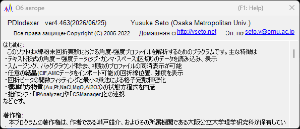

<!-- 260601Cl: migrated from legacy docx + yseto.net web manual -->
# Среда выполнения и установка

На этой странице описано, как установить PDIndexer и какая среда рекомендуется для комфортной работы.

## Установка

Скачайте последнюю версию со страницы релизов GitHub.

- Загрузка: <https://github.com/seto77/PDIndexer/releases/latest>

Рекомендуемый способ — установщик MSI. Скачайте `PDIndexer-setup.msi` (x64) и дважды щёлкните по нему, чтобы начать установку. На Windows on Arm (например, на ПК со Snapdragon) вместо этого скачайте `PDIndexer-setup_arm64.msi`. <!-- 260625Cl WiX asset names + arm64 -->

Если установка MSI заблокирована на управляемом Windows ПК, используйте в качестве альтернативы ZIP-пакет без установки (no-install). Скачайте портативный ZIP (`PDIndexer-v.<ver>.zip` для x64 или `PDIndexer-v.<ver>_arm64.zip` для Arm), распакуйте всю папку в место, доступное пользователю для записи, и запустите `PDIndexer.exe` из распакованной папки. Не запускайте `PDIndexer.exe` напрямую из окна просмотра ZIP-архива. <!-- 260601Ch / 260625Cl -->

!!! note "О предупреждении защиты Windows"
    При запуске недавно скачанного неподписанного исследовательского программного обеспечения Windows может отображать предупреждение SmartScreen («Windows защитила ваш компьютер»). Если это произойдёт, нажмите **Подробнее**, а затем выберите **Выполнить в любом случае**, чтобы продолжить.

!!! note "О ZIP-пакете без установки"
    ZIP-пакет предназначен как альтернатива для сред, где установка MSI, одобрение администратора или отдельная установка .NET Desktop Runtime затруднены. Это не полностью автономная папка с настройками: PDIndexer по-прежнему сохраняет пользовательские настройки и скопированные данные по умолчанию в папке AppData текущего пользователя, а также может сохранять параметры для каждого пользователя в разделе `HKEY_CURRENT_USER\Software\Crystallography\PDIndexer`.

## Требования к среде выполнения

При установке PDIndexer с помощью установщика MSI требуется следующая среда выполнения.

| Пункт | Требование |
| --- | --- |
| ОС | Windows (64-разрядная, x64 или Arm64) |
| Среда выполнения | `.NET Desktop Runtime 10.0` (именно **Desktop Runtime**, а не обычный **.NET Runtime**; на Windows on Arm — сборка **Arm64**) |

!!! warning "Выбирайте Desktop Runtime"
    На странице загрузки предлагаются два продукта: ".NET Runtime" и ".NET Desktop Runtime". Поскольку PDIndexer — это приложение WinForms, обязательно установите именно **.NET Desktop Runtime**. Один лишь обычный ".NET Runtime" не позволит запустить программу.

- Загрузить среду выполнения: <https://dotnet.microsoft.com/download/dotnet/10.0>

ZIP-пакет без установки является самодостаточным (self-contained) для соответствующей архитектуры (x64 или Arm64) и не требует отдельной установки .NET Desktop Runtime. <!-- 260601Ch / 260625Cl arm64 -->

!!! note "О версии, указанной в старой документации"
    В устаревшем руководстве (docx) упоминается ".NET Desktop Runtime 6.0 или новее", однако текущая версия PDIndexer требует **.NET 10.0**. Следуйте требованиям последней версии.

## Рекомендуемая среда

Некоторые функции PDIndexer требуют значительных вычислительных ресурсов. Для повышения скорости вычисления по возможности выполняются в многопоточном режиме. Для комфортной работы рекомендуется компьютер со следующими высокопроизводительными характеристиками.

| Пункт | Рекомендуется |
| --- | --- |
| ОС | Windows 11 (Windows 10 или новее, 64-разрядная — также работает) |
| ОЗУ | 16 ГБ или более |
| ЦП | 8 ядер или более (эффективно для многопоточных вычислений) |

!!! tip "Преимущество многопоточности"
    Вычисление дифракционных картин на основе кристаллических структур, последовательный анализ и подобные задачи выполняются быстрее при большем числе ядер ЦП. Чем больше ядер у вашего процессора, тем короче время ожидания вычислений.

## Обновления (проверка новых версий)

В меню **Справка** главного окна PDIndexer можно обновить программу до последней версии и просмотреть информацию об авторе.

| Меню | Функция |
| --- | --- |
| **Справка** ▸ **Проверить обновления** | Проверяет, вышла ли новая версия, и обновляет программу. |
| **Справка** ▸ **О программе** | Отображает информацию о версии и авторе. |

При выборе **Справка** ▸ **О программе** открывается окно, показанное ниже, в котором можно проверить текущий номер версии и информацию об авторе.

!!! tip "Регулярно обновляйтесь"
    Исправления ошибок и новые функции добавляются постоянно. Время от времени запускайте **Справка** ▸ **Проверить обновления**, чтобы поддерживать PDIndexer в актуальном состоянии.

## Лицензия

PDIndexer распространяется по **лицензии MIT**. Использование, изменение, распространение и коммерческое применение разрешены свободно при условии, что уведомление об авторских правах и текст лицензии включаются в любую редистрибуцию. Программное обеспечение предоставляется без каких-либо гарантий.
