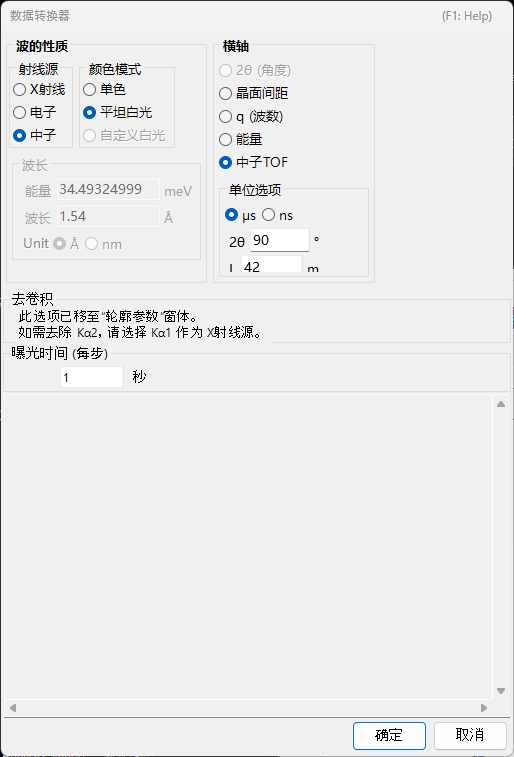

<!-- 260601Cl: migrated from legacy docx + yseto.net web manual -->
# 衍射谱图数据

本页介绍 PDIndexer 处理的“谱图数据”本身（测量数据集），以及如何加载、显示和导出它。加载后的处理——平滑、背景扣除等——在 [谱图参数](4-profile-parameter.md) 窗口中进行。支持的文件扩展名完整列表请参见 [文件格式](appendix/file-formats.md)。

## 谱图是什么

谱图是粉末衍射测量得到的一维“横轴 vs 强度”数据集。横轴根据测量方式以下列方式之一表示：

- 角度色散型衍射（普通 X 射线衍射）中为 \( 2\theta \)（衍射角）
- 能量色散型测量（白色 X 射线、SSD 检测）中为能量
- 中子飞行时间（TOF）法中为飞行时间
- 无论哪种情况，内部都可以转换为晶面间距 \( d \) 或散射矢量 \( q \) 处理

纵轴为衍射强度，可以显示为原始计数（`Raw Counts`）或每步计数（`Count per Step (CPS)`），并以线性或对数比例呈现（参见 [主窗口](1-main-window.md) 页面中的 `Vertical Axis`）。

## 支持的输入格式

`File ▸ Read profile(s)` 可加载 PDIndexer 自身格式，以及其他程序的输出和通用文本格式。

| 扩展名 | 内容 |
| --- | --- |
| `pdi` / `pdi2` | PDIndexer 本身的谱图格式（包含轴设置和处理信息） |
| `csv` | WinPIP 输出（逗号分隔） |
| `chi` | Fit2D 输出 |
| `tsv` | 制表符分隔文本 |
| `ras` | 理学（Rigaku，RAS）格式 |
| `nxs` | NeXus 格式 |
| `npd` / `xbm` / `rpt`（`rpf`） | SSD（半导体检测器）原始数据 |
| 其他文本 | 任何两列“角度（或 d 值）－强度”文本一般都可读取 |

!!! note "读取通用文本"
    以角度－强度文本形式保存的文件，即使不属于上述标准格式，通常也能读取。若无法判断横轴类型或波长／能量，请在下述 `Data Converter` 对话框中指定。

各格式的详细规格汇总在 [文件格式](appendix/file-formats.md) 中。

## 加载方法

谱图可通过多种方式加载。

- **菜单** — `File ▸ Read profile(s)`。可一次选择多个文件。
- **拖放** — 从资源管理器将文件拖放到主窗口。
- **监视剪贴板** — 启用 `Option ▸ Watch Clipboard` 后，会自动导入从其他应用（例如 IPAnalyzer 或 CSManager）复制的谱图／晶体。
- **监视文件** — 启用 `Option ▸ Watch File` 并通过 `Set Directory to the watch` 指定文件夹后，该文件夹中新创建的 `pdi` 谱图文件会被自动读取。这对连续测量时的实时显示很方便。

!!! tip "自动对齐横轴"
    勾选 `After reading profile, change horizontal axis` 后，读取完成后横轴显示会立即切换为与新加载谱图一致。

## 单谱图模式与多谱图模式

使用主窗口右侧的 `Single/Multi Profile` 切换显示模式。

- **`Single Profile`** — 加载新谱图会替换之前的数据，同一时刻只显示一条谱图。
- **`Multi Profiles`** — 加载的谱图会叠加显示。使用 `Increasing intensity by a profile` 可将各谱图的强度略微错开，便于区分多条曲线。启用 `Change automatically color` 会自动为每条谱图分配绘制颜色。

## 谱图列表

主窗口左侧的 `Profile` 列表显示所有已加载的谱图。

- 只有勾选的谱图才会在中央查看区绘制。使用 `Check/Uncheck all` 可一次性切换全部勾选状态。
- 点击 `Color` 列可更改各谱图的绘制颜色。
- 调整列表中条目的顺序可调整叠加绘制的先后次序。
- 该列表在单谱图模式下不可用，在多谱图模式下会显示多条谱图。

更详细的谱图设置（名称、线型、平滑、背景扣除、轴校正、谱图运算等）在 [谱图参数](4-profile-parameter.md) 窗口中进行，勾选列表下方的 `Profile Parameter` 复选框即可打开。

## Data Converter 对话框

当加载的通用文本文件无法判断横轴类型，或加载 SSD（能量色散型）原始数据时，会打开 `Data Converter` 对话框，供你指定所读取数据的横轴及相关参数。

该对话框可设置以下项目。

| 项目 | 内容 |
| --- | --- |
| 横轴设置 | 指定数据的横轴类型（X 射线波长／能量、2θ、中子 TOF 长度／角度等）及相应的线源参数。 |
| `Exposure time (per step)` | 每个数据步的曝光（测量）时间，单位为秒。用于 CPS 换算；小于等于 0 的值按 1 处理。 |
| `Deconvolution` | Kα2 的去除已移至 [谱图参数](4-profile-parameter.md) 窗口。如需去除，请将 X 射线源选为 Kα1。 |
| `For SSD data` 下的 `Low energy cutoff` | 舍弃 EDX 谱中低于右侧阈值（eV）的低能量部分。 |

当横轴类型为能量色散型（白色 X 射线、EDX）时，输入能量校准系数 `E = a₀ + a₁ n + a₂ n²`（E：能量，单位 eV；n：通道编号），即可将通道编号转换为能量。点击 `OK` 应用设置并转换数据，或点击 `Cancel` 中止导入。

## 导出谱图

- **`File ▸ Save profile(s)`** — 将所有已加载的谱图保存为 PDIndexer 本身的 `pdi2` 格式。轴设置和处理信息会被保留。
- **`File ▸ Export the selected profile(s)`** — 将所选谱图以下列格式之一导出：
  - `as CSV (comma separated values) file` — 逗号分隔（角度、强度）
  - `as TSV (tab separated values) file` — 制表符分隔
  - `as GSAS file` — GSAS（Rietveld 精修）数据格式

!!! note "保存图形"
    若要保存绘制的图形而非谱图数据本身，请使用 `File ▸ Copy to Clipboard` 或 `File ▸ Save as Metafile`（EMF）。EMF 是矢量格式，可导入 PowerPoint 和 Word。
