<!-- 260601Cl: migrated from legacy docx + yseto.net web manual -->
# 晶体参数

点击主窗口工具栏上的 `Crystal Parameter` 图标，会打开如下所示的子窗口。在这里可以设置要显示哪些晶体的衍射峰，以及这些峰的显示方式。窗口下部内置了用于搜索和导入结构的晶体数据库。

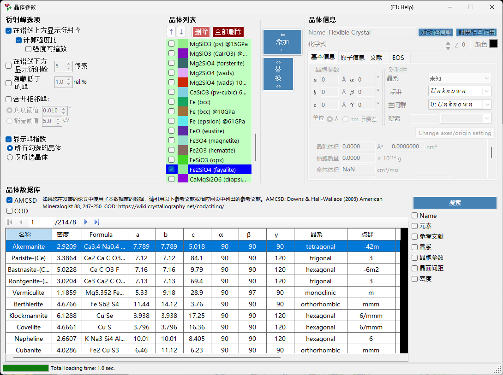

该窗口主要分为四个区域。

| 区域 | 用途 |
| --- | --- |
| `Diffraction Peak Option` | 衍射线的显示方式 |
| `Crystal List` | 与主窗口共享的晶体检查列表 |
| `Crystal Information` | 所选晶体的详细参数（分标签页） |
| `Crystal database` | 基于 AMCSD 的搜索与导入 |

---

## Diffraction Peak Option

配置衍射线的显示方式。

### Show peaks over profiles

选择是否将衍射线叠加显示在谱图数据之上。

### Calculate intensity ratio {#calculate-intensity-ratio}

选择是否根据结构数据计算衍射强度（的比值）。

!!! note
    如果尚未输入原子位置，无论该复选框的状态如何，都不会计算强度。有关输入原子数据的方法，请参阅 [Atom Info. tab](#atom-info-tab)。

### Scalable intensity

选择是否可以在不改变相对强度比的情况下，对所有衍射线整体进行缩放。

### Show peaks under profile

选择是否在谱图下方绘制衍射峰。

#### Peak height

设置谱图下方所绘制峰的高度，单位为像素（`pixel`）。

### Combine adjacent peaks

选择是否合并那些虽然在晶体学上不等价，但 2θ 值几乎相同或完全相同的峰的强度。

例如，在立方晶系中，(333) 面和 (115) 面虽然不等价，但晶面间距(d值)完全相同，因此在观测中会重叠。勾选此选项后，可以显示它们合并后的强度。

| 项目 | 说明 |
| --- | --- |
| `Angle threshold` | 用角度（`°`）指定峰需要接近到何种程度才会被合并。 |
| `Energy threshold` | 对于能量色散数据，用能量（`eV`）指定合并范围。 |

!!! tip
    旧版手册中以埃（Å）表示该阈值，但当前版本会根据横轴类型，以角度（`°`）或能量（`eV`）指定。

### Hide peaks below

选择是否去除相对最强反射过弱的峰。截止值以相对最强线的比率（`rel.%`）给出。

### Show peak indices

选择要为哪些晶体标注衍射线指数（米勒指数）。

| 选项 | 对象 |
| --- | --- |
| `all checked crystals` | 所有已勾选的晶体 |
| `only selected crystal` | 仅列表中当前选中的晶体 |

---

## Crystal List

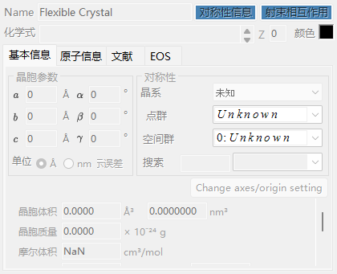

此处显示的信息与主窗口的谱图检查列表相同。已勾选的晶体，其衍射线会在主窗口中绘制。每一行显示一个复选框（`Check`）、绘制颜色（`PeakColor`）以及晶体名称（`Crystal`）。

### Up/Down arrow buttons (↑ / ↓)

更改晶体的排列顺序。

!!! note
    第 1 至第 6 行为状态方程（EOS）保留，无法重新排序。详见 [Equation of state](5-equation-of-states.md)。

### Add

将右侧晶体信息区域（后述）中设置的晶体，作为新条目添加到列表中。

### Replace

用右侧晶体信息区域中设置的晶体，替换当前选中的晶体。

### Delete

从列表中删除当前选中的晶体。

### Delete all

从列表中删除全部晶体。

---

## Crystal Information {#crystal-information}

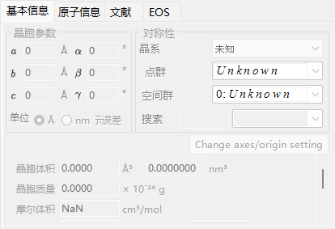

在多个标签页中编辑并显示所选晶体的详细信息。主要标签页如下：

| 标签页 | 内容 |
| --- | --- |
| `Basic Info.` | 晶格常数、晶系、空间群等基本信息 |
| `Atom Info.` | 原子种类、占有率、坐标及温度因子 |
| `Ref.` | 出处论文、作者等参考文献信息 |
| `EOS` | 用于压缩和热膨胀的状态方程设置 |

### Basic Info. tab

设置晶格常数（a, b, c, α, β, γ）、晶系、空间群等基本信息。选择空间群后，可编辑的晶格常数以及原子坐标的自由度会自动受到约束。

!!! tip
    在晶格常数输入框上单击鼠标右键，会显示一个菜单，可将晶格常数恢复为应用程序启动时（或从数据库导入时）的数值。当通过精修更改数值后想要恢复到原始参考值时，这个功能很方便。

### Atom Info. tab {#atom-info-tab}

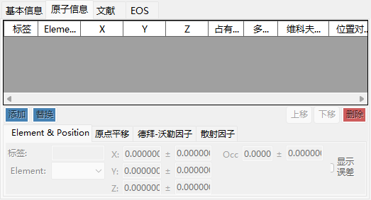

设置每个原子的元素种类、占有率、分数坐标以及各向同性/各向异性温度因子。在此处输入原子位置后，即可通过 [Calculate intensity ratio](#calculate-intensity-ratio) 计算衍射强度。

### Ref. tab

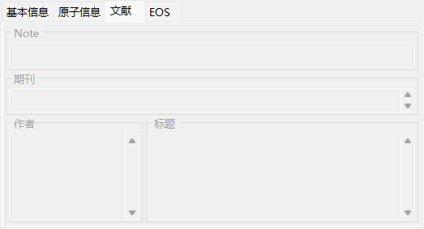

保存作为晶体结构出处的论文标题、期刊名称、作者等参考文献信息。从晶体数据库导入的结构会自动填入这些信息。

### EOS tab

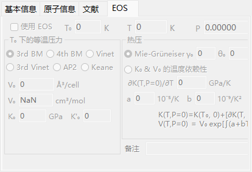

设置每种晶体各自的状态方程（EOS），用于控制晶格常数随压力和温度的变化。主要输入项如下：

| 字段 | 说明 |
| --- | --- |
| `Use EOS` | 为该晶体启用 EOS 压力计算。 |
| `T0` / `Temperature` | 参考温度 / 实测温度。 |
| `V0` | 参考晶胞体积。 |
| `K0`, `K'0` | 等温体积模量及其压力导数。 |
| 等温式 | `BM3`（三阶 Birch-Murnaghan，默认）/ `BM4` / `Vinet` / `AP2` / `Keane`。 |
| 热压力 | `Mie-Grüneisen`（默认；参数 \( \gamma_0, \theta_0, q \)）/ `T-dependence K0&V0`。 |

有关公式及符号定义，请参阅 [Equation of state](5-equation-of-states.md)。

---

## Crystal database

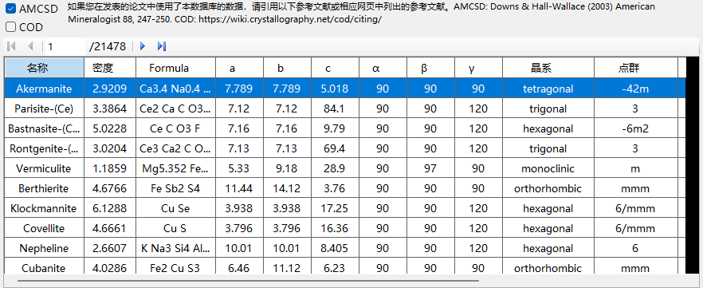

提供超过 20,000 个晶体结构的搜索与导入功能。该数据库基于 American Mineralogist Crystal Structure Database（AMCSD）。

!!! warning "Citation"
    使用此晶体数据时，请仔细阅读 <http://rruff.geo.arizona.edu/AMS/amcsd.php>，并务必引用以下文献。

    > Downs, R.T. and Hall-Wallace, M. (2003) The American Mineralogist Crystal Structure Database. *American Mineralogist* **88**, 247-250.

### Table

列出数据库中包含的晶体。如果输入了搜索条件，则仅显示符合条件的晶体。

在表中选择任意晶体，会将其信息传送到 [Crystal Information](#crystal-information)。若要将其添加到晶体列表，请在晶体列表区域按下 `Add` 或 `Replace` 按钮。

### Search options

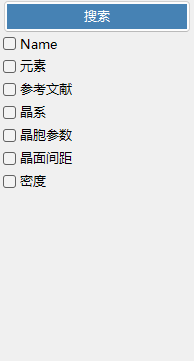

输入搜索条件。输入完成后，按下 `Search` 按钮或按 Enter 键。每个条件都可以通过其复选框启用或禁用。

#### Name

输入晶体名称。

#### Elements

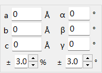

按下 `Periodic Table` 按钮会打开一个单独的窗口，用于选择要搜索的元素。每个元素按钮每次按下都会切换其状态。

窗口顶部的按钮可以一次性切换所有元素的状态。

| 按钮 | 含义 |
| --- | --- |
| `may or not include` | 该元素可以包含也可以不包含（清除所有元素约束）。 |
| `must include` | 必须包含（仅保留包含所有指定元素的晶体）。 |
| `must exclude` | 必须排除（移除包含任一指定元素的晶体）。 |

!!! tip
    勾选 `Ignore scattering factor` 可以在不考虑散射因子的情况下进行搜索。

#### Reference

输入论文标题、期刊名称或作者姓名。

#### Crystal System

通过指定晶系进行搜索。

#### Cell Params

输入晶格常数及其允许的误差范围。

#### d-spacing

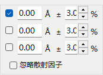

输入强反射的晶面间距(d值)及其允许的误差范围。

#### Density

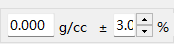

输入密度及其允许的误差范围。
