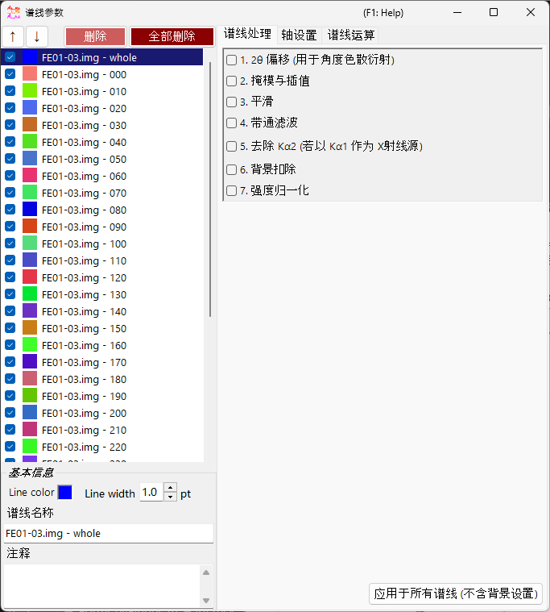
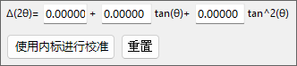
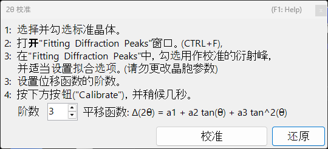
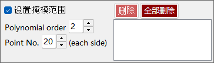
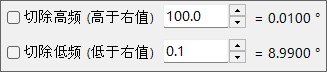
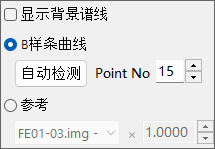
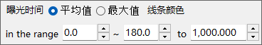

<!-- 260601Cl: migrated from legacy docx + yseto.net web manual -->
# 谱图参数

单击主窗口上的 `Profile parameter`（谱图参数）图标即可打开此子窗口。在这里可以对已加载的谱图进行详细设置，并进行各种数值处理。

窗口左侧是 [Profile 谱图列表](#profile)，右侧则分为三个标签页 —— [谱图处理](#profile-processing)、[轴设置](#axis-setting) 和 [谱图运算](#profile-operator)。每个处理步骤都可以用复选框开启/关闭，并按从上到下的顺序依次应用。

!!! note
    在此窗口中所做的设置会实时反映到 [主窗口](1-main-window.md) 的谱图上。关于晶体一侧的设置，例如横轴单位和衍射线的指数标注，请参见 [晶体参数](3-crystal-parameter.md)。

---

## Profile 谱图列表 {#profile}

窗口左侧的列表显示的信息与主窗口的 Profile 谱图列表相同。在列表中选择某个谱图后，该谱图就成为窗口右侧各项处理与设置的目标对象。

| 项目 | 说明 |
| --- | --- |
| `↑` `↓`（上下箭头按钮） | 更改列表中谱图的排列顺序。 |
| `Delete`（删除） | 删除所选的谱图。 |
| `Delete all`（全部删除） | 删除所有谱图。 |

在列表下方的 `Basic property`（基本信息）区域中，可以编辑所选谱图的基本属性。

| 项目 | 说明 |
| --- | --- |
| `Line Color`（线条颜色） | 单击可更改所选谱图的绘制颜色。 |
| `Line Width`（线条宽度） | 设置谱图的线宽（`pt`）。 |
| `Profile Name`（谱线名称） | 设置谱图的名称。 |
| `Comment`（注释） | 自由填写的注释栏。 |

---

## 谱图处理（Profile processing） {#profile-processing}

在 `Profile processing` 标签页中，可以对所选谱图进行各种数值处理。步骤 1～7 可以分别用独立的复选框启用，启用的处理会按编号顺序依次应用。

### 1. 2θ 偏移 {#two-theta-offset}

`1. 2θ offeset (for angle-dispersive diffractmetry)` 用于校正角度色散数据的角度。校正公式是关于 \( \tan\theta \) 的二次函数。

$$ \Delta(2\theta) = a_0 + a_1 \tan\theta + a_2 \tan^2\theta $$

如果谱图中含有内标（晶格常数已知的样品），可以按下 `Calibration using an internal standard`（使用内标进行校准）按钮，并按照提示信息操作，二次函数的系数即可自动确定。在校准对话框中，观测到的峰位会与内标的理论峰位进行匹配，从而拟合出系数。

按下 `Reset`（重置）按钮可以将已设置的偏移系数重置。

!!! tip
    内标通常使用晶格常数经过精确测定的材料，例如 Si 或 LaB₆。校准完成后，校正过的 2θ 值将直接用于后续的所有分析。

### 2. 掩模与插值（Mask and Interpolation） {#mask}

`2. Mask and Interpolation` 会对指定的角度范围（或能量范围）进行掩模处理，并利用掩模范围之外的强度对谱图进行插值。

| 项目 | 说明 |
| --- | --- |
| `Set Masking range`（设置掩模范围） | 指定要掩模的横轴范围。 |
| `Point No.`（数据点数） | 指定插值所用端点（两侧）的点数。 |
| `Polynomial order`（多项式次数） | 指定插值所用多项式的阶数。 |
| `Save Masking Ranges` / `Read Masking Ranges` | 将设置的掩模范围保存到文件，或从文件中读取。 |
| `Delete` / `Delete all` | 删除单个或全部掩模范围。 |

### 3. 平滑（Smoothing） {#smoothing}

`3. Smoothing` 会对所选谱图进行平滑处理。平滑算法采用 `Savitzky-Golay` 方法。

该方法针对每个关注的 \(x\) 位置，对该点 \(\pm\) `Point No.` 范围内的数据用 `Order`（阶数）阶多项式进行最小二乘拟合，并将所得函数 \(F(x)\) 的值作为该 \(x\) 位置新的强度值。

!!! note
    当 `Order` \(= 1\) 时，Savitzky–Golay 平滑等价于简单移动平均。增大 `Order` 能更好地保留峰形，增大 `Point No.` 则会增强平滑效果。

### 4. 带通滤波（Bandpass filter） {#bandpass}

`4. Bandpass filter` 利用傅里叶变换（FFT）切除高于或低于指定频率的成分。

| 项目 | 说明 |
| --- | --- |
| `Cut high-freq. over`（切除高频） | 去除频率高于指定值的成分（降低高频噪声）。 |
| `Cut low-freq. under`（切除低频） | 去除频率低于指定值的成分（去除缓慢变化的背景）。 |

### 5. 去除 Kα2（Remove Kα2） {#remove-ka2}

`5. Remove Kα2 (if Kα1 is used as X-ray source)`：如果所选谱图是用未分离 Kα1 与 Kα2 的 X 射线测得，并且加载时指定为 Kα1，勾选此项即可去除源自 Kα2 的衍射强度。

!!! warning
    此处理仅在将 Kα1 选为 X 射线源时有效。请在 [轴设置](#axis-setting) 标签页中检查并设置横轴单位与入射线种类。

### 6. 背景扣除（Background） {#background}

`6. Background` 从谱图中扣除背景。共有两种方法。

#### B-Spline curve（B 样条曲线）

按下 `Auto Detect`（自动检测）会自动计算并扣除背景。通过 `Point No.` 可设置自动搜索的背景控制点的最大数量。

也可以手动更改控制点。用鼠标拖动主窗口上绘制的圆形控制点，即可创建合适的曲线。

#### Reference（参考谱图）

可以将另一条谱图指定为所选谱图的背景。勾选 `Show background profile`（显示背景谱线）后，即可显示正被用作背景的谱图。

!!! note
    背景扣除（处理 6）不包含在下文所述的 `Apply for all profiles` 按钮的批量应用范围内。

### 7. 强度归一化（Normalize intensity） {#normalize}

`7. Normarize intensity` 会对谱图进行归一化，使指定横轴范围内的 `Average`（平均值）或 `Maximum`（最大值）达到指定的强度。

| 项目 | 说明 |
| --- | --- |
| `Average` / `Maximum`（平均值 / 最大值） | 选择以范围内的平均值还是最大值作为基准。 |
| `intensity between`（范围内强度） | 指定目标横轴范围。 |
| `to`（归一化到） | 指定归一化后的目标强度值。 |

### Apply for all profiles 按钮 {#apply-all}

`Apply for all profiles (without background setting)`（应用于所有谱线，不含背景设置）按钮会将步骤 1～7 中 **除 6. 背景扣除以外** 的设置一次性应用到所有谱图。

---

## 轴设置（Axis setting） {#axis-setting}

在 `Axis setting` 标签页中，可以更改所选谱图的横轴单位、入射线种类以及入射线能量。

| 项目 | 说明 |
| --- | --- |
| `Horizontal axis setting`（横轴设置） | 更改当前的横轴单位（`horizontal unit`）。通过 `Shift`（平移）还可以对整个横轴进行偏移。 |
| `Exposure Time`（曝光时间） | 设置 CPS 模式（`(for CPS mode)`）下使用的曝光时间（`sec.`）。 |
| `Vertical axis setting`（纵轴设置） | 与纵轴相关的设置。 |

!!! note
    此处的轴设置更改的是谱图自身所持有的物理信息（单位、入射线种类、能量）。与主窗口中仅用于显示的轴变换不同，它会影响数据本身的解读方式。由于入射线种类和能量会直接影响衍射线位置的计算，请设置正确的数值。

---

## 谱图运算（Profile Operator） {#profile-operator}

在 `Profile Operator` 标签页中，可以对多条谱图进行平均化，以及在谱图之间进行算术运算。

指定要计算的目标谱图和所需进行的运算后，按下 `Calculate`（计算）按钮，运算结果就会作为新的谱图被添加进来。

| 模式 | 说明 |
| --- | --- |
| `Average`（平均） | 对多条谱图进行平均化。 |
| `Profile and value`（谱线与数值） | 在谱图与标量数值之间进行运算。 |
| `Two profiles`（两条谱线） | 在两条谱图之间进行算术运算（如加法）。 |

通过 `Output name of the profile`（输出谱线的名称）可以指定生成谱图的名称（默认值为 `Result #01`）。

!!! tip
    该功能可用于例如对多次测量结果取平均以提高信噪比，或对两条谱图取差值以提取二者之间的变化。
