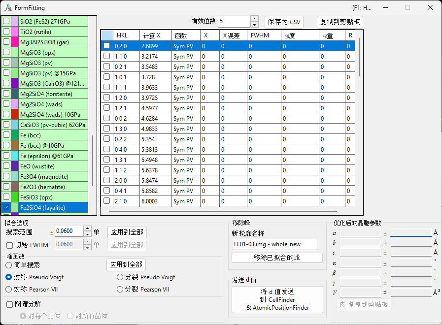
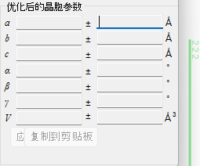
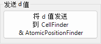
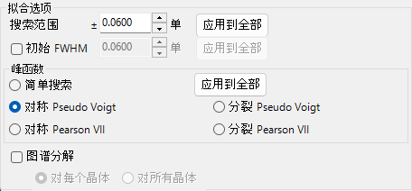
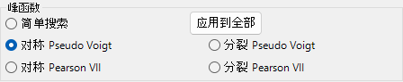
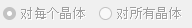
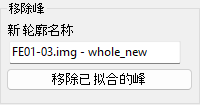
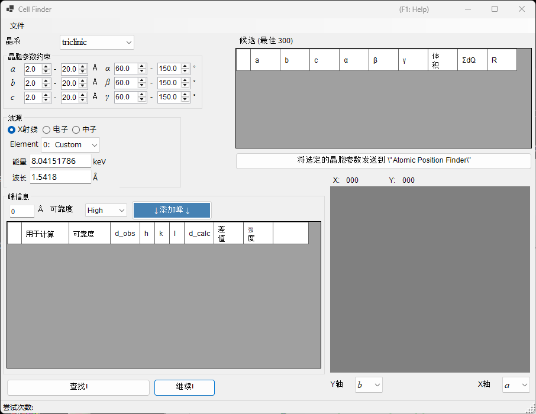
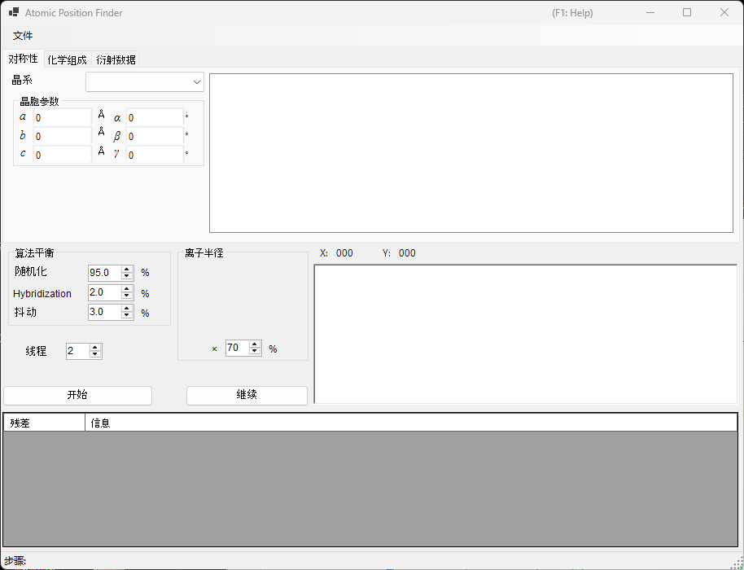

<!-- 260601Cl: migrated from legacy docx + yseto.net web manual -->
# 衍射峰拟合

`Fitting diffraction peaks` 工具会用合适的函数对衍射谱图中的峰进行拟合，从每个峰位置 2θ 求出晶面间距（d 值），并通过最小二乘法精修晶格常数。可从主窗口的工具栏启动此工具。

## 基本操作流程

1. 在晶体列表中选择目标晶体（在多谱图模式下，还需选择要处理的谱图）。
2. 在主窗口中用鼠标拖动衍射线，使其尽量与测量峰重合。
3. 从衍射峰列表（带复选框的列表）中选择要拟合的衍射线指数。
4. 一旦选中了足够多的独立指数，使最小二乘法计算可解，右下方的 `Optimized cell constants`（优化后的晶胞参数）面板中就会显示最可几的晶格常数及其误差。
5. 按下 `Apply to the crystal`（应用到所选晶体）按钮，将精修得到的晶格常数写回主程序中的晶体。

!!! note "晶体的勾选与选择"
    该晶体列表与主窗口中的列表内容一致。要使拟合生效，目标晶体必须同时处于“勾选”和“选中”状态。

## 晶体列表

窗口左上方的晶体列表中包含与主窗口相同的晶体。在此勾选并选中的晶体即为拟合对象。详情参见[晶体参数](3-crystal-parameter.md)。

## 衍射峰列表

此处列出所选晶体的衍射线。勾选某一行的复选框，即可将该衍射线设为拟合对象。列表包含如下各列。

| 列 | 内容 |
| --- | --- |
| `Check` | 是否将该衍射线纳入拟合 |
| `PeakColor` | 显示颜色 |
| `Crystal` | 晶体名称 |
| `HKL` | 反射指数 |
| `Calc X` | 计算得到的衍射线位置 |
| `Func` | 所使用的峰函数 |
| `X` | 拟合得到的峰位置 |
| `X Err` | 峰位置的误差 |
| `FWHM` | 半高全宽 |
| `Intensity` | 峰强度 |
| `Weight` | 最小二乘拟合中的权重 |
| `R` | 拟合的残差指标 |

列表下方的按钮用于导出结果。

- `Copy to clipborad`：将表格内容复制到剪贴板，可直接粘贴到 Excel 等软件中。
- `Save as CSV`：将表格内容保存为 `.csv` 文件。`Effective digit` 用于设置小数位数。
- `Clear peaks`：清除拟合结果。

## Fitting option（拟合选项）

在此对拟合峰形时使用的详细参数进行设置。

### Search Range / Initial FWHM

- `Search Range`（搜索范围）：设置进行拟合的范围。即以计算得到的衍射线位置为中心、上下各 ±Search Range 的区间，作为该峰的拟合对象范围。
- `Initial FWHM`（初始半高全宽）：指定峰形函数的初始半高全宽，作为最小二乘收敛的初始值使用。

按下 `Apply to all`（应用到全部）按钮，可将当前设置一次性应用到所有衍射线。

### Peak function（峰函数）

选择用于拟合的峰函数。

| 峰函数 | 内容 |
| --- | --- |
| `Simple Search` | 不进行函数拟合，而是将计算得到的衍射线位置 ±Search Range 范围内强度最强的点识别为峰位置。 |
| `Symmetric Pseudo Voigt` | 用左右对称的伪 Voigt 函数进行拟合。 |
| `Symmetric Pearson VII` | 用左右对称的 Pearson VII 函数进行拟合。 |
| `Split Pseudo Voigt` | 用左右非对称（分裂型）的伪 Voigt 函数进行拟合。 |
| `Split Pearson VII` | 用左右非对称（分裂型）的 Pearson VII 函数进行拟合。 |

!!! tip "推荐的函数"
    如无特殊理由，推荐使用稳定性更佳的 `Symmetric Pseudo Voigt`。

伪 Voigt 函数是高斯函数 \(G(x)\) 与洛伦兹函数 \(L(x)\) 按混合参数 \(\eta\) 线性组合而成，表达式为：

$$
\mathrm{pV}(x) = \eta\, L(x) + (1-\eta)\, G(x), \qquad 0 \le \eta \le 1
$$

其中 \(\eta\) 为洛伦兹分量所占的比例。分裂（Split）型通过在峰位置左右分别独立设定半高全宽等参数，来表现非对称的峰形。

### Pattern Decomposition（图谱分解）

当所选的两条或更多衍射线的 Search Range 存在重叠时，此选项用于选择是否进行图谱分解（对重叠的多个峰进行同时拟合）。

- `in each crystal`（对每个晶体）：对每个晶体分别独立地进行图谱分解。
- `between crystals`（对所有晶体）：跨所有晶体进行图谱分解。

## Optimized cell constants（优化后的晶胞参数）

一旦选中了足够多的独立指数，使最小二乘法计算可解，此面板即会显示最可几的晶格常数 \(a, b, c, \alpha, \beta, \gamma\) 及体积 \(V\)，并各自附带误差（`±`）。

!!! note "关于 NA 显示"
    当自由度不足时——即拟合峰数与自由度相等，或某个晶格常数没有自由度时——将显示 `NA` 以代替误差值。选择足够多的独立反射后，误差即可被计算出来。

- `Apply to the crystal`（应用到所选晶体）：将精修得到的晶格常数写回主程序中所选的晶体。
- `Copy to Clipboard`（复制到剪贴板）：将优化后的晶格常数复制到剪贴板。
- `Reset take off angle`（重置出射角）：重置出射角。

## Remove fitted peaks（移除已拟合的峰）

此功能会从谱图中减去已拟合的峰，并将残差谱图作为新谱图输出。在 `New profile name`（新谱图名称）中输入目标名称，然后按下 `Remove fitted peaks`（移除已拟合的峰）按钮即可执行相减操作。该功能便于检查背景或重叠峰的分离情况。

## 关联工具（Send d-values）

按下 `Send d-values to CellFinder && AtomicPositionFinder` 按钮，可将拟合得到的晶面间距（d 值）发送给以下分析工具，这些工具同样可从工具栏启动。

### Cell Finder

`Cell Finder` 会根据一组测得的峰位置（d 值列表），反向搜索能够解释这些位置的晶胞（晶格常数），用于对未知样品进行指标化。

### Atomic Position Finder

`Atomic Position Finder` 会根据观测反射的强度等量，搜索晶体结构中的原子位置。

!!! tip "鉴定未知样品"
    用 `Cell Finder` 确定晶格常数后，将该晶体注册到晶体列表中，即可用本工具的最小二乘拟合进一步精修晶格常数。
