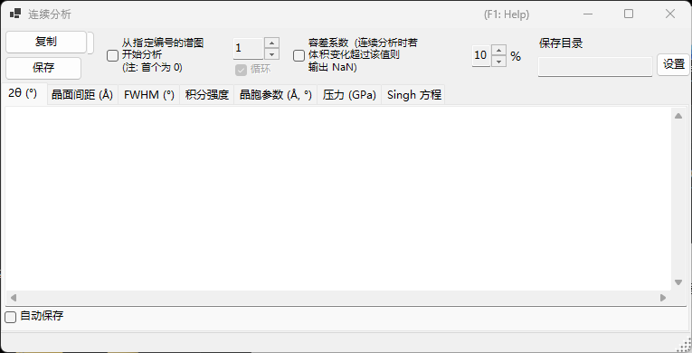
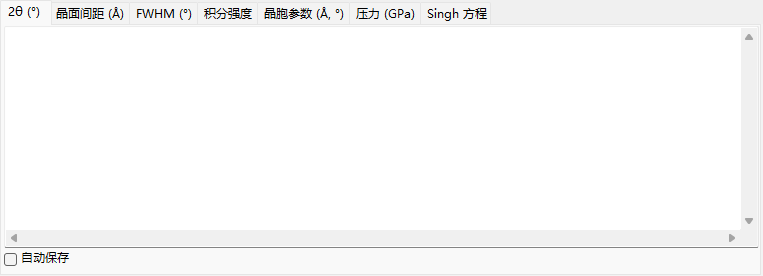
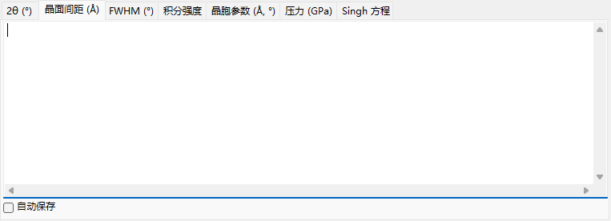
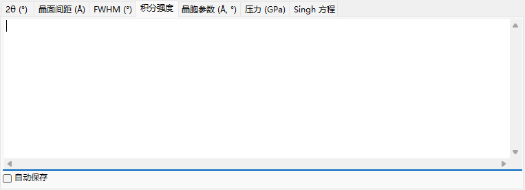
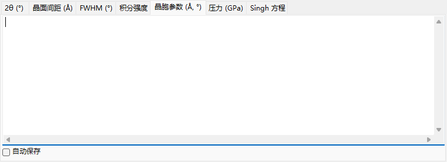
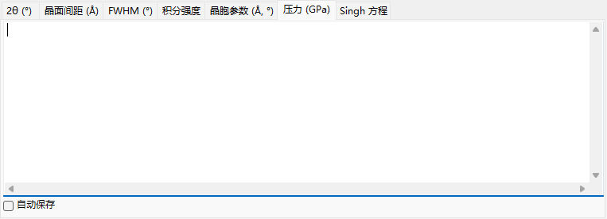
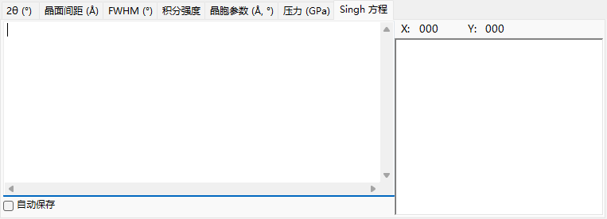

<!-- 260601Cl: migrated from legacy docx + yseto.net web manual -->
# 连续分析

`连续分析` (Sequential Analysis) 是一个工具，它会对已载入的大量谱图依次执行相同的峰拟合，并按量将结果汇总输出。它专为在温度、压力、时间等条件变化的过程中获取的一系列谱图而设计：一次性处理整个序列，并在各自的选项卡中，以表格形式收集每条衍射线的 2θ、晶面间距(d值)、半高宽 (FWHM)、强度、晶胞参数、压力以及 Singh 方程 (单轴应力/晶格应变分析) 的结果。

使用主窗口工具栏上的 `连续分析` 按钮可以打开和关闭此窗口。

!!! note "与[衍射峰拟合](6-fitting-diffraction-peaks.md)共享"
    连续分析与 `Fitting diffraction peaks` 窗口共享拟合设置。请先打开 `Fitting diffraction peaks` 窗口，选择目标晶体，并勾选要拟合的衍射线 (峰)。如果按下 `执行` 时尚未完成这些准备，将弹出提示信息告知你进行设置。

## 基本流程

1. 载入在条件变化过程中测得的整个系列谱图 (至少需要四个谱图)。
2. 打开[衍射峰拟合](6-fitting-diffraction-peaks.md)窗口，选择目标晶体，并勾选要分析的衍射线。在该窗口中设置的拟合函数和搜索范围会被连续分析重复使用。
3. 根据需要设置起始编号、循环、容差系数以及自动保存选项 (见下文)。
4. 按下 `执行`。已载入的每个谱图会依次被激活，执行最小二乘法拟合，结果累积到各个选项卡中。
5. 检查每个选项卡的内容，并通过 `复制` 或 `保存` 将数据导入电子表格软件 (如 Excel)。

窗口底部的状态栏会以 `... % completed.  Elapsed time: ... sec` 的形式显示进度和已用时间。解析完成后，2θ、晶面间距(d值)、半高宽和强度的结果会一并复制到剪贴板。

!!! tip "每个谱图拟合两次"
    为了获得稳定的收敛结果，每个谱图在结果被记录之前会执行两次最小二乘法拟合。

## 分析选项

`执行` 按钮周围的控件用于控制分析范围以及异常值的处理方式。

| 选项 | 说明 |
| --- | --- |
| `从指定编号的谱图开始分析 (注: 首个为 0)` | 勾选后，将从右侧数值框中指定的谱图编号开始分析，而不是从第一个谱图开始。第一个谱图的编号为 0。 |
| `循环` | 在指定起始编号的情况下，到达末尾后会继续处理之前被跳过的较早谱图 (0 … 起始编号 − 1)，循环回绕以分析整个序列。仅当起始编号选项启用时可用。 |
| `容差系数 (连续分析时若体积变化超过该值则输出 NaN)` | 勾选后，当精修得到的晶胞体积相对初始值的变化超过右侧数值 (%) 时，将拒绝该次拟合 (该行输出 `NaN`)。这可以自动剔除因拟合失败而产生的异常值。 |

## 输出选项卡

每个选项卡对应一个输出量的表格。每一行对应一个谱图 (谱图名)，每一列对应一条被选中的衍射线 (hkl 指数，或对于 flexible crystal 显示为 `Peak No.`)。表格以制表符分隔的文本形式保存，在你执行 `复制` 或 `保存` 时会转换为逗号分隔值 (CSV)。

### 2θ (°)

每个谱图、每条衍射线拟合得到的峰位置，以 2θ (度) 表示。

### 晶面间距(d值) (Å)

由各峰位置计算得到的面间距 d，单位为 Å。它由波长和 2θ 通过 \( d = \dfrac{\lambda}{2\sin\theta} \) 求得。

### FWHM (deg.)

各峰的半高宽 (FWHM)，以 2θ 度数表示，可用于追踪峰宽的变化。

### 强度

各峰的积分强度 (面积)，可用于追踪伴随相变或织构变化而产生的强度变化。

### 晶胞参数 (Å, °)

每个谱图精修得到的晶胞体积 `V`、晶胞边长 `A`、`B`、`C` (Å)、轴角 `Alpha`、`Beta`、`Gamma` (°)，以及各自的估计误差 (`_err` 列)。

### 压力 (GPa)

利用[状态方程](5-equation-of-states.md)由各谱图的晶胞参数导出的压力。当在 `Equation of State` 窗口中选择了压力标准物质 (如 Gold、Pt、NaCl (B1/B2)、MgO、Corundum、Ar、Re、Mo 或 Pb) 时，每位研究者 (每个已报道的标度) 对应一列。未选择标准物质时，压力由目标晶体所指定的状态方程计算得到。

### Singh 方程

Singh 单轴应力/晶格应变分析的结果。每个谱图名末尾的数字被解释为方位角 \( \psi \) (度)，对于每个反射，方位角与 d 值的关系通过最小二乘法 (Levenberg–Marquardt) 进行拟合。对每个反射，得到无应力晶面间距 `d0`、最大应变方位角 `Ψmax`，以及与应力成正比的量 `t/6Ghkl` (差应力 \( t \) 与剪切模量 \( G_{hkl} \) 之比)。拟合曲线也会绘制在该选项卡的图表中。

!!! note "Singh 方程的适用条件"
    此选项卡仅对谱图名以 `...-whole` 结尾的“应力分析模式”序列生效。每个谱图名末尾必须带有方位角作为结尾标记 (例如 `...-30`)。对于普通序列，此选项卡不会更新。

Singh 方程所表示的方位角相关晶面间距近似为

$$ d(\psi) = d_0 \left[ 1 + \alpha - 3\,\alpha \left( 1 - \frac{\lambda^2}{4 d^2} \right) \cos^2(\psi - \psi_{\max}) \right] $$

其中 \( \alpha \) 对应 `t/6Ghkl`，\( \psi_{\max} \) 为最大应变的方位角。

## 导出结果

| 操作 | 说明 |
| --- | --- |
| `复制` | 将当前显示的选项卡内容以 CSV (逗号分隔) 格式复制到剪贴板。 |
| `保存` | 将当前显示的选项卡内容保存为 CSV 文件 (文件名在对话框中选择)。 |

### 自动保存

每个选项卡都有一个 `自动保存` 复选框，勾选后会在 `执行` 完成后自动将对应的量写入 CSV 文件。目标文件夹显示在 `保存目录` 中，通过 `设置` 按钮选择。文件名由谱图名的公共部分构成，并按量附加不同后缀: `_2theta.csv`、`_d.csv`、`_fwhm.csv`、`_intensity.csv`、`_cell.csv`、`_pressure.csv` 或 `_Singh.csv`。

!!! tip "设置目标文件夹"
    如果勾选了自动保存但尚未设置目标文件夹 (该文件夹不存在)，则按下 `执行` 时会打开文件夹选择对话框。

## 从宏中使用

连续分析的每一项输出也可以从宏 (Python 脚本) 中获取。它们对应[宏](8-macro.md)中的 `PDI.Sequential` 类。

| 宏函数 | 对应的选项卡 |
| --- | --- |
| `PDI.Sequential.Open()` / `Close()` | 打开/关闭窗口 |
| `PDI.Sequential.Execute()` | 执行连续分析 |
| `PDI.Sequential.GetCSV_2theta()` | 2θ |
| `PDI.Sequential.GetCSV_D()` | 晶面间距(d值) |
| `PDI.Sequential.GetCSV_FWHM()` | FWHM |
| `PDI.Sequential.GetCSV_Intensity()` | 强度 |
| `PDI.Sequential.GetCSV_CellConstants()` | 晶胞参数 |
| `PDI.Sequential.GetCSV_Pressure()` | 压力 |
| `PDI.Sequential.GetCSV_Singh()` | Singh 方程 |

每个 `GetCSV_...()` 都会以 CSV 字符串的形式返回对应选项卡的内容。`PDI.Sequential.Directory` 可获取/设置目标文件夹，将其与 `PDI.File.SaveText(...)` 结合使用即可将结果写入文件。详情请参阅[宏](8-macro.md)。
