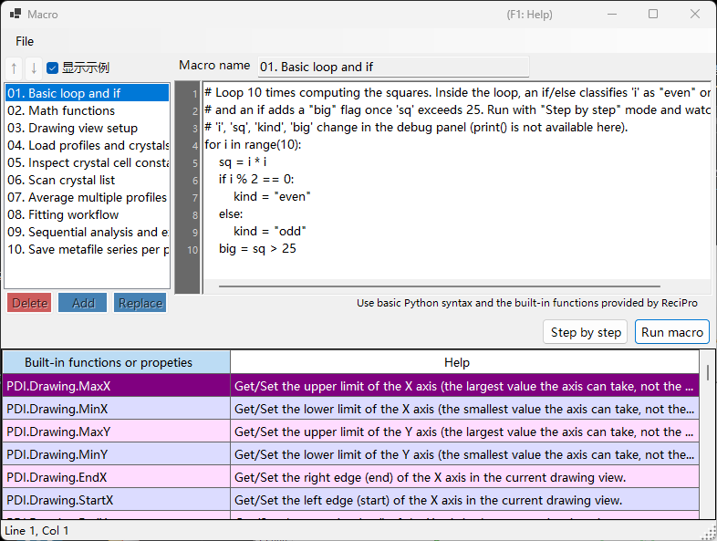

<!-- 260601Cl: migrated from legacy docx + yseto.net web manual -->
# 宏

PDIndexer 的大多数操作都可以通过**宏**功能实现自动化。宏是使用 [IronPython](https://ironpython.net/)（在 .NET 上运行的 Python 实现）编写的 Python 脚本，在专用的宏编辑器窗口中编辑和执行。可用于自动化重复性任务、批量处理多个文件，以及批量导出结果到 CSV 或图像文件。



!!! note "Python 基础知识"
    宏可以直接使用标准的 Python 语法（`for` 循环、`if`/`else`、列表、函数等）。本页不对 Python 语言本身进行说明。PDIndexer 特有的功能通过下文所述的 `PDI` 对象调用。

## 打开宏编辑器

在主窗口的菜单栏中选择**宏 → 编辑器**，即可打开宏编辑器窗口（标题为 `Macro`）。

在编辑器中创建并保存的宏，也会以名称形式列在**宏**菜单下，因此可以直接从菜单运行。宏列表会在 PDIndexer 退出时自动保存，并在下次启动时恢复。

## 编辑器窗口的布局

编辑器窗口由以下部分组成。

| 部分 | 说明 |
| --- | --- |
| 宏列表（左侧） | 已保存宏名称的列表。点击某一项可将该宏加载到右侧的编辑器中。 |
| 代码编辑器（中央） | 输入 Python 脚本的区域。支持行号栏、自动缩进、输入补全（自动完成）以及函数提示。 |
| 函数参考表 | 列出 `PDI` 下所有可用函数的表格。双击单元格可将该函数名插入到光标所在位置的代码中。 |
| 调试面板（右侧） | 在单步执行过程中显示当前时刻的变量名和值。 |
| 状态栏 | 显示当前光标位置（`Line` / `Col`）。 |

### 列表操作按钮

使用以下按钮编辑宏列表。

| 按钮 | 操作 |
| --- | --- |
| `Add` | 将当前代码以名称框中输入的名称添加到列表中（若同名已存在，会提示是否覆盖）。 |
| `Replace` | 用当前代码替换列表中所选中的宏。 |
| `Delete` | 从列表中删除所选中的宏。 |
| `↑` / `↓` | 在列表内上移或下移所选中的宏。 |
| `显示示例` | 切换内置示例宏（见下文）的显示。 |

!!! tip "保存与加载"
    宏可以保存为独立的 `.mcr` 文件，也可以从中加载。将 `.mcr` 文件拖放到编辑器窗口即可加载其内容。编辑后按 `Ctrl+S` 会覆盖保存当前选中的宏。

## 运行宏

使用代码编辑器下方的按钮运行宏。

| 按钮 | 操作 |
| --- | --- |
| `Run macro` | 正常运行宏，直至结束。 |
| `Step by step` | 逐行执行宏。每行执行前会暂停，并在右侧的调试面板中显示当前的变量值。 |
| `Next step (F10)` | 在单步执行过程中前进到下一行（也可使用 `F10` 键）。 |
| `Stop` | 中止执行。中止操作仅在 `Step by step` 执行期间有效。 |

!!! warning "无法使用 print()"
    宏编辑器没有标准输出控制台，因此不会显示 `print()` 的输出。若要查看变量的值，请使用 `Step by step` 模式运行宏，并在调试面板中观察值的变化。

### 示例宏

勾选 `显示示例` 按钮后，列表中会显示内置的示例宏（只读）。示例会以当前 UI 语言（英语／日语）显示。可将其作为编写自己宏的参考。内置示例包括：

| 名称 | 内容 |
| --- | --- |
| 01. Basic loop and if | `for` 循环与 `if`/`else` 的基础用法 |
| 02. Math functions | 使用 `math` 模块（`pi`、`sin`、`sqrt`、`exp`、`log` 等） |
| 03. Drawing view setup | 使用 `PDI.Drawing.SetBounds` 设置显示范围 |
| 04. Load profiles and crystals | `PDI.File.ReadProfiles` / `ReadCrystals` |
| 05. Inspect crystal cell constants | 通过 `PDI.Crystal` 读取晶格常数、体积和压力 |
| 06. Scan crystal list | 遍历 `PDI.CrystalList` 中的全部晶体 |
| 07. Average multiple profiles | `PDI.ProfileOperator.Average` |
| 08. Fitting workflow | 完整的 `PDI.Fitting` 流程 |
| 09. Sequential analysis and export | 运行 `PDI.Sequential` 并导出 CSV |
| 10. Save metafile series per profile | 为每个谱图批量保存 EMF |

!!! note "math 模块已预先导入"
    编辑器启动时会自动执行 `import math`，因此无需显式的 `import` 语句即可直接使用 `math` 模块，例如 `math.sqrt(2)`。

---

## 函数参考

所有 PDIndexer 特有的功能均通过根对象 `PDI` 下的各个类调用。`PDI` 在宏作用域中已经可用，因此无需 `import`。

以下各表均从源代码中的 `[Help]` 属性转录而来。相同的列表也出现在编辑器窗口内的函数参考表，以及[网络手册第 6 章](https://yseto.net/soft/pdi/pdi_06)中。

!!! note "记法说明"
    在签名列中，`(get/set)` 表示可读写属性，`(get)` 表示只读属性。带有 `= value` 的参数为默认参数，可以省略。

### PDI（根对象）

| 成员 | 签名 | 说明 |
| --- | --- | --- |
| `Sleep` | `Sleep(int millisec)` | 将宏的执行暂停指定的毫秒数。 |
| `Obj` | `Obj (get/set)` | 获取／设置从其他程序传入的对象（进程间参数）。 |

### PDI.File — 文件输入输出

| 成员 | 签名 | 说明 |
| --- | --- | --- |
| `GetDirectoryPath` | `GetDirectoryPath(string filename = "")` | 获取目录路径（末尾带反斜杠）。若省略 `filename`，会打开文件夹选择对话框；否则返回 `filename` 的目录部分。 |
| `GetFileName` | `GetFileName()` | 打开文件选择对话框，返回所选文件的完整路径。用户取消时返回空字符串。 |
| `GetFileNames` | `GetFileNames()` | 打开可多选的文件对话框，返回所选文件的完整路径。用户取消时返回空数组。 |
| `ReadProfiles` | `ReadProfiles(string filename)` | 从指定文件读取谱图数据。若省略 `filename`（或文件不存在），会打开文件选择对话框。 |
| `SaveProfiles` | `SaveProfiles(string filename)` | 将谱图数据保存到指定文件。若省略 `filename`，会打开保存对话框。 |
| `ReadCrystals` | `ReadCrystals(string filename)` | 从指定文件读取晶体数据。若省略 `filename`（或文件不存在），会打开文件选择对话框。 |
| `SaveCrystals` | `SaveCrystals(string filename)` | 将晶体数据保存到指定文件。若省略 `filename`，会打开保存对话框。 |
| `SaveMetafile` | `SaveMetafile(string filename)` | 将当前谱图保存为 Windows 图元文件（`.emf`）。若省略 `filename`，会打开保存对话框。 |
| `SaveText` | `SaveText(string text, string filename)` | 将指定的文本内容保存为 `.txt` 文件。若省略 `filename`，会打开保存对话框。 |

### PDI.Drawing — 绘图显示范围

| 成员 | 签名 | 说明 |
| --- | --- | --- |
| `MaxX` | `MaxX (get/set)` | 获取／设置 X 轴的上限值（该轴可取的最大值，而非当前显示范围）。 |
| `MinX` | `MinX (get/set)` | 获取／设置 X 轴的下限值（该轴可取的最小值，而非当前显示范围）。 |
| `MaxY` | `MaxY (get/set)` | 获取／设置 Y 轴的上限值（该轴可取的最大值，而非当前显示范围）。 |
| `MinY` | `MinY (get/set)` | 获取／设置 Y 轴的下限值（该轴可取的最小值，而非当前显示范围）。 |
| `EndX` | `EndX (get/set)` | 获取／设置当前绘图显示范围中 X 轴的右端（终点）。 |
| `StartX` | `StartX (get/set)` | 获取／设置当前绘图显示范围中 X 轴的左端（起点）。 |
| `EndY` | `EndY (get/set)` | 获取／设置当前绘图显示范围中 Y 轴的上端（终点）。 |
| `StartY` | `StartY (get/set)` | 获取／设置当前绘图显示范围中 Y 轴的下端（起点）。 |
| `SetBounds` | `SetBounds(double startX, double endX, double startY, double endY)` | 通过指定四条边（StartX、EndX、StartY、EndY）设置绘图显示范围。 |

### PDI.Crystal — 所选晶体

晶格常数 `CellA`–`CellC` 的单位为 \( \mathrm{\AA} \)，`CellAlpha`–`CellGamma` 的单位为度（deg）。

| 成员 | 签名 | 说明 |
| --- | --- | --- |
| `CellVolume` | `CellVolume (get)` | 获取所选晶体的晶胞体积（\( \mathrm{\AA}^3 \)）。若未选择晶体则返回 0。 |
| `Pressure` | `Pressure(double volume = 0)` | 根据所选晶体的状态方程计算并获取压力（GPa）。若 `volume` 为 0（默认值），则使用当前晶胞体积。 |
| `Name` | `Name (get/set)` | 获取／设置所选晶体的名称。 |
| `CellA` | `CellA (get/set)` | 获取／设置所选晶体的晶格常数 a（\( \mathrm{\AA} \)）。 |
| `CellB` | `CellB (get/set)` | 获取／设置所选晶体的晶格常数 b（\( \mathrm{\AA} \)）。 |
| `CellC` | `CellC (get/set)` | 获取／设置所选晶体的晶格常数 c（\( \mathrm{\AA} \)）。 |
| `CellAlpha` | `CellAlpha (get/set)` | 获取／设置所选晶体的晶格常数 alpha（deg）。 |
| `CellBeta` | `CellBeta (get/set)` | 获取／设置所选晶体的晶格常数 beta（deg）。 |
| `CellGamma` | `CellGamma (get/set)` | 获取／设置所选晶体的晶格常数 gamma（deg）。 |

### PDI.CrystalList — 晶体列表

| 成员 | 签名 | 说明 |
| --- | --- | --- |
| `Open` | `Open()` | 打开「晶体列表」窗口。 |
| `Close` | `Close()` | 关闭「晶体列表」窗口。 |
| `Count` | `Count (get)` | 获取列表中晶体的总数。 |
| `SelectedName` | `SelectedName (get)` | 获取当前所选晶体的名称。若未选择晶体则返回空字符串。 |
| `SelectedIndex` | `SelectedIndex (get/set)` | 获取／设置当前所选晶体的索引。 |
| `Select` | `Select(int index)` | 选择指定索引处的晶体。 |
| `Check` | `Check(int index = -1, bool state = true)` | 勾选或取消勾选指定索引处的晶体。若 `index` 为 -1，则以当前所选晶体为对象。 |
| `Uncheck` | `Uncheck(int index = -1)` | 取消勾选指定索引处的晶体。若 `index` 为 -1，则取消勾选当前所选晶体。 |
| `GetCellVolume` | `GetCellVolume (get)` | 获取所选晶体的晶胞体积（\( \mathrm{\AA}^3 \)）。与 `PDI.Crystal.CellVolume` 相同，为向后兼容而保留。 |

### PDI.Profile — 所选谱图

| 成员 | 签名 | 说明 |
| --- | --- | --- |
| `Comment` | `Comment (get/set)` | 获取／设置当前所选谱图的注释文本。 |
| `Name` | `Name (get/set)` | 获取／设置当前所选谱图的显示名称。 |

### PDI.ProfileOperator — 谱图运算

每个谱图通过其在列表中的索引指定。`output` 为赋予运算结果谱图的名称。

| 成员 | 签名 | 说明 |
| --- | --- | --- |
| `Average` | `Average(int[] indices, string output)` | 计算 `indices` 中列出的索引（例如 `[1,3,5,9]`）所对应谱图的平均值。`output` 为赋予结果谱图的名称。 |
| `AddTwoProfiles` | `AddTwoProfiles(int index1, int index2, string output)` | 计算 profile1 + profile2。各谱图通过索引指定。`output` 为赋予结果谱图的名称。 |
| `SubtractTwoProfiles` | `SubtractTwoProfiles(int index1, int index2, string output)` | 计算 profile1 − profile2。各谱图通过索引指定。`output` 为赋予结果谱图的名称。 |
| `MultiplyTwoProfiles` | `MultiplyTwoProfiles(int index1, int index2, string output)` | 计算 profile1 × profile2。各谱图通过索引指定。`output` 为赋予结果谱图的名称。 |
| `DivideTwoProfiles` | `DivideTwoProfiles(int index1, int index2, string output)` | 计算 profile1 ÷ profile2。各谱图通过索引指定。`output` 为赋予结果谱图的名称。 |

### PDI.ProfileList — 谱图列表

| 成员 | 签名 | 说明 |
| --- | --- | --- |
| `Open` | `Open()` | 打开「谱图列表」窗口。 |
| `Close` | `Close()` | 关闭「谱图列表」窗口。 |
| `DeleteAll` | `DeleteAll()` | 从列表中删除全部谱图（不显示确认对话框）。 |
| `Delete` | `Delete(int index)` | 删除指定索引处的谱图。 |
| `Count` | `Count (get)` | 获取列表中谱图的总数。 |
| `SelectedName` | `SelectedName (get)` | 获取当前所选谱图的名称。若未选择谱图则返回空字符串。 |
| `SelectedIndex` | `SelectedIndex (get/set)` | 获取／设置当前所选谱图的索引。 |
| `Select` | `Select(int index)` | 选择指定索引处的谱图。 |
| `Check` | `Check(int index = -1, bool state = true)` | 勾选或取消勾选指定索引处的谱图。若 `index` 为 -1，则以当前所选谱图为对象。 |
| `Uncheck` | `Uncheck(int index = -1)` | 取消勾选指定索引处的谱图。若 `index` 为 -1，则取消勾选当前所选谱图。 |
| `CheckAll` | `CheckAll()` | 勾选列表中的全部谱图。 |
| `UncheckAll` | `UncheckAll()` | 取消勾选列表中的全部谱图。 |

### PDI.Fitting — 峰拟合

操作[衍射峰拟合](6-fitting-diffraction-peaks.md)窗口。

| 成员 | 签名 | 说明 |
| --- | --- | --- |
| `Open` | `Open()` | 打开「峰拟合」窗口。 |
| `Close` | `Close()` | 关闭「峰拟合」窗口。 |
| `Apply` | `Apply()` | 将优化后的晶格常数应用到所选晶体（等同于点击拟合窗口中的 `Confirm` 按钮）。 |
| `Check` | `Check(int index = -1, bool state = true)` | 勾选或取消勾选指定索引处的晶面。若 `index` 为 -1，则以当前所选晶面为对象。 |
| `Uncheck` | `Uncheck(int index = -1)` | 取消勾选指定索引处的晶面。若 `index` 为 -1，则取消勾选当前所选晶面。 |
| `Select` | `Select(int index)` | 选择指定索引处的晶面。 |
| `SelectedIndex` | `SelectedIndex (get/set)` | 获取／设置当前所选晶面的索引。 |
| `Range` | `Range(double range)` | 为当前所选晶面设置峰搜索范围（单位与 X 轴相同）。 |

### PDI.Sequential — 连续分析

操作[连续分析](7-sequential-analysis.md)窗口。CSV 获取方法返回最近一次连续分析结果的 CSV 字符串。

| 成员 | 签名 | 说明 |
| --- | --- | --- |
| `Directory` | `Directory (get/set)` | 获取／设置保存连续分析结果的目录完整路径。 |
| `Open` | `Open()` | 打开「连续分析」窗口。 |
| `Close` | `Close()` | 关闭「连续分析」窗口。 |
| `Execute` | `Execute()` | 对所有已勾选的谱图执行连续分析。 |
| `GetCSV_2theta` | `GetCSV_2theta()` | 获取最近一次连续分析的 2theta 结果，作为 CSV 字符串。 |
| `GetCSV_D` | `GetCSV_D()` | 获取最近一次连续分析的晶面间距(d值)结果，作为 CSV 字符串。 |
| `GetCSV_FWHM` | `GetCSV_FWHM()` | 获取最近一次连续分析的半高全宽（FWHM）结果，作为 CSV 字符串。 |
| `GetCSV_Intensity` | `GetCSV_Intensity()` | 获取最近一次连续分析的峰强度结果，作为 CSV 字符串。 |
| `GetCSV_CellConstants` | `GetCSV_CellConstants()` | 获取最近一次连续分析的晶格常数结果，作为 CSV 字符串。 |
| `GetCSV_Pressure` | `GetCSV_Pressure()` | 获取最近一次连续分析的压力结果，作为 CSV 字符串。 |
| `GetCSV_Singh` | `GetCSV_Singh()` | 获取最近一次连续分析的 Singh 方程结果，作为 CSV 字符串。 |
| `AutoSave2theta` | `AutoSave2theta (get/set)` | 获取／设置每次运行连续分析后是否自动保存 2theta 结果。 |
| `AutoSaveDspacing` | `AutoSaveDspacing (get/set)` | 获取／设置每次运行连续分析后是否自动保存晶面间距(d值)结果。 |
| `AutoSaveFWHM` | `AutoSaveFWHM (get/set)` | 获取／设置每次运行连续分析后是否自动保存 FWHM 结果。 |
| `AutoSaveIntensity` | `AutoSaveIntensity (get/set)` | 获取／设置每次运行连续分析后是否自动保存峰强度结果。 |
| `AutoSaveCellConstants` | `AutoSaveCellConstants (get/set)` | 获取／设置每次运行连续分析后是否自动保存晶格常数结果。 |
| `AutoSavePressure` | `AutoSavePressure (get/set)` | 获取／设置每次运行连续分析后是否自动保存压力结果。 |
| `AutoSaveSingh` | `AutoSaveSingh (get/set)` | 获取／设置每次运行连续分析后是否自动保存 Singh 方程结果。 |

## 宏示例

作为内置示例之一，以下是运行连续分析并将结果保存为 CSV 的宏。

```python
# Check all profiles, run sequential analysis, then obtain 2-theta / d-spacing /
# cell-constant / pressure results as CSV strings and save each to a file.
PDI.ProfileList.CheckAll()
PDI.Sequential.Open()
PDI.Sequential.Execute()
dir_path = PDI.File.GetDirectoryPath()
PDI.File.SaveText(PDI.Sequential.GetCSV_2theta(),        dir_path + "seq_2theta.csv")
PDI.File.SaveText(PDI.Sequential.GetCSV_D(),             dir_path + "seq_d.csv")
PDI.File.SaveText(PDI.Sequential.GetCSV_CellConstants(), dir_path + "seq_cell.csv")
PDI.File.SaveText(PDI.Sequential.GetCSV_Pressure(),      dir_path + "seq_pressure.csv")
```

其他示例可以从编辑器中的 `显示示例` 按钮查看。
