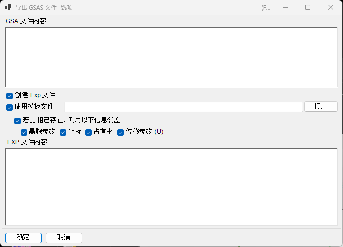

<!-- 260601Cl: migrated from legacy docx + yseto.net web manual -->
# 文件格式

PDIndexer 读写的文件大致分为三类：**谱图数据**、**晶体列表／晶体结构** 和 **绘图输出**。所有这些输入输出操作都可以从[主窗口](../1-main-window.md)的 **文件 (File)** 菜单中进行。

本页以表格形式汇总所支持的扩展名、输入输出方向以及备注。

---

## 谱图数据

### 读入（Read profile(s)）

选择 **文件 → 读入谱线 (Read profile(s))**，可以一次读入多个文件。除本软件自有格式 `pdi` / `pdi2` 外，还支持 WinPIP 输出的 `csv`、Fit2D 输出的 `chi`、Rigaku 的 `ras` 等多种角度－强度（或能量－强度）文本／二进制格式。即使是下表未列出的格式，通常也可以读取：任何普通的角度－强度文本文件都会回退到通用解析器处理。

| 扩展名 | 来源／格式 | 备注 |
| --- | --- | --- |
| `pdi` / `pdi2` | PDIndexer 原生格式 | 将谱图与其附带信息（波源、波长、曝光时间等）一并保存。`pdi2` 为当前版本。读取这些文件时不会显示数据转换对话框。 |
| `csv` | WinPIP 输出（逗号分隔：`angle,intensity`） | 通过数据转换对话框导入，在其中指定横轴的含义、波源和波长。 |
| `tsv` | 制表符分隔（`angle` `[TAB]` `intensity`） | 作为通用文本导入。 |
| `chi` | Fit2D 输出 | 跳过开头的表头行，取四列数据中的第 2、4 列分别作为角度和强度。 |
| `ras` | Rigaku 格式 | 同时包含仪器信息的文本格式。 |
| `nxs` | NeXus / HDF5（SSD，多探测器） | 可能包含多个通道（直方图）；每个通道分别进行能量校准后导入。 |
| `npd` | EDX 谱图（SSD） | 从表头读取 `EGC0/1/2`、`2Theta`、`Live time` 等，并将通道号转换为能量。 |
| `xbm` | EDX 二进制格式（如 SP-8 BL04B2） | 样品名称、测量条件、EGC 校准系数等元数据作为注释导入。 |
| `rpt` | Genie 格式（SSD） | 从表头读取出射角、曝光时间和 EGC。 |
| `xy` | 经 pyFAI 校准的双列文本 | 从表头读取波长，并导入角度与强度。 |
| `gsa` | GSAS 数据（`BANK` 块） | 导入角度、强度、误差三列。 |
| 其他 | 通用角度－强度文本 | 自动检测逗号／空白／制表符分隔符（通过数据转换对话框）。 |

!!! note "一次读入多个文件"
    选择并读入多个文件时，在确认完第一个文件的数据转换设置后，会弹出消息询问是否将相同设置应用于其余文件。选择 **是 (Yes)** 后，其余文件将不再显示对话框而直接批量处理，从而加快读入速度。

### 数据转换对话框（Data Converter）

读取除 `pdi` / `pdi2` 之外的文件（`csv`、`chi`、`ras`、`nxs`、`npd`、`xbm`、`rpt`、`xy`、`gsa` 以及通用文本）时，会打开 **数据转换 (Data Converter)** 对话框。在这里将导入的数值列正确对应到 PDIndexer 内部使用的物理量。

该对话框提供以下设置项。

| 设置项 | 说明 |
| --- | --- |
| Horizontal Axis（横轴） | 指定导入的第 1 列所代表的物理量（2θ、能量、晶面间距(d值)、波数、TOF 等）及其单位。 |
| 波源／波长 | 指定 X 射线／中子／电子束的种类，以及特征 X 射线谱线（Kα 等）或波长。由此决定向晶面间距(d值)和 2θ 的换算方式。 |
| Exposure time (per step)（曝光时间） | 每一步的曝光时间（秒）。用于 CPS 显示和强度归一化。 |
| For SSD data（SSD 数据设置） | 对于 `rpt` / `npd` / `xbm` / `nxs` 等 SSD（EDX）数据，设置将通道号 \(n\) 转换为能量 \(E\) 的系数 \(a_0, a_1, a_2\)。当存在多个探测器时，可以分别启用／禁用并单独设置各自的系数。 |
| Low energy cutoff（低能量截止） | 勾选后，导入时会排除低于指定能量的数据点。 |

对于 SSD 数据，通道号 \(n\) 通过如下二次校准公式转换为能量 \(E\)（单位 eV）：

$$
E = a_0 + a_1\,n + a_2\,n^2
$$

读取通用文本（“其他”格式）时，对话框会在文本框中显示文件的实际内容，可以一边查看数据一边设置横轴、波源等。分隔符（逗号／空白／制表符）以及需要跳过的开头表头行数会自动检测。

!!! tip "监视剪贴板／文件夹"
    启用 **选项 (Option) → 监视剪贴板 (Watch Clipboard)** 后，PDIndexer 可以自动导入从 IPAnalyzer 等其他应用复制的谱图。启用 **监视文件 (Watch File)** 后，会自动读入指定文件夹中新创建的 `pdi` 文件。

### 保存与导出

**文件 → 保存谱线 (Save profile(s))** 会将所有已读入的谱图以 PDIndexer 原生的 `pdi2` 格式保存。

**文件 → 导出所选谱线 (Export the selected profile(s))** 可以将所选谱图以下列格式之一写出。

| 扩展名／格式 | 方向 | 备注 |
| --- | --- | --- |
| `pdi2` | 输出 | PDIndexer 原生格式。一次性保存所有谱图。 |
| `csv` | 输出 | 逗号分隔（角度、强度）。 |
| `tsv` | 输出 | 制表符分隔（角度和强度以制表符分隔）。 |
| `gsa`（GSAS） | 输出 | 用于 Rietveld 分析的 GSAS 格式。可以在下方的导出画面中查看内容。 |

#### 以 GSAS 格式导出

选择 GSAS 格式后，会出现一个导出画面，供你确认将要写出的内容。第 1 行为谱图名称，第 2 行为 `BANK 1 … CONST … FXYE` 表头，其后各行包含角度、强度、误差三列。误差在谱图自身带有误差数据时取自该数据；否则使用 \(\sqrt{\text{intensity}}\)。

!!! note "角度的缩放"
    对于普通的角度色散数据，角度值会乘以 100 后写出（GSAS 的 `CONST` 惯例）。对于中子 TOF 数据，则按原值写出，不进行缩放。

---

## 晶体列表与晶体结构

晶体列表以 XML 格式（扩展名 `xml`）保存和读入。单个晶体结构可以从 CIF / AMC 导入。详情参见[晶体参数](../3-crystal-parameter.md)。

| 操作（文件菜单） | 扩展名 | 方向 | 备注 |
| --- | --- | --- | --- |
| 载入晶体（作为新列表） | `xml` | 输入 | 读入晶体列表并替换当前列表（当前列表将被丢弃）。 |
| 载入晶体（并添加到当前列表） | `xml` | 输入 | 读入晶体列表并追加到当前列表末尾。 |
| 保存晶体 | `xml` | 输出 | 将当前晶体列表保存到文件。 |
| 导入 CIF、AMC... | `cif` / `amc` | 输入 | 将 CIF 格式或 AMC（AMCSD）格式的结构数据添加到当前晶体列表。 |
| 将所选晶体导出为 CIF | `cif` | 输出 | 将所选晶体保存为 CIF 结构数据文件。 |
| 将晶体恢复到初始状态 | — | — | 将晶体列表恢复到安装时的默认状态。 |

---

## 绘图（谱图查看器）输出

主窗口中当前显示的谱图可以作为图像复制到剪贴板，也可以作为矢量图元文件保存。

| 操作（文件菜单） | 格式 | 方向 | 备注 |
| --- | --- | --- | --- |
| 复制为位图（as Bitmap） | 位图 | 剪贴板 | 将查看器内容以位图图像的形式复制到剪贴板。 |
| 复制为图元文件（as Metafile） | 图元文件（矢量） | 剪贴板 | 将查看器内容以矢量形式复制到剪贴板。 |
| 保存为图元文件 | `emf`（EMF） | 输出 | 以 EMF（Enhanced Metafile）格式保存。由于保留了矢量和字体信息，保存的 `emf` 可以被 PowerPoint 和 Word 读取。 |

此外，**页面设置 (Page Setup)**、**打印预览 (Print Preview)** 和 **打印 (Print)** 可以直接打印当前的角度和强度范围。
