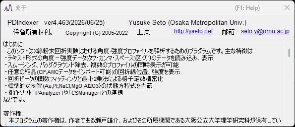

<!-- 260601Cl: migrated from legacy docx + yseto.net web manual -->
# 运行环境与安装

本页介绍如何安装 PDIndexer，以及为舒适运行所推荐的环境。

## 安装

请从 GitHub 发布页面下载最新版本。

- 下载地址: <https://github.com/seto77/PDIndexer/releases/latest>

推荐的方法是使用 MSI 安装程序。下载 `PDIndexer-setup.msi`（x64）并双击即可开始安装。在 Windows on Arm（例如 Snapdragon PC）上，请改为下载 `PDIndexer-setup_arm64.msi`。 <!-- 260625Cl WiX asset names + arm64 -->

如果在受管理的 Windows PC 上无法运行 MSI 安装程序，可以使用免安装的 ZIP 包作为替代方案。下载 portable ZIP（x64 为 `PDIndexer-v.<ver>.zip`，Arm 为 `PDIndexer-v.<ver>_arm64.zip`），将整个文件夹解压到用户可写入的位置，然后运行解压后文件夹中的 `PDIndexer.exe`。请勿直接在 ZIP 查看器内运行 `PDIndexer.exe`。 <!-- 260601Ch / 260625Cl -->

!!! note "关于 Windows 保护警告"
    运行新下载的未签名研究软件时，Windows 可能会显示保护警告（SmartScreen），提示“Windows 已保护你的电脑”。如果出现此提示，请点击 **更多信息**，然后选择 **仍要运行** 以继续。

!!! note "关于免安装 ZIP 包"
    ZIP 包适用于难以使用 MSI 安装、获得管理员批准，或单独安装 .NET Desktop Runtime 的环境，是一种替代方案。但它并非完全自包含的设置文件夹：PDIndexer 仍会将用户设置和已复制的默认数据保存到当前用户的 AppData 文件夹中，并可能将按用户区分的选项保存在 `HKEY_CURRENT_USER\Software\Crystallography\PDIndexer` 下。

## 运行所需环境

通过 MSI 安装程序安装 PDIndexer 时，需要以下运行时环境。

| 项目 | 要求 |
| --- | --- |
| 操作系统 | Windows（64 位，x64 或 Arm64） |
| 运行时 | `.NET Desktop Runtime 10.0`（是 **Desktop Runtime**，而非普通的 **.NET Runtime**；在 Windows on Arm 上为 **Arm64** 版本） |

!!! warning "请选择 Desktop Runtime"
    下载页面提供两种产品：“.NET Runtime”和“.NET Desktop Runtime”。由于 PDIndexer 是 WinForms 应用程序，请务必安装 **.NET Desktop Runtime**。仅安装“.NET Runtime”将无法启动程序。

- 下载运行时: <https://dotnet.microsoft.com/download/dotnet/10.0>

免安装 ZIP 包针对对应体系结构（x64 或 Arm64）是自包含的，无需另外安装 .NET Desktop Runtime。 <!-- 260601Ch / 260625Cl arm64 -->

!!! note "关于旧文档中记载的版本"
    旧版手册（docx）中记载为“.NET Desktop Runtime 6.0 或更高版本”，但当前 PDIndexer 需要 **.NET 10.0**。请以最新版本的要求为准。

## 推荐环境

PDIndexer 的部分功能需要较大的计算资源。为提升速度，程序已尽可能实现多线程化。为获得舒适的使用体验，推荐使用具备以下高性能规格的计算机。

| 项目 | 推荐配置 |
| --- | --- |
| 操作系统 | Windows 11（Windows 10 及以上的 64 位版本也可运行） |
| 内存 | 16 GB 以上 |
| CPU | 8 核以上（对多线程计算有效） |

!!! tip "多线程的优势"
    使用晶体结构进行衍射谱图计算、连续分析等任务时，CPU 核心数越多，运行速度越快。CPU 核心数越多，计算等待时间就越短。

## 更新（检查新版本）

在主窗口的 **帮助** 菜单中，PDIndexer 可以更新到最新版本，并查看作者信息。

| 菜单 | 功能 |
| --- | --- |
| **帮助** ▸ **检查更新** | 检查是否已发布新版本，并更新程序。 |
| **帮助** ▸ **关于 PDIndexer** | 显示版本和作者信息。 |

选择 **帮助** ▸ **关于 PDIndexer** 会打开如下窗口，可在其中查看当前版本号和作者信息。

!!! tip "定期更新"
    程序会持续进行错误修复和功能新增。请不时执行 **帮助** ▸ **检查更新**，以保持 PDIndexer 为最新版本。

## 许可证

PDIndexer 依据 **MIT 许可证** 发布。只要在任何再分发物中附上版权声明和许可证文本，即可自由地使用、修改、分发以及用于商业用途。本软件按“原样”提供，不附带任何担保。
