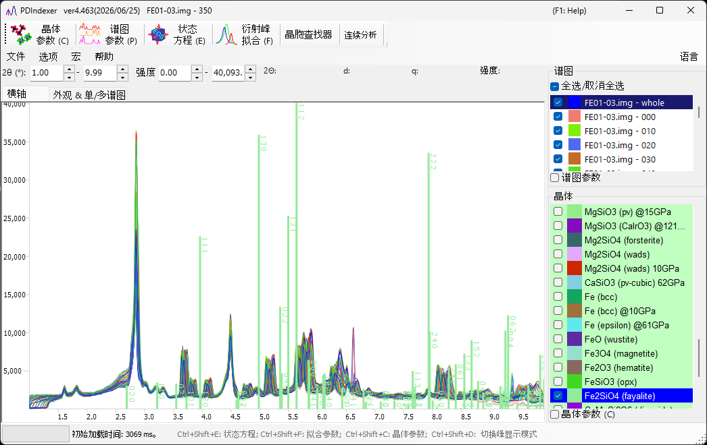

<!-- 260601Cl: English landing page for the PDIndexer Pages manual (content migrated from the legacy docx + yseto.net web manual). -->
<!-- 260625Cl: static-i18n folder mode へ移設 (docs/src/index.md → docs/src/en/index.md)。画像は ../assets、内部リンクは en/ 接頭辞を剥がす。 -->
# PDIndexer 使用手册

**PDIndexer** 是一款免费的 MIT 许可 Windows 应用程序，用于分析一维粉末衍射谱图（实验室/同步辐射 X 射线、中子 TOF）。它可显示测量谱图、叠加根据晶体结构计算出的衍射线、处理并校正谱图、通过最小二乘法拟合峰以精修晶格常数，并根据标准物质的状态方程估算压力。

## 按目标查找

| 目标 | 从这里开始 | 后续主要步骤 |
|------|------------|-----------------|
| 读取并显示测量谱图 | [2. 衍射谱图](2-pattern-profiles.md) | [1. 主窗口](1-main-window.md)、[文件格式](appendix/file-formats.md) |
| 通过叠加已知晶体来鉴定物相 | [3. 晶体参数](3-crystal-parameter.md) | [2. 衍射谱图](2-pattern-profiles.md) |
| 处理/校正谱图 | [4. 谱图参数](4-profile-parameter.md) | [3. 晶体参数](3-crystal-parameter.md) |
| 拟合峰并精修晶格常数 | [6. 衍射峰拟合](6-fitting-diffraction-peaks.md) | [3. 晶体参数](3-crystal-parameter.md) |
| 根据标准物质估算压力 | [5. 状态方程](5-equation-of-states.md) | [6. 衍射峰拟合](6-fitting-diffraction-peaks.md) |
| 批量处理一系列谱图 | [7. 连续分析](7-sequential-analysis.md) | [8. 宏](8-macro.md) |
| 使用脚本自动化任务 | [8. 宏](8-macro.md) | [7. 连续分析](7-sequential-analysis.md) |

## 目录

- [0. 概述](0-overview.md) — PDIndexer 的功能与主要特性
- [1. 主窗口](1-main-window.md) — 界面布局、菜单、工具栏、谱图/晶体列表
- [2. 衍射谱图](2-pattern-profiles.md) — 谱图数据、支持的格式、读取
- [3. 晶体参数](3-crystal-parameter.md) — 衍射线显示、晶体信息、数据库
- [4. 谱图参数](4-profile-parameter.md) — 谱图处理、坐标轴设置、运算
- [5. 状态方程](5-equation-of-states.md) — 根据标准物质 EOS 计算压力
- [6. 衍射峰拟合](6-fitting-diffraction-peaks.md) — 峰拟合与晶格常数精修
- [7. 连续分析](7-sequential-analysis.md) — 谱图系列的批量分析
- [8. 宏](8-macro.md) — IronPython 脚本与函数参考

### 附录

- [运行环境与安装](appendix/runtime-and-installation.md)
- [文件格式](appendix/file-formats.md)
- [故障排除](appendix/troubleshooting.md)

## 快速入门

1. 从 [发布页面](https://github.com/seto77/PDIndexer/releases/latest) 下载并安装，然后启动 *PDIndexer*。
2. 打开一个测量谱图（拖放文件，或粘贴从 [IPAnalyzer](https://github.com/seto77/IPAnalyzer) 复制的谱图）。
3. 从内置数据库添加已知晶体（或导入 CIF/AMC 文件）以叠加其衍射线。
4. 拟合峰以精修晶格常数，或根据标准物质的状态方程估算压力。

## 系统要求

| 项目 | 要求 |
|------|-------------|
| OS | 支持 [.NET Desktop Runtime 10.0](https://dotnet.microsoft.com/download/dotnet/10.0) 的 Windows（**不是** .NET Runtime） |
| 推荐配置 | 64 位 Windows 10/11、16 GB 及以上内存、8 核及以上 CPU |

详情参见[运行环境与安装](appendix/runtime-and-installation.md)。

!!! note
    源代码、发行版和问题跟踪均在 [GitHub](https://github.com/seto77/PDIndexer) 上。PDIndexer 依据 [MIT 许可证](https://github.com/seto77/PDIndexer/blob/master/LICENSE.md) 分发。
