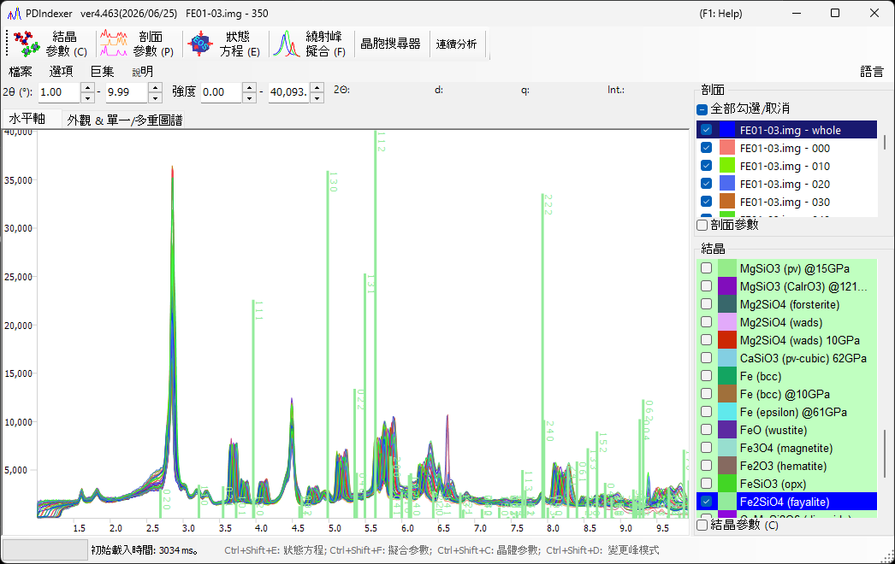

<!-- 260601Cl: migrated from legacy docx + yseto.net web manual -->
# 繞射圖譜

本頁說明 PDIndexer 所處理的「圖譜資料」本身（測量資料集），以及如何載入、顯示與匯出。載入後的處理──平滑化、背景扣除等──則在 [圖譜參數](4-profile-parameter.md) 視窗中進行。支援的副檔名完整清單請參閱 [檔案格式](appendix/file-formats.md)。

## 何謂圖譜

圖譜是粉末繞射測量所得到的一維「橫軸 vs. 強度」資料集。橫軸依測量幾何方式，以下列其中一種方式表示：

- 角度分散型繞射（一般 X 光繞射）為 \( 2\theta \)（繞射角）
- 能量分散型測量（白色 X 光、SSD 偵測）為能量
- 中子飛行時間（TOF）法為飛行時間
- 無論何種情形，資料在內部皆可轉換為晶面間距(d值) \( d \) 或散射向量 \( q \) 來處理

縱軸為繞射強度，可顯示為 `Raw Counts`（原始計數）或 `Count per Step (CPS)`（每步計數），並可選擇線性或對數尺度（詳見 [主視窗](1-main-window.md) 頁面中的 `Vertical Axis`）。

## 支援的輸入格式

`File ▸ Read profile(s)` 可載入 PDIndexer 本身的格式，以及其他程式的輸出與通用文字格式。

| 副檔名 | 內容 |
| --- | --- |
| `pdi` / `pdi2` | PDIndexer 原生圖譜格式（包含軸設定與處理資訊） |
| `csv` | WinPIP 輸出（以逗號分隔） |
| `chi` | Fit2D 輸出 |
| `tsv` | 以定位點分隔的文字 |
| `ras` | Rigaku（RAS）格式 |
| `nxs` | NeXus 格式 |
| `npd` / `xbm` / `rpt`（`rpf`） | SSD（半導體偵測器）原始資料 |
| 其他文字 | 一般而言，任何兩欄的角度（或 d 值）－強度文字皆可讀取 |

!!! note "讀取通用文字"
    以角度－強度文字格式儲存的檔案，即使不屬於上述標準格式，通常也能讀取。若無法判斷橫軸類型或波長／能量，請在下述的 `Data Converter` 對話方塊中指定。

各格式的詳細規格彙整於 [檔案格式](appendix/file-formats.md)。

## 載入方式

圖譜可透過下列幾種方式載入。

- **選單** — `File ▸ Read profile(s)`。可一次選取多個檔案。
- **拖放** — 從檔案總管將檔案拖放至主視窗。
- **監視剪貼簿** — 啟用 `Option ▸ Watch Clipboard` 後，會自動匯入從其他應用程式（例如 IPAnalyzer 或 CSManager）複製的圖譜／晶體。
- **監視檔案** — 啟用 `Option ▸ Watch File`，並以 `Set Directory to the watch` 選擇資料夾後，該資料夾內新建立的 `pdi` 圖譜檔會自動讀入。這對連續測量時的即時顯示相當方便。

!!! tip "自動對齊橫軸"
    勾選 `After reading profile, change horizontal axis` 後，讀入新圖譜的當下即會將橫軸顯示切換為與該圖譜一致。

## 單一圖譜模式與多重圖譜模式

以主視窗右側的 `Single/Multi Profile` 切換顯示模式。

- **`Single Profile`** — 載入新圖譜時會取代先前的資料，同一時間僅顯示一份圖譜。
- **`Multi Profiles`** — 已載入的圖譜會重疊顯示。使用 `Increasing intensity by a profile` 可讓各圖譜的強度略微偏移，以便更容易區分多條曲線。啟用 `Change automatically color` 會自動為每份圖譜指定繪圖顏色。

## 圖譜清單

主視窗左側的 `Profile` 清單會顯示所有已載入的圖譜。

- 只有勾選的圖譜才會繪製於中央檢視區。使用 `Check/Uncheck all` 可一次切換全部勾選狀態。
- 點按 `Color` 欄可變更各圖譜的繪圖顏色。
- 調整清單中項目的順序，可調整重疊繪圖的順序。
- 在單一圖譜模式下此清單會停用，於多重圖譜模式下則會顯示多份圖譜。

更詳細的圖譜設定（名稱、線型、平滑化、背景扣除、軸修正、圖譜運算等）可在勾選清單下方的 `Profile Parameter` 核取方塊後，於 [圖譜參數](4-profile-parameter.md) 視窗中進行。

## Data Converter 對話方塊

當載入無法判斷橫軸類型的通用文字檔，或 SSD（能量分散型）原始資料時，會開啟 `Data Converter` 對話方塊，供你指定所讀入資料的橫軸及其相關參數。

此對話方塊可設定下列項目。

| 項目 | 內容 |
| --- | --- |
| 橫軸設定 | 指定資料的橫軸類型（X 光波長／能量、2θ、中子 TOF 長度／角度等）及對應的來源參數。 |
| `Exposure time (per step)` | 每個資料步的曝光（測量）時間，單位為秒。用於 CPS 換算；小於等於 0 的值會視為 1。 |
| `Deconvolution` | Kα2 去除功能已移至 [圖譜參數](4-profile-parameter.md) 表單。若要去除，請將 X 光源選為 Kα1。 |
| `For SSD data` 下的 `Low energy cutoff` | 捨棄 EDX 能譜中低於右側閾值（eV）的低能量側部分。 |

當橫軸類型為能量分散型（白色 X 光、EDX）時，請輸入能量校正係數 `E = a₀ + a₁ n + a₂ n²`（E：能量，單位 eV；n：通道編號），以將通道編號轉換為能量。按一下 `OK` 套用設定並轉換資料，或按 `Cancel` 中止匯入。

## 匯出圖譜

- **`File ▸ Save profile(s)`** — 以 PDIndexer 原生的 `pdi2` 格式儲存所有已載入的圖譜，並保留軸設定與處理資訊。
- **`File ▸ Export the selected profile(s)`** — 以下列其中一種格式匯出所選取的圖譜：
  - `as CSV (comma separated values) file` — 以逗號分隔（角度、強度）
  - `as TSV (tab separated values) file` — 以定位點分隔
  - `as GSAS file` — GSAS（Rietveld）資料格式

!!! note "儲存圖形"
    若要儲存繪製出的圖形而非圖譜資料，請使用 `File ▸ Copy to Clipboard` 或 `File ▸ Save as Metafile`（EMF）。EMF 是一種可匯入 PowerPoint 與 Word 的向量格式。
