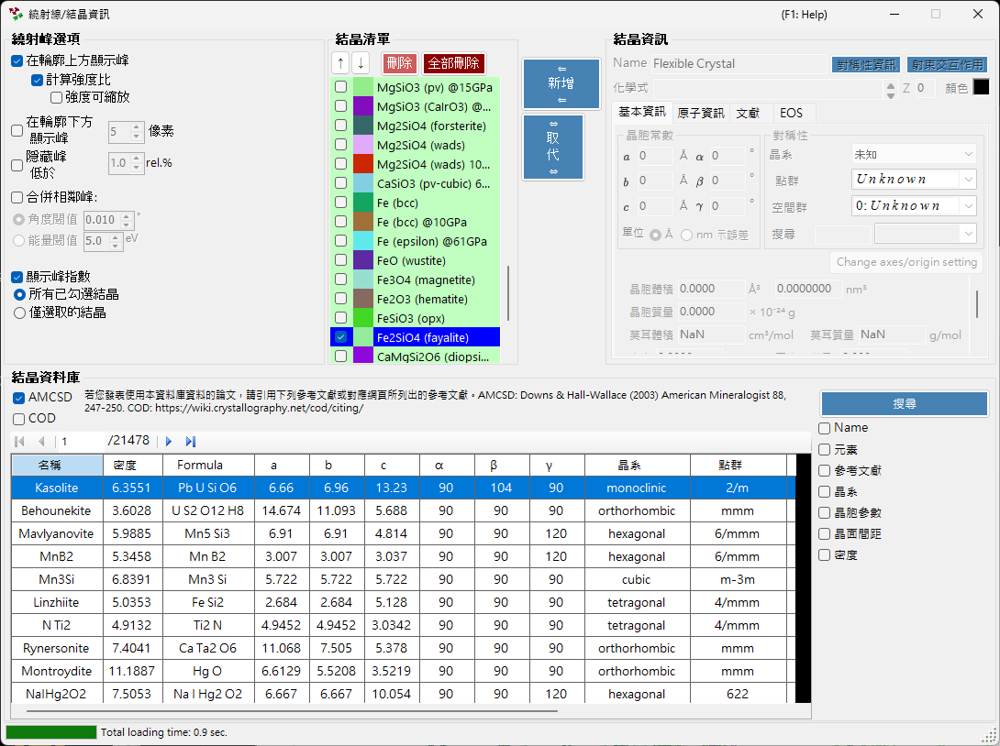
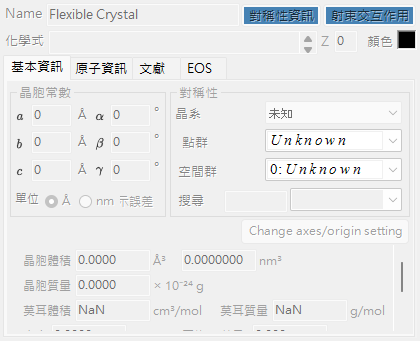
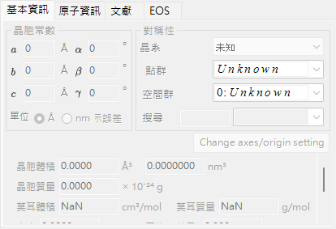
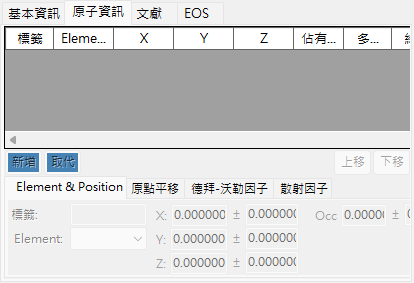
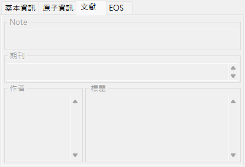
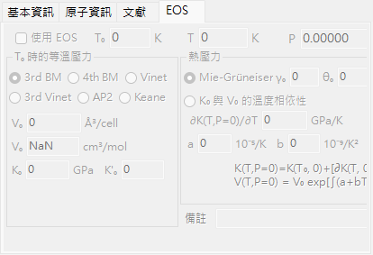
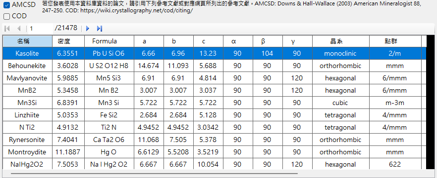
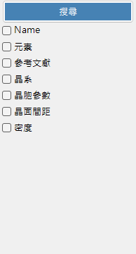
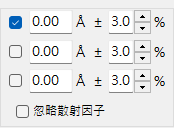
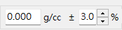

<!-- 260601Cl: migrated from legacy docx + yseto.net web manual -->
# 晶體參數

按一下主視窗工具列上的 `Crystal Parameter` 圖示，會開啟下圖所示的子視窗。在這裡設定要顯示哪些結晶的繞射峰，以及這些峰要如何繪製。視窗下半部內建了用於搜尋與匯入結構的結晶資料庫。

視窗大致分為四個主要區域。

| 區域 | 用途 |
| --- | --- |
| `Diffraction Peak Option` | 繞射線的顯示方式 |
| `Crystal List` | 與主視窗共用的結晶勾選清單 |
| `Crystal Information` | 所選結晶的詳細參數（分頁） |
| `Crystal database` | 以 AMCSD 為基礎的搜尋與匯入 |

---

## Diffraction Peak Option

設定繞射線的顯示方式。

### Show peaks over profiles

選擇是否將繞射線疊加顯示在圖譜資料上。

### Calculate intensity ratio {#calculate-intensity-ratio}

選擇是否依據結構資料計算繞射強度（比率）。

!!! note
    若尚未輸入原子位置，無論勾選狀態為何，都不會計算強度。輸入原子資料的方式請參閱 [原子資訊分頁](#atom-info-tab)。

### Scalable intensity

選擇是否可在不改變相對強度比的情況下，整體縮放所有繞射線。

### Show peaks under profile

選擇是否在圖譜下方繪製繞射峰。

#### Peak height

以像素（`pixel`）為單位，設定圖譜下方所繪峰的高度。

### Combine adjacent peaks

選擇是否合併結晶學上非等價、但 2θ 值幾乎相同或完全相同的峰的強度。

例如，在立方晶系中 (333) 與 (115) 面雖為非等價，卻具有完全相同的晶面間距(d值)，因此在觀測上會重疊。勾選此方塊即可顯示它們合併後的強度。

| Item | Description |
| --- | --- |
| `Angle threshold` | 峰要多接近才會被合併，以角度（`°`）表示。 |
| `Energy threshold` | 針對能量色散資料，以能量（`eV`）表示的合併範圍。 |

!!! tip
    舊版手冊以埃（ångström）表示閾值，但現行版本則依橫軸類型，以角度（`°`）或能量（`eV`）指定。

### Hide peaks below

選擇是否移除相較於最強繞射線過弱的峰。截止值以相對於最強線的比率（`rel.%`）表示。

### Show peak indices

選擇要為哪些結晶標示繞射線指數（米勒指數）。

| Option | Target |
| --- | --- |
| `all checked crystals` | 所有已勾選的結晶 |
| `only selected crystal` | 僅清單中目前選取的結晶 |

---

## Crystal List

這裡顯示與主視窗的 Profile 勾選清單相同的資訊。已勾選的結晶，其繞射線會顯示於主視窗中。每一列會顯示勾選方塊（`Check`）、繪製顏色（`PeakColor`）以及結晶名稱（`Crystal`）。

### Up/Down arrow buttons (↑ / ↓)

變更結晶的排列順序。

!!! note
    第 1 到第 6 列保留給狀態方程（EOS）使用，無法重新排序。詳情請參閱 [Equation of state](5-equation-of-states.md)。

### Add

將右側結晶資訊區域（詳見下文）中設定的結晶，以新項目的形式加入清單。

### Replace

以右側結晶資訊區域中設定的結晶，取代目前選取的結晶。

### Delete

從清單中移除目前選取的結晶。

### Delete all

從清單中移除所有結晶。

---

## Crystal Information {#crystal-information}

以多個分頁編輯並顯示所選結晶的詳細資訊。主要分頁如下。

| Tab | Contents |
| --- | --- |
| `基本資訊` | 晶格常數、晶系、空間群等基本資訊 |
| `原子資訊` | 原子種類、佔有率、座標與溫度因子 |
| `Ref.` | 出處論文、作者等參考文獻資訊 |
| `EOS` | 壓縮與熱膨脹的狀態方程設定 |

### 基本資訊分頁

設定晶格常數（a, b, c, α, β, γ）、晶系、空間群等基本資訊。選擇空間群後，可編輯的晶格常數與原子座標的自由度會自動受到限制。

!!! tip
    在晶格常數欄位按滑鼠右鍵，會顯示可將晶格常數還原至應用程式啟動時（或從資料庫匯入結構時）數值的選單。在透過精修變更數值後，想要恢復為原始參考值時相當方便。

### 原子資訊分頁 {#atom-info-tab}

設定每個原子的元素、佔有率、分率座標，以及等向性／非等向性溫度因子。在此輸入原子位置後，即可透過 [Calculate intensity ratio](#calculate-intensity-ratio) 計算繞射強度。

### Ref. tab

保存作為結晶結構出處的論文標題、期刊名稱及作者等參考文獻資訊。從結晶資料庫匯入的結構會自動填入此資訊。

### EOS tab

設定各結晶的狀態方程（EOS），用以決定晶格常數如何隨壓力與溫度變化。主要輸入欄位如下。

| Field | Description |
| --- | --- |
| `Use EOS` | 為此結晶啟用 EOS 壓力計算。 |
| `T0` / `Temperature` | 參考溫度／量測溫度。 |
| `V0` | 參考晶胞體積。 |
| `K0`, `K'0` | 等溫體積模數及其壓力導數。 |
| Isothermal form | `BM3`（三階 Birch-Murnaghan，預設）／ `BM4` ／ `Vinet` ／ `AP2` ／ `Keane`。 |
| Thermal pressure | `Mie-Grüneisen`（預設；參數 \( \gamma_0, \theta_0, q \)）／ `T-dependence K0&V0`。 |

各公式與符號定義請參閱 [Equation of state](5-equation-of-states.md)。

---

## Crystal database

提供超過 20,000 筆結晶結構的搜尋與匯入功能。此資料庫以 American Mineralogist Crystal Structure Database（AMCSD）為基礎。

!!! warning "Citation"
    使用此結晶資料時，請詳閱 <http://rruff.geo.arizona.edu/AMS/amcsd.php>，並務必引用以下文獻。

    > Downs, R.T. and Hall-Wallace, M. (2003) The American Mineralogist Crystal Structure Database. *American Mineralogist* **88**, 247-250.

### Table

列出資料庫中所收錄的結晶。若已輸入搜尋條件，則僅顯示符合條件的結晶。

在表格中選取任一結晶，會將其資訊傳送至 [Crystal Information](#crystal-information)。若要將其加入結晶清單，請在結晶清單區域按下 `Add` 或 `Replace` 按鈕。

### Search options

輸入搜尋條件。輸入後按下 `Search` 按鈕或 Enter 鍵。每個條件都可透過其勾選方塊啟用或停用。

#### Name

輸入結晶名稱。

#### Elements

按下 `Periodic Table` 按鈕會開啟另一個視窗，用來選擇要搜尋的元素。每個元素按鈕每按一次就會切換其狀態。

視窗上方的按鈕可一次切換所有元素的狀態。

| Button | Meaning |
| --- | --- |
| `may or not include` | 該元素可含可不含（清除所有元素的限制條件）。 |
| `must include` | 必須包含（僅保留包含所有指定元素的結晶）。 |
| `must exclude` | 必須排除（移除包含任一指定元素的結晶）。 |

!!! tip
    勾選 `Ignore scattering factor` 可在不考慮散射因子的情況下進行搜尋。

#### Reference

輸入論文標題、期刊名稱或作者姓名。

#### Crystal System

以指定晶系的方式搜尋。

#### Cell Params

輸入晶格常數及容許誤差。

#### d-spacing

輸入強繞射線的晶面間距(d值)及容許誤差。

#### Density

輸入密度及容許誤差。
