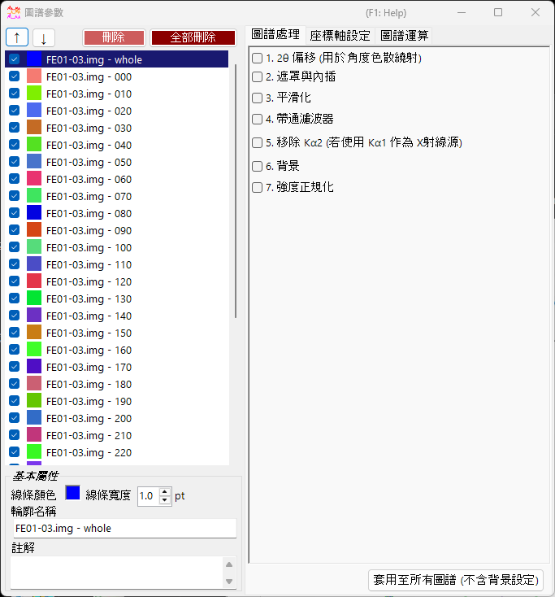
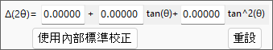
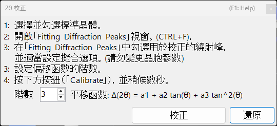
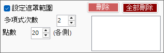
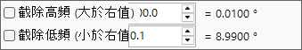
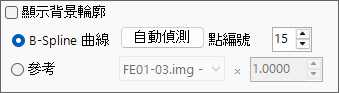
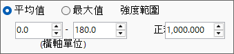

<!-- 260601Cl: migrated from legacy docx + yseto.net web manual -->
# 圖譜參數

按一下主視窗上的 `Profile parameter` 圖示，即可開啟這個子視窗。您可以在此對已載入的圖譜進行詳細設定，並套用各種數值處理。

視窗左側是 [Profile 檢查清單](#profile)，右側則分為三個頁籤 — [圖譜處理](#profile-processing)、[座標軸設定](#axis-setting)、[圖譜運算](#profile-operator)。每個處理步驟都可用核取方塊切換開/關，並依由上而下的順序套用。

!!! note
    在此視窗所做的設定，會即時反映到 [主視窗](1-main-window.md) 的圖譜上。至於晶體側的設定，例如橫軸單位、繞射線的指數標籤等，請參閱 [Crystal Parameter](3-crystal-parameter.md)。

---

## Profile 檢查清單 {#profile}

視窗左側的清單，顯示與主視窗 Profile 檢查清單相同的資訊。在清單中選取一個圖譜後，該圖譜即成為視窗右側各項處理與設定的對象。

| 項目 | 說明 |
| --- | --- |
| `↑` `↓`（上下箭頭按鈕） | 變更圖譜在清單中的排列順序。 |
| `Delete` | 刪除選取的圖譜。 |
| `Delete all` | 刪除所有圖譜。 |

在清單下方的 `Basic property` 區域，可編輯選取圖譜的基本屬性。

| 項目 | 說明 |
| --- | --- |
| `Line Color` | 按一下即可變更選取圖譜的繪圖顏色。 |
| `Line Width` | 設定圖譜的線條粗細（`pt`）。 |
| `Profile Name` | 設定圖譜的名稱。 |
| `Comment` | 自由輸入的註解欄位。 |

---

## 圖譜處理 {#profile-processing}

在 `Profile processing` 頁籤中，可對選取的圖譜套用各種數值處理。步驟 1–7 各自可用核取方塊獨立啟用，已啟用的項目會依編號順序套用。

### 1. 2θ offset {#two-theta-offset}

`1. 2θ offeset (for angle-dispersive diffractmetry)` 用於修正角度分散型繞射資料的角度。修正式是關於 \( \tan\theta \) 的二次函數。

$$ \Delta(2\theta) = a_0 + a_1 \tan\theta + a_2 \tan^2\theta $$

若圖譜中包含內部標準物質（晶格常數已知的樣品），可按下 `Calibration using an internal standard` 按鈕，並依照提示訊息操作；二次函數的係數即會自動決定。在校正對話方塊中，觀測峰位會與標準物質的理論峰位進行對應，並擬合出係數。

`Reset` 按鈕可將您已設定的偏移係數重設。

!!! tip
    內部標準物質通常是晶格常數已精確測定的材料，例如 Si 或 LaB₆。校正完成後，修正過的 2θ 值會直接用於後續的所有分析。

### 2. Mask and Interpolation {#mask}

`2. Mask and Interpolation` 會遮罩指定的角度範圍（或能量範圍），並使用遮罩範圍外側的強度對圖譜進行內插。

| 項目 | 說明 |
| --- | --- |
| `Set Masking range` | 指定要遮罩的橫軸範圍。 |
| `Point No.` | 指定內插時所使用的端點（各側）點數。 |
| `Polynomial order` | 指定內插所使用多項式的次數。 |
| `Save Masking Ranges` / `Read Masking Ranges` | 將設定的遮罩範圍儲存至檔案，或讀回設定。 |
| `Delete` / `Delete all` | 刪除個別遮罩範圍，或刪除全部遮罩範圍。 |

### 3. Smoothing {#smoothing}

`3. Smoothing` 會對選取的圖譜套用平滑化處理。平滑化演算法採用 `Savitzky-Golay` 方法。

此方法會針對每個感興趣的 \(x\) 位置，對該點 \(\pm\) `Point No.` 範圍內的資料，以 `Order` 次多項式進行最小二乘法擬合，並將所得函數 \(F(x)\) 的值，採用為該 \(x\) 位置的新強度值。

!!! note
    當 `Order` \(= 1\) 時，Savitzky–Golay 平滑化等同於簡單移動平均。增加 `Order` 可更好地保留峰形，增加 `Point No.` 則會加強平滑化效果。

### 4. Bandpass filter {#bandpass}

`4. Bandpass filter` 使用傅立葉變換（FFT）截除高於或低於指定頻率的成分。

| 項目 | 說明 |
| --- | --- |
| `Cut high-freq. over` | 移除頻率高於指定值的成分（降低高頻雜訊）。 |
| `Cut low-freq. under` | 移除頻率低於指定值的成分（去除緩慢變化的背景）。 |

### 5. Remove Kα2 {#remove-ka2}

`5. Remove Kα2 (if Kα1 is used as X-ray source)`：若選取的圖譜是以 Kα1 與 Kα2 未分離的 X 射線測量所得，且載入時指定為 Kα1，勾選此項即可去除源自 Kα2 的繞射強度。

!!! warning
    此處理僅在選定 Kα1 作為 X 射線源時有效。請在 [座標軸設定](#axis-setting) 頁籤中確認並設定橫軸單位與輻射種類。

### 6. Background {#background}

`6. Background` 會從圖譜中減除背景，有兩種方法。

#### B-Spline curve

按下 `Auto Detect` 即可自動計算並減除背景。透過 `Point No.` 可設定自動搜尋背景控制點的最大數量。

您也可以手動變更控制點。以滑鼠拖曳主視窗上繪製的圓形控制點，即可建立合適的曲線。

#### Reference

您可以指定另一個圖譜作為選取圖譜的背景。勾選 `Show background profile` 即可顯示目前作為背景使用的圖譜。

!!! note
    背景減除（步驟 6）不包含在下述 `Apply for all profiles` 按鈕的批次套用範圍內。

### 7. Normalize intensity {#normalize}

`7. Normarize intensity` 會將圖譜正規化，使指定橫軸範圍內的 `Average` 或 `Maximum` 成為指定的強度值。

| 項目 | 說明 |
| --- | --- |
| `Average` / `Maximum` | 選擇以範圍內的平均值或最大值作為基準。 |
| `intensity between` | 指定要處理的橫軸範圍。 |
| `to` | 指定正規化後的目標強度值。 |

### Apply for all profiles button {#apply-all}

`Apply for all profiles (without background setting)` 按鈕，會將步驟 1–7 的設定（**不含 6. Background**）一次套用到所有圖譜。

---

## 座標軸設定 {#axis-setting}

在 `Axis setting` 頁籤中，可變更選取圖譜的橫軸單位、輻射（入射光束）種類，以及入射光束能量。

| 項目 | 說明 |
| --- | --- |
| `Horizontal axis setting` | 變更目前的橫軸單位（`horizontal unit`）。搭配 `Shift` 也可以將整個橫軸偏移。 |
| `Exposure Time` | 設定 CPS 模式（`(for CPS mode)`）所使用的曝光時間（`sec.`）。 |
| `Vertical axis setting` | 與縱軸相關的設定。 |

!!! note
    此處的座標軸設定會變更圖譜本身所持有的物理資訊（單位、輻射種類、能量）。這與主視窗中僅供顯示用的座標軸轉換不同，會影響資料本身的解讀方式。由於輻射種類與能量會直接影響繞射線位置的計算，請務必設定正確的數值。

---

## 圖譜運算 {#profile-operator}

在 `Profile Operator` 頁籤中，可對多個圖譜進行平均化，以及在圖譜之間進行算術運算。

指定要計算的目標圖譜與欲執行的運算後，按下 `Calculate` 按鈕，運算結果即會以新圖譜的形式新增。

| 模式 | 說明 |
| --- | --- |
| `Average` | 將多個圖譜平均化。 |
| `Profile and value` | 在圖譜與純量值之間進行運算。 |
| `Two profiles` | 在兩個圖譜之間進行算術運算（例如加法）。 |

透過 `Output name of the profile` 可指定產生之圖譜的名稱（預設值為 `Result #01`）。

!!! tip
    此功能可用於，例如將多次測量的資料平均化以提升訊噪比（S/N），或取兩個圖譜的差值以擷取其間的變化。
