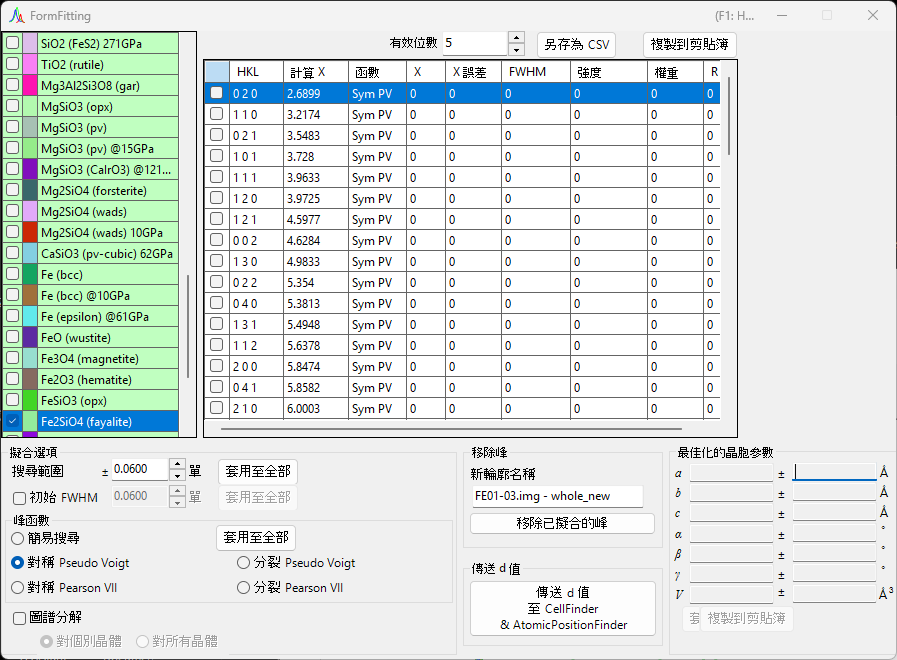
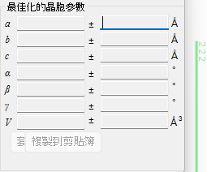
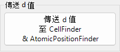
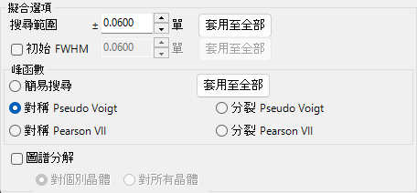
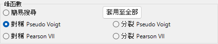
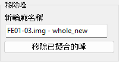
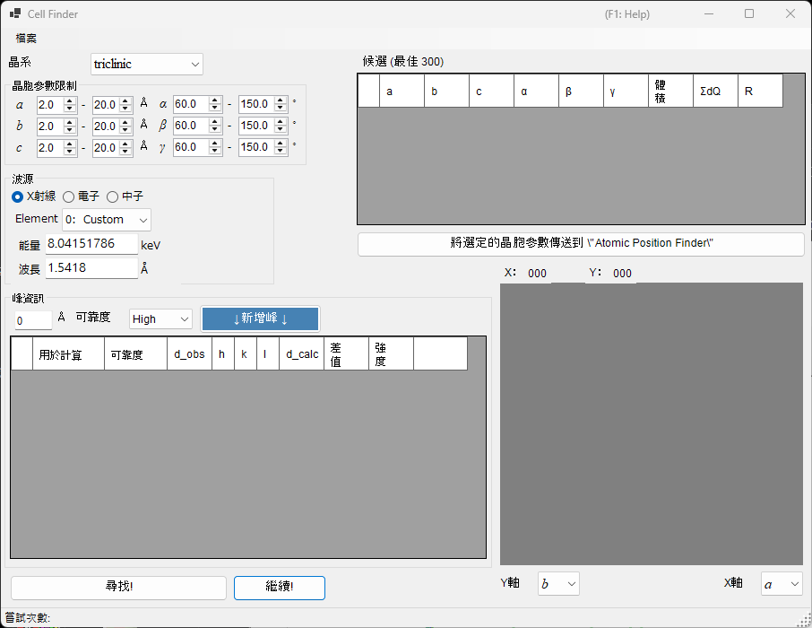
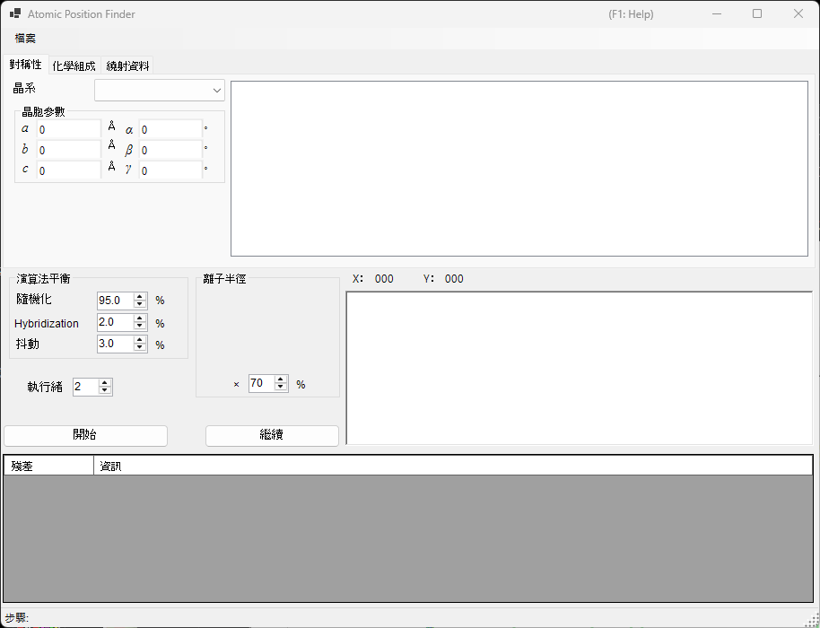

<!-- 260601Cl: migrated from legacy docx + yseto.net web manual -->
# 繞射峰擬合

`Fitting diffraction peaks` 工具會以合適的函數擬合繞射圖譜的峰，從各峰位置 2θ 求出晶面間距(d值)，並以最小二乘法精修晶格常數。可從主視窗的工具列啟動。

## 基本操作流程

1. 在晶體清單中選取目標晶體（在多重圖譜模式下，也一併選取要處理的圖譜）。
2. 在主視窗中用滑鼠拖曳繞射線，使其盡量與量測到的峰重疊。
3. 從繞射峰清單（勾選清單方塊）中選擇要擬合的繞射線指數。
4. 一旦選取了足以求解最小二乘法計算的獨立指數，最可能的晶格常數就會連同誤差一起顯示在右下方的 `Optimized cell constants`（最佳化的晶胞參數）面板中。
5. 按下 `Apply to the crystal`（套用至晶體）即可將精修後的晶格常數回寫到主程式中的晶體。

!!! note "勾選並選取晶體"
    此處的晶體清單與主視窗中的相同。要讓擬合生效，目標晶體必須同時被勾選且被選取。

## 晶體清單

左上方的晶體清單包含與主視窗相同的晶體。在此勾選並選取的晶體即成為擬合的對象。詳情請參閱 [晶體參數](3-crystal-parameter.md)。

## 繞射峰清單

此處列出所選晶體的繞射線。勾選某一列的核取方塊，即可將該繞射線設為擬合對象。清單包含以下欄位。

| 欄位 | 內容 |
| --- | --- |
| `Check` | 是否將此線納入擬合 |
| `PeakColor` | 顯示顏色 |
| `Crystal` | 晶體名稱 |
| `HKL` | 反射指數 |
| `Calc X` | 計算所得的繞射線位置 |
| `Func` | 所使用的峰函數 |
| `X` | 擬合求得的峰位置 |
| `X Err` | 峰位置的誤差 |
| `FWHM` | 半高全寬 |
| `Intensity` | 峰強度 |
| `Weight` | 最小二乘法擬合中的權重 |
| `R` | 擬合的殘差指標 |

清單下方的按鈕可匯出結果。

- `Copy to clipborad`: 將表格複製到剪貼簿。可直接貼到 Excel 等應用程式中。
- `Save as CSV`: 將表格另存為 `.csv` 檔案。`Effective digit`（有效位數）用於設定小數位數。
- `Clear peaks`: 清除擬合結果。

## Fitting option（擬合選項）

在此進行擬合峰圖譜時所使用的詳細設定。

### Search Range / Initial FWHM

- `Search Range`（搜尋範圍）: 設定進行擬合的範圍。也就是說，計算所得繞射線位置 ±Search Range 的區域，會被視為該峰的擬合對象範圍。
- `Initial FWHM`（初始半高全寬）: 指定圖譜函數的初始半高全寬。作為最小二乘法收斂的起始值使用。

按下 `Apply to all`（套用至全部）會將目前的設定一次套用到所有繞射線。

### Peak function（峰函數）

選擇擬合所使用的峰函數。

| 峰函數 | 內容 |
| --- | --- |
| `Simple Search` | 不進行函數擬合，將計算所得繞射線位置 ±Search Range 範圍內強度最強的點視為峰位置。 |
| `Symmetric Pseudo Voigt` | 以左右對稱的擬 Voigt 函數擬合。 |
| `Symmetric Pearson VII` | 以左右對稱的 Pearson VII 函數擬合。 |
| `Split Pseudo Voigt` | 以左右不對稱（分裂型）的擬 Voigt 函數擬合。 |
| `Split Pearson VII` | 以左右不對稱（分裂型）的 Pearson VII 函數擬合。 |

!!! tip "建議使用的函數"
    若無特殊理由，建議使用穩定性較佳的 `Symmetric Pseudo Voigt`。

擬 Voigt 函數是高斯函數 \(G(x)\) 與勞侖茲函數 \(L(x)\) 以混合參數 \(\eta\) 線性組合而成，公式如下：

$$
\mathrm{pV}(x) = \eta\, L(x) + (1-\eta)\, G(x), \qquad 0 \le \eta \le 1
$$

其中 \(\eta\) 為勞侖茲成分所佔的比例。分裂型則是在峰位置左右分別獨立取用半高全寬等參數，藉此表現不對稱的圖譜形狀。

### Pattern Decomposition（圖譜分解）

當所選取的兩條以上繞射線之 Search Range 發生重疊時，此選項用於選擇是否進行圖譜分解（同時擬合重疊的峰）。

- `in each crystal`（對個別晶體）: 針對每個晶體各自獨立進行圖譜分解。
- `between crystals`（對所有晶體）: 跨越所有晶體進行圖譜分解。

## Optimized cell constants（最佳化的晶胞參數）

一旦選取了足以使最小二乘法計算可解的獨立指數，此面板會顯示最可能的晶格常數 \(a, b, c, \alpha, \beta, \gamma\) 與體積 \(V\)，並各自附上誤差（`±`）。

!!! note "關於 NA 顯示"
    當自由度不足時——也就是自由度等於所擬合峰的數量，或某一晶格常數不具自由度時——會以 `NA` 取代誤差值顯示。選取足夠數量的獨立反射即可計算出誤差。

- `Apply to the crystal`（套用至晶體）: 將精修後的晶格常數回寫到主程式中所選取的晶體。
- `Copy to Clipboard`（複製到剪貼簿）: 將最佳化的晶格常數複製到剪貼簿。
- `Reset take off angle`: 重設取出角。

## Remove fitted peaks（移除已擬合的峰）

此功能會從圖譜中減去已擬合的峰，並將殘差圖譜輸出為新的圖譜。在 `New profile name`（新輪廓名稱）中輸入目的地名稱，再按下 `Remove fitted peaks`（移除已擬合的峰）即可執行相減。適用於確認背景或重疊峰的分離情形。

## 相關工具（Send d-values）

按下 `Send d-values to CellFinder && AtomicPositionFinder` 會將擬合所得的 d 值傳送到以下分析工具，這些工具同樣可從工具列啟動。

### Cell Finder

`Cell Finder` 會從一組量測到的峰位置（d 值清單）反推，搜尋出可解釋這些位置的晶胞（晶格常數）。用於未知樣品的指標化。

### Atomic Position Finder

`Atomic Position Finder` 會根據所觀測反射的強度等量，搜尋晶體結構中的原子位置。

!!! tip "鑑定未知樣品"
    以 `Cell Finder` 求出晶格常數後，將該晶體登錄到晶體清單中，即可用本工具的最小二乘擬合進一步精修晶格常數。
