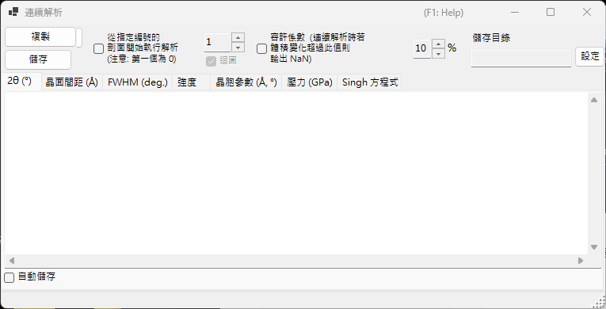
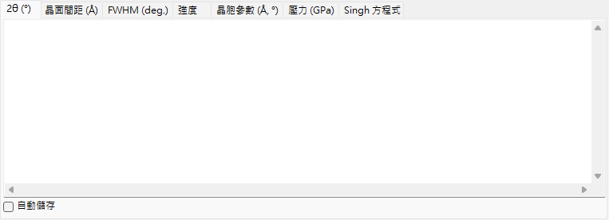
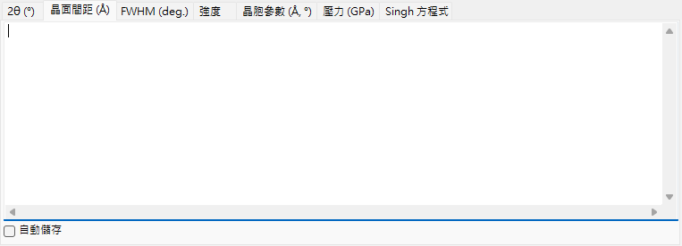
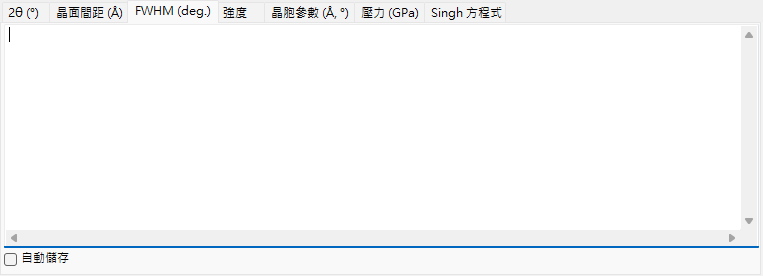
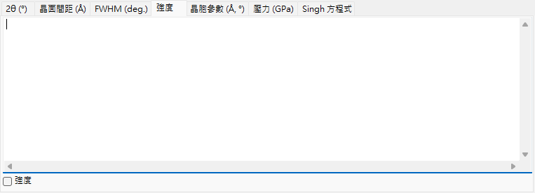
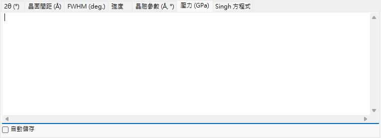
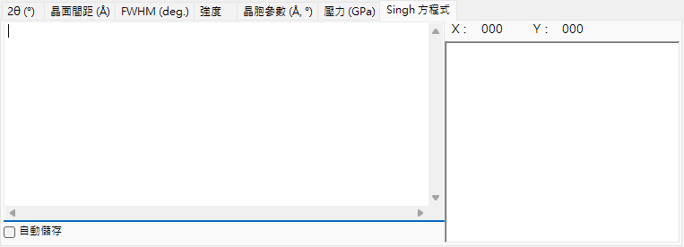

<!-- 260601Cl: migrated from legacy docx + yseto.net web manual -->
# 連續分析

`連續分析` (Sequential Analysis) 會對已載入的多個剖面依序執行相同的峰擬合，並將結果依量分類彙整輸出。它適用於在溫度、壓力、時間等條件變化下依序量測的一系列剖面：一次處理整個序列，並在各自的分頁中，將每條繞射線的 2θ、晶面間距(d值)、半高全寬、強度、晶胞參數、壓力，以及 Singh 方程式 (單軸應力／晶格應變分析) 的結果整理成表格。

使用主視窗工具列上的 `Sequential Analysis` 按鈕來開啟與關閉此視窗。

!!! note "與[繞射峰擬合](6-fitting-diffraction-peaks.md)共用設定"
    連續分析與 `Fitting diffraction peaks` 視窗共用擬合設定。請先開啟 `Fitting diffraction peaks` 視窗，選擇欲解析的晶體，並勾選欲擬合的繞射線 (峰)。若在按下 `執行` 時尚未完成這些準備，畫面會顯示提示訊息。

## 基本流程

1. 載入在條件變化下量測的整個序列剖面 (至少需要 4 個剖面)。
2. 開啟[繞射峰擬合](6-fitting-diffraction-peaks.md)視窗，選擇欲解析的晶體，並勾選欲解析的繞射線。此處設定的擬合函數與搜尋範圍會被連續分析沿用。
3. 視需要設定起始編號、迴圈、容許係數、自動儲存等選項 (見下文)。
4. 按下 `執行`。已載入的各剖面會依序被啟用，執行最小二乘法擬合，並將結果累積於各分頁中。
5. 確認各分頁內容，並以 `複製` 或 `儲存` 將資料匯入試算表 (Excel 等)。

視窗下方的狀態列會顯示進度與經過時間，格式為 `... % completed.  Elapsed time: ... sec`。解析完成後，2θ、晶面間距(d值)、半高全寬與強度的結果會一併複製到剪貼簿。

!!! tip "每個剖面擬合兩次"
    為了取得穩定的收斂結果，每個剖面在記錄結果前都會執行兩次最小二乘法擬合。

## 解析選項

`執行` 按鈕周圍的控制項用於設定解析範圍與離群值的處理方式。

| 選項 | 說明 |
| --- | --- |
| `從指定編號的剖面開始執行解析 (注意: 第一個為 0)` | 勾選後，會從右側方塊所設定的剖面編號開始解析，而非從第一個剖面開始。第一個剖面的編號為 0。 |
| `迴圈` | 指定起始編號時，到達序列末尾後，會接著處理先前被跳過的剖面 (0 … 起始編號 − 1)，回頭補齊，使整個序列都被解析。僅在啟用起始編號時可用。 |
| `容許係數 (連續解析時若體積變化超過此值則輸出 NaN)` | 勾選後，當精修後的晶胞體積相對於初始值的變化超過右側所設定的數值 (%) 時，會捨棄該次擬合 (該列輸出 `NaN`)。可自動剔除因擬合失敗造成的離群值。 |

## 輸出分頁

每個分頁對應一個輸出量的表格。每一列對應一個剖面 (剖面名稱)，每一欄對應所選的一條繞射線 (hkl 指數；若為 flexible crystal 則為 `Peak No.`)。表格以定位字元分隔的文字形式保存，於 `複製` 或 `儲存` 時會轉換為逗號分隔值 (CSV)。

### 2θ (°)

各剖面、各繞射線經擬合得到的峰位置，以 2θ (度) 表示。

### 晶面間距(d值) (Å)

由各峰位置算出的面間距 d，以 Å 為單位。由波長與 2θ 依 \( d = \dfrac{\lambda}{2\sin\theta} \) 求得。

### 半高全寬 (deg.)

各峰的半高全寬 (FWHM)，以 2θ 度數表示，可用於追蹤峰寬的變化。

### 強度

各峰的積分強度 (面積)，可用於追蹤伴隨相變或織構變化而產生的強度變化。

### 晶胞參數 (Å, °)

各剖面精修後的晶胞體積 `V`、晶胞邊長 `A`、`B`、`C` (Å)、軸角 `Alpha`、`Beta`、`Gamma` (°)，以及各自的估計誤差 (`_err` 欄)。

### 壓力 (GPa)

由各剖面的晶胞參數，透過[狀態方程](5-equation-of-states.md)求得的壓力。當 `Equation of State` 視窗中選擇了 Gold、Pt、NaCl (B1/B2)、MgO、Corundum、Ar、Re、Mo、Pb 等壓力標準物質時，每位研究者 (每個發表的標度) 各對應一欄。未選擇標準物質時，則由目標晶體所設定的狀態方程算出壓力。

### Singh 方程式

Singh 單軸應力／晶格應變分析的結果。將各剖面名稱結尾的數值解讀為方位角 \( \psi \) (度)，並對每個反射以最小二乘法 (Levenberg–Marquardt) 擬合方位角與 d 值的關係。針對每個反射，可求得無應力晶面間距 `d0`、最大應變方位角 `Ψmax`，以及與應力成正比的量 `t/6Ghkl` (差應力 \( t \) 與剪切模數 \( G_{hkl} \) 之比)。擬合曲線也會繪製於該分頁的圖表中。

!!! note "Singh 方程式的適用條件"
    此分頁僅適用於剖面名稱結尾為 `...-whole` 的「應力解析模式」序列。每個剖面名稱結尾都必須帶有方位角 (例如 `...-30`)。若為一般序列，此分頁不會更新。

Singh 方程式所表示的方位角相依晶面間距，近似為

$$ d(\psi) = d_0 \left[ 1 + \alpha - 3\,\alpha \left( 1 - \frac{\lambda^2}{4 d^2} \right) \cos^2(\psi - \psi_{\max}) \right] $$

其中 \( \alpha \) 對應 `t/6Ghkl`，\( \psi_{\max} \) 為最大應變的方位角。

## 匯出結果

| 動作 | 說明 |
| --- | --- |
| `複製` | 將目前顯示的分頁內容以 CSV (逗號分隔) 格式複製到剪貼簿。 |
| `儲存` | 將目前顯示的分頁內容儲存為 CSV 檔 (檔名於對話方塊中指定)。 |

### 自動儲存

每個分頁都有 `自動儲存` 核取方塊，可在 `執行` 後自動將對應的量寫出為 CSV 檔。目的地會顯示於 `儲存目錄`，並以 `設定` 按鈕選擇。檔名依剖面名稱的共同部分產生，並依量的種類附加後綴：`_2theta.csv`、`_d.csv`、`_fwhm.csv`、`_intensity.csv`、`_cell.csv`、`_pressure.csv` 或 `_Singh.csv`。

!!! tip "設定儲存目的資料夾"
    若已勾選自動儲存，但尚未設定目的資料夾 (不存在)，按下 `執行` 時會開啟資料夾選擇對話方塊。

## 從巨集使用

連續分析的每一項輸出，也都可以從巨集 (Python 指令碼) 取得。它們對應[巨集](8-macro.md)中的 `PDI.Sequential` 類別。

| 巨集函數 | 對應分頁 |
| --- | --- |
| `PDI.Sequential.Open()` / `Close()` | 開啟／關閉視窗 |
| `PDI.Sequential.Execute()` | 執行連續分析 |
| `PDI.Sequential.GetCSV_2theta()` | 2θ |
| `PDI.Sequential.GetCSV_D()` | 晶面間距(d值) |
| `PDI.Sequential.GetCSV_FWHM()` | 半高全寬 |
| `PDI.Sequential.GetCSV_Intensity()` | 強度 |
| `PDI.Sequential.GetCSV_CellConstants()` | 晶胞參數 |
| `PDI.Sequential.GetCSV_Pressure()` | 壓力 |
| `PDI.Sequential.GetCSV_Singh()` | Singh 方程式 |

每個 `GetCSV_...()` 都會將對應分頁的內容以 CSV 字串傳回。`PDI.Sequential.Directory` 可取得／設定目的資料夾，搭配 `PDI.File.SaveText(...)` 即可將結果寫入檔案。詳情請參閱[巨集](8-macro.md)。
