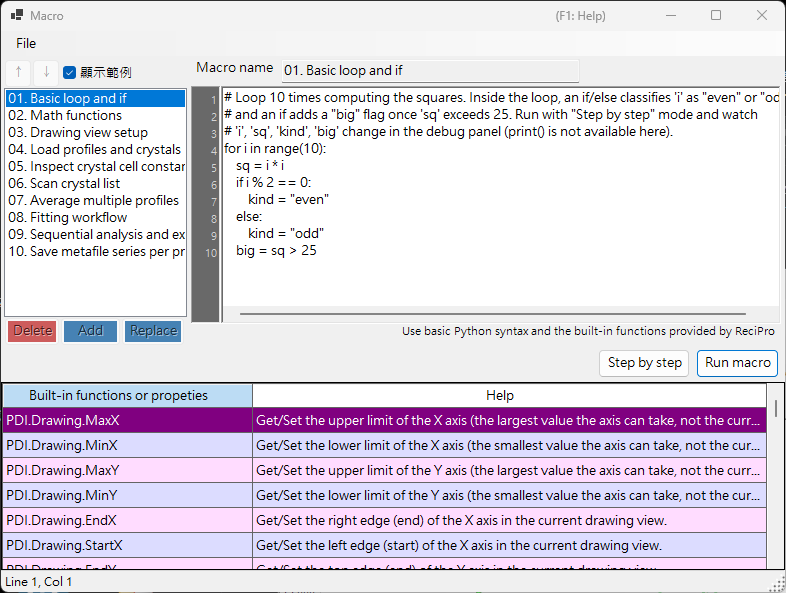

<!-- 260601Cl: migrated from legacy docx + yseto.net web manual -->
# 巨集

PDIndexer 的大多數操作都可以使用**巨集**功能自動化。巨集是以 [IronPython](https://ironpython.net/)（在 .NET 上執行的 Python 實作）撰寫的 Python 指令碼，在專用的巨集編輯器視窗中編輯與執行。可用於自動化重複性作業、批次處理多個檔案，以及將結果批次匯出為 CSV 或影像檔案。



!!! note "Python 基本知識"
    巨集可直接使用標準 Python 語法（`for` 迴圈、`if`/`else`、串列、函式等）。本頁不說明 Python 語言本身。PDIndexer 專屬的功能透過下述的 `PDI` 物件呼叫。

## 開啟巨集編輯器

從主視窗選單列選擇**巨集 → 編輯器**，即可開啟巨集編輯器視窗（標題為 `Macro`）。

在編輯器中建立並儲存的巨集，也會以名稱列在**巨集**選單下，因此可直接從選單執行。巨集清單會在 PDIndexer 結束時自動儲存，並於下次啟動時還原。

## 編輯器視窗的版面配置

編輯器視窗由以下部分組成。

| 部分 | 說明 |
| --- | --- |
| 巨集清單（左側） | 已儲存巨集名稱的清單。點按項目即可將該巨集載入右側的編輯器。 |
| 程式碼編輯器（中央） | 輸入 Python 指令碼的區域。支援行號槽、自動縮排、輸入補全（自動完成）與函式工具提示。 |
| 函式參考表 | `PDI` 下所有可用函式的列表。雙擊儲存格即可將該函式名稱插入游標所在位置的程式碼中。 |
| 除錯面板（右側） | 於逐步執行時，顯示目前時間點的變數名稱與數值。 |
| 狀態列 | 顯示目前的游標位置（`Line` / `Col`）。 |

### 清單操作按鈕

使用下列按鈕編輯巨集清單。

| 按鈕 | 動作 |
| --- | --- |
| `Add` | 以名稱欄輸入的名稱，將目前的程式碼新增至清單（若已有同名項目，會提示是否覆寫）。 |
| `Replace` | 以目前的程式碼內容取代清單中選取的巨集。 |
| `Delete` | 從清單中移除選取的巨集。 |
| `↑` / `↓` | 在清單內上移或下移選取的巨集。 |
| `顯示範例` | 切換內建範例巨集集的顯示（詳見下方）。 |

!!! tip "儲存與載入"
    巨集可儲存為個別的 `.mcr` 檔案，也可從中載入。將 `.mcr` 檔案拖放至編輯器視窗即可載入其內容。編輯後按下 `Ctrl+S`，會覆寫儲存目前選取的巨集。

## 執行巨集

使用程式碼編輯器下方的按鈕執行巨集。

| 按鈕 | 動作 |
| --- | --- |
| `Run macro` | 從頭到尾正常執行整個巨集。 |
| `Step by step` | 逐行執行巨集。每行執行前會暫停，並在右側的除錯面板中顯示目前的變數值。 |
| `Next step (F10)` | 於逐步執行時前進至下一行（`F10` 鍵亦可）。 |
| `Stop` | 中止執行。中止僅在 `Step by step` 執行期間有效。 |

!!! warning "無法使用 print()"
    巨集編輯器沒有標準輸出主控台，因此不會顯示 `print()` 的輸出。若要檢視變數的值，請以 `Step by step` 模式執行巨集，並在除錯面板中觀察數值的變化。

### 範例巨集

勾選 `顯示範例` 按鈕，即可在清單中顯示內建的範例巨集（唯讀）。範例會以目前的 UI 語言（英文／日文）顯示。可將其作為撰寫自訂巨集的參考。內建範例包括：

| 名稱 | 內容 |
| --- | --- |
| 01. Basic loop and if | `for` 迴圈與 `if`/`else` 的基礎 |
| 02. Math functions | 使用 `math` 模組（`pi`, `sin`, `sqrt`, `exp`, `log` 等） |
| 03. Drawing view setup | 以 `PDI.Drawing.SetBounds` 設定顯示範圍 |
| 04. Load profiles and crystals | `PDI.File.ReadProfiles` / `ReadCrystals` |
| 05. Inspect crystal cell constants | 透過 `PDI.Crystal` 讀取晶格常數、體積與壓力 |
| 06. Scan crystal list | 迴圈走訪 `PDI.CrystalList` 的所有項目 |
| 07. Average multiple profiles | `PDI.ProfileOperator.Average` |
| 08. Fitting workflow | 完整的 `PDI.Fitting` 流程 |
| 09. Sequential analysis and export | 執行 `PDI.Sequential` 並匯出 CSV |
| 10. Save metafile series per profile | 為每個圖譜批次儲存一個 EMF |

!!! note "math 模組已預先匯入"
    編輯器啟動時會自動執行 `import math`，因此可直接使用 `math` 模組，例如 `math.sqrt(2)`，而不需要明確的 `import` 陳述式。

---

## 函式參考

所有 PDIndexer 專屬的功能，都是透過根物件 `PDI` 下的類別呼叫。`PDI` 在巨集作用域中已可直接使用，不需要 `import`。

以下各表皆轉錄自原始碼中的 `[Help]` 屬性。編輯器視窗內的函式參考表，以及 [web 手冊第 6 章](https://yseto.net/soft/pdi/pdi_06)中，也列有相同的清單。

!!! note "標記說明"
    在簽章欄中，`(get/set)` 代表可讀寫的屬性，`(get)` 代表唯讀屬性。附有 `= 值` 的引數為預設引數，可省略。

### PDI（根物件）

| 成員 | 簽章 | 說明 |
| --- | --- | --- |
| `Sleep` | `Sleep(int millisec)` | 暫停巨集執行指定的毫秒數。 |
| `Obj` | `Obj (get/set)` | 取得／設定從其他程式傳入的物件（跨處理程序引數）。 |

### PDI.File — 檔案輸入輸出

| 成員 | 簽章 | 說明 |
| --- | --- | --- |
| `GetDirectoryPath` | `GetDirectoryPath(string filename = "")` | 取得目錄路徑（結尾附反斜線）。若省略 `filename`，會開啟資料夾選擇對話方塊；否則傳回 `filename` 的目錄部分。 |
| `GetFileName` | `GetFileName()` | 開啟檔案選擇對話方塊，傳回所選檔案的完整路徑。若使用者取消，則傳回空字串。 |
| `GetFileNames` | `GetFileNames()` | 開啟可多選的檔案對話方塊，傳回所選檔案的完整路徑。若使用者取消，則傳回空陣列。 |
| `ReadProfiles` | `ReadProfiles(string filename)` | 從指定檔案讀取圖譜資料。若省略 `filename`（或該檔案不存在），會開啟檔案選擇對話方塊。 |
| `SaveProfiles` | `SaveProfiles(string filename)` | 將圖譜資料儲存至指定檔案。若省略 `filename`，會開啟儲存對話方塊。 |
| `ReadCrystals` | `ReadCrystals(string filename)` | 從指定檔案讀取晶體資料。若省略 `filename`（或該檔案不存在），會開啟檔案選擇對話方塊。 |
| `SaveCrystals` | `SaveCrystals(string filename)` | 將晶體資料儲存至指定檔案。若省略 `filename`，會開啟儲存對話方塊。 |
| `SaveMetafile` | `SaveMetafile(string filename)` | 將目前的圖譜另存為 Windows 中繼檔（`.emf`）。若省略 `filename`，會開啟儲存對話方塊。 |
| `SaveText` | `SaveText(string text, string filename)` | 將指定的文字內容儲存為 `.txt` 檔案。若省略 `filename`，會開啟儲存對話方塊。 |

### PDI.Drawing — 繪圖顯示範圍

| 成員 | 簽章 | 說明 |
| --- | --- | --- |
| `MaxX` | `MaxX (get/set)` | 取得／設定 X 軸的上限值（該軸可取得的最大值，非目前的顯示範圍）。 |
| `MinX` | `MinX (get/set)` | 取得／設定 X 軸的下限值（該軸可取得的最小值，非目前的顯示範圍）。 |
| `MaxY` | `MaxY (get/set)` | 取得／設定 Y 軸的上限值（該軸可取得的最大值，非目前的顯示範圍）。 |
| `MinY` | `MinY (get/set)` | 取得／設定 Y 軸的下限值（該軸可取得的最小值，非目前的顯示範圍）。 |
| `EndX` | `EndX (get/set)` | 取得／設定目前繪圖顯示範圍中 X 軸的右端（終點）。 |
| `StartX` | `StartX (get/set)` | 取得／設定目前繪圖顯示範圍中 X 軸的左端（起點）。 |
| `EndY` | `EndY (get/set)` | 取得／設定目前繪圖顯示範圍中 Y 軸的上端（終點）。 |
| `StartY` | `StartY (get/set)` | 取得／設定目前繪圖顯示範圍中 Y 軸的下端（起點）。 |
| `SetBounds` | `SetBounds(double startX, double endX, double startY, double endY)` | 指定四個邊界（StartX, EndX, StartY, EndY）以設定繪圖顯示範圍。 |

### PDI.Crystal — 選取的晶體

晶格常數 `CellA`–`CellC` 的單位為 \( \mathrm{\AA} \)，`CellAlpha`–`CellGamma` 的單位為度（deg）。

| 成員 | 簽章 | 說明 |
| --- | --- | --- |
| `CellVolume` | `CellVolume (get)` | 取得選取晶體的晶胞體積（\( \mathrm{\AA}^3 \)）。若未選取晶體，則傳回 0。 |
| `Pressure` | `Pressure(double volume = 0)` | 取得由選取晶體的狀態方程計算出的壓力（GPa）。若 `volume` 為 0（預設值），則使用目前的晶胞體積。 |
| `Name` | `Name (get/set)` | 取得／設定選取晶體的名稱。 |
| `CellA` | `CellA (get/set)` | 取得／設定選取晶體的晶格常數 a（\( \mathrm{\AA} \)）。 |
| `CellB` | `CellB (get/set)` | 取得／設定選取晶體的晶格常數 b（\( \mathrm{\AA} \)）。 |
| `CellC` | `CellC (get/set)` | 取得／設定選取晶體的晶格常數 c（\( \mathrm{\AA} \)）。 |
| `CellAlpha` | `CellAlpha (get/set)` | 取得／設定選取晶體的晶格常數 alpha（deg）。 |
| `CellBeta` | `CellBeta (get/set)` | 取得／設定選取晶體的晶格常數 beta（deg）。 |
| `CellGamma` | `CellGamma (get/set)` | 取得／設定選取晶體的晶格常數 gamma（deg）。 |

### PDI.CrystalList — 晶體清單

| 成員 | 簽章 | 說明 |
| --- | --- | --- |
| `Open` | `Open()` | 開啟「晶體清單」視窗。 |
| `Close` | `Close()` | 關閉「晶體清單」視窗。 |
| `Count` | `Count (get)` | 取得清單中晶體的總數。 |
| `SelectedName` | `SelectedName (get)` | 取得目前選取晶體的名稱。若未選取晶體，則傳回空字串。 |
| `SelectedIndex` | `SelectedIndex (get/set)` | 取得／設定目前選取晶體的索引。 |
| `Select` | `Select(int index)` | 選取指定索引的晶體。 |
| `Check` | `Check(int index = -1, bool state = true)` | 勾選或取消勾選指定索引的晶體。若 `index` 為 -1，則以目前選取的晶體為對象。 |
| `Uncheck` | `Uncheck(int index = -1)` | 取消勾選指定索引的晶體。若 `index` 為 -1，則取消勾選目前選取的晶體。 |
| `GetCellVolume` | `GetCellVolume (get)` | 取得選取晶體的晶胞體積（\( \mathrm{\AA}^3 \)）。與 `PDI.Crystal.CellVolume` 相同，為向下相容而保留。 |

### PDI.Profile — 選取的圖譜

| 成員 | 簽章 | 說明 |
| --- | --- | --- |
| `Comment` | `Comment (get/set)` | 取得／設定目前選取圖譜的註解文字。 |
| `Name` | `Name (get/set)` | 取得／設定目前選取圖譜的顯示名稱。 |

### PDI.ProfileOperator — 圖譜運算

各圖譜以其在清單中的索引指定。`output` 為指定給運算結果圖譜的名稱。

| 成員 | 簽章 | 說明 |
| --- | --- | --- |
| `Average` | `Average(int[] indices, string output)` | 計算 `indices` 中列出索引（例如 `[1,3,5,9]`）的圖譜之平均值。`output` 為指定給結果圖譜的名稱。 |
| `AddTwoProfiles` | `AddTwoProfiles(int index1, int index2, string output)` | 計算 profile1 + profile2。各圖譜以索引指定。`output` 為指定給結果圖譜的名稱。 |
| `SubtractTwoProfiles` | `SubtractTwoProfiles(int index1, int index2, string output)` | 計算 profile1 − profile2。各圖譜以索引指定。`output` 為指定給結果圖譜的名稱。 |
| `MultiplyTwoProfiles` | `MultiplyTwoProfiles(int index1, int index2, string output)` | 計算 profile1 × profile2。各圖譜以索引指定。`output` 為指定給結果圖譜的名稱。 |
| `DivideTwoProfiles` | `DivideTwoProfiles(int index1, int index2, string output)` | 計算 profile1 ÷ profile2。各圖譜以索引指定。`output` 為指定給結果圖譜的名稱。 |

### PDI.ProfileList — 圖譜清單

| 成員 | 簽章 | 說明 |
| --- | --- | --- |
| `Open` | `Open()` | 開啟「圖譜清單」視窗。 |
| `Close` | `Close()` | 關閉「圖譜清單」視窗。 |
| `DeleteAll` | `DeleteAll()` | 刪除清單中的所有圖譜（不顯示確認對話方塊）。 |
| `Delete` | `Delete(int index)` | 刪除指定索引的圖譜。 |
| `Count` | `Count (get)` | 取得清單中圖譜的總數。 |
| `SelectedName` | `SelectedName (get)` | 取得目前選取圖譜的名稱。若未選取圖譜，則傳回空字串。 |
| `SelectedIndex` | `SelectedIndex (get/set)` | 取得／設定目前選取圖譜的索引。 |
| `Select` | `Select(int index)` | 選取指定索引的圖譜。 |
| `Check` | `Check(int index = -1, bool state = true)` | 勾選或取消勾選指定索引的圖譜。若 `index` 為 -1，則以目前選取的圖譜為對象。 |
| `Uncheck` | `Uncheck(int index = -1)` | 取消勾選指定索引的圖譜。若 `index` 為 -1，則取消勾選目前選取的圖譜。 |
| `CheckAll` | `CheckAll()` | 勾選清單中的所有圖譜。 |
| `UncheckAll` | `UncheckAll()` | 取消勾選清單中的所有圖譜。 |

### PDI.Fitting — 峰擬合

操作[繞射峰擬合](6-fitting-diffraction-peaks.md)視窗。

| 成員 | 簽章 | 說明 |
| --- | --- | --- |
| `Open` | `Open()` | 開啟「峰擬合」視窗。 |
| `Close` | `Close()` | 關閉「峰擬合」視窗。 |
| `Apply` | `Apply()` | 將最佳化後的晶格常數套用至選取的晶體（等同於在擬合視窗按下 `Confirm` 按鈕）。 |
| `Check` | `Check(int index = -1, bool state = true)` | 勾選或取消勾選指定索引的晶面。若 `index` 為 -1，則以目前選取的晶面為對象。 |
| `Uncheck` | `Uncheck(int index = -1)` | 取消勾選指定索引的晶面。若 `index` 為 -1，則取消勾選目前選取的晶面。 |
| `Select` | `Select(int index)` | 選取指定索引的晶面。 |
| `SelectedIndex` | `SelectedIndex (get/set)` | 取得／設定目前選取晶面的索引。 |
| `Range` | `Range(double range)` | 設定目前選取晶面的峰搜尋範圍（單位與 X 軸相同）。 |

### PDI.Sequential — 連續分析

操作[連續分析](7-sequential-analysis.md)視窗。CSV 取得類方法會以 CSV 字串傳回最近一次連續分析的結果。

| 成員 | 簽章 | 說明 |
| --- | --- | --- |
| `Directory` | `Directory (get/set)` | 取得／設定儲存連續分析結果的目錄完整路徑。 |
| `Open` | `Open()` | 開啟「連續分析」視窗。 |
| `Close` | `Close()` | 關閉「連續分析」視窗。 |
| `Execute` | `Execute()` | 對所有已勾選的圖譜執行連續分析。 |
| `GetCSV_2theta` | `GetCSV_2theta()` | 以 CSV 字串取得最近一次連續分析的 2theta 結果。 |
| `GetCSV_D` | `GetCSV_D()` | 以 CSV 字串取得最近一次連續分析的晶面間距(d值)結果。 |
| `GetCSV_FWHM` | `GetCSV_FWHM()` | 以 CSV 字串取得最近一次連續分析的半高寬（FWHM）結果。 |
| `GetCSV_Intensity` | `GetCSV_Intensity()` | 以 CSV 字串取得最近一次連續分析的峰強度結果。 |
| `GetCSV_CellConstants` | `GetCSV_CellConstants()` | 以 CSV 字串取得最近一次連續分析的晶格常數結果。 |
| `GetCSV_Pressure` | `GetCSV_Pressure()` | 以 CSV 字串取得最近一次連續分析的壓力結果。 |
| `GetCSV_Singh` | `GetCSV_Singh()` | 以 CSV 字串取得最近一次連續分析的 Singh 方程式結果。 |
| `AutoSave2theta` | `AutoSave2theta (get/set)` | 取得／設定每次連續分析執行後是否自動儲存 2theta 結果。 |
| `AutoSaveDspacing` | `AutoSaveDspacing (get/set)` | 取得／設定每次連續分析執行後是否自動儲存晶面間距(d值)結果。 |
| `AutoSaveFWHM` | `AutoSaveFWHM (get/set)` | 取得／設定每次連續分析執行後是否自動儲存 FWHM 結果。 |
| `AutoSaveIntensity` | `AutoSaveIntensity (get/set)` | 取得／設定每次連續分析執行後是否自動儲存峰強度結果。 |
| `AutoSaveCellConstants` | `AutoSaveCellConstants (get/set)` | 取得／設定每次連續分析執行後是否自動儲存晶格常數結果。 |
| `AutoSavePressure` | `AutoSavePressure (get/set)` | 取得／設定每次連續分析執行後是否自動儲存壓力結果。 |
| `AutoSaveSingh` | `AutoSaveSingh (get/set)` | 取得／設定每次連續分析執行後是否自動儲存 Singh 方程式結果。 |

## 巨集範例

作為內建範例之一，以下巨集會執行連續分析並將結果儲存為 CSV。

```python
# Check all profiles, run sequential analysis, then obtain 2-theta / d-spacing /
# cell-constant / pressure results as CSV strings and save each to a file.
PDI.ProfileList.CheckAll()
PDI.Sequential.Open()
PDI.Sequential.Execute()
dir_path = PDI.File.GetDirectoryPath()
PDI.File.SaveText(PDI.Sequential.GetCSV_2theta(),        dir_path + "seq_2theta.csv")
PDI.File.SaveText(PDI.Sequential.GetCSV_D(),             dir_path + "seq_d.csv")
PDI.File.SaveText(PDI.Sequential.GetCSV_CellConstants(), dir_path + "seq_cell.csv")
PDI.File.SaveText(PDI.Sequential.GetCSV_Pressure(),      dir_path + "seq_pressure.csv")
```

其他範例可從編輯器的 `顯示範例` 按鈕中瀏覽。
