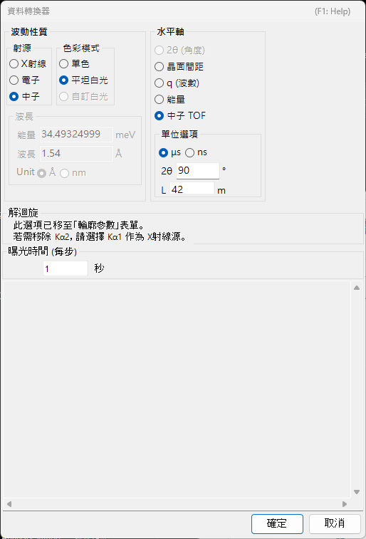
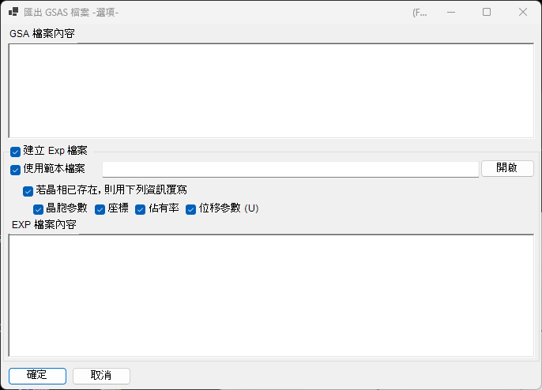

<!-- 260601Cl: migrated from legacy docx + yseto.net web manual -->
# 檔案格式

PDIndexer 讀寫的檔案大致可分為三類：**圖譜資料**、**晶體清單／晶體結構**，以及**繪圖輸出**。這些輸入輸出操作都可從[主視窗](../1-main-window.md)的**檔案 (File)** 選單存取。

本頁以表格整理支援的副檔名、輸入輸出方向及補充說明。

---

## 圖譜資料

### 讀取（Read profile(s)）

**檔案 → 讀取輪廓檔 (Read profile(s))** 可一次載入多個檔案。除了本軟體自有格式的 `pdi` / `pdi2` 之外，也支援多種角度－強度（或能量－強度）文字／二進位格式，例如 WinPIP 輸出的 `csv`、Fit2D 輸出的 `chi`，以及 Rigaku 的 `ras`。即使是下表未列出的格式，只要是一般的角度－強度文字檔，通常也能透過通用解析回退方式讀取。

| 副檔名 | 來源／格式 | 補充說明 |
| --- | --- | --- |
| `pdi` / `pdi2` | PDIndexer 原生格式 | 將圖譜與其附屬資訊（波源、波長、曝光時間等）一併保留。`pdi2` 為目前版本。讀取這類檔案時不會顯示資料轉換對話方塊。 |
| `csv` | WinPIP 輸出（逗號分隔：`angle,intensity`） | 透過資料轉換對話方塊匯入，於其中指定橫軸的意義、波源與波長。 |
| `tsv` | 定位點分隔（`angle` `[TAB]` `intensity`） | 以通用文字格式匯入。 |
| `chi` | Fit2D 輸出 | 略過開頭的標頭列，並將四欄資料中的第 2、4 欄取為角度與強度。 |
| `ras` | Rigaku 格式 | 同時包含儀器資訊的文字格式。 |
| `nxs` | NeXus / HDF5（SSD，多重檢測器） | 可能包含多個通道（直方圖），各通道會分別進行能量校正後匯入。 |
| `npd` | EDX 圖譜（SSD） | 從標頭讀取 `EGC0/1/2`、`2Theta`、`Live time` 等，並將通道編號轉換為能量。 |
| `xbm` | EDX 二進位格式（例如 SP-8 BL04B2） | 樣品名稱、量測條件、EGC 校正係數等中繼資料會以註解方式匯入。 |
| `rpt` | Genie 格式（SSD） | 從標頭讀取出射角、曝光時間與 EGC。 |
| `xy` | pyFAI 校正後的雙欄文字 | 從標頭讀取波長，並匯入角度與強度。 |
| `gsa` | GSAS 資料（`BANK` 區塊） | 匯入角度、強度、誤差三欄。 |
| 其他 | 通用角度－強度文字 | 自動偵測逗號／空白／定位點分隔符（透過資料轉換對話方塊）。 |

!!! note "一次讀取多個檔案"
    選取並讀取多個檔案時，於第一個檔案確認資料轉換設定後，會顯示訊息詢問是否對其餘檔案套用相同設定。選擇**是 (Yes)** 即可不顯示對話方塊而一次處理其餘檔案，加快讀取速度。

### 資料轉換對話方塊（Data Converter）

讀取 `pdi` / `pdi2` 以外的檔案（`csv`、`chi`、`ras`、`nxs`、`npd`、`xbm`、`rpt`、`xy`、`gsa`，以及通用文字）時，會開啟**資料轉換 (Data Converter)** 對話方塊。在此將匯入的數值欄位正確對應到 PDIndexer 內部使用的物理量。

該對話方塊提供以下設定項目。

| 設定項目 | 說明 |
| --- | --- |
| 橫軸 (Horizontal Axis) | 指定匯入第一欄所代表的物理量（2θ、能量、d 值、波數、TOF 等）與單位。 |
| 波源／波長 | X 射線／中子／電子線的種類，以及特性 X 射線譜線（Kα 等）或波長。這將決定換算為 d 值與 2θ 的方式。 |
| 曝光時間 (Exposure time (per step)) | 每一步驟的曝光時間（秒）。用於 CPS 顯示與強度歸一化。 |
| SSD 資料設定 (For SSD data) | 對於 `rpt` / `npd` / `xbm` / `nxs` 等 SSD（EDX）資料，設定將通道編號 \(n\) 轉換為能量 \(E\) 的係數 \(a_0, a_1, a_2\)。當有多個檢測器時，可分別啟用／停用並個別設定其係數。 |
| 低能量截止 (Low energy cutoff) | 勾選後，會在匯入時排除低於指定能量的資料點。 |

對於 SSD 資料，通道編號 \(n\) 會透過以下二次校正式轉換為能量 \(E\)（單位 eV）：

$$
E = a_0 + a_1\,n + a_2\,n^2
$$

讀取通用文字（「其他」格式）時，對話方塊會以文字方塊顯示實際檔案內容，讓您在確認資料的同時設定橫軸、波源等項目。分隔符（逗號／空白／定位點）與開頭需略過的標頭列數皆會自動偵測。

!!! tip "監視剪貼簿／資料夾"
    啟用**選項 (Option) → 監視剪貼簿 (Watch Clipboard)** 後，PDIndexer 可自動匯入從 IPAnalyzer 等其他應用程式複製的圖譜。啟用**監視檔案 (Watch File)** 後，會自動讀取指定資料夾中新建立的 `pdi` 檔案。

### 儲存與匯出

**檔案 → 儲存輪廓檔 (Save profile(s))** 會將所有已載入的圖譜以 PDIndexer 原生的 `pdi2` 格式儲存。

**檔案 → 匯出選取的輪廓 (Export the selected profile(s))** 可將選取中的圖譜以下列格式之一寫出。

| 副檔名／格式 | 方向 | 補充說明 |
| --- | --- | --- |
| `pdi2` | 輸出 | PDIndexer 原生格式。一次儲存所有圖譜。 |
| `csv` | 輸出 | 逗號分隔（角度、強度）。 |
| `tsv` | 輸出 | 定位點分隔（角度與強度以定位點分隔）。 |
| `gsa` (GSAS) | 輸出 | 供 Rietveld 精修使用的 GSAS 格式。可在下方的匯出畫面中檢視內容。 |

#### 以 GSAS 格式匯出

選擇 GSAS 格式時，會顯示匯出畫面以供檢視即將寫出的內容。第 1 行為圖譜名稱，第 2 行為 `BANK 1 … CONST … FXYE` 標頭，其後各行則保存角度、強度、誤差三欄資料。若圖譜本身具有誤差資料，會採用該資料作為誤差；若無，則採用 \(\sqrt{\text{intensity}}\)。

!!! note "角度縮放"
    對於一般的角度色散資料，角度值會乘以 100 後寫出（GSAS 的 `CONST` 慣例）。中子 TOF 資料則不進行縮放，直接寫出原始數值。

---

## 晶體清單與晶體結構

晶體清單以 XML 格式（副檔名 `xml`）儲存與讀取。個別的晶體結構可從 CIF / AMC 匯入。詳情請參閱[晶體參數](../3-crystal-parameter.md)。

| 操作（檔案選單） | 副檔名 | 方向 | 補充說明 |
| --- | --- | --- | --- |
| 載入晶體（做為新清單） | `xml` | 輸入 | 讀取晶體清單並取代目前的清單（目前的清單會被捨棄）。 |
| 載入晶體（並加入目前清單） | `xml` | 輸入 | 讀取晶體清單並附加至目前清單的末尾。 |
| 儲存晶體 | `xml` | 輸出 | 將目前的晶體清單儲存至檔案。 |
| 匯入 CIF、AMC... | `cif` / `amc` | 輸入 | 將 CIF 格式或 AMC（AMCSD）格式的結構資料加入目前的晶體清單。 |
| 將選取的晶體匯出為 CIF | `cif` | 輸出 | 將選取中的晶體儲存為 CIF 格式的結構資料檔案。 |
| 將晶體還原為初始狀態 | — | — | 將晶體清單還原為安裝後的預設狀態。 |

---

## 繪圖（圖譜檢視）輸出

主視窗目前顯示的圖譜，可作為影像複製到剪貼簿，或以向量中繼檔格式儲存。

| 操作（檔案選單） | 格式 | 方向 | 補充說明 |
| --- | --- | --- | --- |
| 複製到剪貼簿（以點陣圖資料） | 點陣圖 | 剪貼簿 | 將檢視內容以點陣圖影像複製到剪貼簿。 |
| 複製到剪貼簿（以中繼檔資料） | 中繼檔（向量） | 剪貼簿 | 將檢視內容以向量格式複製到剪貼簿。 |
| 另存為中繼檔 | `emf` (EMF) | 輸出 | 以 EMF（Enhanced Metafile）格式儲存。由於保留了向量與字型資訊，儲存後的 `emf` 可讀入 PowerPoint 與 Word。 |

此外，也可透過**版面設定 (Page Setup)**、**預覽列印 (Print Preview)** 與**列印 (Print)**，直接列印目前的角度與強度範圍。
