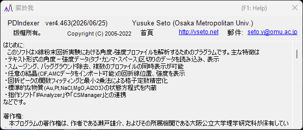

<!-- 260601Cl: migrated from legacy docx + yseto.net web manual -->
# 執行環境與安裝

本頁說明如何安裝 PDIndexer，以及能舒適操作所建議的環境。

## 安裝

請從 GitHub 的發行頁面下載最新版本。

- 下載處: <https://github.com/seto77/PDIndexer/releases/latest>

建議使用的方法是 MSI 安裝程式。下載 `PDIndexer-setup.msi`（x64）後雙擊即可開始安裝。若是 Windows on Arm（例如 Snapdragon PC）則請改為下載 `PDIndexer-setup_arm64.msi`。 <!-- 260625Cl WiX asset names + arm64 -->

若在受管理的 Windows PC 上 MSI 的執行被限制，可改用免安裝的 ZIP 版本作為替代方案。下載 portable ZIP（x64 為 `PDIndexer-v.<ver>.zip`，Arm 為 `PDIndexer-v.<ver>_arm64.zip`），將整個資料夾解壓縮到使用者可寫入的位置，再從解壓縮後的資料夾中執行 `PDIndexer.exe`。請勿直接在 ZIP 檢視器內執行 `PDIndexer.exe`。 <!-- 260601Ch / 260625Cl -->

!!! note "關於 Windows 保護警告"
    執行剛下載、未經簽章的研究用軟體時，Windows 可能會顯示「Windows 已保護您的電腦」的 SmartScreen 保護警告。此時請點選 **其他資訊**，再選擇 **仍要執行** 即可繼續。

!!! note "關於免安裝 ZIP 版本"
    ZIP 版本是為了在難以執行 MSI、取得管理員核准、或另行安裝 .NET Desktop Runtime 的環境下使用的替代方案。它並非完全獨立於系統之外的設定資料夾：PDIndexer 仍會將使用者設定與複製的預設資料儲存於目前使用者的 AppData 資料夾中，並可能將每個使用者的選項儲存於 `HKEY_CURRENT_USER\Software\Crystallography\PDIndexer`。

## 必要的執行環境

從 MSI 安裝程式安裝 PDIndexer 時，需要以下執行環境。

| 項目 | 需求 |
| --- | --- |
| OS | Windows（64 位元版，x64 或 Arm64） |
| 執行環境 | `.NET Desktop Runtime 10.0`（是 **Desktop Runtime**，而非單純的 **.NET Runtime**；在 Windows on Arm 上則為 **Arm64** 版本） |

!!! warning "請選擇 Desktop Runtime"
    下載頁面提供兩種產品：「.NET Runtime」與「.NET Desktop Runtime」。由於 PDIndexer 是 WinForms 應用程式，請務必安裝 **.NET Desktop Runtime**。僅安裝「.NET Runtime」將無法啟動程式。

- 下載執行環境: <https://dotnet.microsoft.com/download/dotnet/10.0>

免安裝 ZIP 版本對於對應的架構（x64 或 Arm64）為自我完備（self-contained）套件，不需要另外安裝 .NET Desktop Runtime。 <!-- 260601Ch / 260625Cl arm64 -->

!!! note "關於舊文件所載版本"
    舊版手冊（docx）中記載為「.NET Desktop Runtime 6.0 以上」，但目前的 PDIndexer 需要 **.NET 10.0**。請依照最新版本的需求為準。

## 建議環境

PDIndexer 的部分功能需要相當可觀的運算資源。為提升速度，程式已盡可能採用多執行緒處理。若要舒適地使用，建議使用具備以下高效能規格的電腦。

| 項目 | 建議 |
| --- | --- |
| OS | Windows 11（Windows 10 以上的 64 位元版亦可運作） |
| 記憶體 | 16 GB 以上 |
| CPU | 8 核心以上（對多執行緒運算有效） |

!!! tip "多執行緒的好處"
    使用晶體結構進行的繞射圖譜計算、連續分析等作業，CPU 核心數愈多，執行速度愈快。CPU 核心數愈多，等待運算完成的時間就愈短。

## 更新（確認新版本）

從主視窗的 **說明** 選單，PDIndexer 可讓您更新至最新版本，並檢視作者資訊。

| 選單 | 功能 |
| --- | --- |
| **說明** ▸ **程式更新** | 確認是否已發布較新版本，並更新程式。 |
| **說明** ▸ **關於** | 顯示版本與作者資訊。 |

選擇 **說明** ▸ **關於** 後，會開啟如下方的視窗，您可以在其中確認目前的版本號碼與作者資訊。

!!! tip "定期更新"
    錯誤修正與新功能會持續新增。請不時執行 **說明** ▸ **程式更新**，以保持 PDIndexer 為最新版本。

## 授權

PDIndexer 依 **MIT 授權條款** 發布。只要在再散布時附上著作權標示與授權條款文字，即可自由使用、修改、散布及商業利用。本軟體以不提供任何保證的形式提供。
